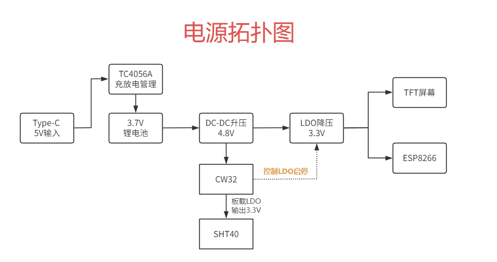

# 硬件设计及原理
## 1 供电电路
电源拓扑图如图3所示.

供电部分使用了一节18650锂电池，充电管理芯片用的是TC4056A，最大可支持到1A充电电流，电路设计如图4所示.

如图5所示，DCDC升压电路部分，使用的是MT3608B，其在电流小于100mA时的效率约92%.输出电压是使用电阻分压反馈方式，VOUT=(1+R2/R1) * VREF.手册里写VREF=0.6V，我取R2=91KΩ，R1=13KΩ得到VOUT=4.8V.这里两个分压电阻大一点好，这样流过它们的电流小，它们所耗的功率也会变小.这里的电感4.7uH是按芯片手册来的，建议选择一个等效直流电阻更低的电感，这样也能提高效率.这里的续流二极管必选肖特基二极管，考虑到整机电流不大，用SS14就行.

降压至3.3V的LDO为RS3236-3.3，选用它是因为其有EN引脚，可用CW32的GPIO控制LDO启停，此外它还有极低的待机电流(0.01uA)，能让整机静态电流再降一些.LDO电路设计见图6.

## 2 MCU选型——为什么选CW32

测量电压和电流，实际上都是在采集电压数据，而电压值是模拟量，要转换成程序能读取的数字量就要用到ADC(模数转换)，立创地文星开发板是使用的CW32F030C8T6，拥有12位精度的高速ADC，有多种Vref参考电压：1.5V、2.5V、VDD、ExRef（PB00）引脚电压.而STM32只有一个VDD作为参考电压，考虑到精度问题，自然是可选的Vref多一点好.CW32用户手册对ADC的介绍如图7所示. 

此外，还考虑到本项目使用了TFT屏幕、ESP8266、按键控制、ADC采集，所需要的IO口数量较多，地文星开发板提供了32个IO引出，很够用了.

## 3 ADC电路
ADC,是Analog-to-Digital Converter的缩写，指模/数转换器，是将连续变量的模拟信号转换为离散的数字信号的器件.

ADC引脚功能说明如下表所示

| 端口-ADC通道  |     功能      |
| :-----------: | :-----------: |
| PBA7-ADC_IN7  | 电池电压测量  |
| PB00-ADC_IN8  | 电压测量校准  |
| PB01-ADC_IN9  | 电压测量0~3V  |
| PB10-ADC_IN11 | 电压测量0~31V |
| PB11-ADC_IN12 | 电流测量0~1A  |
### 3.1电压采样电路
电压采样电路设计图如图8所示，选取Vref为内置1.5V电压.

大量程这边使用一个200k和10k电阻分压，采集10k电阻上的电压值，则最大量程计算方法为:

$$
U_{adc11max}= \frac {1.5}{\frac{10k}{10k+200k}}=31.5V
$$

取整数31V，当电压为31V时，算一下电阻R2和R5上的功率：

$$
P_{R5max}= \frac{(31\times \frac{10k}{10k+200k}) ^{2}}{10k}\approx 0.218mW
$$

$$
P_{R2max}=  \frac{(31\times \frac{200k}{10k+200k}) ^{2}}{200k}\approx 4.36mW
$$

所以R2和R5选择0603的封装（100mW）都绰绰有余，按个人手头上有的器件来选贴片电阻的封装即可.

小量程这边使用了两颗10kΩ ±0.1%电阻分压，最大量程计算方式与 **式(1)** 相同，可算得量程为0~3V.

后面在软件部分实现了自动换挡功能，实现了小电压高精度测量、大电压经校准后也能有很高的精度.

### 3.2 电流采样电路
由
$$
I_s = \frac{V_{REF}}{4096} \times \frac{1}{R_{sa}} 
$$
可知，在参考电压$V_{REF}$一定的情况下，采样电阻$R_{sa}$越大，对应的$I_s$越小.因为本人经常测量毫安级的电流，自然希望单位ADC值所对应的电流越小越好.故选用2512封装的200mΩ电阻，功率为2W.

$$
I_{Rmax} = \sqrt{\frac{P_{max}}{R_{sa}}} = \sqrt{\frac{2}{0.2}}\approx 3.16A
$$
由 **式(5)** 知，200mΩ电阻能采集的最大电流为3.16A，大于设计的采集电流1A.此时单位ADC值对应的电流为

$$
I_s = \frac{1.5V}{4096} \times \frac{1}{0.2\Omega} \approx 1.83mA 
$$

符合设计需求.

电流采样电路设计如图9所示.

### 3.3 电池电压采样
电池电压采样电路设计见图10.使用两个10KΩ ±0.1%的电阻分压.选用内部参考电压2.5V. 

### 3.4 TL431电压校准电路(可选)
在本项目中还使用了一个TL431做电压校准电路，用于提供2.5V的基准电压，虽然CW32内置了2.5V的电压基准，理论上无需外部基准，但可用TL431来学习电压基准芯片的应用原理. 

如图11所示，TL431的核心是一个运放，在电路中充当比较器.芯片内部有一个Vref电压（约为2.5V），作用在比较器的反相端.比较器的同相端会输入一个电压给REF，当这个电压大于Vref时，比较器输出高电平，使能三极管，使CATHODE（阴极）端与 ANODE（阳极）端导通，此时，若REF和CATHODE处于同一电位（连接在一起），则REF处的电位被拉低，当REF处的电位被拉低至低于Vref时，比较器输出低电平，三极管关断，REF处的电位回升，当高于Vref时，继续执行以上描述，如此循环.由于硬件的响应速度是极其快的.所以REF处的电压几乎等于Vref.

TL431电路设计见图12.

## 4 按键电路
CW32的I/O口内部可以配置上下拉电阻，在芯片外围的按键控制电路则无需配置.按键一端接入MCU的I/O上，另一端接地.按键按下，I/O被拉低，在代码编写时去检测下降沿然后进中断即可，代码部分会在软件设计章节(第3节)说明.按键电路设计如图13所示.

各个IO端口对应的按键操作逻辑如下表所示

| IO端口 | 操作逻辑 |
| ------ | :------: |
| PA12   |    上    |
| PA8    |    下    |
| PA9    |    左    |
| PA11   |    右    |
| PA10   |    OK    |

## 5 ESP8266电路
既然本项目是“物联网”电压电流表，则必须要用WIFI去连接网络，上传数据.因此使用了乐鑫的ESP8266，其核心是ESP-12F+配套转接板，在tb上一套约6元，用转接板是为了方便拔插、重复使用的，如图14所示.

另外，如果你和我一样要用CW32去控制ESP8266的启停，则需要把转接板上的一个10K电阻去掉，具体位置见图14.

ESP8266的电路设计见图15，将8266的串口与CW32的PB8、PB9相连，并引出排针作为外部烧录接口.此外可通过跳线帽使GPIO0接地，以切换下载或者调试模式，无需外部连线.

## 6 TFT屏幕
本项目使用的TFT屏幕为1.8寸彩屏，分辨率128*160，驱动为ST7735.使用SPI通信，引脚定义及功能如下表所示：
| 引脚  |                             功能                             |
| :---: | :----------------------------------------------------------: |
|  SCL  |                 SPI时钟, 对应上位机SPI的SCK                  |
|  SDA  |               SPI数据输入, 对应上位机SPI的MOSI               |
|  RES  |              重启, 低电平有效, 工作时处于高电平              |
|  DC   | 命令模式和数据模式切换位, 低电平为命令模式, 高电平为数据模式 |
|  CS   |                 片选信号, 对应上位机SPI的CS                  |
|  BL   |              背光, 高电平亮, 低电平灭,可PWM调光              |

图16为TFT屏幕外观，请注意与商家确认是否为ST7735驱动，否则需要你自己适配代码.

## 7 SHT40温湿度采集（可选）
本着“多功能”的想法，本项目可选择性地增加一个温湿度传感器，以通过屏幕监测温湿度，将这些数据发送至云端数据库.

SHT40原理以及代码实现可参考我之前的开源工程: [基于STM32和SHT40的桌面低功耗可充电温湿度计]( https://oshwhub.com/vrxiaojie/temperature-and-humidity-meter-7508164a )  在此就不再赘述.