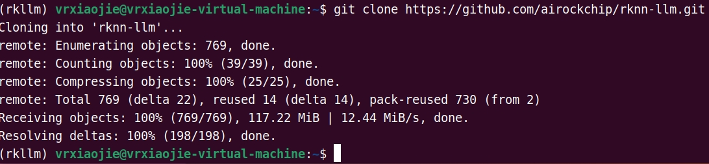
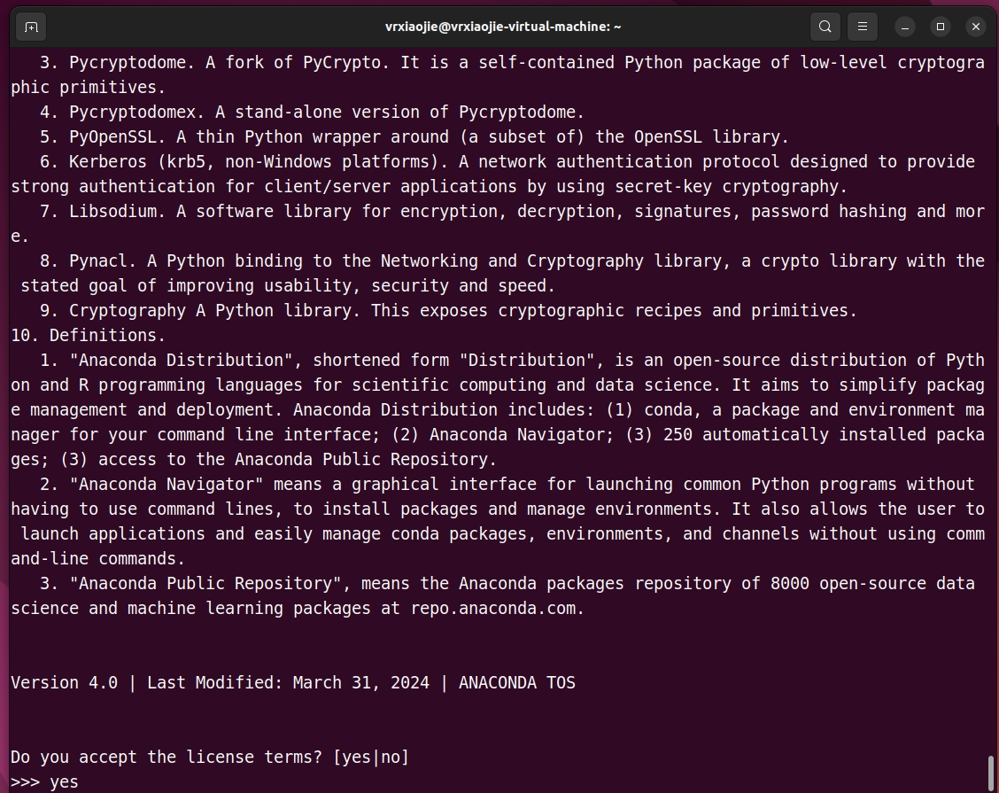
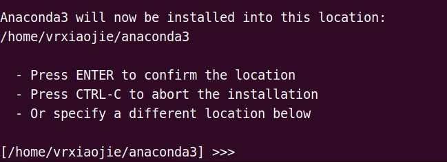
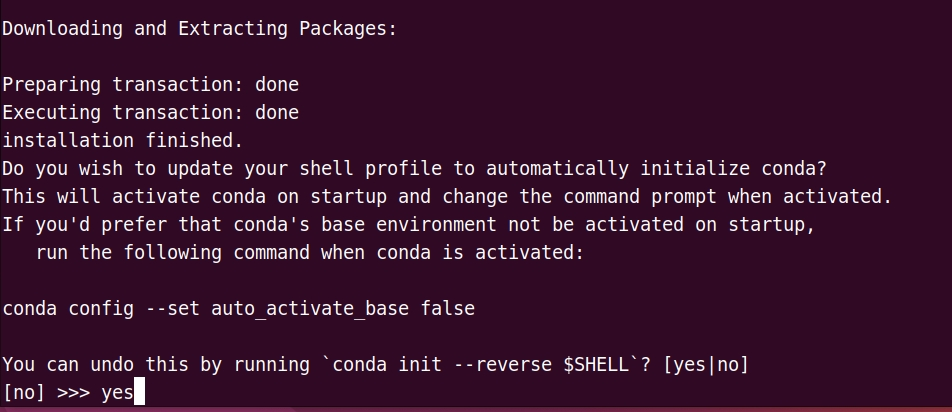
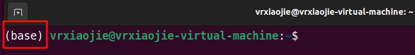

# 开发环境准备
以下都是必备的一些工具/仓库
## 1 准备清单
- 1块香橙派5系列的开发板 **(内存8G及以上)**
- 1~2根质量良好的Type-C线
- 1台运行着Win10及以上的PC

对于PC端来说，需要安装WSL2 (Windows Subsystem Linux)，并运行Ubuntu 22.04，以便后续编译运行文件。如果不想用WSL2，可以用VMWare开一台运行着Ubuntu 22.04的虚拟机。
:::warning 注意
请为Linux虚拟机分配至少60GB的磁盘空间
:::

后文对于运行在Win系统的 WSL/Linux虚拟机 统称为 **PC虚拟机**

## 2 下载RKLLM库到本地
这里使用git命令clone仓库到本地，首先安装git
```shell
sudo apt install git
```
然后clone官方仓库
```shell
git clone https://github.com/airockchip/rknn-llm.git
```

**由于网络环境原因，请确保PC虚拟机能正常访问GitHub**

clone完成后如图所示


进入rknn-llm以便后续使用
```shell
cd rknn-llm
```

:::details rknn-llm结构
rknn-llm文件夹的结构如下图所示
```
rknn-llm
├── doc  # RKLLM SDK 说明文档
├── examples
│   ├── rkllm_api_demo  # 板端推理调用示例工程
│   │   └── src
│   ├── rkllm_multimodel_demo  # 多模态大模型推理示例工程
│   │   ├── data
│   │   │   └── datasets
│   │   ├── deploy
│   │   │   ├── 3rdparty
│   │   │   └── src
│   │   └── export
│   └── rkllm_server_demo  # RKLLM-Server 部署示例工程
│       └── rkllm_server
│           └── lib
├── res
├── rkllm-runtime  # RKLLM Runtime 库
│   ├── Android
│   │   └── librkllm_api
│   │       ├── arm64-v8a
│   │       └── include
│   └── Linux
│       └── librkllm_api
│           ├── aarch64
│           └── include
├── rkllm-toolkit  # RKLLM 模型转换、量化工具包
│   ├── examples
│   └── packages
├── rknpu-driver  # RK-NPU驱动
└── scripts
```
:::

## 3 RKLLM-Toolkit 安装
RKLLM-Toolkit 是为用户提供在计算机上进行大语言模型的量化、转换的开发套件。
### 3.1 通过pip安装
#### 3.1.1 安装Anaconda3
若你的PC虚拟机已安装Anaconda3，则可跳过`3.1.1节`。
::: details 若未安装Anaconda3，点击展开教程
在PC虚拟机的终端中获取Anaconda3的安装包
```shell
wget --user-agent="Mozilla"  https://mirrors.tuna.tsinghua.edu.cn/anaconda/archive/Anaconda3-2024.10-1-Linux-x86_64.sh
```

运行脚本
```shell
bash ./Anaconda3-2024.10-1-Linux-x86_64.sh
```

按回车，并且按键盘方向下键阅读协议，到最后输入`yes` 回车



询问安装路径，这里默认家路径就好，直接回车



等待几分钟让它安装完成，输入`yes`让它自动初始化conda，回车



重新开启一个终端，看到用户名前缀带(base)即为安装成功



:::

#### 3.1.2 创建虚拟环境
创建虚拟环境
```shell
conda create -y -n rkllm python=3.8
```

完成后激活环境
```shell
conda activate rkllm
```

添加清华源
```shell
pip config set global.index-url --site https://pypi.tuna.tsinghua.edu.cn/simple
```

#### 3.1.3 安装rkllm_toolkit包
安装 rkllm_toolkit-1.1.4，其他相关的包会自动安装。
```shell
pip install rkllm-toolkit/packages/rkllm_toolkit-1.1.4-cp38-cp38-linux_x86_64.whl
```

## 4 GCC 交叉编译工具安装
在使用 RKLLM Runtime 的过程中，需要注意 gcc 编译工具的版本。推荐使用交叉编译工具`gcc-arm-10.2-2020.11-x86_64-aarch64-none-linux-gnu`。下载路径为：[GCC_10.2 交叉编译工具下载地址](https://developer.arm.com/downloads/-/gnu-a/10-2-2020-11)。下载完成后将其传到PC虚拟机的当前用户家目录下。

解压
```shell
cd ~ && tar -xvf gcc-arm-10.2-2020.11-x86_64-aarch64-none-linux-gnu.tar.xz
```

交叉编译工具就已经解压到了`~/gcc-arm-10.2-2020.11-x86_64-aarch64-none-linux-gnu`目录下，之后会用到。


