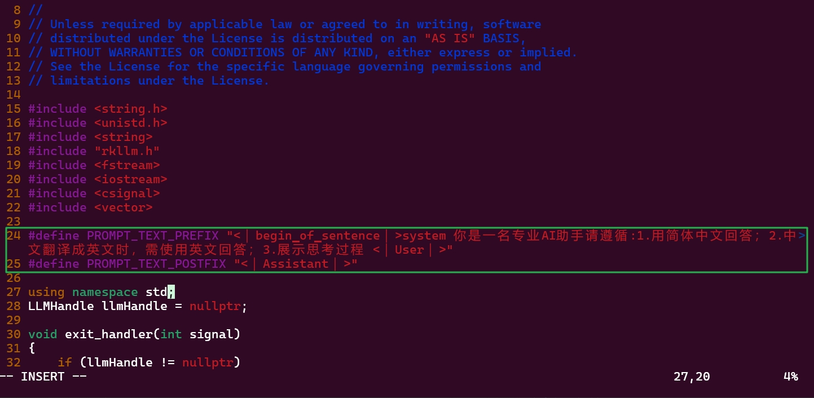

# 板端推理调用
## 1 编译运行程序
### 1.1 修改src/llm_demo.cpp
进入rkllm推理示例工程文件夹下
```shell
cd ~/rknn-llm/examples/rkllm_api_demo
```
修改src/llm_demo.cpp

```shell
vi src/llm_demo.cpp
```
将第24 25行修改为
```c
#define PROMPT_TEXT_PREFIX "<｜begin▁of▁sentence｜>system 你是一名专业AI助手请遵循:1.用简体中文回答；2.中文翻译成英文时，需使用英文回答；3.展示思考过程 <｜User｜>"
#define PROMPT_TEXT_POSTFIX "<｜Assistant｜>"
```

:::tip
1. 你可以根据自己的需求自定义上面的提示词内容，只要修改PROMPT_TEXT_PREFIX的 `<｜begin▁of▁sentence｜>system`到`<｜User｜>`之间的内容。
2. 上述该提示词仅适用于
`DeepSeek-R1-Distill-Qwen`系列的模型，如果你要用其他模型(例如Qwen-2.5)，需要修改提示词，请参考[如何修改提示词](（扩展阅读）如何修改提示词.html)章节。
:::




将第184行取消注释
```c
text = PROMPT_TEXT_PREFIX + input_str + PROMPT_TEXT_POSTFIX;
```

紧接着注释第185行
```c
// text = input_str;
```


这样就能启用提示词的前后缀了，让模型正常运行。

### 1.2 修改build-linux.sh
```shell
vi build-linux.sh
```
将其第7行的GNU编译工具路径改为
```
GCC_COMPILER_PATH=~/gcc-arm-10.2-2020.11-x86_64-aarch64-none-linux-gnu/bin/aarch64-none-linux-gnu
```

### 1.3 安装cmake
```shell
sudo apt-get install -y cmake
```

### 1.4 编译运行程序llm_demo

为build-linux.sh添加运行权限
```shell
sudo chmod 775 build-linux.sh
```
运行build-linux.sh
```shell
./build-linux.sh
```

成功后显示如下内容


### 1.5 上传运行程序和库
在开发板端新建文件夹，该文件夹`rkllm`存放运行程序和模型，`rkllm/lib`文件夹内存放运行库。

```shell
mkdir ~/rkllm && cd ~/rkllm && mkdir ~/rkllm/lib
```

将`~/rknn-llm/examples/rkllm_api_demo/build/build_linux_aarch64_Release/`目录下的`llm_demo`上传至板端rkllm文件夹内。

将`~/rknn-llm/rkllm-runtime/Linux/librkllm_api/aarch64`目录下的`librkllmrt.so`上传至板端rkllm/lib文件夹内。


## 2 上传rkllm模型至板端
### 2.1 准备模型
这里以我自己转换好的`DeepSeek-R1-Distill-Qwen-1.5B-RK3588S-RKLLM1.1.4`为例，已将其放置于huggingface [VRxiaojie/DeepSeek-R1-Distill-Qwen-1.5B-RK3588S-RKLLM1.1.4](https://huggingface.co/VRxiaojie/DeepSeek-R1-Distill-Qwen-1.5B-RK3588S-RKLLM1.1.4)
::: tip
该网站需使用代理进入，建议用[镜像站](https://hf-mirror.com/)）
:::

### 2.2 上传模型
rkllm模型文件名为`deepseek-r1-1.5B-rkllm1.1.4.rkllm`，使用SFTP或ADB等方法把它传到开发板 `~/rkllm`文件夹下

## 3 启动板端推理程序
进入~/rkllm文件夹下
```shell
cd ~/rkllm
```
其文件树应如下所示
::: details rkllm文件树
```
rkllm/
├── deepseek-r1-1.5B-rkllm1.1.4.rkllm
├── lib
│   └── librkllmrt.so
└── llm_demo
```
:::

通过环境变量指定库函数路径，注意每次打开一个终端都要添加该环境变量。
```shell
export LD_LIBRARY_PATH=./lib
```

:::tip 不用每次都添加环境变量的方法
打开设置文件
```shell
vim ~/.bashrc
```
在文件末尾添加
```Text
export LD_LIBRARY_PATH=~/rkllm/lib
```
保存退出后，使文件配置立即生效
```shell
source ~/.bashrc
```
:::

启动llm_demo程序
```shell
#用法: ./llm_demo model_path max_new_tokens max_context_len
./llm_demo ./deepseek-r1-1.5B-rkllm1.1.4.rkllm 10240 10240
```

稍等片刻，出现如下界面就算成功加载模型了


可以在shell里输入文字与其对话。

若需要查看 RKLLM 在板端推理的性能，可使用如下指令：
```shell
export RKLLM_LOG_LEVEL=1
```
即可在每次推理完成后，显示 Prefill 与 Generate 阶段的 token 数与推理耗时。
:::

