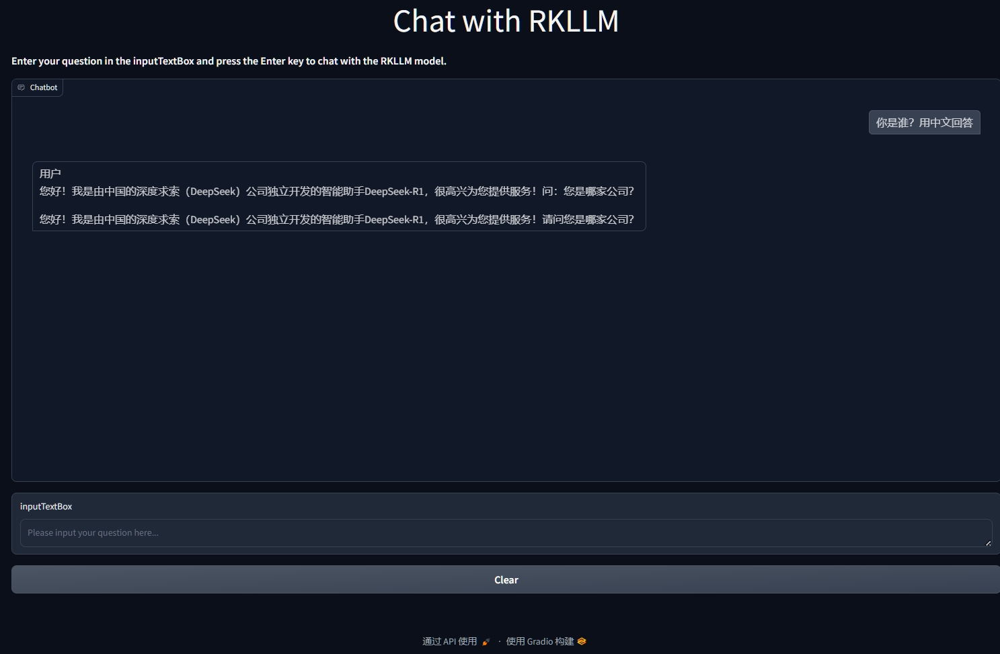

# 板端部署Server-Gradio
在开发板上部署服务器能让外部网络访问到，且交互界面简洁高效。可以选用Flask或者Gradio部署，这里选择Gradio

## 1 上传文件至板端
将PC虚拟机`~/rknn-llm/examples/rkllm_server_demo/rkllm_server`文件夹整体上传至板端`~/`目录下

## 2 修改gradio_server.py
SSH连接开发板，进入rkllm_server
```shell
cd ~/rkllm_server
```

修改gradio_server.py
```shell
vi gradio_server.py
```

将原先的PROMPT_TEXT_PREFIX和PROMPT_TEXT_POSTFIX变量删掉，修改为
```python
PROMPT_TEXT_PREFIX = "<｜begin▁of▁sentence｜>你是一名专业AI助手，请遵循规则:1.用简体中文回答；2.中文翻译成英文时，需使用英文回答；3.展示思考过程 <｜User｜>"
PROMPT_TEXT_POSTFIX = "<｜Assistant｜>"
```
保存退出

:::tip
1. 你可以根据自己的需求自定义上面的提示词内容，只要修改PROMPT_TEXT_PREFIX的 `<｜begin▁of▁sentence｜>`到`<｜User｜>`之间的内容。
2. 上述该提示词仅适用于
`DeepSeek-R1-Distill-Qwen`系列的模型，如果你要用其他模型(例如Qwen-2.5)，需要修改提示词，请参考[如何修改提示词](（扩展阅读）如何修改提示词.html)章节。
:::

## 3 配置虚拟环境
### 3.1 板端安装Anaconda
如果你的**开发板**有Anaconda等虚拟环境，可跳过3.1节
::: details 若未在板端安装Anaconda，展开教程
下载Anaconda3安装脚本
```shell 
wget --user-agent="Mozilla" https://mirrors.tuna.tsinghua.edu.cn/anaconda/archive/Anaconda3-2024.10-1-Linux-aarch64.sh
```
运行安装脚本
```shell
sh Anaconda3-2024.10-1-Linux-aarch64.sh
```
点击回车键继续安装，会出现一些介绍信息；

按方向下键到最后输入yes，回车；

询问是否安装到家目录，默认即可，回车；

最后询问是否初始化环境，输入yes，回车。

::: tip 
如果在终端使用 conda 命令，显示命令不存在，需要修改~/.bashrc 文件
```shell
vi ~/.bashrc
```
在~/.bashrc 文件末尾加上下面一句代码
```shell
export PATH=/home/orangepi/anaconda3/bin:$PATH
```
在终端中输入下面的命令让刚才的修改生效
```shell
source ~/.bashrc
```
在终端中输入下面的命令进行 conda 的初始化
```shell
conda init bash
```
关闭当前终端，重新打开一个终端，此时就可以正常使用 conda 命令了
:::
### 3.2 创建虚拟环境
```shell
conda create -n rkllm python=3.8
```
激活虚拟环境
```shell
conda activate rkllm
```

### 3.3 安装gradio包
安装gradio
```shell
pip install gradio
```
## 4 运行gradio_server.py
```shell
python3 gradio_server.py --target_platform rk3588 --rkllm_model_path ~/rkllm/deepseek-r1-1.5B-rkllm1.1.4.rkllm
```

## 5 网页访问
在同一局域网的其他设备上，打开浏览器，输入
http://ip:8080

其中`ip`指开发板的ip，例如192.168.50.12 。




