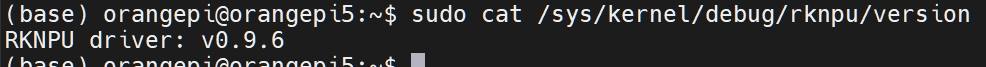
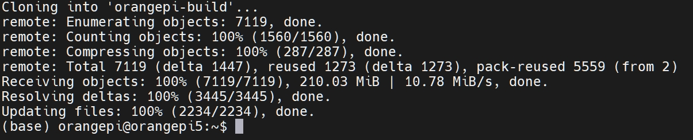
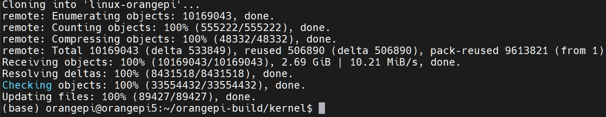
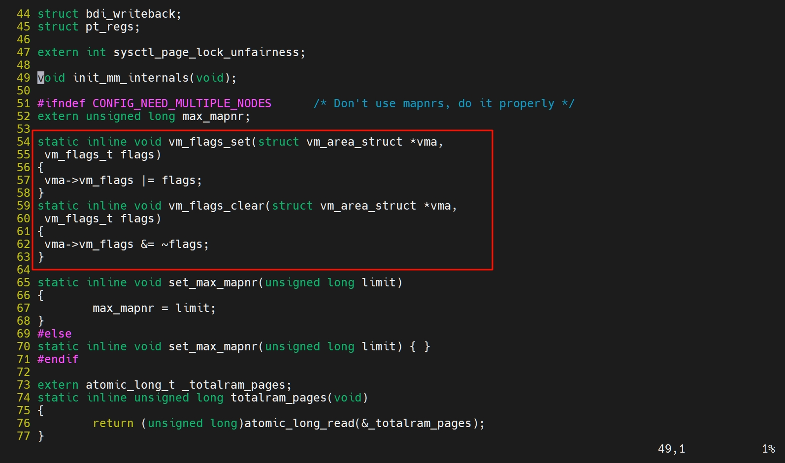
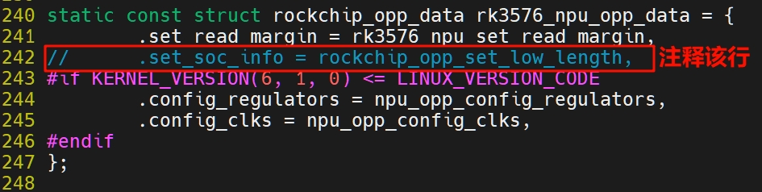
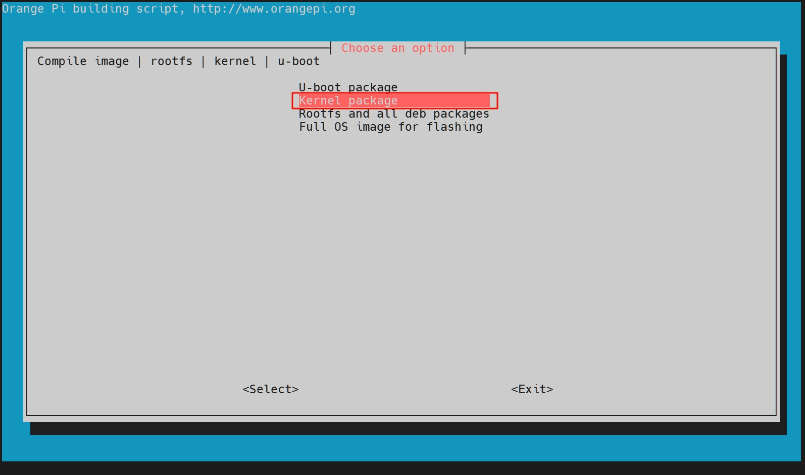
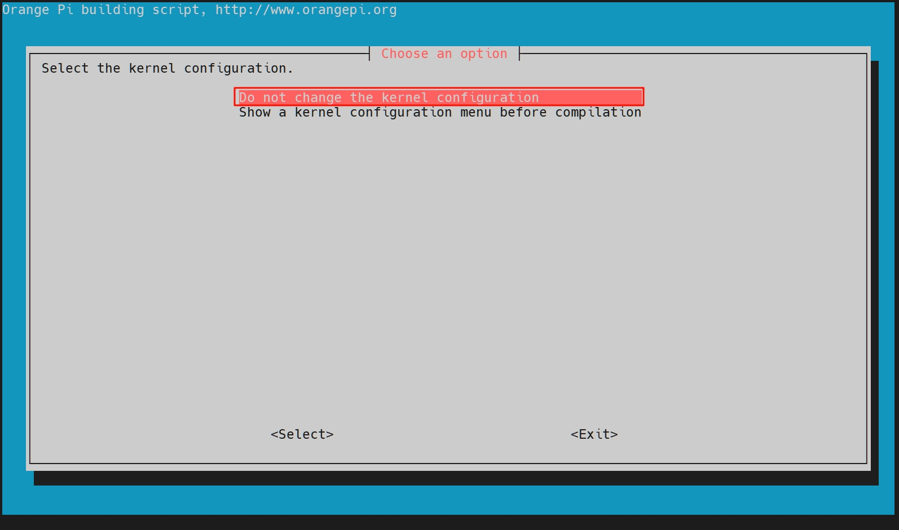
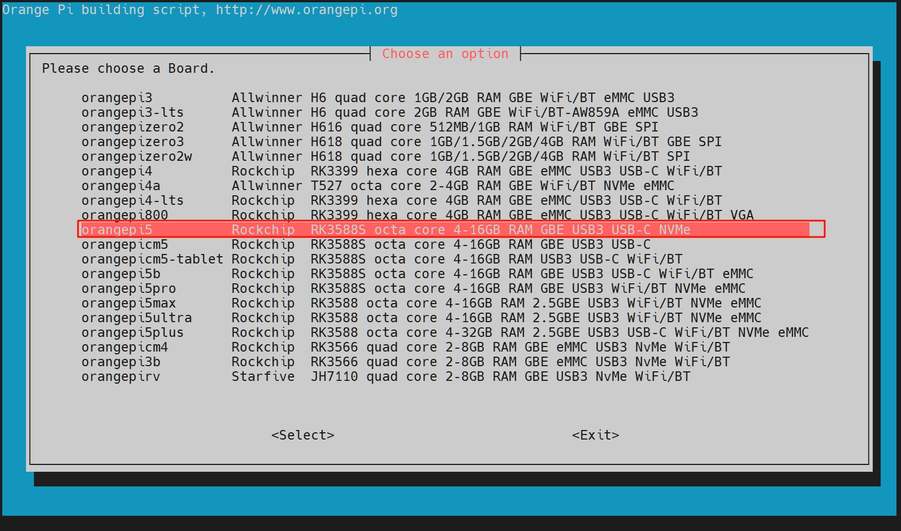
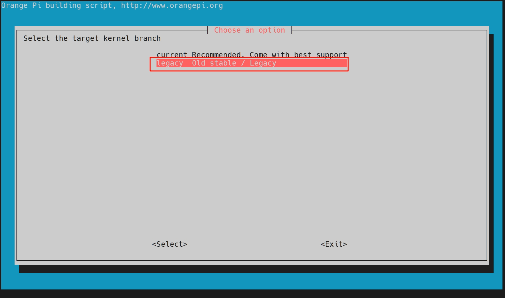
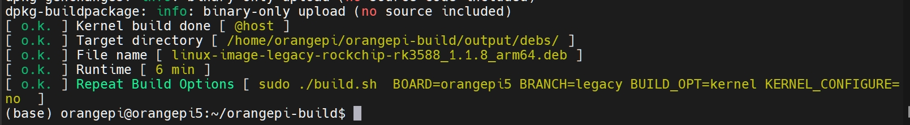

# （可选）升级RKNPU驱动
从官方镜像`Orangepi5_1.1.10_ubuntu_jammy_desktop_xfce_linux5.10.160`安装的系统自带RKNPU 驱动版本0.9.6。但是要运行最新的RKLLM大模型，还是建议升级到0.9.8(写文档时间 2025.2.2 最新版本0.9.8)。

::: danger 注意
1. 本教程基于香橙派5的 [官方Ubuntu镜像](https://pan.baidu.com/share/init?surl=MMyK2cA54zV-swELYAu5yw&pwd=mjbi)，**不是第三方Ubuntu镜像**，实测第三方Ubuntu镜像刷入deb包后会导致系统无法启动！其他官方系统镜像(Debian、Orangepi OS等)的兼容性请自行测试。
2. 建议开发板预留20GB以上的空间
3. 需要clone GitHub上的仓库，请确保开发板网络环境能正常连接至GitHub！
:::

## 1 查看NPU驱动版本
```shell
sudo cat /sys/kernel/debug/rknpu/version
```
查看到NPU驱动版本为0.9.6



## 2 板端编译的系统需求
本教程使用**开发板**的 Ubuntu22.04 系统编译，其他系统没有测试过。查看开发板已安装的 Ubuntu 版本的命令如下所示:
```shell
lsb_release -a
```
如果 **Release 字段**显示的不是 22.04，说明当前使用的 Ubuntu 版本不符合要求，请更换系统后再进行下面的操作。
```
No LSB modules are available.
Distributor ID: Ubuntu
Description:    Ubuntu 22.04.4 LTS
Release:        22.04
Codename:       jammy
```

## 3 从 github 下载 orangepi-build
linux sdk 其实指的就是 orangepi-build 这套代码，orangepi-build 是基于 armbian build 编译系统修改而来的，使用 orangepi-build 可以编译出多个版本的 linux 镜像。


安装git并从GitHub**克隆next分支**
```shell
cd ~
sudo apt-get update
sudo apt-get install -y git
git clone https://github.com/orangepi-xunlong/orangepi-build.git -b next
```

成功clone仓库的内容如图所示，如果clone出现错误，请检查网络环境能否连接至GitHub及命令是否有错误。



## 4 下载Linux5.10内核源码
首先创建kernel文件夹，用于存放内核源码
```shell
cd orangepi-build
mkdir kernel && cd kernel
```
```shell
git clone https://github.com/orangepi-xunlong/linux-orangepi.git -b orange-pi-5.10-rk35xx
```



将文件夹改名以备后面使用
```shell
mv linux-orangepi/ orange-pi-5.10-rk35xx
```

## 5 覆盖RKNPU 驱动
回到PC虚拟机，将`~/rknn-llm/rknpu-driver`目录下的`rknpu_driver_0.9.8_20241009.tar.bz2`文件上传到开发板`~/orangepi-build`目录下

解压驱动
```shell
cd ~/orangepi-build
tar -xvf rknpu_driver_0.9.8_20241009.tar.bz2
```

覆盖驱动
```shell
cp drivers/ kernel/orange-pi-5.10-rk35xx/ -r
```

## 6 修改几个文件避免编译出错
1. 修改kernel/include/linux/mm.h
打开文件
```shell
vi kernel/orange-pi-5.10-rk35xx/include/linux/mm.h
```

添加代码
```c
static inline void vm_flags_set(struct vm_area_struct *vma,
 vm_flags_t flags)
{
 vma->vm_flags |= flags;
}
static inline void vm_flags_clear(struct vm_area_struct *vma,
 vm_flags_t flags)
{
 vma->vm_flags &= ~flags;
}
```


保存退出。

2. 修改rknpu_devfreq.c
打开文件
```shell
vi kernel/orange-pi-5.10-rk35xx/drivers/rknpu/rknpu_devfreq.c
```
在242行注释掉这句`.set_soc_info = rockchip_opp_set_low_length,
`



保存退出。

## 7 禁用源码同步功能
由于先前我们手动覆盖了drivers到kernel/orange-pi-5.10-rk35xx目录下，如果现在直接运行编译，脚本会检查到与云端的源码不一致，导致重新拉取代码覆盖的问题。因此，要在配置文件内禁用源码同步功能。

首先运行一次build.sh 脚本，进行初始化。
```shell
sudo ./build.sh
```
等待片刻，见到让我们选择的界面时，操作键盘的方向→键和回车键到Exit退出菜单。

再次查看当前目录下，发现多出来一个userpatches文件夹，里面存放着配置文件。

编辑配置文件`config-default.conf`
```shell
sudo vi userpatches/config-default.conf
```
找到`IGNORE_UPDATES`，改为
```shell
IGNORE_UPDATES="yes"
```
保存退出。

## 8 运行build.sh开始编译linux 内核
运行 build.sh 脚本
```shell
sudo ./build.sh
```

选择Kernel package



选择不更改内核配置



选择**你的开发板型号**，我的是orangepi5



选择 **legacy**，这个对应的内核是5.10的


编译成功后的输出如下所示



## 9 安装deb包
查看输出的deb包
```shell
ls output/debs/linux-*
```
::: info
a. linux-dtb-legacy-rockchip-rk3588_1.1.8_arm64.deb 包含内核使用的 dtb 文件

b. linux-headers-legacy-rockchip-rk3588_1.1.8_arm64.deb 包含内核头文件

c. linux-image-legacy-rockchip-rk3588_1.1.8_arm64.deb 包含内核镜像和内核模块

:::warning 注意
你编译出来的版本号可能与我的`1.1.8`不同，不影响
:::

我们只需要安装`linux-image-legacy-rockchip-rk3588_1.1.8_arm64.deb`

```shell
sudo dpkg -i output/debs/linux-image-legacy-rockchip-rk3588_1.1.8_arm64.deb
```

成功后**重启开发板**，再次查看NPU驱动版本。
```shell
sudo cat /sys/kernel/debug/rknpu/version
```
现在驱动已升级为0.9.8

## 10 GitLab/Gitee仓库
考虑到相比于GitHub，GitLab/Gitee连接性能更好一些，所以将仓库上传于这两个代码托管站。

[查看GitLab仓库](https://gitlab.com/vrxiaojie/linux-orangepi-rknpu-0.9.8)

[查看Gitee仓库](https://gitee.com/vrxiaojie/linux-orangepi-rknpu-0.9.8)