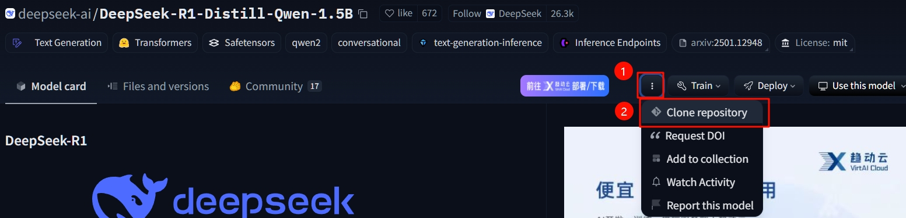
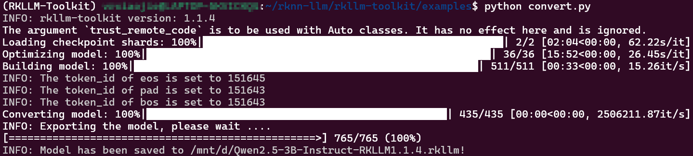

# （可选）模型转换
如果你想用已经转换好的rkllm模型，请前往huggingface下载:

[DeepSeek-R1-Distill-Qwen-1.5B-RK3588S-RKLLM1.1.4](https://huggingface.co/VRxiaojie/DeepSeek-R1-Distill-Qwen-1.5B-RK3588S-RKLLM1.1.4)

[DeepSeek-R1-Distill-Qwen-7B-RK3588S-RKLLM1.1.4](https://huggingface.co/VRxiaojie/DeepSeek-R1-Distill-Qwen-7B-RK3588S-RKLLM1.1.4)

:::warning 注意
1. 若你的香橙派5内存为8GB及以下，请下载参数量1.5B的模型，若为16GB的可尝试7B的。
2. huggingface官网需代理上网，若实在上不去可使用[镜像站](https://hf-mirror.com/)
3. 转换好的模型基于2025.1.21的版本，若后续模型有更新，请自行转换。
:::

## 1 配置WSL环境
由于转换模型时能用Nvidia CUDA进行GPU加速，因此，如果你是N卡，建议使用WSL进行转换。当然，CPU也能转，但速度非常慢。

### 1.1 安装WSL
安装WSL的方法建议参阅网上的资料，这里就不再赘述了。请在搜索引擎搜索**WSL安装Ubuntu 22.04**，安装好后再往下进行。

### 1.2 下载RKLLM库到本地
本部分参阅之前的文档[下载RKLLM库到本地](开发环境准备.html#_2-下载rkllm库到本地)

### 1.3 安装Anaconda3虚拟环境及rkllm-toolkit库
本部分参阅之前的文档[rkllm-toolkit-安装](开发环境准备.html#_3-rkllm-toolkit-安装)

## 2 下载huggingface模型
这里将以huggingface的镜像站为例，若无法访问，请想方法访问其官网。

打开[huggingface镜像站](https://hf-mirror.com/)，搜索`
 DeepSeek-R1-Distill-Qwen-1.5B`。

clone这个仓库



::: tip 将仓库存在Win系统磁盘而非Linux磁盘内
若你想把模型放在Win系统的磁盘内，例如我这里放在D盘根目录下，需要在WSL终端内执行
```shell
sudo mount -t drvfs D: /mnt/d
cd /mnt/d
```
:::

根据弹出的页面提示，在WSL终端输入命令

```shell
sudo apt install git-lfs # 在Ubuntu上安装git-lfs
git lfs install # 初始化git lfs
git clone https://hf-mirror.com/deepseek-ai/DeepSeek-R1-Distill-Qwen-1.5B # clone仓库
```

这里我是将仓库存在Win系统的D盘下，即Linux系统挂载的/mnt/d目录下。

:::tip 
如果你在clone时长时间卡住不动，或许是因为大文件无法下载下来，这时候需要在网页的Files and versions中，使用IDM等多线程下载工具，手动下载大文件到仓库目录下。
:::

## 3 新建convert.py文件
参考官方给出的示例，简单做了个用于转换的python程序。

```shell
cd ~/rknn-llm/rkllm-toolkit/examples
vi convert.py
```

:::details 查看代码
```python
from rkllm.api import RKLLM

modelpath = '/mnt/d/DeepSeek-R1-Distill-Qwen-1.5B'
# 初始化RKLLM对象
llm = RKLLM()

# 模型加载
ret = llm.load_huggingface(model=modelpath, model_lora = None, device='cuda')
if ret != 0:
    print('Load model failed!')
    exit(ret)

# 模型的量化构建
ret = llm.build(do_quantization=True, optimization_level=1, quantized_dtype='w8a8',
                quantized_algorithm='normal', target_platform='rk3588', num_npu_core=3)
#ret = llm.build(do_quantization=True, optimization_level=1, quantized_dtype='w8a8', target_platform='rk3588')
if ret != 0:
    print('Build model failed!')
    exit(ret)

# 导出rkllm模型
ret = llm.export_rkllm("/mnt/d/deepseek-r1-1.5B-rkllm1.1.4.rkllm")
if ret != 0:
    print('Export model failed!')
    exit(ret)
```
:::

::: warning 注意
请将上述代码的第3行改为你从huggingface上下载的模型路径，以及第22行改为你的模型输出路径！
:::

## 4 运行转换程序
:::warning 建议
这里尽量把后台程序关掉，留出充足的内存和显存。
:::
在终端输入
```shell
conda activate rkllm
python convert.py
```
等待一会，出现下图所示内容即为转换完成。

