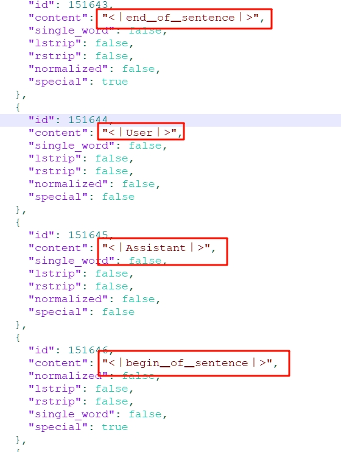

# （扩展阅读）如何修改提示词
由于RKLLM官方给出的示例代码llm_demo.cpp中，配置的提示词前后缀是针对Qwen模型的，而不同模型的配置方法各不相同。本章节就来讲讲修改提示词的思路。

## 1 查阅Huggingface上的tokenizer.json
例如我使用的Deepseek官方基于Qwen蒸馏的模型，参考其文件中的[tokenizer.json](https://huggingface.co/deepseek-ai/DeepSeek-R1-Distill-Qwen-7B/blob/main/tokenizer.json)和[tokenizer_config.json](https://huggingface.co/deepseek-ai/DeepSeek-R1-Distill-Qwen-7B/blob/main/tokenizer_config.json)。

`<｜begin▁of▁sentence｜>`是作为一句话的起始标记，`<｜User｜>`后面的是用户输入的内容`<｜Assistant｜>`后面的内容是AI生成的内容，`<｜end▁of▁sentence｜>`作为一句话的结束标记。



这样就能拼凑出提示词前缀+正文+提示词后缀的内容了，整体结构如下：
```text
<｜begin▁of▁sentence｜> + 提示词 + <｜User｜> + 用户输入 + <｜Assistant｜> + AI输出 + <｜end▁of▁sentence｜>
```

## 2 修改提示词
我们要在代码中使用
```cpp
text = PROMPT_TEXT_PREFIX + input_str + PROMPT_TEXT_POSTFIX;
```

```cpp
#define PROMPT_TEXT_PREFIX "<｜begin▁of▁sentence｜> 提示词 <｜User｜>"
#define PROMPT_TEXT_POSTFIX "<｜Assistant｜>"
```

:::tip
这里的`<｜end▁of▁sentence｜>`不需要我们自己写，因为AI输出结束后会自动补上的。
:::

