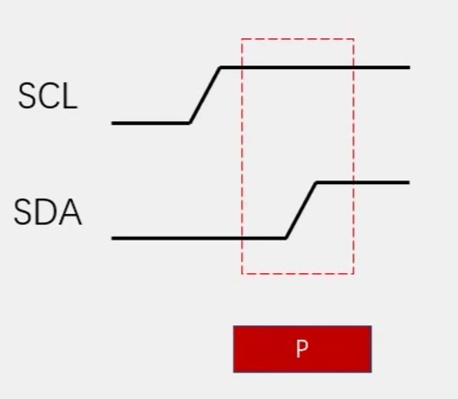

# I2C简介及模拟I2C

## 简介
I2C 通讯协议(Inter－Integrated Circu司开发的，由于它引脚少，硬件实现it)是由Phiilps公简单，可扩展性强， 不需要USART、CAN等通讯协议的外部收发设备，现在被广泛地使用在系统内多个集成电路(IC)间的通讯。

在计算机科学里，大部分复杂的问题都可以通过分层来简化。如芯片被分为内核层和片上外设；STM32标准库则是在寄存器与用户代码之间的软件层。 对于通讯协议，我们也以分层的方式来理解，最基本的是把它分为物理层和协议层。物理层规定通讯系统中具有机械、电子功能部分的特性， 确保原始数据在物理媒体的传输。协议层主要规定通讯逻辑，统一收发双方的数据打包、解包标准。 简单来说物理层规定我们用嘴巴还是用肢体来交流，协议层则规定我们用中文还是英文来交流。

## 电路规范
1. I2C有两条线，一条是SDA数据线，一条是SCL时钟线。
2. 所有设备的SDA连在一起，SCL连在一起
3. SCL和SDA线上都要配置上拉电阻，且阻值越小速率越快。通常值为4.7KΩ
4. 主控设备(通常是MCU)，要将SDA和SCL线所对的引脚配置为开漏输出模式。
5. 开漏输出和上拉电阻共同实现了"线与"的功能

:::tip
所谓"线与"，就是在主设备或者从设备有一方将总线拉低，则整个总线都为低电平(0)，而如果都不动，则被上拉电阻拉至高电平(1)。所以，如果要释放总线，主机将SDA置1即可。
:::

## 通信过程关键点
::: warning 注意
本节的代码使用STC89C52单片机使用，其主频不高(普中开发A2上的晶振11.0592MHz，实测IO翻转频率在230KHz)，故未添加延时函数。如果要用其他MCU模拟I2C，需视主频而定延时时间，以防速率过快无法和从设备正常通信。
:::
### 1 起始条件
在SCL为高电平时，SDA由高变到低


:::details Code
```c
void I2C_Start()
{
    SDA = 1;
    SCL = 1;
    SDA = 0;
    SCL = 0;
}
```
:::

### 2 终止条件
在SCL为高电平时，SDA由低变到高



:::details Code
```c
void I2C_Stop()
{
    SDA = 0;
    SCL = 1;
    SDA = 1;
    SCL = 0;
}
```
:::

:::tip 巧记方法
起始与终止条件都是让SCL=1时让SDA**有个变化的过程**
:::

### 3 接收应答
当主机向从机发送一字节时，从机需要给予回应(ACK，Acknowledgement缩写)，主机才会发下一字节。

具体做法是主机将SDA=1以释放SDA线，然后CLK=1，此时读取SDA的值，若SDA=0，为ACK(应答)，否则为NACK(无应答)。

:::details Code
```c
u8 I2C_ReceiveACK()
{
    u8 ack;
    SDA = 1;
    SCL = 1;
    ack = SDA;
    SCL = 0;
    return ack;
}
```
:::

### 4 发送字节


说明:
1. 数据是遵循MSB原则的，即高位先发
2. SCL=1期间，要求SDA保持稳定，以便从设备读取SDA线上的值
3. SCL=0期间，主机放置数据到SDA线上

:::details Code
```c
void I2C_WriteByte(u8 dat)
{
    u8 i;
    for (i = 0; i < 8; i++) {
        SDA = dat & (0x80 >> i);
        SCL = 1;
        SCL = 0;
    }
}
```
:::

### 5 发送应答
当主机要接收从机发来的字节时，主机需要发送应答位ACK，以便让从机知道可以继续发下一字节。

具体做法是主机将CLK=1，**若要发送应答，则将SDA=0，否则将SDA=1**，最后CLK=0

:::details Code
```c
void I2C_SendACK(u8 ack)
{
    SDA = ack;
    SCL = 1;
    SCL = 0;
}
```
:::

### 6 接收字节


说明:
1. 数据是遵循MSB原则的，即主机先接收到的是高位
2. SCL=1期间由从机控制SDA线，此时主机读取SDA线上的值

:::details Code
```c
u8 I2C_ReadByte()
{
    u8 i, dat = 0x00;
    for (i = 0; i < 8; i++) {
        SCL = 1;
        if (SDA) {
            dat |= (0x80 >> i);
        }
        SCL = 0;
    }
    return dat;
}
```
:::

