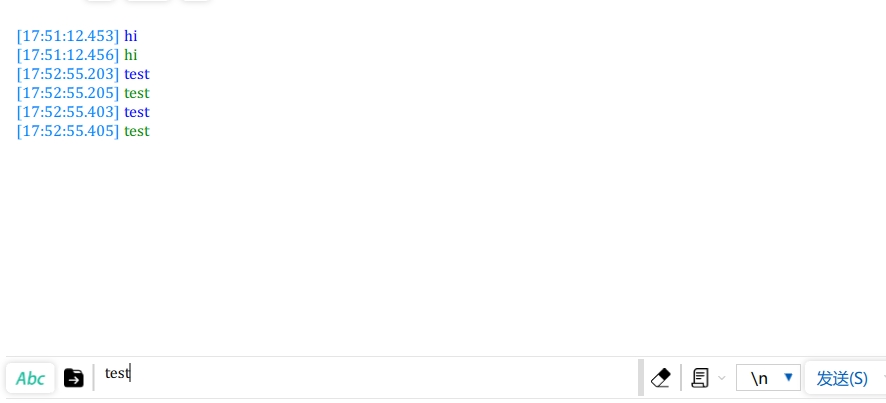

# 创建模板工程
开发瑞萨MCU是要用到E2 Studio的（简称e2s），之前在试用RA4E2时已做过详细的配置记录：[https://bbs.elecfans.com/jishu_2468424_1_1.html](https://bbs.elecfans.com/jishu_2468424_1_1.html) ，在这里就不再赘述，直接开始创建模板工程。

## 1. 新建项目
点击新建--瑞萨C/C++项目--Renesas RA
根据下方图片来进行之后的操作，其中项目名为template，主控芯片搜索R7FA2L1AB2DFL，不用FreeRTOS


## 2. 设置输出hex文件
点击菜单栏的项目--C/C++ Project Settings，找到下图所示的地方，选择 Intel HEX


## 3. 设置串口及printf重定向
### 3.1 设置外设对应引脚
双击e2s界面左侧的`项目资源管理器`当中的`configuration.xml`文件，在中间选择Pins--peripherals--Connectivity:SCI--SCI9，将右侧的RXD9设置为P110、TXD9为P109


### 3.2 新建并设置模块属性
点击Stacks，New Stack--Connectivity--UART(r_sci_uart)


单击g_uart0_UART，在属性对话框中更改`name`为`g_uart9`，`Channel`改为`9`，其他属性配置保持默认。


然后，在Interrupts--Callback中，修改为`debug_uart9_callback`，这是串口中断回调函数，稍后将在代码中写具体逻辑。每当串口发送或者接收完成一个字符时，都会默认触发串口的中断，而在串口中断中会调用函数 debug_uart9_callback，在函数里我们需要根据不同的中断情况进行相应的处理。


### 3.3 重定向printf输出到串口
虽然我们可以直接使用 `R_SCI_UART_Write` 函数来将字符串输出到串口，但是这个函数在很多情况下没有 `printf` 函数那样方便。所以我们需要添加一段代码来将 printf 输出重定向到串口UART9。

在菜单栏中单击项目--C/C++ Project Settings，按下图所示进行勾选，最后应用并关闭。


最后，修改一下堆大小，点击BSP--Heap Size--修改为`0x1000`


保存配置文件，并点击Generate Project Content让其自动为我们生成代码。


### 3.4 代码编写
在工程的src文件夹下，新建`debug_bsp_uart.h`头文件和`debug_bsp_uart.c`源文件。

### 3.4.1 修改debug_bsp_uart.c

在`debug_bsp_uart.c`中键入如下代码，包含了一个发送完成标志`uart_send_complete_flag`、调试串口 UART9 初始化`Debug_UART9_Init`和先前配置的串口回调函数`debug_uart9_callback`。

```c
#include "debug_bsp_uart.h"
/* 发送完成标志 */
volatile int uart_send_complete_flag = 0;

/* 调试串口 UART9 初始化 */
void Debug_UART9_Init(void)
{
   fsp_err_t err = FSP_SUCCESS;

   err = R_SCI_UART_Open (&g_uart9_ctrl, &g_uart9_cfg);
   assert(FSP_SUCCESS == err);
}

/* 串口中断回调 */
void debug_uart9_callback (uart_callback_args_t * p_args)
{
   switch (p_args->event)
   {
      case UART_EVENT_RX_CHAR:
      {
            /* 把串口接收到的数据发送回去 */
            R_SCI_UART_Write(&g_uart9_ctrl, (uint8_t *)&(p_args->data), 1);
            break;
      }
      case UART_EVENT_TX_COMPLETE:
      {
            uart_send_complete_flag = 1;
            break;
      }
      default:
            break;
   }
}

```
还是在`debug_bsp_uart.c`文件中，加入重定向 printf 输出的函数
```c
/* 重定向 printf 输出 */
#if defined __GNUC__ && !defined __clang__
int _write(int fd, char *pBuffer, int size); //防止编译警告
int _write(int fd, char *pBuffer, int size)
{
   (void)fd;
   R_SCI_UART_Write(&g_uart9_ctrl, (uint8_t *)pBuffer, (uint32_t)size);
   while(uart_send_complete_flag == 0);
   uart_send_complete_flag = 0;

   return size;
}
#else
int fputc(int ch, FILE *f)
{
   (void)f;
   R_SCI_UART_Write(&g_uart9_ctrl, (uint8_t *)&ch, 1);
   while(uart_send_complete_flag == 0);
   uart_send_complete_flag = 0;

   return ch;
}
#endif
```

### 3.4.2 修改debug_bsp_uart.h
在`debug_bsp_uart.h`中加入以下代码，用于声明函数：
```c
#include "hal_data.h"
#include "stdio.h"
void Debug_UART9_Init(void);
```

### 3.4.3 修改hal_entry.c
在文件开头，加入以下代码:
```c
#include "debug_bsp_uart.h"
```
在`hal_entry`函数中，加入以下代码:
```c
    Debug_UART9_Init(); // SCI9 UART 调试串口初始化
```
最后编译该工程即可。

## 4. 下载测试
### 4.1 Renesas Flash Programmer 软件
需要下载 Renesas Flash Programmer 软件，可以到 RA 生态社区网站下载。

RA 生态社区网站下载地址：
[https://ramcu.cn/resource/list/?aType=5](https://ramcu.cn/resource/list/?aType=5)

或者去瑞萨官网下载：
[https://www.renesas.cn/zh/software-tool/renesas-flash-programmer-programming-gui](https://www.renesas.cn/zh/software-tool/renesas-flash-programmer-programming-gui)

这里我使用串口下载的方式，接线如下表所示
| USB转串口模块 | 开发板    |
| ------------- | --------- |
| 3.3V          | VCC       |
| GND           | GND       |
| RXD           | P109/TXD9 |
| TXD           | P110/RXD9 |

### 4.2 软件配置
将USB转TTL的模块接入电脑，双击打开烧录软件，先新建工程


然后做一些配置

找到template项目的.hex文件


将开发板上的模式选择跳线改为短接1、3号接口的，并按一下RST按键，接着点击软件中的Start，即可完成烧录。

### 4.3 效果
打开串口助手软件，将波特率设置为115200，发送任意消息，可看到板子同时发送回来，即为配置成功。

