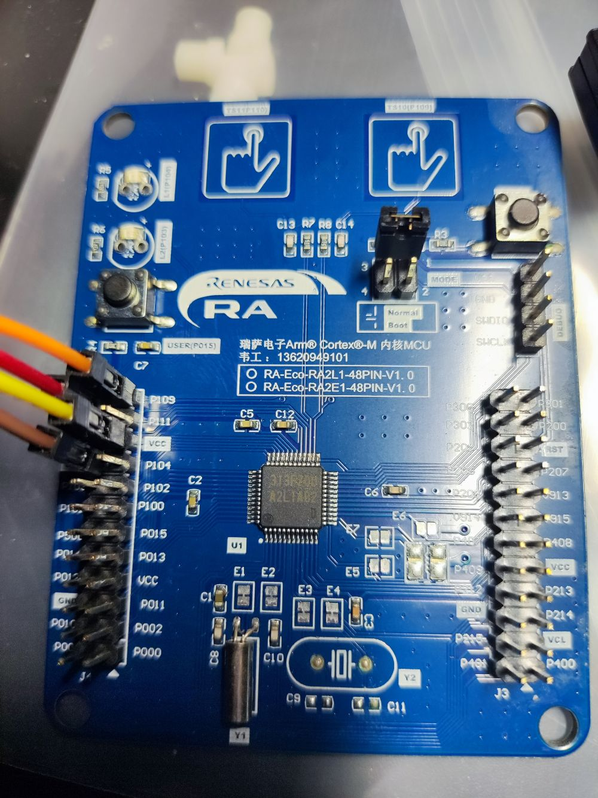

# 开箱
前些天在电子发烧友论坛上申请试用了RA2L1开发板，下面是其外观，两边各引出了两排引脚，支持串口烧录和JLink烧录。
左侧有一个用户按键，右侧的是RST按键，上方是两块触摸按键。

这次拿这块开发板来做一个低功耗的桌面摆件项目，功能是实时时钟+温湿度计，使用0.96寸 OLED屏幕显示数据，触摸按键唤醒，未唤醒时进入待机模式。预计用到的开发板功能有：I2C、触摸按键、UART、待机模式