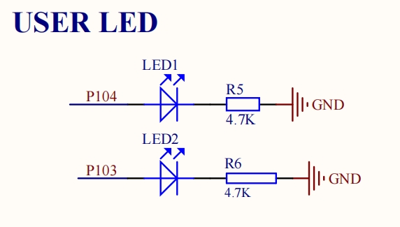

# 硬件部分
## 1 LED
这块RA2L1开发板载有2颗LED灯，通过原理图可知它们接在了P103和P104引脚上，串了限流电阻接地。

## 2 GPT介绍
通用 PWM 定时器（GPT，General PWM Timer）是 RA MCU 的其中一种 32/16 位的定时器外设。 在 GPT 当中，可分为 GPT32 和 GPT16，它们最主要的区别是计数器的不同。 GPT32 是 32 位的定时器，包含的计数器是 32 位的，所能计数的范围为：0 ~ 0xFFFF_FFFF； 而 GPT16 是 16 位的定时器，包含的计数器是 16 位的，所能计数的范围为：0 ~ 0xFFFF。

定时器（Timer）最基本的功能就是定时，比如定时发送串口数据、定时采集AD数据、定时触发中断处理其它事务等等。 如果把定时器与 GPIO 引脚结合起来使用的话可以实现更加丰富的功能， 可以对输入信号进行计数，可以测量输入信号的脉冲宽度，可以输出单个脉冲、PWM 等波形，等等。 通过定时器生成 PWM 波形信号来控制电机状态是工业控制的普遍方法，这方面知识非常值得深入了解。

GPT 模块可用于计数事件、测量外部输入信号、作为通用计时器并产生周期性中断、以及输出周期性或 PWM 信号到 GTIOC 引脚。 GPT 也可用于输出单个脉冲，但是注意这是通过软件来实现的，GPT 硬件本身不支持输出单个脉冲（One-Shot）功能。 当使用单个脉冲（One-Shot）模式时，必须要开启中断，计时器需要在脉冲周期结束后在 ISR 中断服务函数中被停止。

## 3 PWM介绍
PWM 的全称是脉冲宽度调制（Pulse Width Modulation），简称脉宽调制，通俗的讲就是调节脉冲的宽度。 其原理是通过将有效的电信号分散成离散形式从而来降低电信号所传递的平均功率， 根据面积等效法则，可以通过对改变脉冲的时间宽度，来等效地获得所需要合成的相应幅值和频率的波形。 PWM 有着非常广泛的应用，比如直流电机控制、开关电源、逆变器等等。
