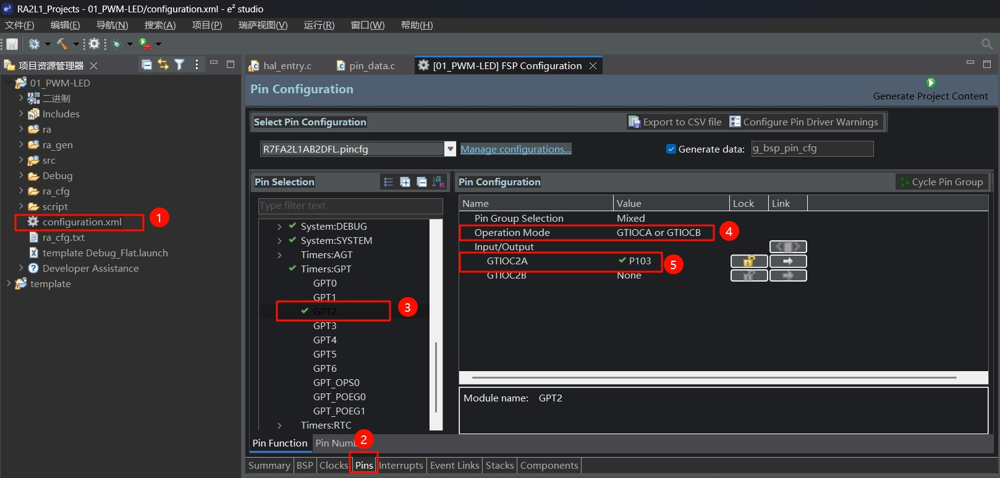
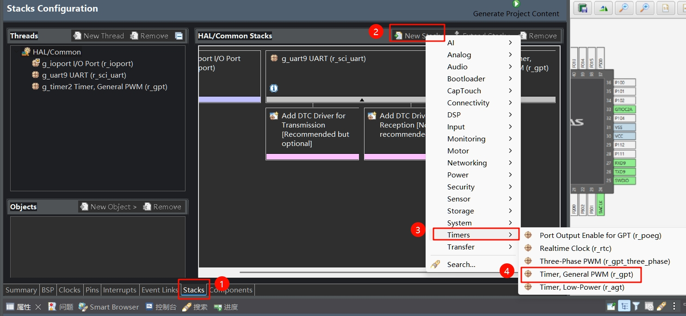
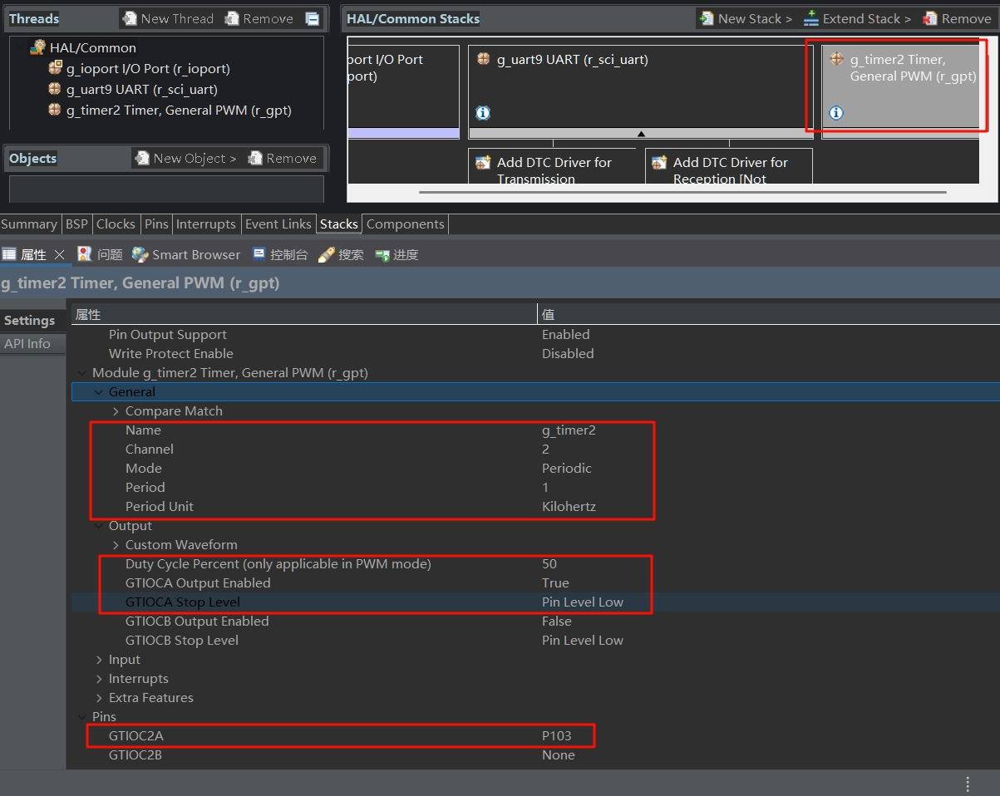

# 软件部分
将先前的项目模板复制一份，重命名为`01_PWM-lED`
## 1 GPT-PWM配置
点击`configuration.xml`文件，
| 步骤 | 操作                                                                    |
| ---- | ----------------------------------------------------------------------- |
| 1    | 在左侧项目资源管理器中，点击`configuration.xml`文件。                   |
| 2    | 点击界面下方标签栏中的`Pins`标签，进入引脚配置界面。                    |
| 3    | 在`Pin Selection`区域，展开`Timers:GPT`，选择GPT2。                     |
| 4    | 在`Pin Configuration`区域，将`Operation Mode`设置为`GTIOCA or GTIOCB`。 |
| 5    | 在`Pin Configuration`区域，勾选GTIOCA下的P103引脚。                     |



接着来到`Stacks`选项卡，
| 步骤 | 操作                                                 |
| ---- | ---------------------------------------------------- |
| 1    | 在界面下方标签栏，点击`Stacks`标签，进入堆栈配置页面 |
| 2    | 在`HAL/Common Stacks`区域，点击`New Stack`按钮       |
| 3    | 在弹出菜单中，选择`Timers`选项                       |
| 4    | 在`Timers`子菜单中，选择`Timer, General PWM (r_gpt)` |




| 序号 | 操作                                                                                                                                                                                                                                   |
| ---- | -------------------------------------------------------------------------------------------------------------------------------------------------------------------------------------------------------------------------------------- |
| 1    | 在`HAL/Common Stacks`区域，点击选中`g_timer2 Timer, General PWM (r_gpt)`。                                                                                                                                                             |
| 2    | 在下方`属性`设置区域，找到`General`部分，配置参数：`Name`为`g_timer2`，`Channel`为`2`，`Mode`为`Periodic`，`Period`为`1`，`Period Unit`为`Kilohertz`。                                                                                 |
| 3    | 在`Custom Waveform`部分，设置`Duty Cycle Percent (only applicable in PWM mode)`为`50`，`GTIOCA Output Enabled`为`True`，`GTIOCA Stop Level`为`Pin Level Low`，`GTIOCB Output Enabled`为`False`，`GTIOCB Stop Level`为`Pin Level Low`。 |
| 4    | 在`Pins`部分，确认`GTIOCA2A`对应`P103`。                                                                                                                                                                                               |



配置完成后，生成项目代码。

## 2 代码编写
### 2.1 PWM.c
新建一个源文件`PWM.c`，里面内容如下：
```c
#include "hal_data.h"
// 设置占空比的函数
void GPT_PWM_SetDuty(uint8_t duty)
{
    timer_info_t info;
    /* 获得GPT的信息 */
    R_GPT_InfoGet(&g_timer2_ctrl, &info);

    /* 获得计时器一个周期需要的计数次数 */
    uint32_t current_period_counts = info.period_counts;

    /* 根据占空比和一个周期的计数次数计算GTCCR寄存器的值 */
    uint32_t duty_cycle_counts = (uint32_t)(((uint64_t)current_period_counts * duty) / 100);

    /* 最后调用FSP库函数设置占空比 */
    R_GPT_DutyCycleSet(&g_timer2_ctrl, duty_cycle_counts, GPT_IO_PIN_GTIOCA);
}

```

### 2.2 PWM.h
新建一个头文件`PWM.c`，里面内容如下：
```c
#ifndef PWM_H_
#define PWM_H_

void GPT_PWM_SetDuty(uint8_t duty);

#endif /* PWM_H_ */
```

### 2.3 修改hal_entry.c

在包含头文件部分，添加：
```c
#include "PWM.h"
```

在`hal_entry`函数中，添加代码：
```c
typedef enum
    {
        up = 0,
        down
    } Direction;

    uint8_t dutyNum = 0; // 占空比[0,100]
    Direction d = up;
    Debug_UART9_Init();                        // SCI9 UART 调试串口初始化
    R_GPT_Open(&g_timer2_ctrl, &g_timer2_cfg); // 初始化定时器GPT2

    R_GPT_Start(&g_timer2_ctrl); // 启动定时器GPT2

    while (1)
    {
        if (d == up)
        {
            if (dutyNum == 100)
            {
                d = down;
            }
            dutyNum++;
        }
        else
        {
            if (dutyNum == 0)
            {
                d = up;
            }
            dutyNum--;
        }
        GPT_PWM_SetDuty(dutyNum);
        R_BSP_SoftwareDelay(10, BSP_DELAY_UNITS_MILLISECONDS);
    }
```

这段代码作用是，每隔10ms设置一次PWM占空比的值dutyNum。dutyNum是从0递增，若达到100，则转为递减，若降低到0，则转为递增，循环往复。

