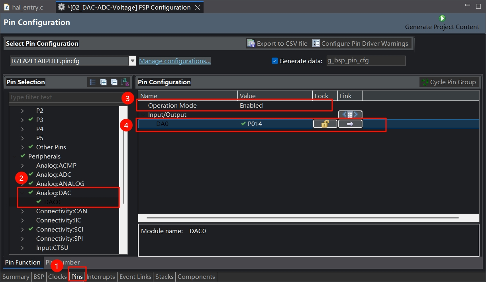
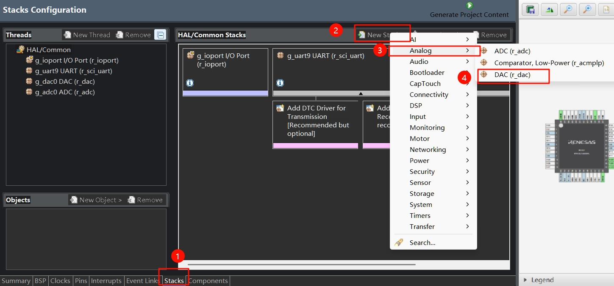
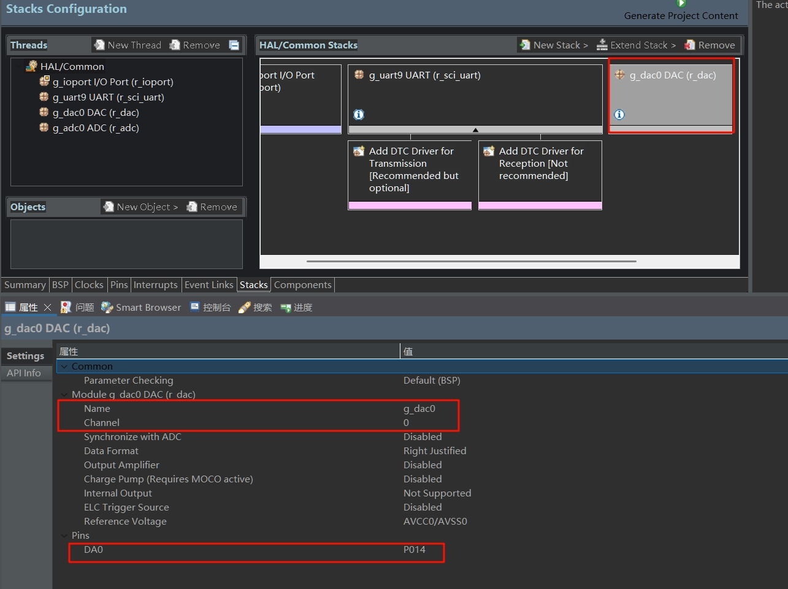
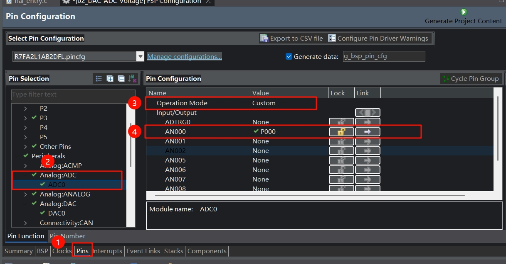
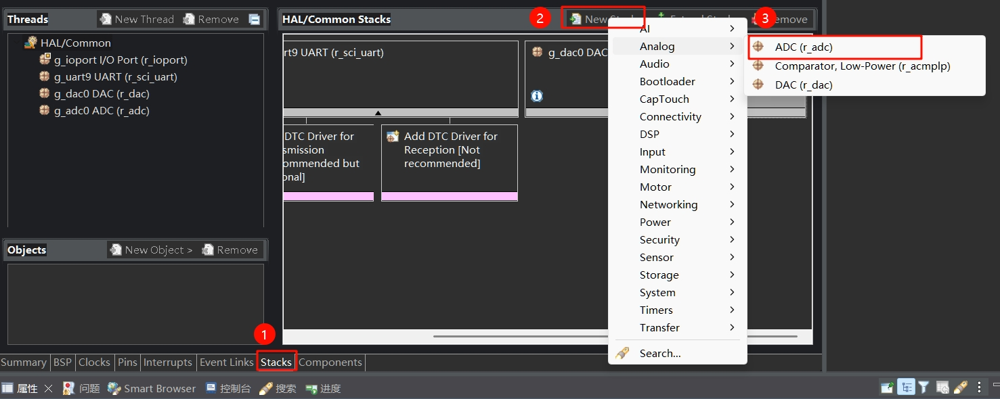
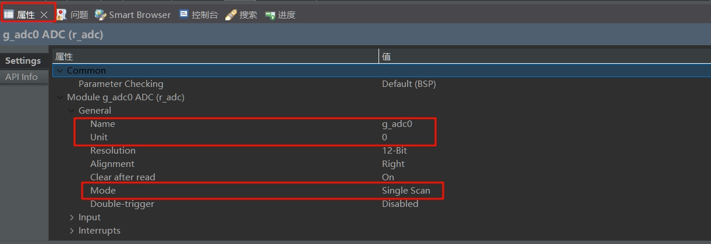
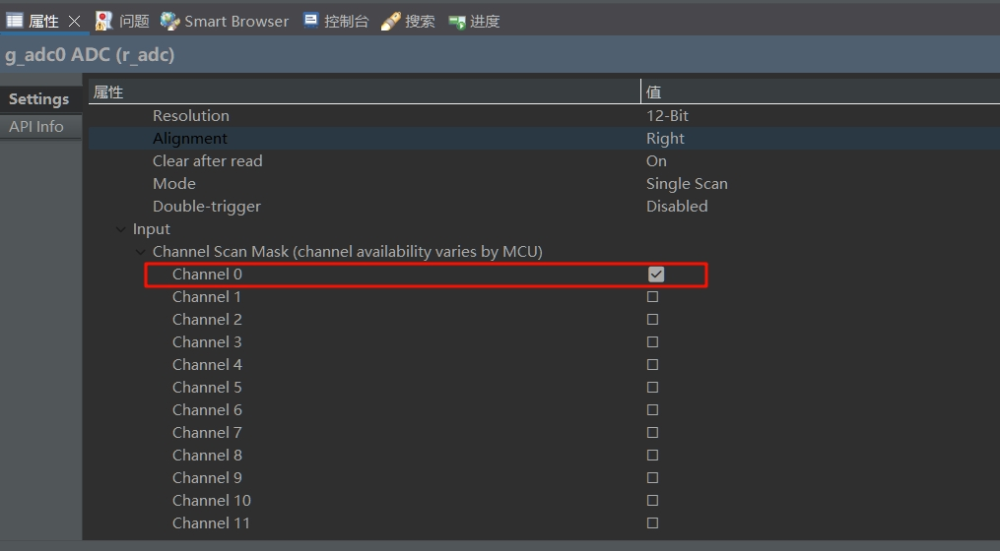
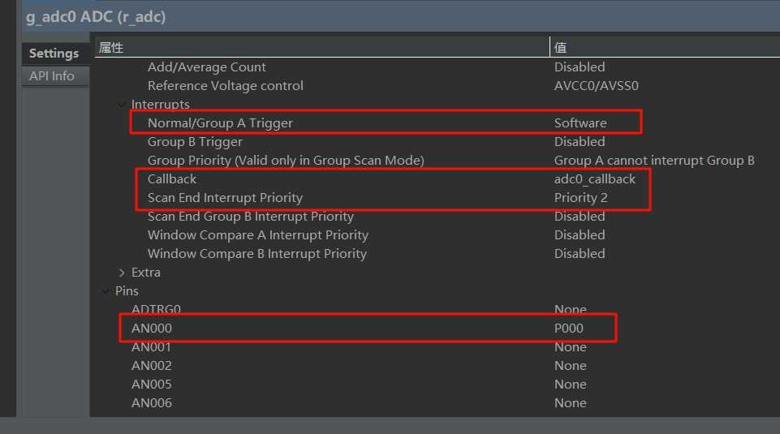

# 软件部分
将先前的项目模板复制一份，重命名为`02_DAC-ADC-Voltage`
## 1. 配置DAC
先进入Pins页面
| 序号 | 操作                                                                  |
| ---- | --------------------------------------------------------------------- |
| 1    | 点击界面下方标签栏中的`Pins`标签，进入引脚配置界面。                  |
| 2    | 在`Pin Selection`区域，展开`Analog`选项，选择`Analog:DAC`下的`DAC0`。 |
| 3    | 在`Pin Configuration`区域，将`Operation Mode`设置为`Enabled`。        |
| 4    | 在`Pin Configuration`区域，勾选`DAC0`对应的`P014`引脚。               |



再来到Stacks页面

| 序号 | 操作                                                   |
| ---- | ------------------------------------------------------ |
| 1    | 点击界面下方标签栏中的`Stacks`标签，进入堆栈配置页面。 |
| 2    | 在`HAL/Common Stacks`区域，点击`New Stack`按钮。       |
| 3    | 在弹出菜单中，选择`Analog`选项。                       |
| 4    | 在`Analog`子菜单中，选择`DAC (r_dac)`。                |



最后配置DAC的属性

| 序号 | 操作                                                                                              |
| ---- | ------------------------------------------------------------------------------------------------- |
| 1    | 在`HAL/Common Stacks`区域，点击选中`g_dac0 DAC (r_dac)`。                                         |
| 2    | 在下方`Settings`设置区域，`Module g_dac0 DAC (r_dac)`部分，确认`Name`为`g_dac0`，`Channel`为`0`。 |
| 3    | 在`Settings`设置区域的`Pins`部分，确认`DAC0`对应`P014`。                                          |




## 2. 配置ADC
进入Pins页面

| 序号 | 操作                                                          |
| ---- | ------------------------------------------------------------- |
| 1    | 点击界面下方标签栏中的`Pins`标签，进入引脚配置界面。          |
| 2    | 在`Pin Selection`区域，展开`Analog:ADC`选项，选择`ADC0`。     |
| 3    | 在`Pin Configuration`区域，将`Operation Mode`设置为`Custom`。 |
| 4    | 在`Pin Configuration`区域，勾选`AN000`对应的`P000`引脚。      |



进入Stacks页面

| 序号 | 操作                                                   |
| ---- | ------------------------------------------------------ |
| 1    | 点击界面下方标签栏中的`Stacks`标签，进入堆栈配置页面。 |
| 2    | 在`HAL/Common Stacks`区域，点击`New Stack`按钮。       |
| 3    | 在弹出菜单中，选择`Analog`选项下的`ADC (r_adc)`。      |



| 序号 | 操作                                                                                                   |
| ---- | ------------------------------------------------------------------------------------------------------ |
| 1    | 在`Settings`设置区域的`Module g_adc0 ADC (r_adc)` - `General`部分，设置`Name`为`g_adc0`，`Unit`为`0`。 |
| 2    | 在`Settings`设置区域的`Module g_adc0 ADC (r_adc)` - `General`部分，设置`Mode`为`Single Scan`。         |



| 序号 | 操作                                                                                                            |
| ---- | --------------------------------------------------------------------------------------------------------------- |
| 1    | 在`Settings`设置区域的`Input` - `Channel Scan Mask (channel availability varies by MCU)`部分，勾选`Channel 0`。 |



| 序号 | 操作                                                                                                                   |
| ---- | ---------------------------------------------------------------------------------------------------------------------- |
| 1    | 在`Settings`设置区域的`Interrupts`部分，设置`Normal/Group A Trigger`为`Software`。                                     |
| 2    | 在`Settings`设置区域的`Interrupts`部分，设置`Callback`为`adc0_callback`，`Scan End Interrupt Priority`为`Priority 2`。 |
| 3    | 在`Settings`设置区域的`Pins`部分，确认`AN000`对应`P000`。                                                              |



配置完成后，生成项目代码。

## 3. 编写代码
### 3.1 新建adc.h
新建文件`adc.h`，加入以下代码
```c
#ifndef ADC_H_
#define ADC_H_
void adc0_waitComplete();
#endif
```

### 3.2 新建adc.c
这段代码中实现了adc的回调函数`adc0_callback`，当ADC扫描完成时会自动调用。在回调函数中将标志位`scan_complete_flag`设为true，以便`adc0_waitComplete`函数退出死循环。

新建文件`adc.c`，加入以下代码
```c
#include "adc.h"
#include "hal_data.h"

volatile static bool scan_complete_flag = true;
void adc0_callback(adc_callback_args_t *p_args)
{
    FSP_PARAMETER_NOT_USED(p_args);
    scan_complete_flag = true;
}

void adc0_waitComplete()
{
    scan_complete_flag = false;
    while (!scan_complete_flag)
    {
        /* Wait for callback to*/
    }
}
```


### 3.3 修改hal_entry.c
在这里要实现用DAC输出电压，ADC采集电压，每隔200ms递增或递减一次DAC输出的电压值，同时打印到串口。
在`hal_entry.c`的文件开头加入:
```c
#include "adc.h"
uint16_t adc_data = 0;
```

在`hal_entry函数`中加入:
```c
typedef enum
    {
        up,
        down
    } Direction;
    Direction d = up;
    uint16_t dac_value = 0;
    Debug_UART9_Init(); // SCI9 UART 调试串口初始化
    g_dac0.p_api->open(&g_dac0_ctrl, &g_dac0_cfg);
    g_dac0.p_api->start(&g_dac0_ctrl);

    g_adc0.p_api->open(&g_adc0_ctrl, &g_adc0_cfg);
    g_adc0.p_api->scanCfg(&g_adc0_ctrl, &g_adc0_channel_cfg);
    while (1)
    {
        g_dac0.p_api->write(&g_dac0_ctrl, dac_value);
        g_adc0.p_api->scanStart(&g_adc0_ctrl);
        adc0_waitComplete();
        g_adc0.p_api->read(&g_adc0_ctrl, ADC_CHANNEL_0, &adc_data);
        double volt = (double)(adc_data / 4095.0) * 3.3;
        printf("adc_data: %d, 电压: %.3lf V\n", adc_data, volt);
        if (d == up)
        {
            dac_value += 500;
        }
        else
        {
            dac_value -= 500;
        }
        if (dac_value >= 4000)
        {
            d = down;
        }
        if (dac_value == 0)
        {
            d = up;
        }
        R_BSP_SoftwareDelay(200, BSP_DELAY_UNITS_MILLISECONDS);
    }
```
注意，这里是用了面向对象的编程方法，参考教程为：[《ARM嵌入式系统中面向对象的模块编程方法》基于DShanMCU-RA6M5(瑞萨MCU)](https://renesas-docs.100ask.net/zh/DShanMCU_RA6M5/object_oriented_module_programming_method_in_ARM_embedded_system/)
也可以用瑞萨FSP库的函数编程，一样的。
例如
```c
g_dac0.p_api->write(&g_dac0_ctrl, dac_value);
```
就可以用FSP库代替
```c
R_DAC_Write(&g_dac0_ctrl, dac_value);
```
