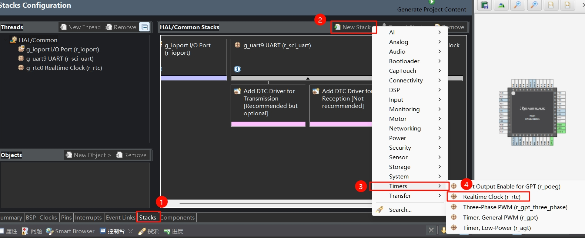
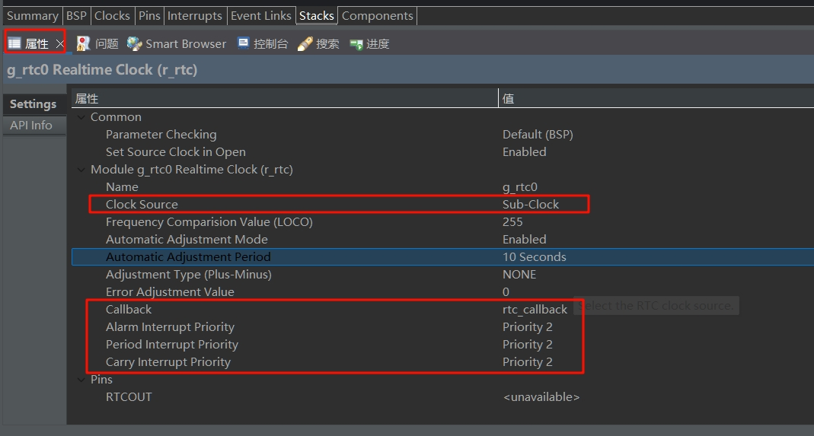

# 软件部分
## 1. 配置RTC
选择Stacks选项卡

| 序号 | 操作                                                   |
| ---- | ------------------------------------------------------ |
| 1    | 点击界面下方标签栏中的`Stacks`标签，进入堆栈配置页面。 |
| 2    | 在`HAL/Common Stacks`区域，点击`New Stack`按钮。       |
| 3    | 在弹出菜单中，选择`Timers`选项。                       |
| 4    | 在`Timers`子菜单中，选择`Realtime Clock (r_rtc)`。     |



| 序号 | 操作                                                                                                                                                                          |
| ---- | ----------------------------------------------------------------------------------------------------------------------------------------------------------------------------- |
| 1    | 在`Settings`设置区域的`Module g_rtc0 Realtime Clock (r_rtc)`部分，找到`Clock Source`，将其设置为`Sub-Clock`。                                                                 |
| 2    | 在`Settings`设置区域的`Module g_rtc0 Realtime Clock (r_rtc)`部分，设置`Callback`为`rtc_callback`。                                                                            |
| 3    | 在`Settings`设置区域的`Module g_rtc0 Realtime Clock (r_rtc)`部分，分别设置`Alarm Interrupt Priority`、`Period Interrupt Priority`、`Carry Interrupt Priority`为`Priority 2`。 |



配置完成后，生成项目代码。
## 2. 编写代码
将先前的项目模板复制一份，重命名为`03_RTC`
### 2.1 新建rtc.h
新建文件`rtc.h`，加入以下代码
```c
#ifndef RTC_H_
#define RTC_H_
#include "hal_data.h"
extern rtc_time_t set_time;
extern volatile bool rtc_flag;
#endif
```

### 2.2 新建rtc.c
这段代码定义一个set_time结构体，用于在主函数中配置，同时实现了`rtc_callback`回调函数，用于每1秒中断一次使用
```c
#include "hal_data.h"
#include "rtc.h"

rtc_time_t set_time = {
    .tm_sec = 59,   /* 秒，范围从 0 到 59 */
    .tm_min = 59,   /* 分，范围从 0 到 59 */
    .tm_hour = 23,  /* 小时，范围从 0 到 23*/
    .tm_mday = 28,  /* 一月中的第几天，范围从 1 到 31*/
    .tm_mon = 1,   /* 月份，范围从 0 到 11（0代表1月，11代表12月）*/
    .tm_year = 125, /* 自 1900 起的年数，2021 为 121*/
};

volatile bool rtc_flag = false;       // RTC 延时 1s 标志位

void rtc_callback(rtc_callback_args_t *p_args)
{
    if (p_args->event == RTC_EVENT_PERIODIC_IRQ)
        rtc_flag = true;
}
```

### 2.3 修改hal_entry.c
在文件开头加入代码
```c
#include "rtc.h"

rtc_time_t get_time;
```

在`hal_entry`函数中加入代码，主要功能是初始化了rtc、配置时间以及解析串口接收到的设定时间的信息
```c
    g_rtc0.p_api->open(&g_rtc0_ctrl, &g_rtc0_cfg);
    g_rtc0.p_api->calendarTimeSet(&g_rtc0_ctrl, &set_time);
    g_rtc0.p_api->periodicIrqRateSet(&g_rtc0_ctrl, RTC_PERIODIC_IRQ_SELECT_1_SECOND);
    while (1)
    {
        if (rtc_flag)
        {
            g_rtc0.p_api->calendarTimeGet(&g_rtc0_ctrl, &get_time); // 获取 RTC 计数时间
            rtc_flag = 0;
            printf("%d年%d月%d日 %d:%d:%d\n",
                    get_time.tm_year + 1900, get_time.tm_mon +1, get_time.tm_mday,
                    get_time.tm_hour, get_time.tm_min, get_time.tm_sec);
        }
        if (uart_rx_complete_flag)
        {
            char * time;
            uart_rx_complete_flag = 0;
            // 解析设置时间的命令 e.g: time:20250126080910
            // warning: 未添加错误纠正算法，请输入正确的时间，否则工作异常！
            if(strncmp(rx_data, "time:", 5) == 0){
                time = rx_data+5;
                set_time.tm_year = ((time[0]-'0')*1000)+((time[1]-'0')*100)+
                        ((time[2]-'0')*10)+(time[3]-'0')-1900;
                set_time.tm_mon = ((time[4]-'0')*10)+(time[5]-'0') - 1;
                set_time.tm_mday = ((time[6]-'0')*10)+(time[7]-'0');
                set_time.tm_hour = ((time[8]-'0')*10)+(time[9]-'0');
                set_time.tm_min = ((time[10]-'0')*10)+(time[11]-'0');
                set_time.tm_sec = ((time[12]-'0')*10)+(time[13]-'0');
                g_rtc0.p_api->calendarTimeSet(&g_rtc0_ctrl, &set_time);
           }
        }
    }
```

### 2.4 修改debug_bsp_uart.c
改动部分比较多，为了方便起见，把该文件的内容都放在下方了。
:::details 点击展开
```c
#include "debug_bsp_uart.h"
/* 发送完成标志 */
volatile int uart_send_complete_flag = 0;
volatile int uart_rx_complete_flag = 0;

char rx_data[1024];
volatile uint16_t cnt;
uint8_t stat = 0;
/* 调试串口 UART9 初始化 */
void Debug_UART9_Init(void)
{
   fsp_err_t err = FSP_SUCCESS;

   err = R_SCI_UART_Open(&g_uart9_ctrl, &g_uart9_cfg);
   assert(FSP_SUCCESS == err);
}

/* 串口中断回调 */
void debug_uart9_callback(uart_callback_args_t *p_args)
{
   switch (p_args->event)
   {
   case UART_EVENT_RX_CHAR:
   {
      /* 把串口接收到的数据发送回去 */
      // R_SCI_UART_Write(&g_uart9_ctrl, (uint8_t *)&(p_args->data), 1);
      rx_data[cnt++] = (char)p_args->data;
      if (stat == 0 && p_args->data == '\r')
      {
         stat = 1;
      }
      else if (stat == 1 && p_args->data == '\n')
      { // 接收完一行
         uart_rx_complete_flag = 1;
         cnt = 0;
      }
      else
      {
         stat = 0;
      }

      break;
   }
   case UART_EVENT_TX_COMPLETE:
   {
      uart_send_complete_flag = 1;
      break;
   }

   default:
      break;
   }
}

/* 重定向 printf 输出 */
#if defined __GNUC__ && !defined __clang__
int _write(int fd, char *pBuffer, int size); // 防止编译警告
int _write(int fd, char *pBuffer, int size)
{
   (void)fd;
   R_SCI_UART_Write(&g_uart9_ctrl, (uint8_t *)pBuffer, (uint32_t)size);
   while (uart_send_complete_flag == 0)
      ;
   uart_send_complete_flag = 0;

   return size;
}
#else
int fputc(int ch, FILE *f)
{
   (void)f;
   R_SCI_UART_Write(&g_uart9_ctrl, (uint8_t *)&ch, 1);
   while (uart_send_complete_flag == 0)
      ;
   uart_send_complete_flag = 0;

   return ch;
}
#endif
```
:::

### 2.5 修改debug_bsp_uart.h
该文件内容为
:::details 点击展开
```c
#ifndef DEBUG_BSP_UART_H_
#define DEBUG_BSP_UART_H_
#include "hal_data.h"
#include "stdio.h"
void Debug_UART9_Init(void);
extern volatile int uart_rx_complete_flag;
extern char rx_data[1024];
#endif
```
:::
