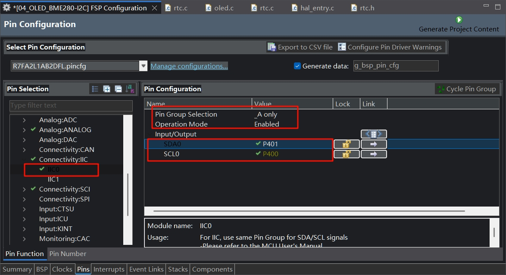
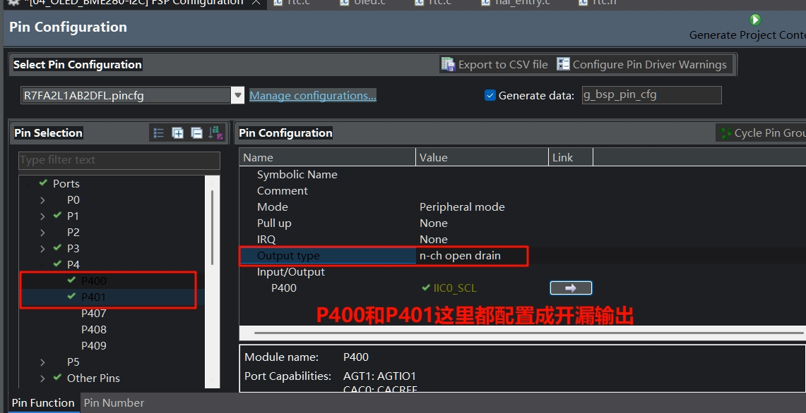
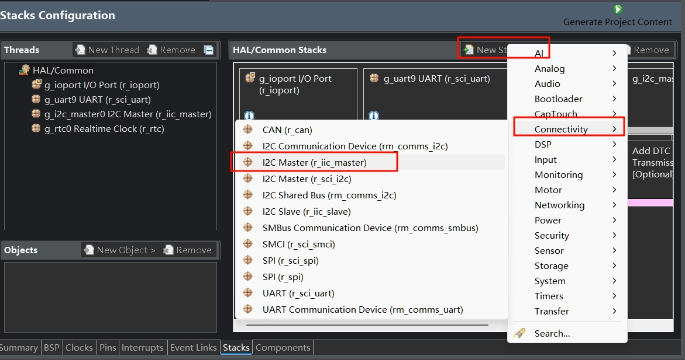
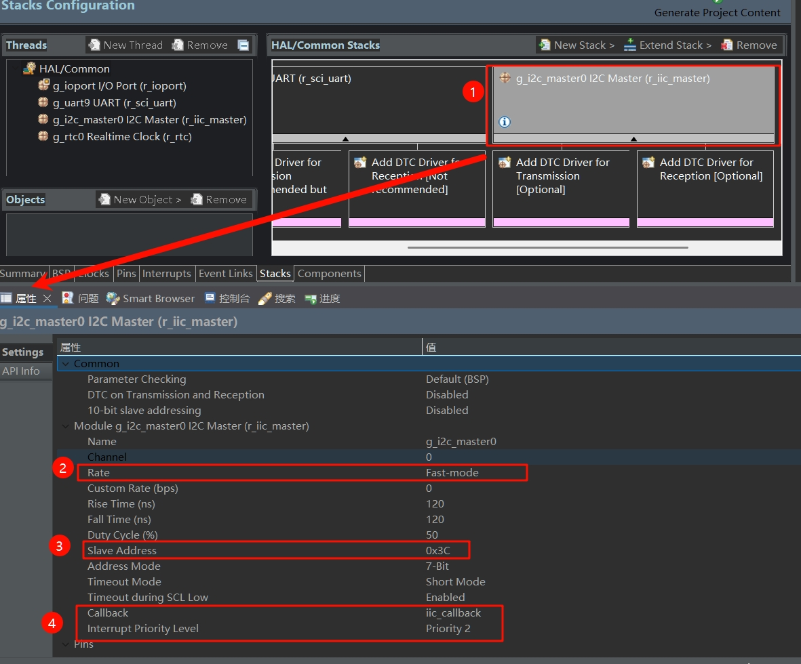

# 软件部分
将先前`03_RTC`工程复制一份，重命名为`04_OLED_BME280-I2C`。
## 1 配置I2C
首先在e2s内配置I2C
| 序号 | 操作                                                                                                 |
| ---- | ---------------------------------------------------------------------------------------------------- |
| 1    | 点击界面下方标签栏中的`Pins`标签，进入引脚配置界面。                                                 |
| 2    | 在`Pin Selection`区域，展开`Connectivity:I2C`选项，选择`I2C0`。                                      |
| 3    | 在`Pin Configuration`区域，将`Pin Group Selection`设置为`_A only`，`Operation Mode`设置为`Enabled`。 |
| 4    | 勾选`SDA0`对应的`P401`引脚和`SCL0`对应的`P400`引脚。                                                 |



| 序号 | 操作                                                                     |
| ---- | ------------------------------------------------------------------------ |
| 1    | 在`Pin Selection`区域，分别选择`P400`和`P401`引脚。                      |
| 2    | 将`Output type`设置为`n-ch open drain`，把`P400`和`P401`配置成开漏输出。 |




| 序号 | 操作                                                        |
| ---- | ----------------------------------------------------------- |
| 1    | 点击界面下方标签栏中的`Stacks`标签，进入堆栈配置页面。      |
| 2    | 在`HAL/Common Stacks`区域，点击`New Stack`按钮。            |
| 3    | 在弹出菜单中，选择`Connectivity`选项。                      |
| 4    | 在`Connectivity`子菜单中，选择`I2C Master (r_iic_master)`。 |



| 序号 | 操作                                                                                                                             |
| ---- | -------------------------------------------------------------------------------------------------------------------------------- |
| 1    | 在`HAL/Common Stacks`区域，点击选中`g_i2c_master0 I2C Master (r_iic_master)`。                                                   |
| 2    | 在下方`Settings`设置区域的`Module g_i2c_master0 I2C Master (r_iic_master)`部分，将`Rate`设置为`Fast-mode`。                      |
| 3    | `Module g_i2c_master0 I2C Master (r_iic_master)`部分，设置`Slave Address`为`0x3c`。                                              |
| 4    | `Module g_i2c_master0 I2C Master (r_iic_master)`部分，设置`Callback`为`iic_callback`，`Interrupt Priority Level`为`Priority 2`。 |




这里说明一下，在移植商家给的STM32 OLED驱动库时看到屏幕地址为`0x78`，即 `01111000`，是包含读写位的（最低位）。而瑞萨这里是7位地址，不含读写位，因此要将0x78右移1位，即`0x3C` (0111100)。

确认上面设置没问题后，生成项目代码。
## 2 编写代码
### 2.1 I2C通信相关
新建`i2c.c`和`i2c.h`文件。

`i2c.h`:
::: details 查看代码
```c
#ifndef I2C_H_
#define I2C_H_

extern volatile bool i2c_rx_complete;
extern volatile bool i2c_tx_complete;

void i2c_wait_rx();
void i2c_wait_tx();
#endif

```
:::

`i2c.c`:
::: details 查看代码
```c
#include "hal_data.h"
#include "i2c.h"

volatile bool i2c_rx_complete = false;
volatile bool i2c_tx_complete = false;
uint16_t timeout = 0;

void iic_callback(i2c_master_callback_args_t *p_args)
{
    if (p_args->event == I2C_MASTER_EVENT_RX_COMPLETE)
    {
        i2c_rx_complete = true;
    }
    else if (p_args->event == I2C_MASTER_EVENT_TX_COMPLETE)
    {
        i2c_tx_complete = true;
    }
}

void i2c_wait_tx()
{
    timeout = 1000;
    while (!i2c_tx_complete && timeout > 0)
    {
        timeout--;
    }
    i2c_tx_complete = false;
}

void i2c_wait_rx()
{
    timeout = 1000;
    while (!i2c_rx_complete && timeout > 0)
    {
        timeout--;
    }
    i2c_rx_complete = false;
}

```

:::

由于瑞萨FSP库的高集成度，我只需要编写代码实现回调函数`iic_callback`、等待发送函数`i2c_wait_tx`、等待接收`i2c_wait_rx`函数改变标志位即可。

### 2.2 BME280操作相关
`bme280.h`:
::: details 查看代码
```c

#ifndef BME280_H_
#define BME280_H_
#include "hal_data.h"
#define BME280_ID 0x60
typedef struct
{
    double humi, temp, press;
    bool initialized;
} BME_Struct;

void BME280_Get_Data(BME_Struct *bme);
void BME280_Init(BME_Struct *bme);
void BME280_Write_then_Read(uint8_t *src, uint8_t write_bytes, uint8_t *data_dest, uint8_t read_bytes);
void BME280_Trimming_Values();
double BME280_compensate_T_double(int32_t adc_T);
double BME280_compensate_P_double(int32_t adc_P);
double bme280_compensate_H_double(int32_t adc_H);

#endif /* BME280_H_ */

```
:::

`bme280.c`:
::: details 查看代码
```c
#include "bme280.h"
#include "hal_data.h"
#include "i2c.h"

uint16_t dig_T1;
int16_t dig_T2;
int16_t dig_T3;
uint16_t dig_P1;
int16_t dig_P2;
int16_t dig_P3;
int16_t dig_P4;
int16_t dig_P5;
int16_t dig_P6;
int16_t dig_P7;
int16_t dig_P8;
int16_t dig_P9;

int8_t dig_H1;
int16_t dig_H2;
int8_t dig_H3;
int16_t dig_H4;
int16_t dig_H5;
int8_t dig_H6;

void BME280_Write_then_Read(uint8_t *src, uint8_t write_bytes, uint8_t *data_dest, uint8_t read_bytes)
{
    //临时设置I2C从机地址为0x76
    g_i2c_master0.p_api->slaveAddressSet(&g_i2c_master0_ctrl, 0x76, I2C_MASTER_ADDR_MODE_7BIT);
    g_i2c_master0.p_api->write(&g_i2c_master0_ctrl, src, write_bytes, true);
    i2c_wait_tx();
    g_i2c_master0.p_api->read(&g_i2c_master0_ctrl, data_dest, read_bytes, false);
    i2c_wait_rx();
    g_i2c_master0.p_api->slaveAddressSet(&g_i2c_master0_ctrl, 0x3C, I2C_MASTER_ADDR_MODE_7BIT);
}

void BME280_Init(BME_Struct *bme)
{
    uint8_t reg = 0xD0;
    uint8_t write_settings[7] = {0x00};
    uint8_t read_data;
    BME280_Write_then_Read(&reg, 1, &read_data, 1);
    if (read_data != BME280_ID)
    {
        printf("Init BME280 Failed!\n");
        bme->initialized = false;
        return;
    }
    else
    {
        bme->initialized = true;
    }

    write_settings[0] = 0xF2; // 设置湿度采集的寄存器 0xF2
    write_settings[1] = 0x05; // 00000 101 湿度 oversampling x16
    write_settings[2] = 0xF4; // 设置温度采集、气压采集、工作模式的寄存器 0xF4
    write_settings[3] = 0x93; // 100 100 11 温度和气压 oversampling x8，模式为normal
    write_settings[4] = 0xF5; // 配置config寄存器
    write_settings[5] = 0x10; // 000 100 0 0 ，配置滤波器系数为16
    g_i2c_master0.p_api->slaveAddressSet(&g_i2c_master0_ctrl, 0x76, I2C_MASTER_ADDR_MODE_7BIT);
    g_i2c_master0.p_api->write(&g_i2c_master0_ctrl, &write_settings[0], 6, false);
    i2c_wait_tx();
    g_i2c_master0.p_api->slaveAddressSet(&g_i2c_master0_ctrl, 0x3C, I2C_MASTER_ADDR_MODE_7BIT);
    R_BSP_SoftwareDelay(2, BSP_DELAY_UNITS_MILLISECONDS);
    // 校准数据
    BME280_Trimming_Values();
}

void BME280_Trimming_Values()
{
    uint8_t data[33] = {
        0,
    };
    uint8_t reg = 0x88;
    BME280_Write_then_Read(&reg, 1, &data[0], 24);
    R_BSP_SoftwareDelay(5, BSP_DELAY_UNITS_MILLISECONDS); // 适当加延迟否则数据错误
    reg = 0xA1;
    BME280_Write_then_Read(&reg, 1, &data[24], 1);
    R_BSP_SoftwareDelay(5, BSP_DELAY_UNITS_MILLISECONDS); // 适当加延迟否则数据错误
    reg = 0xE1;
    BME280_Write_then_Read(&reg, 1, &data[25], 7);
    R_BSP_SoftwareDelay(5, BSP_DELAY_UNITS_MILLISECONDS); // 适当加延迟否则数据错误

    dig_T1 = (data[1] << 8) | data[0];
    dig_T2 = (data[3] << 8) | data[2];
    dig_T3 = (data[5] << 8) | data[4];

    dig_P1 = (data[7] << 8) | data[6];
    dig_P2 = (data[9] << 8) | data[8];
    dig_P3 = (data[11] << 8) | data[10];
    dig_P4 = (data[13] << 8) | data[12];
    dig_P5 = (data[15] << 8) | data[14];
    dig_P6 = (data[17] << 8) | data[16];
    dig_P7 = (data[19] << 8) | data[18];
    dig_P8 = (data[21] << 8) | data[20];
    dig_P9 = (data[23] << 8) | data[22];

    dig_H1 = data[24];
    dig_H2 = (data[26] << 8) | data[25];
    dig_H3 = data[27];
    dig_H4 = (data[28] << 4) | (data[29] & 0x0F);
    dig_H5 = (data[30] << 4) | ((data[29] >> 4));
    dig_H6 = data[31];
}

// Returns temperature in DegC, double precision. Output value of “51.23” equals 51.23 DegC.
// t_fine carries fine temperature as global value
volatile long signed int t_fine;
double BME280_compensate_T_double(long signed int adc_T)
{
    double var1, var2, T;
    var1 = (((double)adc_T) / 16384.0 - ((double)dig_T1) / 1024.0) * ((double)dig_T2);
    var2 = ((((double)adc_T) / 131072.0 - ((double)dig_T1) / 8192.0) *
            (((double)adc_T) / 131072.0 - ((double)dig_T1) / 8192.0)) *
           ((double)dig_T3);
    t_fine = (long signed int)(var1 + var2);
    T = (var1 + var2) / 5120.0;
    return T;
}
// Returns pressure in Pa as double. Output value of “96386.2” equals 96386.2 Pa = 963.862 hPa
double BME280_compensate_P_double(long signed int adc_P)
{
    double var1, var2, p;
    var1 = ((double)t_fine / 2.0) - 64000.0;
    var2 = var1 * var1 * ((double)dig_P6) / 32768.0;
    var2 = var2 + var1 * ((double)dig_P5) * 2.0;
    var2 = (var2 / 4.0) + (((double)dig_P4) * 65536.0);
    var1 = (((double)dig_P3) * var1 * var1 / 524288.0 + ((double)dig_P2) * var1) / 524288.0;
    var1 = (1.0 + var1 / 32768.0) * ((double)dig_P1);
    if (var1 == 0.0)
    {
        return 0; // avoid exception caused by division by zero
    }
    p = 1048576.0 - (double)adc_P;
    p = (p - (var2 / 4096.0)) * 6250.0 / var1;
    var1 = ((double)dig_P9) * p * p / 2147483648.0;
    var2 = p * ((double)dig_P8) / 32768.0;
    p = p + (var1 + var2 + ((double)dig_P7)) / 16.0;
    return p;
}
// Returns humidity in %rH as as double. Output value of “46.332” represents 46.332 % rH
double bme280_compensate_H_double(long signed int adc_H)
{
    double var_H;
    var_H = (((double)t_fine) - 76800.0);
    var_H = (adc_H - (((double)dig_H4) * 64.0 + ((double)dig_H5) / 16384.0 *
                                                    var_H)) *
            (((double)dig_H2) / 65536.0 * (1.0 + ((double)dig_H6) / 67108864.0 * var_H * (1.0 + ((double)dig_H3) / 67108864.0 * var_H)));
    var_H = var_H * (1.0 - ((double)dig_H1) * var_H / 524288.0);
    if (var_H > 100.0)
        var_H = 100.0;
    else if (var_H < 0.0)
        var_H = 0.0;
    return var_H;
}

void BME280_Get_Data(BME_Struct *bme)
{
    uint8_t dat[8] = {0};
    uint32_t press_t, temp_t, hum_t = 0;
    uint8_t reg = 0xF7;

    BME280_Write_then_Read(&reg, 1, &dat[0], 8);
    R_BSP_SoftwareDelay(2, BSP_DELAY_UNITS_MILLISECONDS);
    press_t = ((((uint32_t)dat[0] << 12) | ((uint32_t)dat[1] << 4)) | ((uint32_t)dat[2] >> 4));
    temp_t = ((((uint32_t)dat[3] << 12) | ((uint32_t)dat[4] << 4)) | ((uint32_t)dat[5] >> 4));
    hum_t = (((uint32_t)dat[6] << 8) | (uint32_t)dat[7]);

    bme->temp = BME280_compensate_T_double(temp_t);
    bme->press = BME280_compensate_P_double(press_t) / 100.0;
    bme->humi = bme280_compensate_H_double(hum_t);
//    printf("temp: %.2lf, humid: %.2lf, pressure: %.2lf\n", bme->temp, bme->humi, bme->press);
}
```
:::
`BME280_compensate_T_double`、`bme280_compensate_H_double`、`bme280_compensate_P_double`这三个函数分别为温度、湿度、气压的补偿算法函数，借鉴了BME280官方数据手册内给出的参考代码。
bme280工作流程为
| 步骤 | 内容                                               |
| ---- | -------------------------------------------------- |
| 1    | 上电初始化                                         |
| 2    | 写入0xF2、0xF4、0xF5寄存器以设定过采样率等参数     |
| 3    | 获取校准数据                                       |
| 4    | 调用BME280_Get_Data函数，读取0xF7~0xFE寄存器的数据 |
| 5    | 调用补偿算法函数得到人类可读的数值                 |

:::warning 注意
在写入+读取函数后记得跟1~5ms的延时，再进行下一步操作，否则会因为bme280侧的数据未准备好，有极大概率读取到错误数据或读不到数据。
:::
### 2.3 OLED屏幕操作相关
`oled.h`:
::: details 查看代码
```c
#ifndef OLED_H_
#define OLED_H_

#include "hal_data.h"

#define OLED_CMD 0  // 写命令
#define OLED_DATA 1 // 写数据
void OLED_ClearPoint(uint8_t x, uint8_t y);
void OLED_ColorTurn(uint8_t i);
void OLED_DisplayTurn(uint8_t i);
void OLED_WR_Byte(uint8_t dat, uint8_t mode);
void OLED_DisPlay_On(void);
void OLED_DisPlay_Off(void);
void OLED_Refresh(void);
void OLED_Clear(void);
void OLED_DrawPoint(uint8_t x, uint8_t y, uint8_t t);
void OLED_DrawLine(uint8_t x1, uint8_t y1, uint8_t x2, uint8_t y2, uint8_t mode);
void OLED_DrawCircle(uint8_t x, uint8_t y, uint8_t r);
void OLED_ShowChar(uint8_t x, uint8_t y, uint8_t chr, uint8_t size1);
void OLED_ShowString(uint8_t x, uint8_t y, uint8_t *chr, uint8_t size1);
void OLED_ShowNum(uint8_t x, uint8_t y, uint32_t num, uint8_t len, uint8_t size1);
void OLED_ShowChinese(uint8_t x, uint8_t y, uint8_t num, uint8_t size1);
void OLED_ScrollDisplay(uint8_t num, uint8_t space);
void OLED_ShowPicture(uint8_t x, uint8_t y, uint8_t sizex, uint8_t sizey, uint8_t BMP[], uint8_t mode);
void OLED_Init(void);

#endif

```
:::


`oled.c`:
::: details 查看代码
```c
#include "oled.h"
#include "oled_font.h"
#include "i2c.h"
volatile uint8_t OLED_GRAM[144][8];

// 反显函数
void OLED_ColorTurn(uint8_t i)
{
    if (i == 0)
    {
        OLED_WR_Byte(0xA6, OLED_CMD); // 正常显示
    }
    if (i == 1)
    {
        OLED_WR_Byte(0xA7, OLED_CMD); // 反色显示
    }
}

// 屏幕旋转180度
void OLED_DisplayTurn(uint8_t i)
{
    if (i == 0)
    {
        OLED_WR_Byte(0xC8, OLED_CMD); // 正常显示
        OLED_WR_Byte(0xA1, OLED_CMD);
    }
    if (i == 1)
    {
        OLED_WR_Byte(0xC0, OLED_CMD); // 反转显示
        OLED_WR_Byte(0xA0, OLED_CMD);
    }
}

// 发送一个字节
// mode:数据/命令标志 0,表示命令;1,表示数据;
void OLED_WR_Byte(uint8_t dat, uint8_t mode)
{
    uint8_t data[2];
    if (mode)
    {
        data[0] = 0x40;
    }
    else
    {
        data[0] = 0x00;
    }
    data[1] = dat;
    R_IIC_MASTER_Write(&g_i2c_master0_ctrl, data, 2, false);
    i2c_wait_tx();
}

// 开启OLED显示
void OLED_DisPlay_On(void)
{
    OLED_WR_Byte(0x8D, OLED_CMD); // 电荷泵使能
    OLED_WR_Byte(0x14, OLED_CMD); // 开启电荷泵
    OLED_WR_Byte(0xAF, OLED_CMD); // 点亮屏幕
}

// 关闭OLED显示
void OLED_DisPlay_Off(void)
{
    OLED_WR_Byte(0x8D, OLED_CMD); // 电荷泵使能
    OLED_WR_Byte(0x10, OLED_CMD); // 关闭电荷泵
    OLED_WR_Byte(0xAE, OLED_CMD); // 关闭屏幕
}

// 更新显存到OLED
void OLED_Refresh(void)
{
    uint8_t i, n;
    for (i = 0; i < 8; i++)
    {
        OLED_WR_Byte(0xb0 + i, OLED_CMD); // 设置行起始地址
        OLED_WR_Byte(0x00, OLED_CMD);     // 设置低列起始地址
        OLED_WR_Byte(0x10, OLED_CMD);     // 设置高列起始地址
        for (n = 0; n < 128; n++)
        {
            OLED_WR_Byte(OLED_GRAM[n][i], OLED_DATA);
        }
    }
}
// 清屏函数
void OLED_Clear(void)
{
    uint8_t i, n;
    for (i = 0; i < 8; i++)
    {
        for (n = 0; n < 128; n++)
        {
            OLED_GRAM[n][i] = 0; // 清除所有数据
        }
    }
    OLED_Refresh(); // 更新显示
}

// 画点
// x:0~127
// y:0~63
// t:1 填充 0,清空
void OLED_DrawPoint(uint8_t x, uint8_t y, uint8_t t)
{
    uint8_t i, m, n;
    i = y / 8;
    m = y % 8;
    n = 1 << m;
    if (t)
    {
        OLED_GRAM[x][i] |= n;
    }
    else
    {
        OLED_GRAM[x][i] = ~OLED_GRAM[x][i];
        OLED_GRAM[x][i] |= n;
        OLED_GRAM[x][i] = ~OLED_GRAM[x][i];
    }
}

// 画线
// x1,y1:起点坐标
// x2,y2:结束坐标
void OLED_DrawLine(uint8_t x1, uint8_t y1, uint8_t x2, uint8_t y2, uint8_t mode)
{
    uint16_t t;
    int xerr = 0, yerr = 0, delta_x, delta_y, distance;
    int incx, incy, uRow, uCol;
    delta_x = x2 - x1; // 计算坐标增量
    delta_y = y2 - y1;
    uRow = x1; // 画线起点坐标
    uCol = y1;
    if (delta_x > 0)
        incx = 1; // 设置单步方向
    else if (delta_x == 0)
        incx = 0; // 垂直线
    else
    {
        incx = -1;
        delta_x = -delta_x;
    }
    if (delta_y > 0)
        incy = 1;
    else if (delta_y == 0)
        incy = 0; // 水平线
    else
    {
        incy = -1;
        delta_y = -delta_x;
    }
    if (delta_x > delta_y)
        distance = delta_x; // 选取基本增量坐标轴
    else
        distance = delta_y;
    for (t = 0; t < distance + 1; t++)
    {
        OLED_DrawPoint(uRow, uCol, mode); // 画点
        xerr += delta_x;
        yerr += delta_y;
        if (xerr > distance)
        {
            xerr -= distance;
            uRow += incx;
        }
        if (yerr > distance)
        {
            yerr -= distance;
            uCol += incy;
        }
    }
    //	OLED_Refresh();
}
// x,y:圆心坐标
// r:圆的半径
void OLED_DrawCircle(uint8_t x, uint8_t y, uint8_t r)
{
    int a, b, num;
    a = 0;
    b = r;
    while (2 * b * b >= r * r)
    {
        OLED_DrawPoint(x + a, y - b, 1);
        OLED_DrawPoint(x - a, y - b, 1);
        OLED_DrawPoint(x - a, y + b, 1);
        OLED_DrawPoint(x + a, y + b, 1);

        OLED_DrawPoint(x + b, y + a, 1);
        OLED_DrawPoint(x + b, y - a, 1);
        OLED_DrawPoint(x - b, y - a, 1);
        OLED_DrawPoint(x - b, y + a, 1);

        a++;
        num = (a * a + b * b) - r * r; // 计算画的点离圆心的距离
        if (num > 0)
        {
            b--;
            a--;
        }
    }
    //		OLED_Refresh();
}

// 显示字符 不建议直接使用，若要使用需要加上OLED_Refresh();更新到显存
void OLED_ShowChar(uint8_t x, uint8_t y, uint8_t chr, uint8_t size1)
{
    uint8_t i, m, temp, size2, chr1;
    uint8_t x0 = x, y0 = y;

    // 计算字符的字节数
    if (size1 == 8)
        size2 = 6;
    else
        size2 = (size1 / 8 + ((size1 % 8) ? 1 : 0)) * (size1 / 2); // 字体占用的字节数

    chr1 = chr - ' '; // 偏移字符值，转换为数组索引

    for (i = 0; i < size2; i++)
    {
        // 根据字体大小选择相应的字模
        if (size1 == 8)
        {
            temp = asc2_0806[chr1][i];
        }
        else if (size1 == 12)
        {
            temp = asc2_1206[chr1][i];
        }
        else if (size1 == 16)
        {
            temp = asc2_1608[chr1][i];
        }
        else if (size1 == 24)
        {
            temp = asc2_2412[chr1][i];
        }
        else
        {
            return; // 字体不支持
        }

        for (m = 0; m < 8; m++)
        {
            if (temp & 0x01)
                OLED_GRAM[x][y / 8] |= (1 << (y % 8)); // 设置显存中的点
            else
                OLED_GRAM[x][y / 8] &= ~(1 << (y % 8)); // 清除显存中的点
            temp >>= 1;
            y++;
        }

        x++;
        if ((size1 != 8) && ((x - x0) == size1 / 2))
        {
            x = x0;
            y0 = y0 + 8;
        }
        y = y0;
    }
}

// 显示字符串
// x,y:起点坐标
// size1:字体大小
//*chr:字符串起始地址
void OLED_ShowString(uint8_t x, uint8_t y, uint8_t *chr, uint8_t size1)
{
    while ((*chr >= ' ') && (*chr <= '~')) // 判断是不是非法字符!
    {
        OLED_ShowChar(x, y, *chr, size1);
        if (size1 == 8)
            x += 6;
        else
            x += size1 / 2;
        chr++;
    }
    OLED_Refresh();
}

// m^n
uint32_t OLED_Pow(uint8_t m, uint8_t n)
{
    uint32_t result = 1;
    while (n--)
    {
        result *= m;
    }
    return result;
}

// 显示数字
// x,y :起点坐标
// num :要显示的数字
// len :数字的位数
// size:字体大小
void OLED_ShowNum(uint8_t x, uint8_t y, uint32_t num, uint8_t len, uint8_t size1)
{
    uint8_t t, temp, m = 0;
    if (size1 == 8)
        m = 2;
    for (t = 0; t < len; t++)
    {
        temp = (num / OLED_Pow(10, len - t - 1)) % 10;
        if (temp == 0)
        {
            OLED_ShowChar(x + (size1 / 2 + m) * t, y, '0', size1);
        }
        else
        {
            OLED_ShowChar(x + (size1 / 2 + m) * t, y, temp + '0', size1);
        }
    }
    OLED_Refresh();
}

void OLED_ShowChinese(uint8_t x, uint8_t y, uint8_t num, uint8_t size1)
{
    uint8_t m, temp;
    uint8_t x0 = x, y0 = y;
    uint16_t i, size3 = (size1 / 8 + ((size1 % 8) ? 1 : 0)) * size1; // 计算一个字符对应的字节数
    uint8_t mask;                                                    // 用来构造显示的掩码

    for (i = 0; i < size3; i++)
    {
        if (size1 == 16)
        {
            temp = Hzk1[num][i]; // 获取字形数据
        }
        else
        {
            return; // 只处理 16x16 字体
        }

        for (m = 0; m < 8; m++)
        {
            mask = (1 << (y % 8)); // 根据当前 y 坐标计算掩码

            if (temp & 0x01) // 当前位为 1
            {
                OLED_GRAM[x][y / 8] |= mask; // 设置该位
            }
            else // 当前位为 0
            {
                OLED_GRAM[x][y / 8] &= ~mask; // 清除该位
            }

            temp >>= 1; // 右移，处理下一个像素
            y++;        // 纵向位置移动
        }

        x++; // 横向位置移动

        // 判断是否换行
        if ((x - x0) == size1)
        {
            x = x0;
            y0 = y0 + 8; // 换行时，y 坐标增加 8
        }

        y = y0; // 恢复 y 坐标
    }

    // 最后刷新整个显示屏
    OLED_Refresh();
}

// num 显示汉字的个数
// space 每一遍显示的间隔
void OLED_ScrollDisplay(uint8_t num, uint8_t space)
{
    uint8_t i, n, t = 0, m = 0, r;
    while (1)
    {
        if (m == 0)
        {
            OLED_ShowChinese(128, 24, t, 16); // 写入一个汉字保存在OLED_GRAM[][]数组中
            t++;
        }
        if (t == num)
        {
            for (r = 0; r < 16 * space; r++) // 显示间隔
            {
                for (i = 1; i < 144; i++)
                {
                    for (n = 0; n < 8; n++)
                    {
                        OLED_GRAM[i - 1][n] = OLED_GRAM[i][n];
                    }
                }
                OLED_Refresh();
            }
            t = 0;
        }
        m++;
        if (m == 16)
        {
            m = 0;
        }
        for (i = 1; i < 144; i++) // 实现左移
        {
            for (n = 0; n < 8; n++)
            {
                OLED_GRAM[i - 1][n] = OLED_GRAM[i][n];
            }
        }
        OLED_Refresh();
    }
}

// x,y：起点坐标
// sizex,sizey,图片长宽
// BMP[]：要写入的图片数组
// mode:0,反色显示;1,正常显示
void OLED_ShowPicture(uint8_t x, uint8_t y, uint8_t sizex, uint8_t sizey, uint8_t BMP[], uint8_t mode)
{
    uint16_t j = 0;
    uint8_t i, n, temp, m;
    uint8_t x0 = x, y0 = y;
    sizey = sizey / 8 + ((sizey % 8) ? 1 : 0);
    for (n = 0; n < sizey; n++)
    {
        for (i = 0; i < sizex; i++)
        {
            temp = BMP[j];
            j++;
            for (m = 0; m < 8; m++)
            {
                if (temp & 0x01)
                    OLED_DrawPoint(x, y, mode);
                else
                    OLED_DrawPoint(x, y, !mode);
                temp >>= 1;
                y++;
            }
            x++;
            if ((x - x0) == sizex)
            {
                x = x0;
                y0 = y0 + 8;
            }
            y = y0;
        }
    }
    OLED_Refresh();
}
// OLED的初始化
void OLED_Init(void)
{
    OLED_WR_Byte(0xAE, OLED_CMD); //--turn off oled panel 关闭显示
    OLED_WR_Byte(0x00, OLED_CMD); //---set low column address
    OLED_WR_Byte(0x10, OLED_CMD); //---set high column address
    OLED_WR_Byte(0x40, OLED_CMD); //--set start line address  Set Mapping RAM Display Start Line (0x00~0x3F)
    OLED_WR_Byte(0x81, OLED_CMD); //--set contrast control register
    OLED_WR_Byte(0xCF, OLED_CMD); // Set SEG Output Current Brightness
    OLED_WR_Byte(0xA1, OLED_CMD); //--Set SEG/Column Mapping     0xa0左右反置 0xa1正常
    OLED_WR_Byte(0xC8, OLED_CMD); // Set COM/Row Scan Direction   0xc0上下反置 0xc8正常
    OLED_WR_Byte(0xA6, OLED_CMD); //--set normal display
    OLED_WR_Byte(0xA8, OLED_CMD); //--set multiplex ratio(1 to 64) 设置驱动路数
    OLED_WR_Byte(0x3f, OLED_CMD); //--1/64 duty
    OLED_WR_Byte(0xD3, OLED_CMD); //-set display offset	Shift Mapping RAM Counter (0x00~0x3F)
    OLED_WR_Byte(0x00, OLED_CMD); //-not offset
    OLED_WR_Byte(0xd5, OLED_CMD); //--set display clock divide ratio/oscillator frequency
    OLED_WR_Byte(0x80, OLED_CMD); //--set divide ratio, Set Clock as 100 Frames/Sec
    OLED_WR_Byte(0xD9, OLED_CMD); //--set pre-charge period
    OLED_WR_Byte(0xF1, OLED_CMD); // Set Pre-Charge as 15 Clocks & Discharge as 1 Clock
    OLED_WR_Byte(0xDA, OLED_CMD); //--set com pins hardware configuration
    OLED_WR_Byte(0x12, OLED_CMD);
    OLED_WR_Byte(0xDB, OLED_CMD); //--set vcomh
    OLED_WR_Byte(0x30, OLED_CMD); // Set VCOM Deselect Level
    OLED_WR_Byte(0x20, OLED_CMD); //-Set Page Addressing Mode (0x00/0x01/0x02)
    OLED_WR_Byte(0x02, OLED_CMD); //
    OLED_WR_Byte(0x8D, OLED_CMD); //--set Charge Pump enable/disable
    OLED_WR_Byte(0x14, OLED_CMD); //--set(0x10) disable
    OLED_Clear();
    OLED_WR_Byte(0xAF, OLED_CMD);
}

```
:::

`oled_font.h`:
::: details 查看代码
```c
#ifndef __OLEDFONT_H
#define __OLEDFONT_H

const unsigned char asc2_0806[][6] =
    {
        {0x00, 0x00, 0x00, 0x00, 0x00, 0x00}, // sp
        {0x00, 0x00, 0x00, 0x2f, 0x00, 0x00}, // !
        {0x00, 0x00, 0x07, 0x00, 0x07, 0x00}, // "
        {0x00, 0x14, 0x7f, 0x14, 0x7f, 0x14}, // #
        {0x00, 0x24, 0x2a, 0x7f, 0x2a, 0x12}, // $
        {0x00, 0x62, 0x64, 0x08, 0x13, 0x23}, // %
        {0x00, 0x36, 0x49, 0x55, 0x22, 0x50}, // &
        {0x00, 0x00, 0x05, 0x03, 0x00, 0x00}, // '
        {0x00, 0x00, 0x1c, 0x22, 0x41, 0x00}, // (
        {0x00, 0x00, 0x41, 0x22, 0x1c, 0x00}, // )
        {0x00, 0x14, 0x08, 0x3E, 0x08, 0x14}, // *
        {0x00, 0x08, 0x08, 0x3E, 0x08, 0x08}, // +
        {0x00, 0x00, 0x00, 0xA0, 0x60, 0x00}, // ,
        {0x00, 0x08, 0x08, 0x08, 0x08, 0x08}, // -
        {0x00, 0x00, 0x60, 0x60, 0x00, 0x00}, // .
        {0x00, 0x20, 0x10, 0x08, 0x04, 0x02}, // /
        {0x00, 0x3E, 0x51, 0x49, 0x45, 0x3E}, // 0
        {0x00, 0x00, 0x42, 0x7F, 0x40, 0x00}, // 1
        {0x00, 0x42, 0x61, 0x51, 0x49, 0x46}, // 2
        {0x00, 0x21, 0x41, 0x45, 0x4B, 0x31}, // 3
        {0x00, 0x18, 0x14, 0x12, 0x7F, 0x10}, // 4
        {0x00, 0x27, 0x45, 0x45, 0x45, 0x39}, // 5
        {0x00, 0x3C, 0x4A, 0x49, 0x49, 0x30}, // 6
        {0x00, 0x01, 0x71, 0x09, 0x05, 0x03}, // 7
        {0x00, 0x36, 0x49, 0x49, 0x49, 0x36}, // 8
        {0x00, 0x06, 0x49, 0x49, 0x29, 0x1E}, // 9
        {0x00, 0x00, 0x36, 0x36, 0x00, 0x00}, // :
        {0x00, 0x00, 0x56, 0x36, 0x00, 0x00}, // ;
        {0x00, 0x08, 0x14, 0x22, 0x41, 0x00}, // <
        {0x00, 0x14, 0x14, 0x14, 0x14, 0x14}, // =
        {0x00, 0x00, 0x41, 0x22, 0x14, 0x08}, // >
        {0x00, 0x02, 0x01, 0x51, 0x09, 0x06}, // ?
        {0x00, 0x32, 0x49, 0x59, 0x51, 0x3E}, // @
        {0x00, 0x7C, 0x12, 0x11, 0x12, 0x7C}, // A
        {0x00, 0x7F, 0x49, 0x49, 0x49, 0x36}, // B
        {0x00, 0x3E, 0x41, 0x41, 0x41, 0x22}, // C
        {0x00, 0x7F, 0x41, 0x41, 0x22, 0x1C}, // D
        {0x00, 0x7F, 0x49, 0x49, 0x49, 0x41}, // E
        {0x00, 0x7F, 0x09, 0x09, 0x09, 0x01}, // F
        {0x00, 0x3E, 0x41, 0x49, 0x49, 0x7A}, // G
        {0x00, 0x7F, 0x08, 0x08, 0x08, 0x7F}, // H
        {0x00, 0x00, 0x41, 0x7F, 0x41, 0x00}, // I
        {0x00, 0x20, 0x40, 0x41, 0x3F, 0x01}, // J
        {0x00, 0x7F, 0x08, 0x14, 0x22, 0x41}, // K
        {0x00, 0x7F, 0x40, 0x40, 0x40, 0x40}, // L
        {0x00, 0x7F, 0x02, 0x0C, 0x02, 0x7F}, // M
        {0x00, 0x7F, 0x04, 0x08, 0x10, 0x7F}, // N
        {0x00, 0x3E, 0x41, 0x41, 0x41, 0x3E}, // O
        {0x00, 0x7F, 0x09, 0x09, 0x09, 0x06}, // P
        {0x00, 0x3E, 0x41, 0x51, 0x21, 0x5E}, // Q
        {0x00, 0x7F, 0x09, 0x19, 0x29, 0x46}, // R
        {0x00, 0x46, 0x49, 0x49, 0x49, 0x31}, // S
        {0x00, 0x01, 0x01, 0x7F, 0x01, 0x01}, // T
        {0x00, 0x3F, 0x40, 0x40, 0x40, 0x3F}, // U
        {0x00, 0x1F, 0x20, 0x40, 0x20, 0x1F}, // V
        {0x00, 0x3F, 0x40, 0x38, 0x40, 0x3F}, // W
        {0x00, 0x63, 0x14, 0x08, 0x14, 0x63}, // X
        {0x00, 0x07, 0x08, 0x70, 0x08, 0x07}, // Y
        {0x00, 0x61, 0x51, 0x49, 0x45, 0x43}, // Z
        {0x00, 0x00, 0x7F, 0x41, 0x41, 0x00}, // [
        {0x00, 0x55, 0x2A, 0x55, 0x2A, 0x55}, // 55
        {0x00, 0x00, 0x41, 0x41, 0x7F, 0x00}, // ]
        {0x00, 0x04, 0x02, 0x01, 0x02, 0x04}, // ^
        {0x00, 0x40, 0x40, 0x40, 0x40, 0x40}, // _
        {0x00, 0x00, 0x01, 0x02, 0x04, 0x00}, // '
        {0x00, 0x20, 0x54, 0x54, 0x54, 0x78}, // a
        {0x00, 0x7F, 0x48, 0x44, 0x44, 0x38}, // b
        {0x00, 0x38, 0x44, 0x44, 0x44, 0x20}, // c
        {0x00, 0x38, 0x44, 0x44, 0x48, 0x7F}, // d
        {0x00, 0x38, 0x54, 0x54, 0x54, 0x18}, // e
        {0x00, 0x08, 0x7E, 0x09, 0x01, 0x02}, // f
        {0x00, 0x18, 0xA4, 0xA4, 0xA4, 0x7C}, // g
        {0x00, 0x7F, 0x08, 0x04, 0x04, 0x78}, // h
        {0x00, 0x00, 0x44, 0x7D, 0x40, 0x00}, // i
        {0x00, 0x40, 0x80, 0x84, 0x7D, 0x00}, // j
        {0x00, 0x7F, 0x10, 0x28, 0x44, 0x00}, // k
        {0x00, 0x00, 0x41, 0x7F, 0x40, 0x00}, // l
        {0x00, 0x7C, 0x04, 0x18, 0x04, 0x78}, // m
        {0x00, 0x7C, 0x08, 0x04, 0x04, 0x78}, // n
        {0x00, 0x38, 0x44, 0x44, 0x44, 0x38}, // o
        {0x00, 0xFC, 0x24, 0x24, 0x24, 0x18}, // p
        {0x00, 0x18, 0x24, 0x24, 0x18, 0xFC}, // q
        {0x00, 0x7C, 0x08, 0x04, 0x04, 0x08}, // r
        {0x00, 0x48, 0x54, 0x54, 0x54, 0x20}, // s
        {0x00, 0x04, 0x3F, 0x44, 0x40, 0x20}, // t
        {0x00, 0x3C, 0x40, 0x40, 0x20, 0x7C}, // u
        {0x00, 0x1C, 0x20, 0x40, 0x20, 0x1C}, // v
        {0x00, 0x3C, 0x40, 0x30, 0x40, 0x3C}, // w
        {0x00, 0x44, 0x28, 0x10, 0x28, 0x44}, // x
        {0x00, 0x1C, 0xA0, 0xA0, 0xA0, 0x7C}, // y
        {0x00, 0x44, 0x64, 0x54, 0x4C, 0x44}, // z
        {0x14, 0x14, 0x14, 0x14, 0x14, 0x14}, // horiz lines
};

// 12*12 ASCII字符集点阵
const unsigned char asc2_1206[95][12] = {
    {0x00, 0x00, 0x00, 0x00, 0x00, 0x00, 0x00, 0x00, 0x00, 0x00, 0x00, 0x00}, /*" ",0*/
    {0x00, 0x00, 0xFC, 0x00, 0x00, 0x00, 0x00, 0x00, 0x02, 0x00, 0x00, 0x00}, /*"!",1*/
    {0x00, 0x0C, 0x02, 0x0C, 0x02, 0x00, 0x00, 0x00, 0x00, 0x00, 0x00, 0x00}, /*""",2*/
    {0x90, 0xD0, 0xBC, 0xD0, 0xBC, 0x90, 0x00, 0x03, 0x00, 0x03, 0x00, 0x00}, /*"#",3*/
    {0x18, 0x24, 0xFE, 0x44, 0x8C, 0x00, 0x03, 0x02, 0x07, 0x02, 0x01, 0x00}, /*"$",4*/
    {0x18, 0x24, 0xD8, 0xB0, 0x4C, 0x80, 0x00, 0x03, 0x00, 0x01, 0x02, 0x01}, /*"%",5*/
    {0xC0, 0x38, 0xE4, 0x38, 0xE0, 0x00, 0x01, 0x02, 0x02, 0x01, 0x02, 0x02}, /*"&",6*/
    {0x08, 0x06, 0x00, 0x00, 0x00, 0x00, 0x00, 0x00, 0x00, 0x00, 0x00, 0x00}, /*"'",7*/
    {0x00, 0x00, 0x00, 0xF8, 0x04, 0x02, 0x00, 0x00, 0x00, 0x01, 0x02, 0x04}, /*"(",8*/
    {0x00, 0x02, 0x04, 0xF8, 0x00, 0x00, 0x00, 0x04, 0x02, 0x01, 0x00, 0x00}, /*")",9*/
    {0x90, 0x60, 0xF8, 0x60, 0x90, 0x00, 0x00, 0x00, 0x01, 0x00, 0x00, 0x00}, /*"*",10*/
    {0x20, 0x20, 0xFC, 0x20, 0x20, 0x00, 0x00, 0x00, 0x01, 0x00, 0x00, 0x00}, /*"+",11*/
    {0x00, 0x00, 0x00, 0x00, 0x00, 0x00, 0x08, 0x06, 0x00, 0x00, 0x00, 0x00}, /*",",12*/
    {0x20, 0x20, 0x20, 0x20, 0x20, 0x00, 0x00, 0x00, 0x00, 0x00, 0x00, 0x00}, /*"-",13*/
    {0x00, 0x00, 0x00, 0x00, 0x00, 0x00, 0x00, 0x02, 0x00, 0x00, 0x00, 0x00}, /*".",14*/
    {0x00, 0x80, 0x60, 0x1C, 0x02, 0x00, 0x04, 0x03, 0x00, 0x00, 0x00, 0x00}, /*"/",15*/
    {0xF8, 0x04, 0x04, 0x04, 0xF8, 0x00, 0x01, 0x02, 0x02, 0x02, 0x01, 0x00}, /*"0",16*/
    {0x00, 0x08, 0xFC, 0x00, 0x00, 0x00, 0x00, 0x02, 0x03, 0x02, 0x00, 0x00}, /*"1",17*/
    {0x18, 0x84, 0x44, 0x24, 0x18, 0x00, 0x03, 0x02, 0x02, 0x02, 0x02, 0x00}, /*"2",18*/
    {0x08, 0x04, 0x24, 0x24, 0xD8, 0x00, 0x01, 0x02, 0x02, 0x02, 0x01, 0x00}, /*"3",19*/
    {0x40, 0xB0, 0x88, 0xFC, 0x80, 0x00, 0x00, 0x00, 0x00, 0x03, 0x02, 0x00}, /*"4",20*/
    {0x3C, 0x24, 0x24, 0x24, 0xC4, 0x00, 0x01, 0x02, 0x02, 0x02, 0x01, 0x00}, /*"5",21*/
    {0xF8, 0x24, 0x24, 0x2C, 0xC0, 0x00, 0x01, 0x02, 0x02, 0x02, 0x01, 0x00}, /*"6",22*/
    {0x0C, 0x04, 0xE4, 0x1C, 0x04, 0x00, 0x00, 0x00, 0x03, 0x00, 0x00, 0x00}, /*"7",23*/
    {0xD8, 0x24, 0x24, 0x24, 0xD8, 0x00, 0x01, 0x02, 0x02, 0x02, 0x01, 0x00}, /*"8",24*/
    {0x38, 0x44, 0x44, 0x44, 0xF8, 0x00, 0x00, 0x03, 0x02, 0x02, 0x01, 0x00}, /*"9",25*/
    {0x00, 0x00, 0x10, 0x00, 0x00, 0x00, 0x00, 0x00, 0x02, 0x00, 0x00, 0x00}, /*":",26*/
    {0x00, 0x00, 0x20, 0x00, 0x00, 0x00, 0x00, 0x00, 0x06, 0x00, 0x00, 0x00}, /*";",27*/
    {0x00, 0x20, 0x50, 0x88, 0x04, 0x02, 0x00, 0x00, 0x00, 0x00, 0x01, 0x02}, /*"<",28*/
    {0x90, 0x90, 0x90, 0x90, 0x90, 0x00, 0x00, 0x00, 0x00, 0x00, 0x00, 0x00}, /*"=",29*/
    {0x00, 0x02, 0x04, 0x88, 0x50, 0x20, 0x00, 0x02, 0x01, 0x00, 0x00, 0x00}, /*">",30*/
    {0x18, 0x04, 0xC4, 0x24, 0x18, 0x00, 0x00, 0x00, 0x02, 0x00, 0x00, 0x00}, /*"?",31*/
    {0xF8, 0x04, 0xE4, 0x94, 0xF8, 0x00, 0x01, 0x02, 0x02, 0x02, 0x02, 0x00}, /*"@",32*/
    {0x00, 0xE0, 0x9C, 0xF0, 0x80, 0x00, 0x02, 0x03, 0x00, 0x00, 0x03, 0x02}, /*"A",33*/
    {0x04, 0xFC, 0x24, 0x24, 0xD8, 0x00, 0x02, 0x03, 0x02, 0x02, 0x01, 0x00}, /*"B",34*/
    {0xF8, 0x04, 0x04, 0x04, 0x0C, 0x00, 0x01, 0x02, 0x02, 0x02, 0x01, 0x00}, /*"C",35*/
    {0x04, 0xFC, 0x04, 0x04, 0xF8, 0x00, 0x02, 0x03, 0x02, 0x02, 0x01, 0x00}, /*"D",36*/
    {0x04, 0xFC, 0x24, 0x74, 0x0C, 0x00, 0x02, 0x03, 0x02, 0x02, 0x03, 0x00}, /*"E",37*/
    {0x04, 0xFC, 0x24, 0x74, 0x0C, 0x00, 0x02, 0x03, 0x02, 0x00, 0x00, 0x00}, /*"F",38*/
    {0xF0, 0x08, 0x04, 0x44, 0xCC, 0x40, 0x00, 0x01, 0x02, 0x02, 0x01, 0x00}, /*"G",39*/
    {0x04, 0xFC, 0x20, 0x20, 0xFC, 0x04, 0x02, 0x03, 0x00, 0x00, 0x03, 0x02}, /*"H",40*/
    {0x04, 0x04, 0xFC, 0x04, 0x04, 0x00, 0x02, 0x02, 0x03, 0x02, 0x02, 0x00}, /*"I",41*/
    {0x00, 0x04, 0x04, 0xFC, 0x04, 0x04, 0x06, 0x04, 0x04, 0x03, 0x00, 0x00}, /*"J",42*/
    {0x04, 0xFC, 0x24, 0xD0, 0x0C, 0x04, 0x02, 0x03, 0x02, 0x00, 0x03, 0x02}, /*"K",43*/
    {0x04, 0xFC, 0x04, 0x00, 0x00, 0x00, 0x02, 0x03, 0x02, 0x02, 0x02, 0x03}, /*"L",44*/
    {0xFC, 0x3C, 0xC0, 0x3C, 0xFC, 0x00, 0x03, 0x00, 0x03, 0x00, 0x03, 0x00}, /*"M",45*/
    {0x04, 0xFC, 0x30, 0xC4, 0xFC, 0x04, 0x02, 0x03, 0x02, 0x00, 0x03, 0x00}, /*"N",46*/
    {0xF8, 0x04, 0x04, 0x04, 0xF8, 0x00, 0x01, 0x02, 0x02, 0x02, 0x01, 0x00}, /*"O",47*/
    {0x04, 0xFC, 0x24, 0x24, 0x18, 0x00, 0x02, 0x03, 0x02, 0x00, 0x00, 0x00}, /*"P",48*/
    {0xF8, 0x84, 0x84, 0x04, 0xF8, 0x00, 0x01, 0x02, 0x02, 0x07, 0x05, 0x00}, /*"Q",49*/
    {0x04, 0xFC, 0x24, 0x64, 0x98, 0x00, 0x02, 0x03, 0x02, 0x00, 0x03, 0x02}, /*"R",50*/
    {0x18, 0x24, 0x24, 0x44, 0x8C, 0x00, 0x03, 0x02, 0x02, 0x02, 0x01, 0x00}, /*"S",51*/
    {0x0C, 0x04, 0xFC, 0x04, 0x0C, 0x00, 0x00, 0x02, 0x03, 0x02, 0x00, 0x00}, /*"T",52*/
    {0x04, 0xFC, 0x00, 0x00, 0xFC, 0x04, 0x00, 0x01, 0x02, 0x02, 0x01, 0x00}, /*"U",53*/
    {0x04, 0x7C, 0x80, 0xE0, 0x1C, 0x04, 0x00, 0x00, 0x03, 0x00, 0x00, 0x00}, /*"V",54*/
    {0x1C, 0xE0, 0x3C, 0xE0, 0x1C, 0x00, 0x00, 0x03, 0x00, 0x03, 0x00, 0x00}, /*"W",55*/
    {0x04, 0x9C, 0x60, 0x9C, 0x04, 0x00, 0x02, 0x03, 0x00, 0x03, 0x02, 0x00}, /*"X",56*/
    {0x04, 0x1C, 0xE0, 0x1C, 0x04, 0x00, 0x00, 0x02, 0x03, 0x02, 0x00, 0x00}, /*"Y",57*/
    {0x0C, 0x84, 0x64, 0x1C, 0x04, 0x00, 0x02, 0x03, 0x02, 0x02, 0x03, 0x00}, /*"Z",58*/
    {0x00, 0x00, 0xFE, 0x02, 0x02, 0x00, 0x00, 0x00, 0x07, 0x04, 0x04, 0x00}, /*"[",59*/
    {0x00, 0x0E, 0x30, 0xC0, 0x00, 0x00, 0x00, 0x00, 0x00, 0x01, 0x02, 0x00}, /*"\",60*/
    {0x00, 0x02, 0x02, 0xFE, 0x00, 0x00, 0x00, 0x04, 0x04, 0x07, 0x00, 0x00}, /*"]",61*/
    {0x00, 0x04, 0x02, 0x04, 0x00, 0x00, 0x00, 0x00, 0x00, 0x00, 0x00, 0x00}, /*"^",62*/
    {0x00, 0x00, 0x00, 0x00, 0x00, 0x00, 0x08, 0x08, 0x08, 0x08, 0x08, 0x08}, /*"_",63*/
    {0x00, 0x00, 0x02, 0x00, 0x00, 0x00, 0x00, 0x00, 0x00, 0x00, 0x00, 0x00}, /*"`",64*/
    {0x00, 0x40, 0xA0, 0xA0, 0xC0, 0x00, 0x00, 0x01, 0x02, 0x02, 0x03, 0x02}, /*"a",65*/
    {0x04, 0xFC, 0x20, 0x20, 0xC0, 0x00, 0x00, 0x03, 0x02, 0x02, 0x01, 0x00}, /*"b",66*/
    {0x00, 0xC0, 0x20, 0x20, 0x60, 0x00, 0x00, 0x01, 0x02, 0x02, 0x02, 0x00}, /*"c",67*/
    {0x00, 0xC0, 0x20, 0x24, 0xFC, 0x00, 0x00, 0x01, 0x02, 0x02, 0x03, 0x02}, /*"d",68*/
    {0x00, 0xC0, 0xA0, 0xA0, 0xC0, 0x00, 0x00, 0x01, 0x02, 0x02, 0x02, 0x00}, /*"e",69*/
    {0x00, 0x20, 0xF8, 0x24, 0x24, 0x04, 0x00, 0x02, 0x03, 0x02, 0x02, 0x00}, /*"f",70*/
    {0x00, 0x40, 0xA0, 0xA0, 0x60, 0x20, 0x00, 0x07, 0x0A, 0x0A, 0x0A, 0x04}, /*"g",71*/
    {0x04, 0xFC, 0x20, 0x20, 0xC0, 0x00, 0x02, 0x03, 0x02, 0x00, 0x03, 0x02}, /*"h",72*/
    {0x00, 0x20, 0xE4, 0x00, 0x00, 0x00, 0x00, 0x02, 0x03, 0x02, 0x00, 0x00}, /*"i",73*/
    {0x00, 0x00, 0x20, 0xE4, 0x00, 0x00, 0x08, 0x08, 0x08, 0x07, 0x00, 0x00}, /*"j",74*/
    {0x04, 0xFC, 0x80, 0xE0, 0x20, 0x20, 0x02, 0x03, 0x02, 0x00, 0x03, 0x02}, /*"k",75*/
    {0x04, 0x04, 0xFC, 0x00, 0x00, 0x00, 0x02, 0x02, 0x03, 0x02, 0x02, 0x00}, /*"l",76*/
    {0xE0, 0x20, 0xE0, 0x20, 0xC0, 0x00, 0x03, 0x00, 0x03, 0x00, 0x03, 0x00}, /*"m",77*/
    {0x20, 0xE0, 0x20, 0x20, 0xC0, 0x00, 0x02, 0x03, 0x02, 0x00, 0x03, 0x02}, /*"n",78*/
    {0x00, 0xC0, 0x20, 0x20, 0xC0, 0x00, 0x00, 0x01, 0x02, 0x02, 0x01, 0x00}, /*"o",79*/
    {0x20, 0xE0, 0x20, 0x20, 0xC0, 0x00, 0x08, 0x0F, 0x0A, 0x02, 0x01, 0x00}, /*"p",80*/
    {0x00, 0xC0, 0x20, 0x20, 0xE0, 0x00, 0x00, 0x01, 0x02, 0x0A, 0x0F, 0x08}, /*"q",81*/
    {0x20, 0xE0, 0x40, 0x20, 0x20, 0x00, 0x02, 0x03, 0x02, 0x00, 0x00, 0x00}, /*"r",82*/
    {0x00, 0x60, 0xA0, 0xA0, 0x20, 0x00, 0x00, 0x02, 0x02, 0x02, 0x03, 0x00}, /*"s",83*/
    {0x00, 0x20, 0xF8, 0x20, 0x00, 0x00, 0x00, 0x00, 0x01, 0x02, 0x02, 0x00}, /*"t",84*/
    {0x20, 0xE0, 0x00, 0x20, 0xE0, 0x00, 0x00, 0x01, 0x02, 0x02, 0x03, 0x02}, /*"u",85*/
    {0x20, 0xE0, 0x20, 0x80, 0x60, 0x20, 0x00, 0x00, 0x03, 0x01, 0x00, 0x00}, /*"v",86*/
    {0x60, 0x80, 0xE0, 0x80, 0x60, 0x00, 0x00, 0x03, 0x00, 0x03, 0x00, 0x00}, /*"w",87*/
    {0x20, 0x60, 0x80, 0x60, 0x20, 0x00, 0x02, 0x03, 0x00, 0x03, 0x02, 0x00}, /*"x",88*/
    {0x20, 0xE0, 0x20, 0x80, 0x60, 0x20, 0x08, 0x08, 0x07, 0x01, 0x00, 0x00}, /*"y",89*/
    {0x00, 0x20, 0xA0, 0x60, 0x20, 0x00, 0x00, 0x02, 0x03, 0x02, 0x02, 0x00}, /*"z",90*/
    {0x00, 0x00, 0x20, 0xDE, 0x02, 0x00, 0x00, 0x00, 0x00, 0x07, 0x04, 0x00}, /*"{",91*/
    {0x00, 0x00, 0x00, 0xFF, 0x00, 0x00, 0x00, 0x00, 0x00, 0x0F, 0x00, 0x00}, /*"|",92*/
    {0x00, 0x02, 0xDE, 0x20, 0x00, 0x00, 0x00, 0x04, 0x07, 0x00, 0x00, 0x00}, /*"}",93*/
    {0x02, 0x01, 0x02, 0x04, 0x04, 0x02, 0x00, 0x00, 0x00, 0x00, 0x00, 0x00}, /*"~",94*/
};

// 16*16 ASCII字符集点阵
const unsigned char asc2_1608[][16] = {
    {0x00, 0x00, 0x00, 0x00, 0x00, 0x00, 0x00, 0x00, 0x00, 0x00, 0x00, 0x00, 0x00, 0x00, 0x00, 0x00}, /*" ",0*/
    {0x00, 0x00, 0x00, 0xF8, 0x00, 0x00, 0x00, 0x00, 0x00, 0x00, 0x00, 0x33, 0x30, 0x00, 0x00, 0x00}, /*"!",1*/
    {0x00, 0x10, 0x0C, 0x06, 0x10, 0x0C, 0x06, 0x00, 0x00, 0x00, 0x00, 0x00, 0x00, 0x00, 0x00, 0x00}, /*""",2*/
    {0x40, 0xC0, 0x78, 0x40, 0xC0, 0x78, 0x40, 0x00, 0x04, 0x3F, 0x04, 0x04, 0x3F, 0x04, 0x04, 0x00}, /*"#",3*/
    {0x00, 0x70, 0x88, 0xFC, 0x08, 0x30, 0x00, 0x00, 0x00, 0x18, 0x20, 0xFF, 0x21, 0x1E, 0x00, 0x00}, /*"$",4*/
    {0xF0, 0x08, 0xF0, 0x00, 0xE0, 0x18, 0x00, 0x00, 0x00, 0x21, 0x1C, 0x03, 0x1E, 0x21, 0x1E, 0x00}, /*"%",5*/
    {0x00, 0xF0, 0x08, 0x88, 0x70, 0x00, 0x00, 0x00, 0x1E, 0x21, 0x23, 0x24, 0x19, 0x27, 0x21, 0x10}, /*"&",6*/
    {0x10, 0x16, 0x0E, 0x00, 0x00, 0x00, 0x00, 0x00, 0x00, 0x00, 0x00, 0x00, 0x00, 0x00, 0x00, 0x00}, /*"'",7*/
    {0x00, 0x00, 0x00, 0xE0, 0x18, 0x04, 0x02, 0x00, 0x00, 0x00, 0x00, 0x07, 0x18, 0x20, 0x40, 0x00}, /*"(",8*/
    {0x00, 0x02, 0x04, 0x18, 0xE0, 0x00, 0x00, 0x00, 0x00, 0x40, 0x20, 0x18, 0x07, 0x00, 0x00, 0x00}, /*")",9*/
    {0x40, 0x40, 0x80, 0xF0, 0x80, 0x40, 0x40, 0x00, 0x02, 0x02, 0x01, 0x0F, 0x01, 0x02, 0x02, 0x00}, /*"*",10*/
    {0x00, 0x00, 0x00, 0xF0, 0x00, 0x00, 0x00, 0x00, 0x01, 0x01, 0x01, 0x1F, 0x01, 0x01, 0x01, 0x00}, /*"+",11*/
    {0x00, 0x00, 0x00, 0x00, 0x00, 0x00, 0x00, 0x00, 0x80, 0xB0, 0x70, 0x00, 0x00, 0x00, 0x00, 0x00}, /*",",12*/
    {0x00, 0x00, 0x00, 0x00, 0x00, 0x00, 0x00, 0x00, 0x00, 0x01, 0x01, 0x01, 0x01, 0x01, 0x01, 0x01}, /*"-",13*/
    {0x00, 0x00, 0x00, 0x00, 0x00, 0x00, 0x00, 0x00, 0x00, 0x30, 0x30, 0x00, 0x00, 0x00, 0x00, 0x00}, /*".",14*/
    {0x00, 0x00, 0x00, 0x00, 0x80, 0x60, 0x18, 0x04, 0x00, 0x60, 0x18, 0x06, 0x01, 0x00, 0x00, 0x00}, /*"/",15*/
    {0x00, 0xE0, 0x10, 0x08, 0x08, 0x10, 0xE0, 0x00, 0x00, 0x0F, 0x10, 0x20, 0x20, 0x10, 0x0F, 0x00}, /*"0",16*/
    {0x00, 0x10, 0x10, 0xF8, 0x00, 0x00, 0x00, 0x00, 0x00, 0x20, 0x20, 0x3F, 0x20, 0x20, 0x00, 0x00}, /*"1",17*/
    {0x00, 0x70, 0x08, 0x08, 0x08, 0x88, 0x70, 0x00, 0x00, 0x30, 0x28, 0x24, 0x22, 0x21, 0x30, 0x00}, /*"2",18*/
    {0x00, 0x30, 0x08, 0x88, 0x88, 0x48, 0x30, 0x00, 0x00, 0x18, 0x20, 0x20, 0x20, 0x11, 0x0E, 0x00}, /*"3",19*/
    {0x00, 0x00, 0xC0, 0x20, 0x10, 0xF8, 0x00, 0x00, 0x00, 0x07, 0x04, 0x24, 0x24, 0x3F, 0x24, 0x00}, /*"4",20*/
    {0x00, 0xF8, 0x08, 0x88, 0x88, 0x08, 0x08, 0x00, 0x00, 0x19, 0x21, 0x20, 0x20, 0x11, 0x0E, 0x00}, /*"5",21*/
    {0x00, 0xE0, 0x10, 0x88, 0x88, 0x18, 0x00, 0x00, 0x00, 0x0F, 0x11, 0x20, 0x20, 0x11, 0x0E, 0x00}, /*"6",22*/
    {0x00, 0x38, 0x08, 0x08, 0xC8, 0x38, 0x08, 0x00, 0x00, 0x00, 0x00, 0x3F, 0x00, 0x00, 0x00, 0x00}, /*"7",23*/
    {0x00, 0x70, 0x88, 0x08, 0x08, 0x88, 0x70, 0x00, 0x00, 0x1C, 0x22, 0x21, 0x21, 0x22, 0x1C, 0x00}, /*"8",24*/
    {0x00, 0xE0, 0x10, 0x08, 0x08, 0x10, 0xE0, 0x00, 0x00, 0x00, 0x31, 0x22, 0x22, 0x11, 0x0F, 0x00}, /*"9",25*/
    {0x00, 0x00, 0x00, 0xC0, 0xC0, 0x00, 0x00, 0x00, 0x00, 0x00, 0x00, 0x30, 0x30, 0x00, 0x00, 0x00}, /*":",26*/
    {0x00, 0x00, 0x00, 0x80, 0x00, 0x00, 0x00, 0x00, 0x00, 0x00, 0x80, 0x60, 0x00, 0x00, 0x00, 0x00}, /*";",27*/
    {0x00, 0x00, 0x80, 0x40, 0x20, 0x10, 0x08, 0x00, 0x00, 0x01, 0x02, 0x04, 0x08, 0x10, 0x20, 0x00}, /*"<",28*/
    {0x40, 0x40, 0x40, 0x40, 0x40, 0x40, 0x40, 0x00, 0x04, 0x04, 0x04, 0x04, 0x04, 0x04, 0x04, 0x00}, /*"=",29*/
    {0x00, 0x08, 0x10, 0x20, 0x40, 0x80, 0x00, 0x00, 0x00, 0x20, 0x10, 0x08, 0x04, 0x02, 0x01, 0x00}, /*">",30*/
    {0x00, 0x70, 0x48, 0x08, 0x08, 0x08, 0xF0, 0x00, 0x00, 0x00, 0x00, 0x30, 0x36, 0x01, 0x00, 0x00}, /*"?",31*/
    {0xC0, 0x30, 0xC8, 0x28, 0xE8, 0x10, 0xE0, 0x00, 0x07, 0x18, 0x27, 0x24, 0x23, 0x14, 0x0B, 0x00}, /*"@",32*/
    {0x00, 0x00, 0xC0, 0x38, 0xE0, 0x00, 0x00, 0x00, 0x20, 0x3C, 0x23, 0x02, 0x02, 0x27, 0x38, 0x20}, /*"A",33*/
    {0x08, 0xF8, 0x88, 0x88, 0x88, 0x70, 0x00, 0x00, 0x20, 0x3F, 0x20, 0x20, 0x20, 0x11, 0x0E, 0x00}, /*"B",34*/
    {0xC0, 0x30, 0x08, 0x08, 0x08, 0x08, 0x38, 0x00, 0x07, 0x18, 0x20, 0x20, 0x20, 0x10, 0x08, 0x00}, /*"C",35*/
    {0x08, 0xF8, 0x08, 0x08, 0x08, 0x10, 0xE0, 0x00, 0x20, 0x3F, 0x20, 0x20, 0x20, 0x10, 0x0F, 0x00}, /*"D",36*/
    {0x08, 0xF8, 0x88, 0x88, 0xE8, 0x08, 0x10, 0x00, 0x20, 0x3F, 0x20, 0x20, 0x23, 0x20, 0x18, 0x00}, /*"E",37*/
    {0x08, 0xF8, 0x88, 0x88, 0xE8, 0x08, 0x10, 0x00, 0x20, 0x3F, 0x20, 0x00, 0x03, 0x00, 0x00, 0x00}, /*"F",38*/
    {0xC0, 0x30, 0x08, 0x08, 0x08, 0x38, 0x00, 0x00, 0x07, 0x18, 0x20, 0x20, 0x22, 0x1E, 0x02, 0x00}, /*"G",39*/
    {0x08, 0xF8, 0x08, 0x00, 0x00, 0x08, 0xF8, 0x08, 0x20, 0x3F, 0x21, 0x01, 0x01, 0x21, 0x3F, 0x20}, /*"H",40*/
    {0x00, 0x08, 0x08, 0xF8, 0x08, 0x08, 0x00, 0x00, 0x00, 0x20, 0x20, 0x3F, 0x20, 0x20, 0x00, 0x00}, /*"I",41*/
    {0x00, 0x00, 0x08, 0x08, 0xF8, 0x08, 0x08, 0x00, 0xC0, 0x80, 0x80, 0x80, 0x7F, 0x00, 0x00, 0x00}, /*"J",42*/
    {0x08, 0xF8, 0x88, 0xC0, 0x28, 0x18, 0x08, 0x00, 0x20, 0x3F, 0x20, 0x01, 0x26, 0x38, 0x20, 0x00}, /*"K",43*/
    {0x08, 0xF8, 0x08, 0x00, 0x00, 0x00, 0x00, 0x00, 0x20, 0x3F, 0x20, 0x20, 0x20, 0x20, 0x30, 0x00}, /*"L",44*/
    {0x08, 0xF8, 0xF8, 0x00, 0xF8, 0xF8, 0x08, 0x00, 0x20, 0x3F, 0x00, 0x3F, 0x00, 0x3F, 0x20, 0x00}, /*"M",45*/
    {0x08, 0xF8, 0x30, 0xC0, 0x00, 0x08, 0xF8, 0x08, 0x20, 0x3F, 0x20, 0x00, 0x07, 0x18, 0x3F, 0x00}, /*"N",46*/
    {0xE0, 0x10, 0x08, 0x08, 0x08, 0x10, 0xE0, 0x00, 0x0F, 0x10, 0x20, 0x20, 0x20, 0x10, 0x0F, 0x00}, /*"O",47*/
    {0x08, 0xF8, 0x08, 0x08, 0x08, 0x08, 0xF0, 0x00, 0x20, 0x3F, 0x21, 0x01, 0x01, 0x01, 0x00, 0x00}, /*"P",48*/
    {0xE0, 0x10, 0x08, 0x08, 0x08, 0x10, 0xE0, 0x00, 0x0F, 0x18, 0x24, 0x24, 0x38, 0x50, 0x4F, 0x00}, /*"Q",49*/
    {0x08, 0xF8, 0x88, 0x88, 0x88, 0x88, 0x70, 0x00, 0x20, 0x3F, 0x20, 0x00, 0x03, 0x0C, 0x30, 0x20}, /*"R",50*/
    {0x00, 0x70, 0x88, 0x08, 0x08, 0x08, 0x38, 0x00, 0x00, 0x38, 0x20, 0x21, 0x21, 0x22, 0x1C, 0x00}, /*"S",51*/
    {0x18, 0x08, 0x08, 0xF8, 0x08, 0x08, 0x18, 0x00, 0x00, 0x00, 0x20, 0x3F, 0x20, 0x00, 0x00, 0x00}, /*"T",52*/
    {0x08, 0xF8, 0x08, 0x00, 0x00, 0x08, 0xF8, 0x08, 0x00, 0x1F, 0x20, 0x20, 0x20, 0x20, 0x1F, 0x00}, /*"U",53*/
    {0x08, 0x78, 0x88, 0x00, 0x00, 0xC8, 0x38, 0x08, 0x00, 0x00, 0x07, 0x38, 0x0E, 0x01, 0x00, 0x00}, /*"V",54*/
    {0xF8, 0x08, 0x00, 0xF8, 0x00, 0x08, 0xF8, 0x00, 0x03, 0x3C, 0x07, 0x00, 0x07, 0x3C, 0x03, 0x00}, /*"W",55*/
    {0x08, 0x18, 0x68, 0x80, 0x80, 0x68, 0x18, 0x08, 0x20, 0x30, 0x2C, 0x03, 0x03, 0x2C, 0x30, 0x20}, /*"X",56*/
    {0x08, 0x38, 0xC8, 0x00, 0xC8, 0x38, 0x08, 0x00, 0x00, 0x00, 0x20, 0x3F, 0x20, 0x00, 0x00, 0x00}, /*"Y",57*/
    {0x10, 0x08, 0x08, 0x08, 0xC8, 0x38, 0x08, 0x00, 0x20, 0x38, 0x26, 0x21, 0x20, 0x20, 0x18, 0x00}, /*"Z",58*/
    {0x00, 0x00, 0x00, 0xFE, 0x02, 0x02, 0x02, 0x00, 0x00, 0x00, 0x00, 0x7F, 0x40, 0x40, 0x40, 0x00}, /*"[",59*/
    {0x00, 0x0C, 0x30, 0xC0, 0x00, 0x00, 0x00, 0x00, 0x00, 0x00, 0x00, 0x01, 0x06, 0x38, 0xC0, 0x00}, /*"\",60*/
    {0x00, 0x02, 0x02, 0x02, 0xFE, 0x00, 0x00, 0x00, 0x00, 0x40, 0x40, 0x40, 0x7F, 0x00, 0x00, 0x00}, /*"]",61*/
    {0x00, 0x00, 0x04, 0x02, 0x02, 0x02, 0x04, 0x00, 0x00, 0x00, 0x00, 0x00, 0x00, 0x00, 0x00, 0x00}, /*"^",62*/
    {0x00, 0x00, 0x00, 0x00, 0x00, 0x00, 0x00, 0x00, 0x80, 0x80, 0x80, 0x80, 0x80, 0x80, 0x80, 0x80}, /*"_",63*/
    {0x00, 0x02, 0x02, 0x04, 0x00, 0x00, 0x00, 0x00, 0x00, 0x00, 0x00, 0x00, 0x00, 0x00, 0x00, 0x00}, /*"`",64*/
    {0x00, 0x00, 0x80, 0x80, 0x80, 0x80, 0x00, 0x00, 0x00, 0x19, 0x24, 0x22, 0x22, 0x22, 0x3F, 0x20}, /*"a",65*/
    {0x08, 0xF8, 0x00, 0x80, 0x80, 0x00, 0x00, 0x00, 0x00, 0x3F, 0x11, 0x20, 0x20, 0x11, 0x0E, 0x00}, /*"b",66*/
    {0x00, 0x00, 0x00, 0x80, 0x80, 0x80, 0x00, 0x00, 0x00, 0x0E, 0x11, 0x20, 0x20, 0x20, 0x11, 0x00}, /*"c",67*/
    {0x00, 0x00, 0x00, 0x80, 0x80, 0x88, 0xF8, 0x00, 0x00, 0x0E, 0x11, 0x20, 0x20, 0x10, 0x3F, 0x20}, /*"d",68*/
    {0x00, 0x00, 0x80, 0x80, 0x80, 0x80, 0x00, 0x00, 0x00, 0x1F, 0x22, 0x22, 0x22, 0x22, 0x13, 0x00}, /*"e",69*/
    {0x00, 0x80, 0x80, 0xF0, 0x88, 0x88, 0x88, 0x18, 0x00, 0x20, 0x20, 0x3F, 0x20, 0x20, 0x00, 0x00}, /*"f",70*/
    {0x00, 0x00, 0x80, 0x80, 0x80, 0x80, 0x80, 0x00, 0x00, 0x6B, 0x94, 0x94, 0x94, 0x93, 0x60, 0x00}, /*"g",71*/
    {0x08, 0xF8, 0x00, 0x80, 0x80, 0x80, 0x00, 0x00, 0x20, 0x3F, 0x21, 0x00, 0x00, 0x20, 0x3F, 0x20}, /*"h",72*/
    {0x00, 0x80, 0x98, 0x98, 0x00, 0x00, 0x00, 0x00, 0x00, 0x20, 0x20, 0x3F, 0x20, 0x20, 0x00, 0x00}, /*"i",73*/
    {0x00, 0x00, 0x00, 0x80, 0x98, 0x98, 0x00, 0x00, 0x00, 0xC0, 0x80, 0x80, 0x80, 0x7F, 0x00, 0x00}, /*"j",74*/
    {0x08, 0xF8, 0x00, 0x00, 0x80, 0x80, 0x80, 0x00, 0x20, 0x3F, 0x24, 0x02, 0x2D, 0x30, 0x20, 0x00}, /*"k",75*/
    {0x00, 0x08, 0x08, 0xF8, 0x00, 0x00, 0x00, 0x00, 0x00, 0x20, 0x20, 0x3F, 0x20, 0x20, 0x00, 0x00}, /*"l",76*/
    {0x80, 0x80, 0x80, 0x80, 0x80, 0x80, 0x80, 0x00, 0x20, 0x3F, 0x20, 0x00, 0x3F, 0x20, 0x00, 0x3F}, /*"m",77*/
    {0x80, 0x80, 0x00, 0x80, 0x80, 0x80, 0x00, 0x00, 0x20, 0x3F, 0x21, 0x00, 0x00, 0x20, 0x3F, 0x20}, /*"n",78*/
    {0x00, 0x00, 0x80, 0x80, 0x80, 0x80, 0x00, 0x00, 0x00, 0x1F, 0x20, 0x20, 0x20, 0x20, 0x1F, 0x00}, /*"o",79*/
    {0x80, 0x80, 0x00, 0x80, 0x80, 0x00, 0x00, 0x00, 0x80, 0xFF, 0xA1, 0x20, 0x20, 0x11, 0x0E, 0x00}, /*"p",80*/
    {0x00, 0x00, 0x00, 0x80, 0x80, 0x80, 0x80, 0x00, 0x00, 0x0E, 0x11, 0x20, 0x20, 0xA0, 0xFF, 0x80}, /*"q",81*/
    {0x80, 0x80, 0x80, 0x00, 0x80, 0x80, 0x80, 0x00, 0x20, 0x20, 0x3F, 0x21, 0x20, 0x00, 0x01, 0x00}, /*"r",82*/
    {0x00, 0x00, 0x80, 0x80, 0x80, 0x80, 0x80, 0x00, 0x00, 0x33, 0x24, 0x24, 0x24, 0x24, 0x19, 0x00}, /*"s",83*/
    {0x00, 0x80, 0x80, 0xE0, 0x80, 0x80, 0x00, 0x00, 0x00, 0x00, 0x00, 0x1F, 0x20, 0x20, 0x00, 0x00}, /*"t",84*/
    {0x80, 0x80, 0x00, 0x00, 0x00, 0x80, 0x80, 0x00, 0x00, 0x1F, 0x20, 0x20, 0x20, 0x10, 0x3F, 0x20}, /*"u",85*/
    {0x80, 0x80, 0x80, 0x00, 0x00, 0x80, 0x80, 0x80, 0x00, 0x01, 0x0E, 0x30, 0x08, 0x06, 0x01, 0x00}, /*"v",86*/
    {0x80, 0x80, 0x00, 0x80, 0x00, 0x80, 0x80, 0x80, 0x0F, 0x30, 0x0C, 0x03, 0x0C, 0x30, 0x0F, 0x00}, /*"w",87*/
    {0x00, 0x80, 0x80, 0x00, 0x80, 0x80, 0x80, 0x00, 0x00, 0x20, 0x31, 0x2E, 0x0E, 0x31, 0x20, 0x00}, /*"x",88*/
    {0x80, 0x80, 0x80, 0x00, 0x00, 0x80, 0x80, 0x80, 0x80, 0x81, 0x8E, 0x70, 0x18, 0x06, 0x01, 0x00}, /*"y",89*/
    {0x00, 0x80, 0x80, 0x80, 0x80, 0x80, 0x80, 0x00, 0x00, 0x21, 0x30, 0x2C, 0x22, 0x21, 0x30, 0x00}, /*"z",90*/
    {0x00, 0x00, 0x00, 0x00, 0x80, 0x7C, 0x02, 0x02, 0x00, 0x00, 0x00, 0x00, 0x00, 0x3F, 0x40, 0x40}, /*"{",91*/
    {0x00, 0x00, 0x00, 0x00, 0xFF, 0x00, 0x00, 0x00, 0x00, 0x00, 0x00, 0x00, 0xFF, 0x00, 0x00, 0x00}, /*"|",92*/
    {0x00, 0x02, 0x02, 0x7C, 0x80, 0x00, 0x00, 0x00, 0x00, 0x40, 0x40, 0x3F, 0x00, 0x00, 0x00, 0x00}, /*"}",93*/
    {0x00, 0x06, 0x01, 0x01, 0x02, 0x02, 0x04, 0x04, 0x00, 0x00, 0x00, 0x00, 0x00, 0x00, 0x00, 0x00}, /*"~",94*/
};

// 24*24 ASICII字符集点阵
const unsigned char asc2_2412[][36] = {
    {0x00, 0x00, 0x00, 0x00, 0x00, 0x00, 0x00, 0x00, 0x00, 0x00, 0x00, 0x00, 0x00, 0x00, 0x00, 0x00, 0x00, 0x00, 0x00, 0x00, 0x00, 0x00, 0x00, 0x00, 0x00, 0x00, 0x00, 0x00, 0x00, 0x00, 0x00, 0x00, 0x00, 0x00, 0x00, 0x00}, /*" ",0*/
    {0x00, 0x00, 0x00, 0x00, 0x00, 0xF0, 0xF0, 0xF0, 0x00, 0x00, 0x00, 0x00, 0x00, 0x00, 0x00, 0x00, 0x00, 0x01, 0x7F, 0x01, 0x00, 0x00, 0x00, 0x00, 0x00, 0x00, 0x00, 0x00, 0x00, 0x1C, 0x1C, 0x1C, 0x00, 0x00, 0x00, 0x00}, /*"!",1*/
    {0x00, 0x00, 0x80, 0x60, 0x30, 0x1C, 0x8C, 0x60, 0x30, 0x1C, 0x0C, 0x00, 0x00, 0x00, 0x00, 0x00, 0x00, 0x00, 0x00, 0x00, 0x00, 0x00, 0x00, 0x00, 0x00, 0x00, 0x00, 0x00, 0x00, 0x00, 0x00, 0x00, 0x00, 0x00, 0x00, 0x00}, /*""",2*/
    {0x00, 0x00, 0x00, 0xE0, 0x00, 0x00, 0x00, 0x00, 0x00, 0xE0, 0x00, 0x00, 0x00, 0x86, 0xE6, 0x9F, 0x86, 0x86, 0x86, 0x86, 0xE6, 0x9F, 0x86, 0x00, 0x00, 0x01, 0x1F, 0x01, 0x01, 0x01, 0x01, 0x01, 0x1F, 0x01, 0x01, 0x00}, /*"#",3*/
    {0x00, 0x00, 0x80, 0xC0, 0x60, 0x20, 0xF8, 0x20, 0xE0, 0xC0, 0x00, 0x00, 0x00, 0x00, 0x03, 0x07, 0x0C, 0x18, 0xFF, 0x70, 0xE1, 0x81, 0x00, 0x00, 0x00, 0x00, 0x07, 0x0F, 0x10, 0x10, 0x7F, 0x10, 0x0F, 0x07, 0x00, 0x00}, /*"$",4*/
    {0x80, 0x60, 0x20, 0x60, 0x80, 0x00, 0x00, 0x00, 0xE0, 0x20, 0x00, 0x00, 0x0F, 0x30, 0x20, 0x30, 0x9F, 0x70, 0xDC, 0x37, 0x10, 0x30, 0xC0, 0x00, 0x00, 0x00, 0x10, 0x0E, 0x03, 0x00, 0x07, 0x18, 0x10, 0x18, 0x07, 0x00}, /*"%",5*/
    {0x00, 0x00, 0xC0, 0x20, 0x20, 0xE0, 0xC0, 0x00, 0x00, 0x00, 0x00, 0x00, 0x80, 0xE0, 0x1F, 0x38, 0xE8, 0x87, 0x03, 0xC4, 0x3C, 0x04, 0x00, 0x00, 0x07, 0x0F, 0x18, 0x10, 0x10, 0x0B, 0x07, 0x0D, 0x10, 0x10, 0x08, 0x00}, /*"&",6*/
    {0x00, 0x80, 0x8C, 0x4C, 0x38, 0x00, 0x00, 0x00, 0x00, 0x00, 0x00, 0x00, 0x00, 0x00, 0x00, 0x00, 0x00, 0x00, 0x00, 0x00, 0x00, 0x00, 0x00, 0x00, 0x00, 0x00, 0x00, 0x00, 0x00, 0x00, 0x00, 0x00, 0x00, 0x00, 0x00, 0x00}, /*"'",7*/
    {0x00, 0x00, 0x00, 0x00, 0x00, 0x00, 0x80, 0xE0, 0x30, 0x08, 0x04, 0x00, 0x00, 0x00, 0x00, 0x00, 0x00, 0xFE, 0xFF, 0x01, 0x00, 0x00, 0x00, 0x00, 0x00, 0x00, 0x00, 0x00, 0x00, 0x00, 0x03, 0x0F, 0x18, 0x20, 0x40, 0x00}, /*"(",8*/
    {0x00, 0x04, 0x08, 0x30, 0xE0, 0x80, 0x00, 0x00, 0x00, 0x00, 0x00, 0x00, 0x00, 0x00, 0x00, 0x00, 0x01, 0xFF, 0xFE, 0x00, 0x00, 0x00, 0x00, 0x00, 0x00, 0x40, 0x20, 0x18, 0x0F, 0x03, 0x00, 0x00, 0x00, 0x00, 0x00, 0x00}, /*")",9*/
    {0x00, 0x00, 0x00, 0x00, 0x00, 0x00, 0xC0, 0x00, 0x00, 0x00, 0x00, 0x00, 0x00, 0x42, 0x66, 0x66, 0x3C, 0x18, 0xFF, 0x18, 0x3C, 0x66, 0x66, 0x42, 0x00, 0x00, 0x00, 0x00, 0x00, 0x00, 0x03, 0x00, 0x00, 0x00, 0x00, 0x00}, /*"*",10*/
    {0x00, 0x00, 0x00, 0x00, 0x00, 0x00, 0x80, 0x00, 0x00, 0x00, 0x00, 0x00, 0x00, 0x10, 0x10, 0x10, 0x10, 0x10, 0xFF, 0x10, 0x10, 0x10, 0x10, 0x10, 0x00, 0x00, 0x00, 0x00, 0x00, 0x00, 0x03, 0x00, 0x00, 0x00, 0x00, 0x00}, /*"+",11*/
    {0x00, 0x00, 0x00, 0x00, 0x00, 0x00, 0x00, 0x00, 0x00, 0x00, 0x00, 0x00, 0x00, 0x00, 0x00, 0x00, 0x00, 0x00, 0x00, 0x00, 0x00, 0x00, 0x00, 0x00, 0x00, 0x80, 0x8C, 0x4C, 0x38, 0x00, 0x00, 0x00, 0x00, 0x00, 0x00, 0x00}, /*",",12*/
    {0x00, 0x00, 0x00, 0x00, 0x00, 0x00, 0x00, 0x00, 0x00, 0x00, 0x00, 0x00, 0x00, 0x10, 0x10, 0x10, 0x10, 0x10, 0x10, 0x10, 0x10, 0x10, 0x10, 0x00, 0x00, 0x00, 0x00, 0x00, 0x00, 0x00, 0x00, 0x00, 0x00, 0x00, 0x00, 0x00}, /*"-",13*/
    {0x00, 0x00, 0x00, 0x00, 0x00, 0x00, 0x00, 0x00, 0x00, 0x00, 0x00, 0x00, 0x00, 0x00, 0x00, 0x00, 0x00, 0x00, 0x00, 0x00, 0x00, 0x00, 0x00, 0x00, 0x00, 0x00, 0x1C, 0x1C, 0x1C, 0x00, 0x00, 0x00, 0x00, 0x00, 0x00, 0x00}, /*".",14*/
    {0x00, 0x00, 0x00, 0x00, 0x00, 0x00, 0x00, 0x00, 0xE0, 0x38, 0x0C, 0x00, 0x00, 0x00, 0x00, 0x00, 0x80, 0x70, 0x1C, 0x03, 0x00, 0x00, 0x00, 0x00, 0x00, 0x60, 0x38, 0x0E, 0x01, 0x00, 0x00, 0x00, 0x00, 0x00, 0x00, 0x00}, /*"/",15*/
    {0x00, 0x00, 0x80, 0xC0, 0x60, 0x20, 0x20, 0x60, 0xC0, 0x80, 0x00, 0x00, 0x00, 0xFE, 0xFF, 0x01, 0x00, 0x00, 0x00, 0x00, 0x01, 0xFF, 0xFE, 0x00, 0x00, 0x01, 0x07, 0x0E, 0x18, 0x10, 0x10, 0x18, 0x0E, 0x07, 0x01, 0x00}, /*"0",16*/
    {0x00, 0x00, 0x80, 0x80, 0x80, 0xC0, 0xE0, 0x00, 0x00, 0x00, 0x00, 0x00, 0x00, 0x00, 0x00, 0x00, 0x00, 0xFF, 0xFF, 0x00, 0x00, 0x00, 0x00, 0x00, 0x00, 0x00, 0x10, 0x10, 0x10, 0x1F, 0x1F, 0x10, 0x10, 0x10, 0x00, 0x00}, /*"1",17*/
    {0x00, 0x80, 0x40, 0x20, 0x20, 0x20, 0x20, 0x60, 0xC0, 0x80, 0x00, 0x00, 0x00, 0x03, 0x03, 0x00, 0x80, 0x40, 0x20, 0x38, 0x1F, 0x07, 0x00, 0x00, 0x00, 0x1C, 0x1A, 0x19, 0x18, 0x18, 0x18, 0x18, 0x18, 0x1F, 0x00, 0x00}, /*"2",18*/
    {0x00, 0x80, 0xC0, 0x20, 0x20, 0x20, 0x60, 0xC0, 0x80, 0x00, 0x00, 0x00, 0x00, 0x03, 0x03, 0x00, 0x10, 0x10, 0x18, 0x2F, 0xE7, 0x80, 0x00, 0x00, 0x00, 0x07, 0x0F, 0x10, 0x10, 0x10, 0x10, 0x18, 0x0F, 0x07, 0x00, 0x00}, /*"3",19*/
    {0x00, 0x00, 0x00, 0x00, 0x00, 0x00, 0xC0, 0xE0, 0xF0, 0x00, 0x00, 0x00, 0x00, 0xC0, 0xB0, 0x88, 0x86, 0x81, 0x80, 0xFF, 0xFF, 0x80, 0x80, 0x00, 0x00, 0x00, 0x00, 0x00, 0x00, 0x10, 0x10, 0x1F, 0x1F, 0x10, 0x10, 0x00}, /*"4",20*/
    {0x00, 0x00, 0xE0, 0x60, 0x60, 0x60, 0x60, 0x60, 0x60, 0x60, 0x00, 0x00, 0x00, 0x00, 0x3F, 0x10, 0x08, 0x08, 0x08, 0x18, 0xF0, 0xE0, 0x00, 0x00, 0x00, 0x07, 0x0B, 0x10, 0x10, 0x10, 0x10, 0x1C, 0x0F, 0x03, 0x00, 0x00}, /*"5",21*/
    {0x00, 0x00, 0x80, 0xC0, 0x40, 0x20, 0x20, 0x20, 0xE0, 0xC0, 0x00, 0x00, 0x00, 0xFC, 0xFF, 0x21, 0x10, 0x08, 0x08, 0x08, 0x18, 0xF0, 0xE0, 0x00, 0x00, 0x01, 0x07, 0x0C, 0x18, 0x10, 0x10, 0x10, 0x08, 0x0F, 0x03, 0x00}, /*"6",22*/
    {0x00, 0x00, 0xC0, 0xE0, 0x60, 0x60, 0x60, 0x60, 0x60, 0xE0, 0x60, 0x00, 0x00, 0x00, 0x03, 0x00, 0x00, 0x00, 0xE0, 0x18, 0x07, 0x00, 0x00, 0x00, 0x00, 0x00, 0x00, 0x00, 0x00, 0x1F, 0x1F, 0x00, 0x00, 0x00, 0x00, 0x00}, /*"7",23*/
    {0x00, 0x80, 0xC0, 0x60, 0x20, 0x20, 0x20, 0x20, 0x60, 0xC0, 0x80, 0x00, 0x00, 0x87, 0xEF, 0x2C, 0x18, 0x18, 0x30, 0x30, 0x68, 0xCF, 0x83, 0x00, 0x00, 0x07, 0x0F, 0x08, 0x10, 0x10, 0x10, 0x10, 0x18, 0x0F, 0x07, 0x00}, /*"8",24*/
    {0x00, 0x00, 0xC0, 0xC0, 0x20, 0x20, 0x20, 0x20, 0xC0, 0x80, 0x00, 0x00, 0x00, 0x1F, 0x3F, 0x60, 0x40, 0x40, 0x40, 0x20, 0x10, 0xFF, 0xFE, 0x00, 0x00, 0x00, 0x0C, 0x1C, 0x10, 0x10, 0x10, 0x08, 0x0F, 0x03, 0x00, 0x00}, /*"9",25*/
    {0x00, 0x00, 0x00, 0x00, 0x00, 0x00, 0x00, 0x00, 0x00, 0x00, 0x00, 0x00, 0x00, 0x00, 0x00, 0x00, 0x00, 0x0E, 0x0E, 0x0E, 0x00, 0x00, 0x00, 0x00, 0x00, 0x00, 0x00, 0x00, 0x00, 0x1C, 0x1C, 0x1C, 0x00, 0x00, 0x00, 0x00}, /*":",26*/
    {0x00, 0x00, 0x00, 0x00, 0x00, 0x00, 0x00, 0x00, 0x00, 0x00, 0x00, 0x00, 0x00, 0x00, 0x00, 0x00, 0x00, 0x0C, 0x0C, 0x00, 0x00, 0x00, 0x00, 0x00, 0x00, 0x00, 0x00, 0x00, 0x00, 0x58, 0x38, 0x00, 0x00, 0x00, 0x00, 0x00}, /*";",27*/
    {0x00, 0x00, 0x00, 0x00, 0x00, 0x00, 0x00, 0x80, 0x40, 0x20, 0x10, 0x00, 0x00, 0x00, 0x10, 0x28, 0x44, 0x82, 0x01, 0x00, 0x00, 0x00, 0x00, 0x00, 0x00, 0x00, 0x00, 0x00, 0x00, 0x00, 0x01, 0x02, 0x04, 0x08, 0x10, 0x00}, /*"<",28*/
    {0x00, 0x00, 0x00, 0x00, 0x00, 0x00, 0x00, 0x00, 0x00, 0x00, 0x00, 0x00, 0x00, 0x84, 0x84, 0x84, 0x84, 0x84, 0x84, 0x84, 0x84, 0x84, 0x84, 0x00, 0x00, 0x00, 0x00, 0x00, 0x00, 0x00, 0x00, 0x00, 0x00, 0x00, 0x00, 0x00}, /*"=",29*/
    {0x00, 0x00, 0x10, 0x20, 0x40, 0x80, 0x00, 0x00, 0x00, 0x00, 0x00, 0x00, 0x00, 0x00, 0x00, 0x00, 0x00, 0x00, 0x01, 0x82, 0x44, 0x28, 0x10, 0x00, 0x00, 0x00, 0x10, 0x08, 0x04, 0x02, 0x01, 0x00, 0x00, 0x00, 0x00, 0x00}, /*">",30*/
    {0x00, 0xC0, 0x20, 0x20, 0x10, 0x10, 0x10, 0x10, 0x30, 0xE0, 0xC0, 0x00, 0x00, 0x03, 0x03, 0x00, 0x00, 0xF0, 0x10, 0x08, 0x0C, 0x07, 0x03, 0x00, 0x00, 0x00, 0x00, 0x00, 0x1C, 0x1C, 0x1C, 0x00, 0x00, 0x00, 0x00, 0x00}, /*"?",31*/
    {0x00, 0x00, 0x00, 0xC0, 0x40, 0x60, 0x20, 0x20, 0x20, 0x40, 0xC0, 0x00, 0x00, 0xFC, 0xFF, 0x01, 0xF0, 0x0E, 0x03, 0xC1, 0xFE, 0x03, 0x80, 0x7F, 0x00, 0x01, 0x07, 0x0E, 0x08, 0x11, 0x11, 0x10, 0x11, 0x09, 0x04, 0x02}, /*"@",32*/
    {0x00, 0x00, 0x00, 0x00, 0x80, 0xE0, 0xE0, 0x00, 0x00, 0x00, 0x00, 0x00, 0x00, 0x00, 0x80, 0x7C, 0x43, 0x40, 0x47, 0x7F, 0xF8, 0x80, 0x00, 0x00, 0x10, 0x18, 0x1F, 0x10, 0x00, 0x00, 0x00, 0x00, 0x13, 0x1F, 0x1C, 0x10}, /*"A",33*/
    {0x20, 0xE0, 0xE0, 0x20, 0x20, 0x20, 0x20, 0x60, 0xC0, 0x80, 0x00, 0x00, 0x00, 0xFF, 0xFF, 0x10, 0x10, 0x10, 0x10, 0x18, 0x2F, 0xE7, 0x80, 0x00, 0x10, 0x1F, 0x1F, 0x10, 0x10, 0x10, 0x10, 0x10, 0x18, 0x0F, 0x07, 0x00}, /*"B",34*/
    {0x00, 0x00, 0x80, 0xC0, 0x40, 0x20, 0x20, 0x20, 0x20, 0x60, 0xE0, 0x00, 0x00, 0xFC, 0xFF, 0x01, 0x00, 0x00, 0x00, 0x00, 0x00, 0x00, 0x01, 0x00, 0x00, 0x01, 0x07, 0x0E, 0x18, 0x10, 0x10, 0x10, 0x08, 0x04, 0x03, 0x00}, /*"C",35*/
    {0x20, 0xE0, 0xE0, 0x20, 0x20, 0x20, 0x20, 0x40, 0xC0, 0x80, 0x00, 0x00, 0x00, 0xFF, 0xFF, 0x00, 0x00, 0x00, 0x00, 0x00, 0x01, 0xFF, 0xFE, 0x00, 0x10, 0x1F, 0x1F, 0x10, 0x10, 0x10, 0x18, 0x08, 0x0E, 0x07, 0x01, 0x00}, /*"D",36*/
    {0x20, 0xE0, 0xE0, 0x20, 0x20, 0x20, 0x20, 0x20, 0x20, 0x60, 0x80, 0x00, 0x00, 0xFF, 0xFF, 0x10, 0x10, 0x10, 0x10, 0x7C, 0x00, 0x00, 0x00, 0x00, 0x10, 0x1F, 0x1F, 0x10, 0x10, 0x10, 0x10, 0x10, 0x10, 0x18, 0x06, 0x00}, /*"E",37*/
    {0x20, 0xE0, 0xE0, 0x20, 0x20, 0x20, 0x20, 0x20, 0x60, 0x60, 0x80, 0x00, 0x00, 0xFF, 0xFF, 0x10, 0x10, 0x10, 0x10, 0x7C, 0x00, 0x00, 0x01, 0x00, 0x10, 0x1F, 0x1F, 0x10, 0x00, 0x00, 0x00, 0x00, 0x00, 0x00, 0x00, 0x00}, /*"F",38*/
    {0x00, 0x00, 0x80, 0xC0, 0x60, 0x20, 0x20, 0x20, 0x40, 0xE0, 0x00, 0x00, 0x00, 0xFC, 0xFF, 0x01, 0x00, 0x00, 0x40, 0x40, 0xC0, 0xC1, 0x40, 0x40, 0x00, 0x01, 0x07, 0x0E, 0x18, 0x10, 0x10, 0x10, 0x0F, 0x0F, 0x00, 0x00}, /*"G",39*/
    {0x20, 0xE0, 0xE0, 0x20, 0x00, 0x00, 0x00, 0x00, 0x20, 0xE0, 0xE0, 0x20, 0x00, 0xFF, 0xFF, 0x10, 0x10, 0x10, 0x10, 0x10, 0x10, 0xFF, 0xFF, 0x00, 0x10, 0x1F, 0x1F, 0x10, 0x00, 0x00, 0x00, 0x00, 0x10, 0x1F, 0x1F, 0x10}, /*"H",40*/
    {0x00, 0x00, 0x20, 0x20, 0x20, 0xE0, 0xE0, 0x20, 0x20, 0x20, 0x00, 0x00, 0x00, 0x00, 0x00, 0x00, 0x00, 0xFF, 0xFF, 0x00, 0x00, 0x00, 0x00, 0x00, 0x00, 0x00, 0x10, 0x10, 0x10, 0x1F, 0x1F, 0x10, 0x10, 0x10, 0x00, 0x00}, /*"I",41*/
    {0x00, 0x00, 0x00, 0x00, 0x20, 0x20, 0x20, 0xE0, 0xE0, 0x20, 0x20, 0x20, 0x00, 0x00, 0x00, 0x00, 0x00, 0x00, 0x00, 0xFF, 0xFF, 0x00, 0x00, 0x00, 0x00, 0x60, 0xE0, 0x80, 0x80, 0x80, 0xC0, 0x7F, 0x3F, 0x00, 0x00, 0x00}, /*"J",42*/
    {0x20, 0xE0, 0xE0, 0x20, 0x00, 0x00, 0x20, 0xA0, 0x60, 0x20, 0x20, 0x00, 0x00, 0xFF, 0xFF, 0x30, 0x18, 0x7C, 0xE3, 0xC0, 0x00, 0x00, 0x00, 0x00, 0x10, 0x1F, 0x1F, 0x10, 0x00, 0x00, 0x01, 0x13, 0x1F, 0x1C, 0x18, 0x10}, /*"K",43*/
    {0x20, 0xE0, 0xE0, 0x20, 0x00, 0x00, 0x00, 0x00, 0x00, 0x00, 0x00, 0x00, 0x00, 0xFF, 0xFF, 0x00, 0x00, 0x00, 0x00, 0x00, 0x00, 0x00, 0x00, 0x00, 0x10, 0x1F, 0x1F, 0x10, 0x10, 0x10, 0x10, 0x10, 0x10, 0x18, 0x06, 0x00}, /*"L",44*/
    {0x20, 0xE0, 0xE0, 0xE0, 0x00, 0x00, 0x00, 0x00, 0xE0, 0xE0, 0xE0, 0x20, 0x00, 0xFF, 0x01, 0x3F, 0xFE, 0xC0, 0xE0, 0x1E, 0x01, 0xFF, 0xFF, 0x00, 0x10, 0x1F, 0x10, 0x00, 0x03, 0x1F, 0x03, 0x00, 0x10, 0x1F, 0x1F, 0x10}, /*"M",45*/
    {0x20, 0xE0, 0xE0, 0xC0, 0x00, 0x00, 0x00, 0x00, 0x00, 0x20, 0xE0, 0x20, 0x00, 0xFF, 0x00, 0x03, 0x07, 0x1C, 0x78, 0xE0, 0x80, 0x00, 0xFF, 0x00, 0x10, 0x1F, 0x10, 0x00, 0x00, 0x00, 0x00, 0x00, 0x03, 0x0F, 0x1F, 0x00}, /*"N",46*/
    {0x00, 0x00, 0x80, 0xC0, 0x60, 0x20, 0x20, 0x60, 0xC0, 0x80, 0x00, 0x00, 0x00, 0xFE, 0xFF, 0x01, 0x00, 0x00, 0x00, 0x00, 0x00, 0xFF, 0xFE, 0x00, 0x00, 0x01, 0x07, 0x0E, 0x18, 0x10, 0x10, 0x18, 0x0C, 0x07, 0x01, 0x00}, /*"O",47*/
    {0x20, 0xE0, 0xE0, 0x20, 0x20, 0x20, 0x20, 0x20, 0x60, 0xC0, 0x80, 0x00, 0x00, 0xFF, 0xFF, 0x20, 0x20, 0x20, 0x20, 0x20, 0x30, 0x1F, 0x0F, 0x00, 0x10, 0x1F, 0x1F, 0x10, 0x00, 0x00, 0x00, 0x00, 0x00, 0x00, 0x00, 0x00}, /*"P",48*/
    {0x00, 0x00, 0x80, 0xC0, 0x60, 0x20, 0x20, 0x60, 0xC0, 0x80, 0x00, 0x00, 0x00, 0xFE, 0xFF, 0x01, 0x00, 0x00, 0x00, 0x00, 0x00, 0xFF, 0xFE, 0x00, 0x00, 0x01, 0x07, 0x0E, 0x11, 0x11, 0x13, 0x3C, 0x7C, 0x67, 0x21, 0x00}, /*"Q",49*/
    {0x20, 0xE0, 0xE0, 0x20, 0x20, 0x20, 0x20, 0x20, 0x60, 0xC0, 0x80, 0x00, 0x00, 0xFF, 0xFF, 0x10, 0x10, 0x30, 0xF0, 0xD0, 0x08, 0x0F, 0x07, 0x00, 0x10, 0x1F, 0x1F, 0x10, 0x00, 0x00, 0x00, 0x03, 0x0F, 0x1C, 0x10, 0x10}, /*"R",50*/
    {0x00, 0x80, 0xC0, 0x60, 0x20, 0x20, 0x20, 0x20, 0x40, 0x40, 0xE0, 0x00, 0x00, 0x07, 0x0F, 0x0C, 0x18, 0x18, 0x30, 0x30, 0x60, 0xE0, 0x81, 0x00, 0x00, 0x1F, 0x0C, 0x08, 0x10, 0x10, 0x10, 0x10, 0x18, 0x0F, 0x07, 0x00}, /*"S",51*/
    {0x80, 0x60, 0x20, 0x20, 0x20, 0xE0, 0xE0, 0x20, 0x20, 0x20, 0x60, 0x80, 0x01, 0x00, 0x00, 0x00, 0x00, 0xFF, 0xFF, 0x00, 0x00, 0x00, 0x00, 0x01, 0x00, 0x00, 0x00, 0x00, 0x10, 0x1F, 0x1F, 0x10, 0x00, 0x00, 0x00, 0x00}, /*"T",52*/
    {0x20, 0xE0, 0xE0, 0x20, 0x00, 0x00, 0x00, 0x00, 0x00, 0x20, 0xE0, 0x20, 0x00, 0xFF, 0xFF, 0x00, 0x00, 0x00, 0x00, 0x00, 0x00, 0x00, 0xFF, 0x00, 0x00, 0x07, 0x0F, 0x18, 0x10, 0x10, 0x10, 0x10, 0x10, 0x08, 0x07, 0x00}, /*"U",53*/
    {0x20, 0x60, 0xE0, 0xE0, 0x20, 0x00, 0x00, 0x00, 0x20, 0xE0, 0x60, 0x20, 0x00, 0x00, 0x07, 0x7F, 0xF8, 0x80, 0x00, 0x80, 0x7C, 0x03, 0x00, 0x00, 0x00, 0x00, 0x00, 0x00, 0x07, 0x1F, 0x1C, 0x07, 0x00, 0x00, 0x00, 0x00}, /*"V",54*/
    {0x20, 0xE0, 0xE0, 0x20, 0x00, 0xE0, 0xE0, 0x20, 0x00, 0x20, 0xE0, 0x20, 0x00, 0x07, 0xFF, 0xF8, 0xE0, 0x1F, 0xFF, 0xFC, 0xE0, 0x1F, 0x00, 0x00, 0x00, 0x00, 0x03, 0x1F, 0x03, 0x00, 0x01, 0x1F, 0x03, 0x00, 0x00, 0x00}, /*"W",55*/
    {0x00, 0x20, 0x60, 0xE0, 0xA0, 0x00, 0x00, 0x20, 0xE0, 0x60, 0x20, 0x00, 0x00, 0x00, 0x00, 0x03, 0x8F, 0x7C, 0xF8, 0xC6, 0x01, 0x00, 0x00, 0x00, 0x00, 0x10, 0x18, 0x1E, 0x13, 0x00, 0x01, 0x17, 0x1F, 0x18, 0x10, 0x00}, /*"X",56*/
    {0x20, 0x60, 0xE0, 0xE0, 0x20, 0x00, 0x00, 0x00, 0x20, 0xE0, 0x60, 0x20, 0x00, 0x00, 0x01, 0x07, 0x3E, 0xF8, 0xE0, 0x18, 0x07, 0x00, 0x00, 0x00, 0x00, 0x00, 0x00, 0x10, 0x10, 0x1F, 0x1F, 0x10, 0x10, 0x00, 0x00, 0x00}, /*"Y",57*/
    {0x00, 0x80, 0x60, 0x20, 0x20, 0x20, 0x20, 0xA0, 0xE0, 0xE0, 0x20, 0x00, 0x00, 0x00, 0x00, 0x00, 0xC0, 0xF0, 0x3E, 0x0F, 0x03, 0x00, 0x00, 0x00, 0x00, 0x10, 0x1C, 0x1F, 0x17, 0x10, 0x10, 0x10, 0x10, 0x18, 0x06, 0x00}, /*"Z",58*/
    {0x00, 0x00, 0x00, 0x00, 0x00, 0xFC, 0x04, 0x04, 0x04, 0x04, 0x04, 0x00, 0x00, 0x00, 0x00, 0x00, 0x00, 0xFF, 0x00, 0x00, 0x00, 0x00, 0x00, 0x00, 0x00, 0x00, 0x00, 0x00, 0x00, 0x7F, 0x40, 0x40, 0x40, 0x40, 0x40, 0x00}, /*"[",59*/
    {0x00, 0x00, 0x10, 0xE0, 0x00, 0x00, 0x00, 0x00, 0x00, 0x00, 0x00, 0x00, 0x00, 0x00, 0x00, 0x00, 0x03, 0x1C, 0x60, 0x80, 0x00, 0x00, 0x00, 0x00, 0x00, 0x00, 0x00, 0x00, 0x00, 0x00, 0x00, 0x03, 0x0C, 0x70, 0x80, 0x00}, /*"\",60*/
    {0x00, 0x00, 0x04, 0x04, 0x04, 0x04, 0x04, 0xFC, 0x00, 0x00, 0x00, 0x00, 0x00, 0x00, 0x00, 0x00, 0x00, 0x00, 0x00, 0xFF, 0x00, 0x00, 0x00, 0x00, 0x00, 0x00, 0x40, 0x40, 0x40, 0x40, 0x40, 0x7F, 0x00, 0x00, 0x00, 0x00}, /*"]",61*/
    {0x00, 0x00, 0x00, 0x10, 0x08, 0x0C, 0x04, 0x0C, 0x08, 0x10, 0x00, 0x00, 0x00, 0x00, 0x00, 0x00, 0x00, 0x00, 0x00, 0x00, 0x00, 0x00, 0x00, 0x00, 0x00, 0x00, 0x00, 0x00, 0x00, 0x00, 0x00, 0x00, 0x00, 0x00, 0x00, 0x00}, /*"^",62*/
    {0x00, 0x00, 0x00, 0x00, 0x00, 0x00, 0x00, 0x00, 0x00, 0x00, 0x00, 0x00, 0x00, 0x00, 0x00, 0x00, 0x00, 0x00, 0x00, 0x00, 0x00, 0x00, 0x00, 0x00, 0x80, 0x80, 0x80, 0x80, 0x80, 0x80, 0x80, 0x80, 0x80, 0x80, 0x80, 0x80}, /*"_",63*/
    {0x00, 0x00, 0x00, 0x04, 0x04, 0x08, 0x08, 0x00, 0x00, 0x00, 0x00, 0x00, 0x00, 0x00, 0x00, 0x00, 0x00, 0x00, 0x00, 0x00, 0x00, 0x00, 0x00, 0x00, 0x00, 0x00, 0x00, 0x00, 0x00, 0x00, 0x00, 0x00, 0x00, 0x00, 0x00, 0x00}, /*"`",64*/
    {0x00, 0x00, 0x00, 0x00, 0x00, 0x00, 0x00, 0x00, 0x00, 0x00, 0x00, 0x00, 0x00, 0x00, 0x98, 0xD8, 0x44, 0x64, 0x24, 0x24, 0xFC, 0xF8, 0x00, 0x00, 0x00, 0x0F, 0x1F, 0x18, 0x10, 0x10, 0x10, 0x08, 0x1F, 0x1F, 0x10, 0x18}, /*"a",65*/
    {0x00, 0x20, 0xE0, 0xF0, 0x00, 0x00, 0x00, 0x00, 0x00, 0x00, 0x00, 0x00, 0x00, 0x00, 0xFF, 0xFF, 0x18, 0x08, 0x04, 0x04, 0x0C, 0xF8, 0xF0, 0x00, 0x00, 0x00, 0x1F, 0x0F, 0x18, 0x10, 0x10, 0x10, 0x18, 0x0F, 0x03, 0x00}, /*"b",66*/
    {0x00, 0x00, 0x00, 0x00, 0x00, 0x00, 0x00, 0x00, 0x00, 0x00, 0x00, 0x00, 0x00, 0xE0, 0xF8, 0x18, 0x04, 0x04, 0x04, 0x3C, 0x38, 0x00, 0x00, 0x00, 0x00, 0x03, 0x0F, 0x0C, 0x10, 0x10, 0x10, 0x10, 0x08, 0x06, 0x00, 0x00}, /*"c",67*/
    {0x00, 0x00, 0x00, 0x00, 0x00, 0x00, 0x00, 0x20, 0xE0, 0xF0, 0x00, 0x00, 0x00, 0xE0, 0xF8, 0x1C, 0x04, 0x04, 0x04, 0x08, 0xFF, 0xFF, 0x00, 0x00, 0x00, 0x03, 0x0F, 0x18, 0x10, 0x10, 0x10, 0x08, 0x1F, 0x0F, 0x08, 0x00}, /*"d",68*/
    {0x00, 0x00, 0x00, 0x00, 0x00, 0x00, 0x00, 0x00, 0x00, 0x00, 0x00, 0x00, 0x00, 0x00, 0xE0, 0xF8, 0x48, 0x44, 0x44, 0x44, 0x4C, 0x78, 0x70, 0x00, 0x00, 0x00, 0x03, 0x0F, 0x0C, 0x18, 0x10, 0x10, 0x10, 0x08, 0x04, 0x00}, /*"e",69*/
    {0x00, 0x00, 0x00, 0x00, 0x80, 0xC0, 0x60, 0x20, 0x20, 0xE0, 0xC0, 0x00, 0x00, 0x04, 0x04, 0x04, 0xFF, 0xFF, 0x04, 0x04, 0x04, 0x04, 0x00, 0x00, 0x00, 0x00, 0x10, 0x10, 0x1F, 0x1F, 0x10, 0x10, 0x10, 0x00, 0x00, 0x00}, /*"f",70*/
    {0x00, 0x00, 0x00, 0x00, 0x00, 0x00, 0x00, 0x00, 0x00, 0x00, 0x00, 0x00, 0x00, 0x00, 0x70, 0xF8, 0x8C, 0x04, 0x04, 0x8C, 0xF8, 0x74, 0x04, 0x0C, 0x00, 0x70, 0x76, 0xCF, 0x8D, 0x8D, 0x8D, 0x89, 0xC8, 0x78, 0x70, 0x00}, /*"g",71*/
    {0x00, 0x20, 0xE0, 0xF0, 0x00, 0x00, 0x00, 0x00, 0x00, 0x00, 0x00, 0x00, 0x00, 0x00, 0xFF, 0xFF, 0x08, 0x04, 0x04, 0x04, 0xFC, 0xF8, 0x00, 0x00, 0x00, 0x10, 0x1F, 0x1F, 0x10, 0x00, 0x00, 0x10, 0x1F, 0x1F, 0x10, 0x00}, /*"h",72*/
    {0x00, 0x00, 0x00, 0x00, 0x00, 0x60, 0x60, 0x00, 0x00, 0x00, 0x00, 0x00, 0x00, 0x00, 0x04, 0x04, 0x04, 0xFC, 0xFC, 0x00, 0x00, 0x00, 0x00, 0x00, 0x00, 0x00, 0x10, 0x10, 0x10, 0x1F, 0x1F, 0x10, 0x10, 0x10, 0x00, 0x00}, /*"i",73*/
    {0x00, 0x00, 0x00, 0x00, 0x00, 0x00, 0x00, 0x60, 0x60, 0x00, 0x00, 0x00, 0x00, 0x00, 0x00, 0x00, 0x04, 0x04, 0x04, 0xFC, 0xFC, 0x00, 0x00, 0x00, 0x00, 0x00, 0xC0, 0xC0, 0x80, 0x80, 0xC0, 0x7F, 0x3F, 0x00, 0x00, 0x00}, /*"j",74*/
    {0x00, 0x20, 0xE0, 0xF0, 0x00, 0x00, 0x00, 0x00, 0x00, 0x00, 0x00, 0x00, 0x00, 0x00, 0xFF, 0xFF, 0x80, 0xC0, 0xF4, 0x1C, 0x04, 0x04, 0x00, 0x00, 0x00, 0x10, 0x1F, 0x1F, 0x11, 0x00, 0x03, 0x1F, 0x1C, 0x10, 0x10, 0x00}, /*"k",75*/
    {0x00, 0x00, 0x20, 0x20, 0x20, 0xE0, 0xF0, 0x00, 0x00, 0x00, 0x00, 0x00, 0x00, 0x00, 0x00, 0x00, 0x00, 0xFF, 0xFF, 0x00, 0x00, 0x00, 0x00, 0x00, 0x00, 0x00, 0x10, 0x10, 0x10, 0x1F, 0x1F, 0x10, 0x10, 0x10, 0x00, 0x00}, /*"l",76*/
    {0x00, 0x00, 0x00, 0x00, 0x00, 0x00, 0x00, 0x00, 0x00, 0x00, 0x00, 0x00, 0x04, 0xFC, 0xFC, 0x08, 0x04, 0xFC, 0xFC, 0x08, 0x04, 0xFC, 0xFC, 0x00, 0x10, 0x1F, 0x1F, 0x10, 0x00, 0x1F, 0x1F, 0x10, 0x00, 0x1F, 0x1F, 0x10}, /*"m",77*/
    {0x00, 0x00, 0x00, 0x00, 0x00, 0x00, 0x00, 0x00, 0x00, 0x00, 0x00, 0x00, 0x00, 0x04, 0xFC, 0xFC, 0x08, 0x08, 0x04, 0x04, 0xFC, 0xF8, 0x00, 0x00, 0x00, 0x10, 0x1F, 0x1F, 0x10, 0x00, 0x00, 0x10, 0x1F, 0x1F, 0x10, 0x00}, /*"n",78*/
    {0x00, 0x00, 0x00, 0x00, 0x00, 0x00, 0x00, 0x00, 0x00, 0x00, 0x00, 0x00, 0x00, 0xE0, 0xF0, 0x18, 0x0C, 0x04, 0x04, 0x0C, 0x18, 0xF0, 0xE0, 0x00, 0x00, 0x03, 0x0F, 0x0C, 0x10, 0x10, 0x10, 0x10, 0x0C, 0x0F, 0x03, 0x00}, /*"o",79*/
    {0x00, 0x00, 0x00, 0x00, 0x00, 0x00, 0x00, 0x00, 0x00, 0x00, 0x00, 0x00, 0x00, 0x04, 0xFC, 0xFC, 0x08, 0x04, 0x04, 0x04, 0x0C, 0xF8, 0xF0, 0x00, 0x00, 0x80, 0xFF, 0xFF, 0x88, 0x90, 0x10, 0x10, 0x1C, 0x0F, 0x03, 0x00}, /*"p",80*/
    {0x00, 0x00, 0x00, 0x00, 0x00, 0x00, 0x00, 0x00, 0x00, 0x00, 0x00, 0x00, 0x00, 0xE0, 0xF8, 0x1C, 0x04, 0x04, 0x04, 0x08, 0xF8, 0xFC, 0x00, 0x00, 0x00, 0x03, 0x0F, 0x18, 0x10, 0x10, 0x90, 0x88, 0xFF, 0xFF, 0x80, 0x00}, /*"q",81*/
    {0x00, 0x00, 0x00, 0x00, 0x00, 0x00, 0x00, 0x00, 0x00, 0x00, 0x00, 0x00, 0x04, 0x04, 0x04, 0xFC, 0xFC, 0x10, 0x08, 0x04, 0x04, 0x0C, 0x0C, 0x00, 0x10, 0x10, 0x10, 0x1F, 0x1F, 0x10, 0x10, 0x10, 0x00, 0x00, 0x00, 0x00}, /*"r",82*/
    {0x00, 0x00, 0x00, 0x00, 0x00, 0x00, 0x00, 0x00, 0x00, 0x00, 0x00, 0x00, 0x00, 0x00, 0x30, 0x78, 0xCC, 0xC4, 0x84, 0x84, 0x84, 0x0C, 0x1C, 0x00, 0x00, 0x00, 0x1E, 0x18, 0x10, 0x10, 0x10, 0x11, 0x19, 0x0F, 0x06, 0x00}, /*"s",83*/
    {0x00, 0x00, 0x00, 0x00, 0x00, 0xC0, 0x00, 0x00, 0x00, 0x00, 0x00, 0x00, 0x00, 0x04, 0x04, 0x04, 0xFF, 0xFF, 0x04, 0x04, 0x04, 0x00, 0x00, 0x00, 0x00, 0x00, 0x00, 0x00, 0x0F, 0x1F, 0x10, 0x10, 0x10, 0x0C, 0x00, 0x00}, /*"t",84*/
    {0x00, 0x00, 0x00, 0x00, 0x00, 0x00, 0x00, 0x00, 0x00, 0x00, 0x00, 0x00, 0x00, 0x04, 0xFC, 0xFE, 0x00, 0x00, 0x00, 0x04, 0xFC, 0xFE, 0x00, 0x00, 0x00, 0x00, 0x0F, 0x1F, 0x18, 0x10, 0x10, 0x08, 0x1F, 0x0F, 0x08, 0x00}, /*"u",85*/
    {0x00, 0x00, 0x00, 0x00, 0x00, 0x00, 0x00, 0x00, 0x00, 0x00, 0x00, 0x00, 0x00, 0x04, 0x0C, 0x3C, 0xFC, 0xC4, 0x00, 0x00, 0xC4, 0x3C, 0x0C, 0x04, 0x00, 0x00, 0x00, 0x00, 0x01, 0x0F, 0x1E, 0x0E, 0x01, 0x00, 0x00, 0x00}, /*"v",86*/
    {0x00, 0x00, 0x00, 0x00, 0x00, 0x00, 0x00, 0x00, 0x00, 0x00, 0x00, 0x00, 0x04, 0x3C, 0xFC, 0xC4, 0x00, 0xE4, 0x7C, 0xFC, 0x84, 0x80, 0x7C, 0x04, 0x00, 0x00, 0x07, 0x1F, 0x07, 0x00, 0x00, 0x07, 0x1F, 0x07, 0x00, 0x00}, /*"w",87*/
    {0x00, 0x00, 0x00, 0x00, 0x00, 0x00, 0x00, 0x00, 0x00, 0x00, 0x00, 0x00, 0x00, 0x04, 0x04, 0x1C, 0x7C, 0xE4, 0xC0, 0x34, 0x1C, 0x04, 0x04, 0x00, 0x00, 0x10, 0x10, 0x1C, 0x16, 0x01, 0x13, 0x1F, 0x1C, 0x18, 0x10, 0x00}, /*"x",88*/
    {0x00, 0x00, 0x00, 0x00, 0x00, 0x00, 0x00, 0x00, 0x00, 0x00, 0x00, 0x00, 0x00, 0x04, 0x0C, 0x3C, 0xFC, 0xC4, 0x00, 0xC4, 0x3C, 0x04, 0x04, 0x00, 0x00, 0x00, 0xC0, 0x80, 0xC1, 0x37, 0x0E, 0x01, 0x00, 0x00, 0x00, 0x00}, /*"y",89*/
    {0x00, 0x00, 0x00, 0x00, 0x00, 0x00, 0x00, 0x00, 0x00, 0x00, 0x00, 0x00, 0x00, 0x00, 0x1C, 0x04, 0x04, 0xC4, 0xF4, 0x7C, 0x1C, 0x04, 0x00, 0x00, 0x00, 0x00, 0x10, 0x1C, 0x1F, 0x17, 0x11, 0x10, 0x10, 0x18, 0x0E, 0x00}, /*"z",90*/
    {0x00, 0x00, 0x00, 0x00, 0x00, 0x00, 0x00, 0xF8, 0x0C, 0x04, 0x00, 0x00, 0x00, 0x00, 0x00, 0x00, 0x00, 0x10, 0x28, 0xEF, 0x00, 0x00, 0x00, 0x00, 0x00, 0x00, 0x00, 0x00, 0x00, 0x00, 0x00, 0x3F, 0x60, 0x40, 0x00, 0x00}, /*"{",91*/
    {0x00, 0x00, 0x00, 0x00, 0x00, 0x00, 0xFF, 0x00, 0x00, 0x00, 0x00, 0x00, 0x00, 0x00, 0x00, 0x00, 0x00, 0x00, 0xFF, 0x00, 0x00, 0x00, 0x00, 0x00, 0x00, 0x00, 0x00, 0x00, 0x00, 0x00, 0xFF, 0x00, 0x00, 0x00, 0x00, 0x00}, /*"|",92*/
    {0x00, 0x00, 0x04, 0x0C, 0xF8, 0x00, 0x00, 0x00, 0x00, 0x00, 0x00, 0x00, 0x00, 0x00, 0x00, 0x00, 0xEF, 0x28, 0x10, 0x00, 0x00, 0x00, 0x00, 0x00, 0x00, 0x00, 0x40, 0x60, 0x3F, 0x00, 0x00, 0x00, 0x00, 0x00, 0x00, 0x00}, /*"}",93*/
    {0x00, 0x18, 0x06, 0x02, 0x02, 0x04, 0x08, 0x10, 0x20, 0x20, 0x30, 0x08, 0x00, 0x00, 0x00, 0x00, 0x00, 0x00, 0x00, 0x00, 0x00, 0x00, 0x00, 0x00, 0x00, 0x00, 0x00, 0x00, 0x00, 0x00, 0x00, 0x00, 0x00, 0x00, 0x00, 0x00}, /*"~",94*/
};

// 16x16字体
const unsigned char Hzk1[][32] = {};

#endif
```
:::

:::tip
最开始OLED屏幕上显示字的速度非常慢，几乎是一个字一个字地往外蹦。
解决方法是开一个显存数组`OLED_GRAM `，将内容先缓存到显存数组，再调用`OLED_Refresh`一次性地写给OLED屏幕控制器
:::


### 2.4 修改hal_entry.c
在`hal_entry.c`开头加入
::: details 查看代码
```c
#include "hal_data.h"
#include "debug_bsp_uart.h"
#include "oled.h"
#include "bme280.h"
#include "rtc.h"
#include <stdio.h>

BME_Struct bme = {0, 0, 0, false};
rtc_time_t get_time;
```
:::

在hal_entry函数中加入
::: details 查看代码
```c
    Debug_UART9_Init(); // SCI9 UART 调试串口初始化
    g_i2c_master0.p_api->open(&g_i2c_master0_ctrl, &g_i2c_master0_cfg);
    BME280_Init(&bme);
    OLED_Init();
    RTC_Init();
    printf("I2C OLED屏幕+BME280获取温湿度实验\n");
    printf("若要通过串口设置时间，请输入类似time:20250126080910的字符串\n");
    while (1)
    {
        uint8_t t1[50] = {0}, t2[50] = {0}, t3[50] = {0}, t4[50] = {0};
        if (rtc_flag)
        {
            g_rtc0.p_api->calendarTimeGet(&g_rtc0_ctrl, &get_time); // 获取 RTC 计数时间
            rtc_flag = 0;
//            printf("%d年%d月%d日 %d:%d:%d\n",
//                   get_time.tm_year + 1900, get_time.tm_mon + 1, get_time.tm_mday,
//                   get_time.tm_hour, get_time.tm_min, get_time.tm_sec);

            sprintf((char *)t1, "%4d.%02d.%02d",
                    get_time.tm_year + 1900, get_time.tm_mon + 1, get_time.tm_mday);
            sprintf((char *)t2, "%02d:%02d:%02d",
                    get_time.tm_hour, get_time.tm_min, get_time.tm_sec);

            if (bme.initialized)
            {
                BME280_Get_Data(&bme);
                sprintf((char *)t3, "%.1fC %.1f%%RH", bme.temp, bme.humi);
                sprintf((char *)t4, "%.1fhPa", bme.press);
                OLED_ShowString(12, 32, t3, 16); // 显示温度湿度
                OLED_ShowString(24, 48, t4, 16); // 显示气压
            }
            OLED_ShowString(24, 0, t1, 16);  // 显示年月日
            OLED_ShowString(32, 16, t2, 16); // 显示时分秒

        }
        if (uart_rx_complete_flag)
        {
            char *time;
            uart_rx_complete_flag = 0;
            // 解析设置时间的命令 e.g: time:20250126080910
            // warning: 未添加错误纠正算法，请输入正确的时间，否则工作异常！
            if (strncmp(rx_data, "time:", 5) == 0)
            {
                time = rx_data + 5;
                set_time.tm_year = ((time[0] - '0') * 1000) + ((time[1] - '0') * 100) +
                                   ((time[2] - '0') * 10) + (time[3] - '0') - 1900;
                set_time.tm_mon = ((time[4] - '0') * 10) + (time[5] - '0') - 1;
                set_time.tm_mday = ((time[6] - '0') * 10) + (time[7] - '0');
                set_time.tm_hour = ((time[8] - '0') * 10) + (time[9] - '0');
                set_time.tm_min = ((time[10] - '0') * 10) + (time[11] - '0');
                set_time.tm_sec = ((time[12] - '0') * 10) + (time[13] - '0');
                g_rtc0.p_api->calendarTimeSet(&g_rtc0_ctrl, &set_time);
            }
            else{
                printf("若要通过串口设置时间，请输入类似time:20250126080910的字符串\n");
            }
        }
    }
```
:::
这段程序实现了每1秒刷新一次OLED屏幕上的时间和温湿度气压数据，同时能从串口接收格式化的数据以设定时间。
