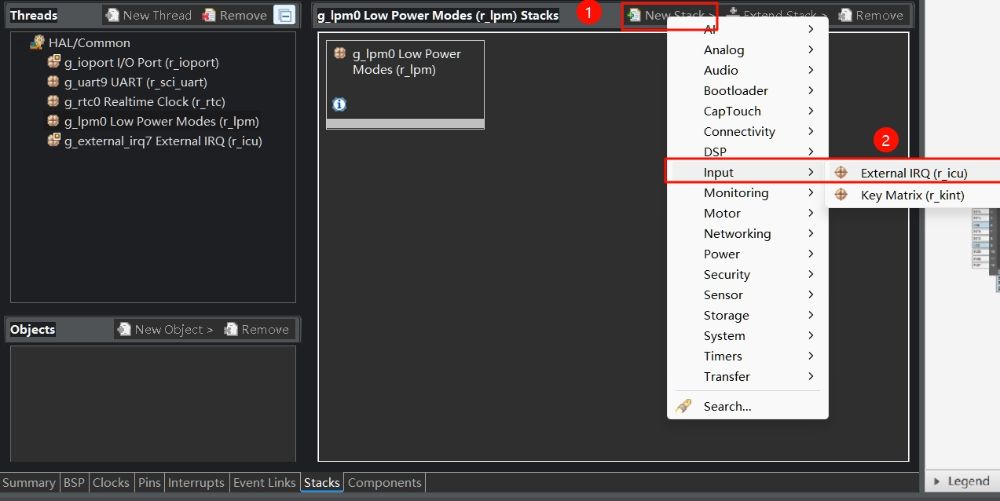

# 软件部分
将先前`03_RTC`工程复制一份，重命名为`05_Low-Power-Mode-Btn-Wakeup`。
## 1 配置按键外部中断
从开发板的原理图可以得知，用户按键接在P015引脚上，而其对应的中断请求(IRQ)通道为IRQ7

| 序号 | 操作                                                                                        |
| ---- | ------------------------------------------------------------------------------------------- |
| 1    | 点击界面下方标签栏中的`Pins`标签，进入引脚配置界面。                                        |
| 2    | 在`Pin Selection`区域，展开`Input:ICU`选项，选择`ICU0`。                                    |
| 3    | 在`Pin Configuration`区域，将`Operation Mode`设置为`Enabled`，勾选`IRQ07`对应的`P015`引脚。 |


| 序号 | 操作                                                      |
| ---- | --------------------------------------------------------- |
| 1    | 点击界面下方标签栏中的`Stacks`标签，进入堆栈配置页面。    |
| 2    | 在`HAL/Common Stacks`区域，点击`New Stack`按钮。          |
| 3    | 在弹出菜单中，选择`Input`选项下的`External IRQ (r_icu)`。 |



| 序号 | 操作                                                                                                                            |
| ---- | ------------------------------------------------------------------------------------------------------------------------------- |
| 1    | 在下方`Settings`设置区域的`Module g_external_irq7 External IRQ (r_icu)`部分，设置`Name`为`g_external_irq7`，`Channel`为`7`。    |
| 2    | `Module g_external_irq7 External IRQ (r_icu)`部分，设置`Callback`为`key_irq_callback`，`Pin Interrupt Priority`为`Priority 2`。 |


## 2 配置低功耗模式

| 序号 | 操作                                                   |
| ---- | ------------------------------------------------------ |
| 1    | 点击界面下方标签栏中的`Stacks`标签，进入堆栈配置页面。 |
| 2    | 在`HAL/Common Stacks`区域，点击`New Stack`按钮。       |
| 3    | 在`Power`子菜单中，选择`Low Power Modes (r_lpm)`。     |


| 序号 | 操作                                                                                                                 |
| ---- | -------------------------------------------------------------------------------------------------------------------- |
| 1    | 在下方`Settings`设置区域的`Module g_lpm0 Low Power Modes (r_lpm)`部分，设置`Name`为`g_lpm0`。                        |
| 2    | 在`Settings`设置区域的`Module g_lpm0 Low Power Modes (r_lpm)`部分，将`Low Power Mode`设置为`Software Standby mode`。 |
| 3    | `Module g_lpm0 Low Power Modes (r_lpm)` - `Wake Sources`部分，勾选`IRQ7`。                                           |


## 3 编写代码
### 3.1 按键中断
新建`irq.h`
::: details 查看代码
```c
#ifndef IRQ_H_
#define IRQ_H_
#include "hal_data.h"
void IRQ_Init();
extern volatile bool key_pressed;
#endif

```
:::

新建`irq.c`
::: details 查看代码
```c
#include "irq.h"
#include "hal_data.h"

volatile bool key_pressed = false;
void key_irq_callback(external_irq_callback_args_t *p_args)
{
    key_pressed = true;
}
void IRQ_Init()
{
    g_external_irq7.p_api->open(&g_external_irq7_ctrl, &g_external_irq7_cfg);
    g_external_irq7.p_api->enable(&g_external_irq7_ctrl);
}
```
:::
在irq.c文件中定义了初始化函数`IRQ_Init`，并实现按键中断回调函数`key_irq_callback`。

### 3.2 低功耗模式
新建`lpm.h`
::: details 查看代码
```c
#ifndef LPM_H_
#define LMP_H_
#include "hal_data.h"
extern volatile bool in_LPM;
void LPM_Init();
void EnterLowPowerMode();
#endif

```
:::

新建`lpm.c`
::: details 查看代码
```c
#include "lpm.h"
#include "hal_data.h"

volatile bool in_LPM = true;  // 在低功耗模式的标志位 防止用按键唤醒了又立即进待机
void LPM_Init()
{
    g_lpm0.p_api->open(&g_lpm0_ctrl, &g_lpm0_cfg);
}

void EnterLowPowerMode()
{
    if(!in_LPM){
        printf("进入低功耗模式\n");
        in_LPM = true;
        g_lpm0.p_api->lowPowerModeEnter(&g_lpm0_ctrl);
    }
}

```
:::
`EnterLowPowerMode`是进入低功耗模式的函数，`LPM_Init`是初始化低功耗模式的。

### 3.3 修改hal_entry.c
`hal_entry`函数之前
::: details 查看代码
```c
#include "hal_data.h"
#include "debug_bsp_uart.h"
#include "rtc.h"
#include "irq.h"
#include "lpm.h"
rtc_time_t get_time;
```
:::

在`hal_entry`函数内添加
::: details 查看代码
```c
 Debug_UART9_Init(); // SCI9 UART 调试串口初始化
    RTC_Init();
    IRQ_Init();
    LPM_Init();
    while (1)
    {
        if (key_pressed)
        {
            key_pressed = false;
            if(!in_LPM){
                EnterLowPowerMode();
                printf("退出待机模式\n");
            }
            else{
                in_LPM = false;
            }
        }
        if (rtc_flag)
        {
            g_rtc0.p_api->calendarTimeGet(&g_rtc0_ctrl, &get_time); // 获取 RTC 计数时间
            rtc_flag = 0;
            printf("%d年%d月%d日 %d:%d:%d\n",
                   get_time.tm_year + 1900, get_time.tm_mon + 1, get_time.tm_mday,
                   get_time.tm_hour, get_time.tm_min, get_time.tm_sec);
        }
        if (uart_rx_complete_flag)
        {
            char *time;
            uart_rx_complete_flag = 0;
            // 解析设置时间的命令 e.g: time:20250126080910
            // warning: 未添加错误纠正算法，请输入正确的时间，否则工作异常！
            if (strncmp(rx_data, "time:", 5) == 0)
            {
                time = rx_data + 5;
                set_time.tm_year = ((time[0] - '0') * 1000) + ((time[1] - '0') * 100) +
                                   ((time[2] - '0') * 10) + (time[3] - '0') - 1900;
                set_time.tm_mon = ((time[4] - '0') * 10) + (time[5] - '0') - 1;
                set_time.tm_mday = ((time[6] - '0') * 10) + (time[7] - '0');
                set_time.tm_hour = ((time[8] - '0') * 10) + (time[9] - '0');
                set_time.tm_min = ((time[10] - '0') * 10) + (time[11] - '0');
                set_time.tm_sec = ((time[12] - '0') * 10) + (time[13] - '0');
                g_rtc0.p_api->calendarTimeSet(&g_rtc0_ctrl, &set_time);
            }
        }
    }
```
:::

::: tip
主程序设计为按键按下即进入待机模式，这里只是为了快速实现效果，而采用的按键触发方式，可以是串口发消息触发、程序逻辑调用等等方法进入待机模式。
:::