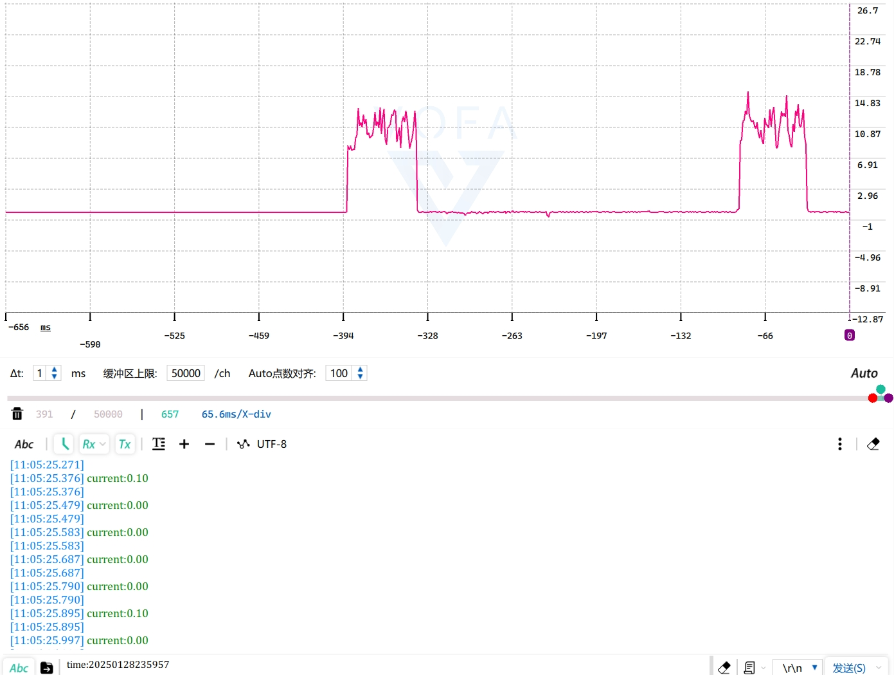

# 下载测试
把编译好的程序下载到开发板并复位，正确连接OLED屏幕和BME280传感器模块。

板子上电后，会亮屏5秒钟显示时间、温湿度气压数据，接着进入低功耗待机状态。点按板子上的用户按键，板子恢复工作状态，继续显示5秒钟，用户可中途再按下按键让其立即进入低功耗待机状态。

使用手上的INA219模块采集电流，其分辨率20uA，连接PC上位机，能看到下图所示的电流波形。

电源输入3.3V时，板子待机电流在20uA以下，采集值近似为0，工作时平均电流约12mA，峰值电流15.5mA。

