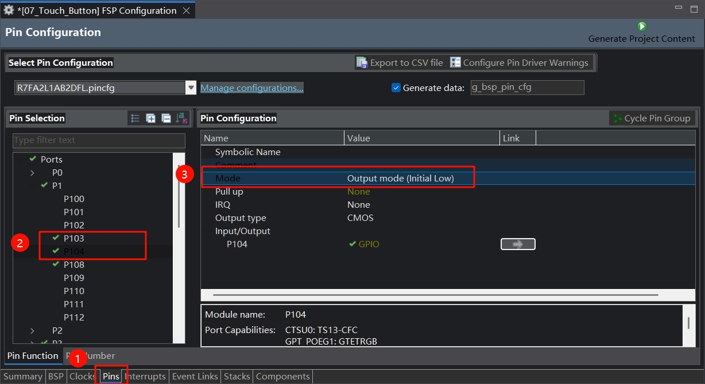
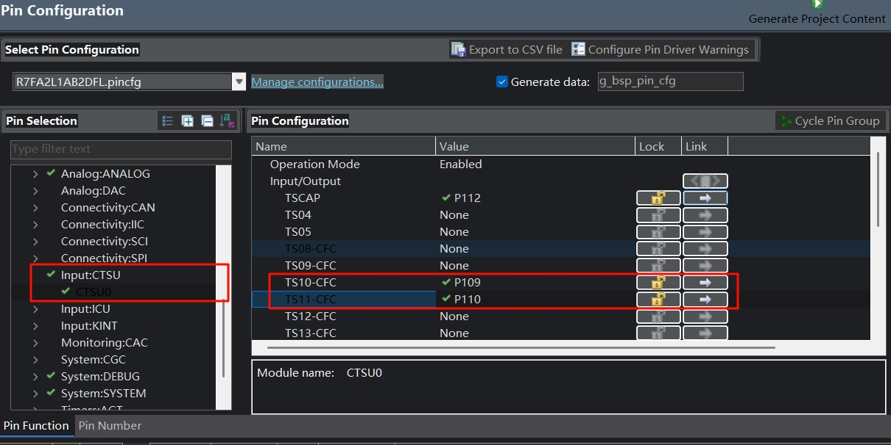
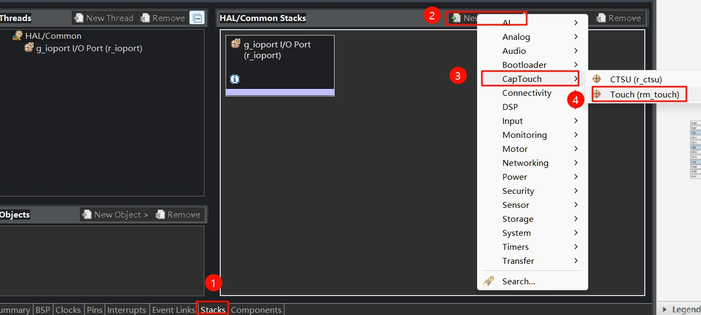
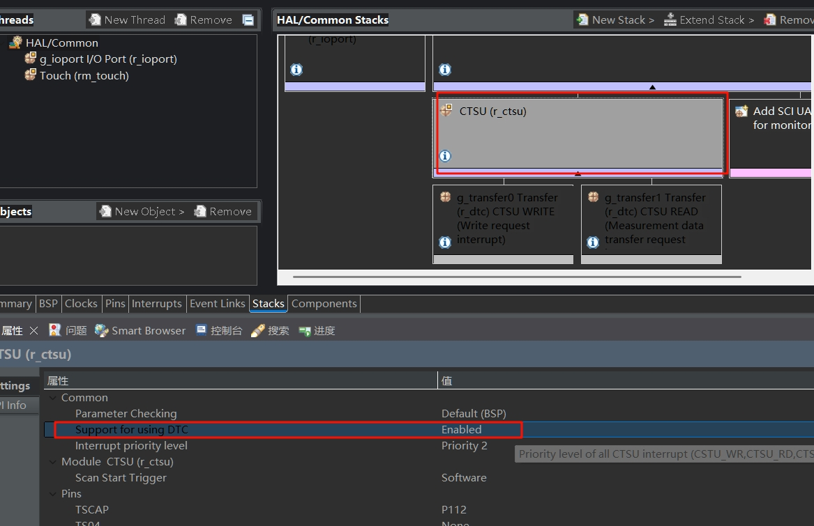
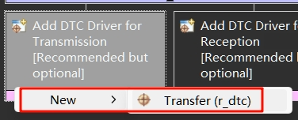
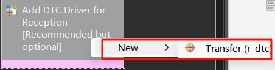
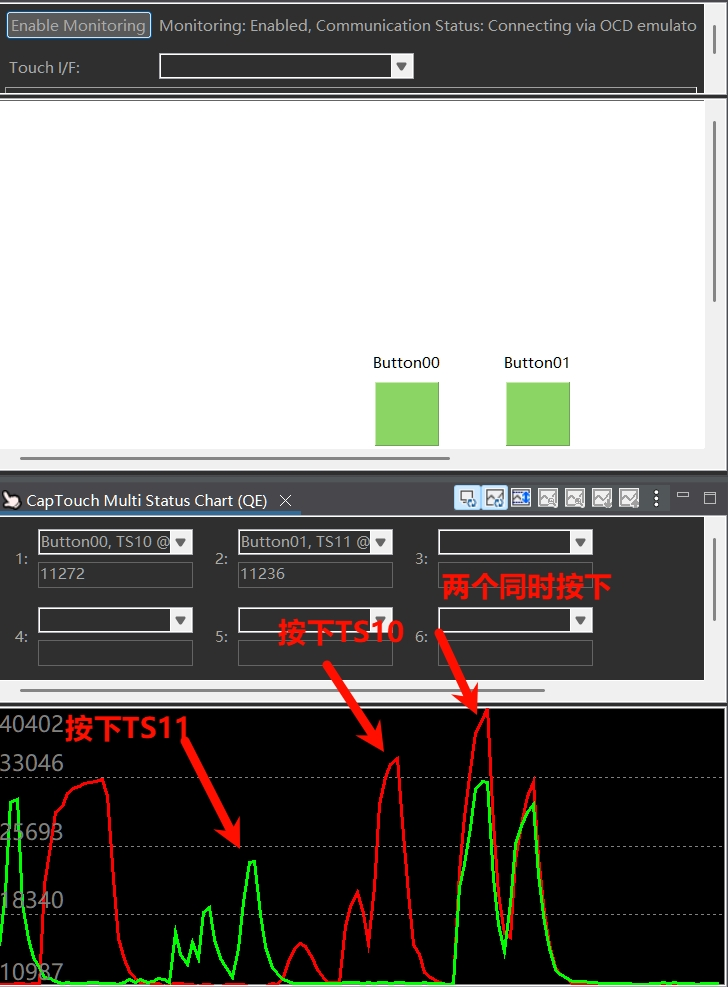

# 软件部分
新建一个项目，命名为`07_Touch_Button`
## 1 配置LED引脚
板子上的两颗LED接在P103和P104引脚上，且输出高电平时点亮。因此，在Pins--P1--将这两个引脚配置为输出模式，初始低电平。



## 2 配置CTSU
开发板的两个触摸按键接在了P109和P110引脚上，对应着TS10和TS11。在Input:CTSU--CTSU0--选择TS10和TS11分别为P109和P110。



在Stacks页面，按如图所示新建Touch(rm_touch)



接着双击CTSU(r_ctsu)，将`Support for Using DTC`值改为`Enabled`。



然后add DTC driver，注意Transmission和Reception都要操作。





一切就绪，生成代码。

## 3 调试电容按键值
点击瑞萨视图--Renesas QE--CapTouch  workflow


选择项目


下一步，选择新建一个配置


在弹出的页面上，点击Button，放置两个按钮，并双击按钮打开配置，分别选择TS10和TS11，电阻配置510ohm，最后点击create。  


下一步，连接J-Link与开发板，接线如下：

| J-Link | RA2L1开发板 |
| ------ | ----------- |
| Vref   | 3V3         |
| SWDIO  | SWDIO       |
| SWCLK  | SWCLK       |

点击Start Tuning，会自动编译、下载，这期间不要动板子，直到出现下图带黄条的界面


此时用合适的力度按住TS10(注意不要用力过重，否则阈值过高按键不灵敏)，当看到**黄条到顶后**，在键盘上按下任意键。TS11也是如此。

结束后，点击Continue the Tuning Process


回到workflow界面，点击Output Parameter Files，自动生成参数文件。其保存在项目下的qe_gen文件夹内。


点击 Implement Program，点击Show Sample，选择Output to a File，在qe_gen文件夹内就多出一个`qe_touch_sample.c`


## 4 测试按键点灯效果
打开`qe_touch_sample.c`，在` /* TODO: Add your own code here. */ `后面写下我自己的测试代码。

```c
if(button_status == 1){
    g_ioport.p_api->pinWrite(&g_ioport_ctrl, BSP_IO_PORT_01_PIN_03, BSP_IO_LEVEL_HIGH);
}
else if(button_status == 2){
    g_ioport.p_api->pinWrite(&g_ioport_ctrl, BSP_IO_PORT_01_PIN_04, BSP_IO_LEVEL_HIGH);
}
else if(button_status == 3){
    g_ioport.p_api->pinWrite(&g_ioport_ctrl, BSP_IO_PORT_01_PIN_03, BSP_IO_LEVEL_HIGH);
    g_ioport.p_api->pinWrite(&g_ioport_ctrl, BSP_IO_PORT_01_PIN_04, BSP_IO_LEVEL_HIGH);
}
else{
    g_ioport.p_api->pinWrite(&g_ioport_ctrl, BSP_IO_PORT_01_PIN_03, BSP_IO_LEVEL_LOW);
    g_ioport.p_api->pinWrite(&g_ioport_ctrl, BSP_IO_PORT_01_PIN_04, BSP_IO_LEVEL_LOW);
}
```
这段代码功能是检测按键值，1和2分别点亮LED1和LED2，按键值为3时是两个按键同时按下，即同时点亮两个LED。

在`hal_entry.c`文件中的hal_entry函数中，加入代码调用触摸测试函数
```c
qe_touch_main();
```

接下来，启动监测。按下图所示配置，并开始调试。


效果如下图所示，同时可以观察板子上LED亮灭情况。



