# 搭建开发环境
安装e2 studio参考教程 [https://doc.embedfire.com/mcu/renesas/fsp_ra/zh/latest/doc/chapter2/chapter2.html](https://doc.embedfire.com/mcu/renesas/fsp_ra/zh/latest/doc/chapter2/chapter2.html)

## 1 安装e2 studio
先从[https://github.com/renesas/fsp/releases](https://github.com/renesas/fsp/releases)下载如下图所示的e2s(e2 studio简称)，并解压

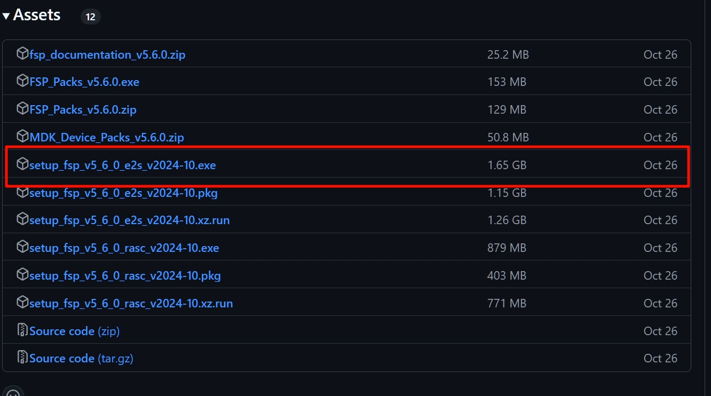

双击可执行程序，按下图所示进行配置，注意在**Device Famlies** 选择第一个 **RA**，其余配置均用默认。

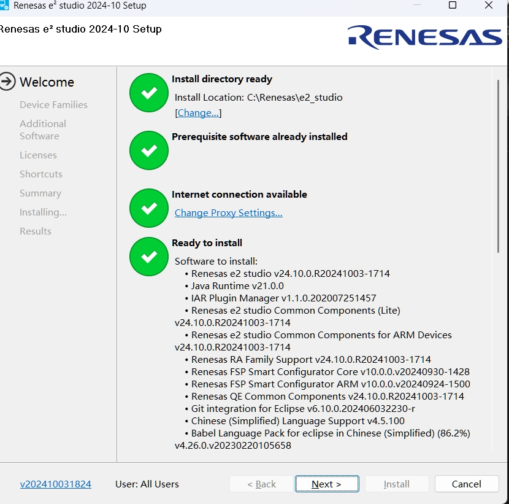

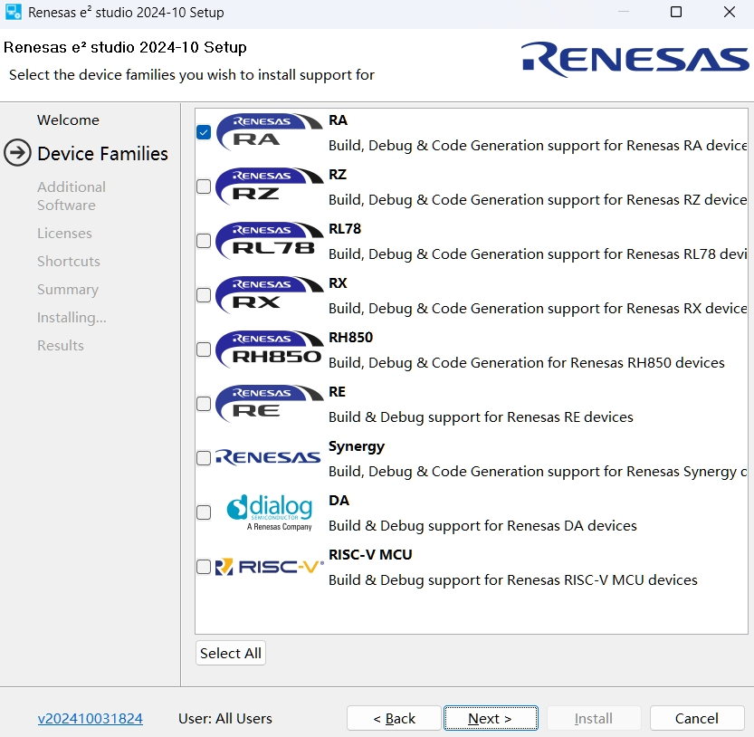

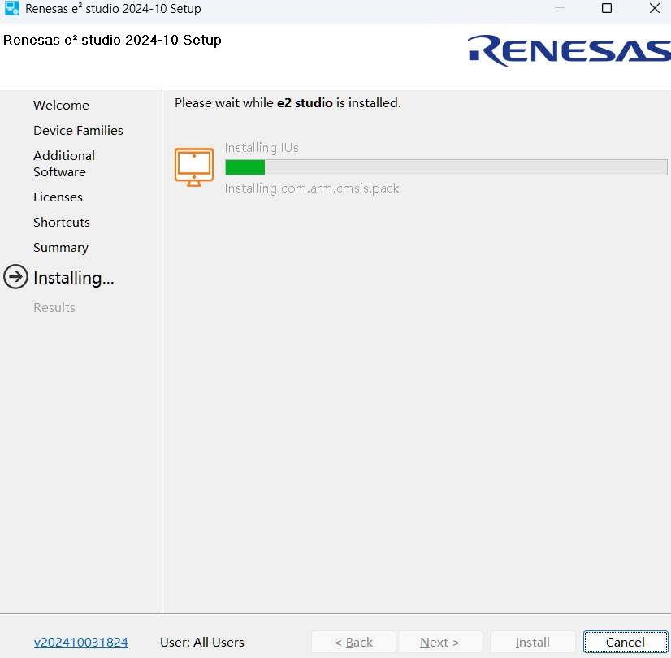

请注意：
- 可以不用安装Keil
- 安装过程中，会弹出一些驱动安装提示，均选择“安装”
- 安装时会下载一些内容，有可能网络问题导致下载缓慢或失败，建议有条件的使用代理。

经过漫长的等待之后，安装完成

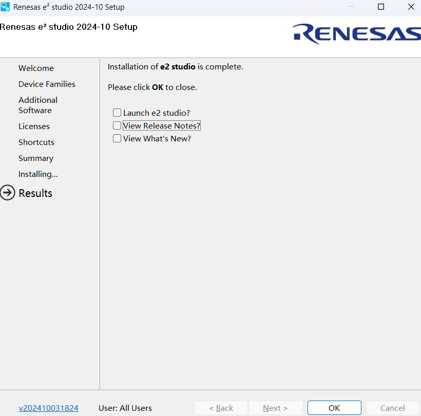

## 2 配置e2s
启动e2s，在打开的对话框中配置你的工作路径，注意不要使用中文。我这里创建了个名为`RA4E2_Projects`的文件夹来存放项目。

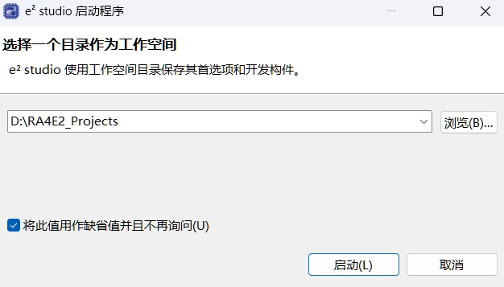

## 3 创建工程模板
请按下图顺序创建工程，我在这里将工程命名为Template。

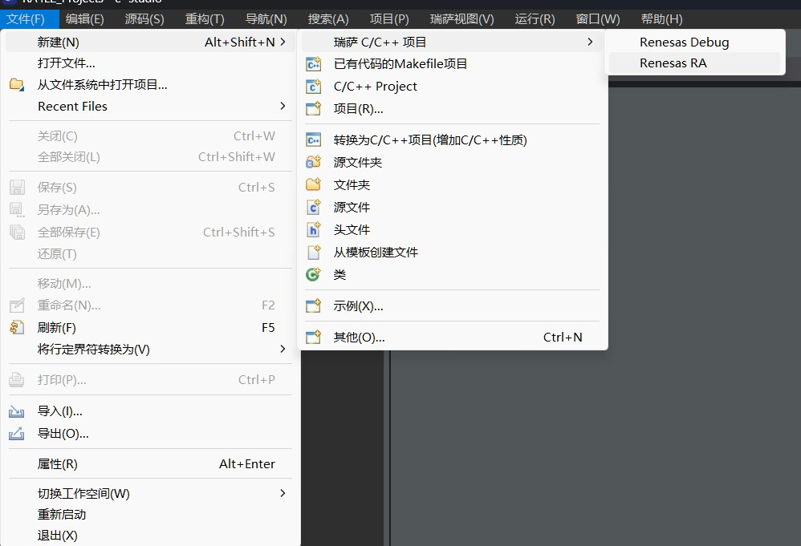

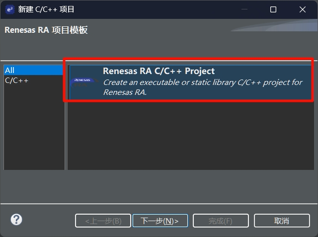

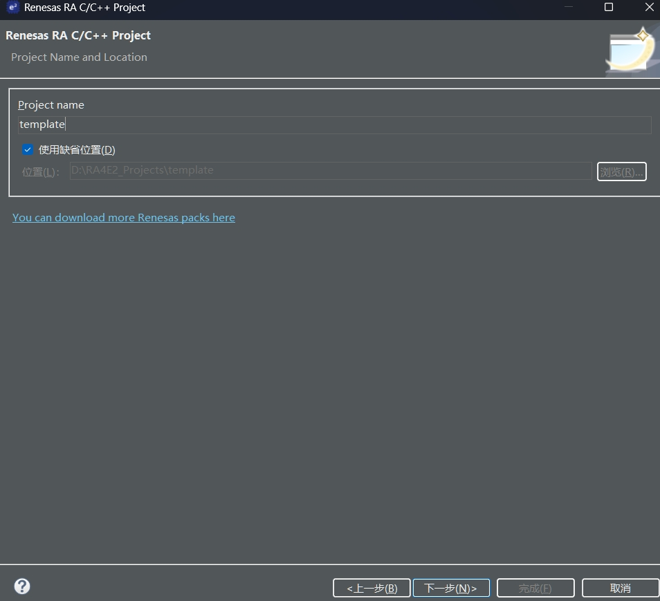

`错误提示：`**有可能**你在创建工程时会遇到 `No FSP versions installed`错误，出现在如下图所示的位置。

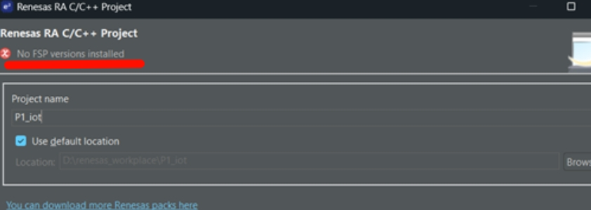

`解决方法：`在github页面[https://github.com/renesas/fsp/releases](https://github.com/renesas/fsp/releases)下载`FSP_Packs_v5.6.0.exe`并安装到e2s所在文件夹下，重启e2s再次创建工程即可。

接下来选择芯片，按下图步骤来，本次开发板所用的芯片型号为`R7FA4E2B93CFM`

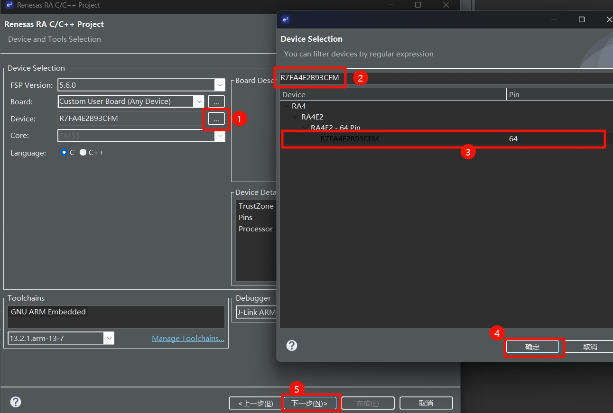

后面的选项都保持默认，最后点击完成。
最终进入到e2s配置界面，左侧是项目文件资源管理器，右侧是可视化界面配置引脚，下方是控制台窗口。

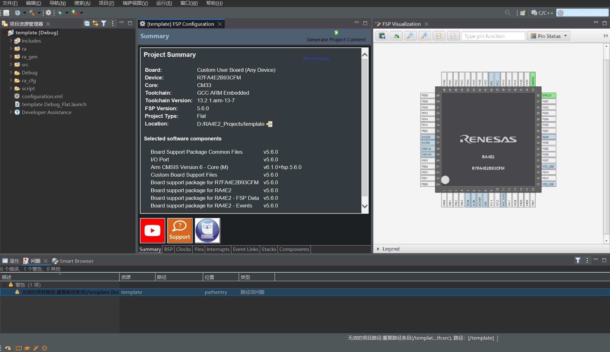

## 4 编译代码
点击上一步主界面的`Generate Project Content`，等待进度条走完。
打开src下的hal_entry.c，点击左上角的小锤子进行build工作，完成之后应在控制台看到0 errors, 0 warnings

## 5 修改输出文件设置
为了方便之后下载hex文件，需要在项目设置中设置输出文件为HEX。
点击菜单栏的 项目--属性，然后如下图所示配置
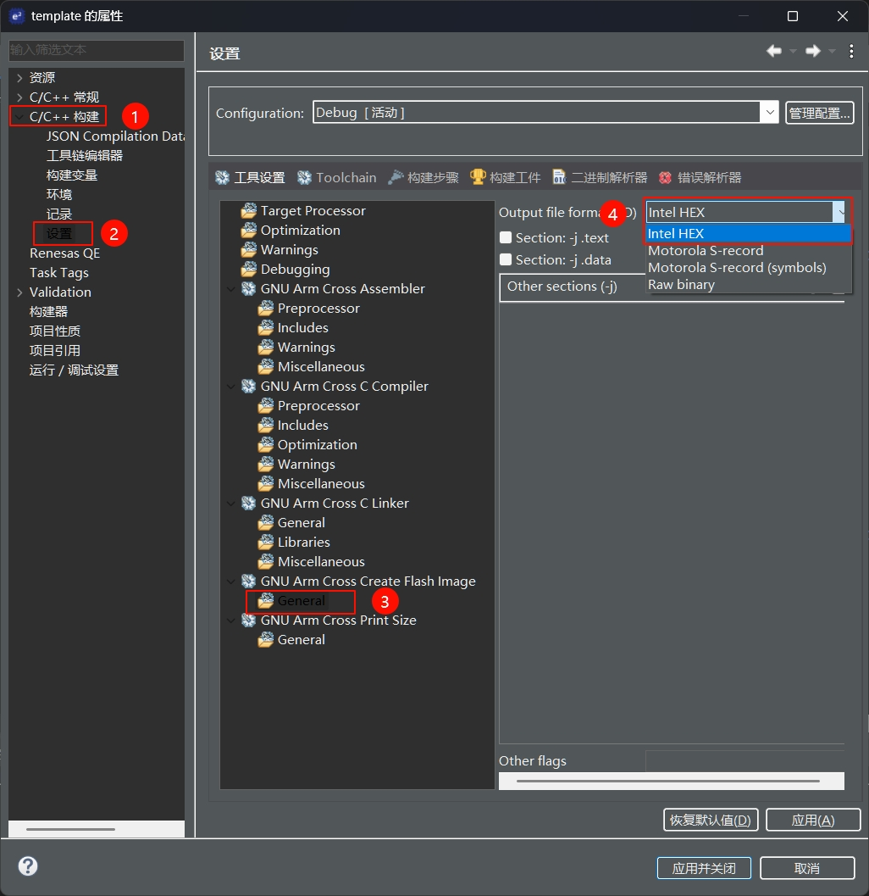

保存，关闭项目。至此，模板项目就创建完毕了~