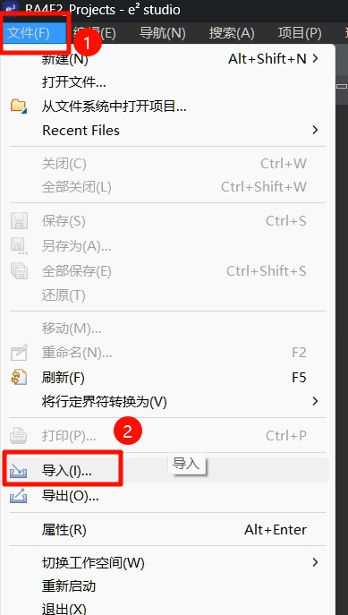
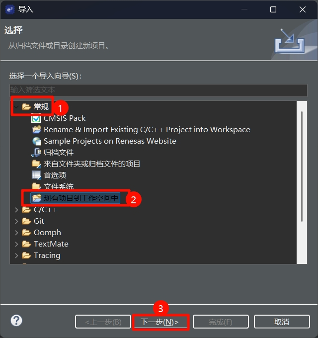
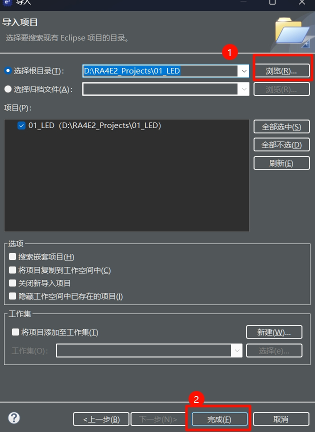
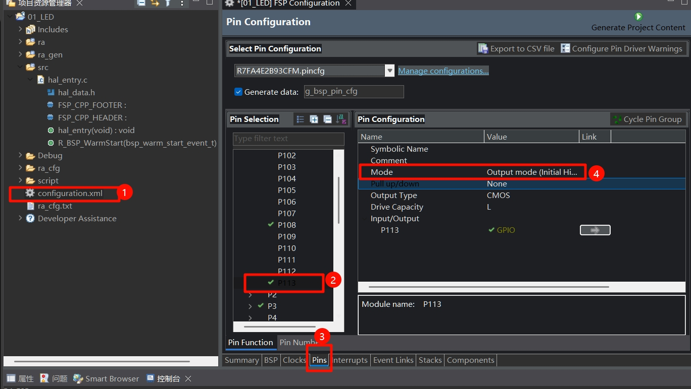
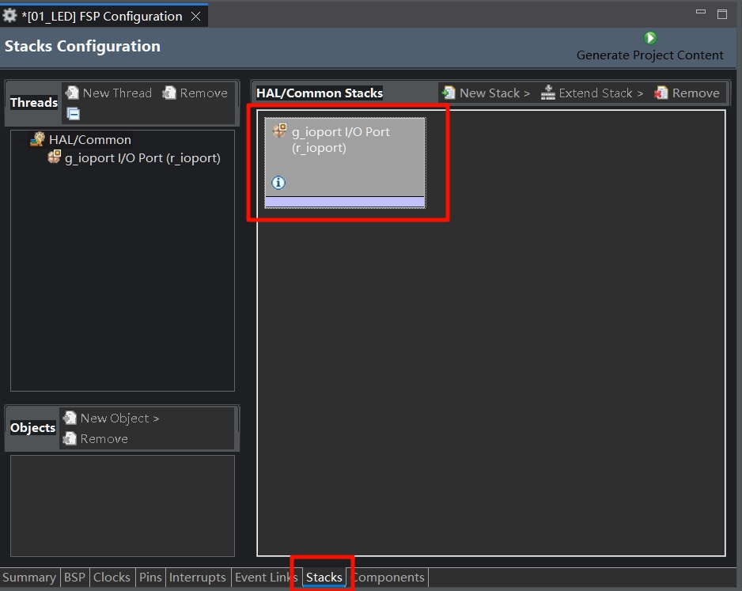
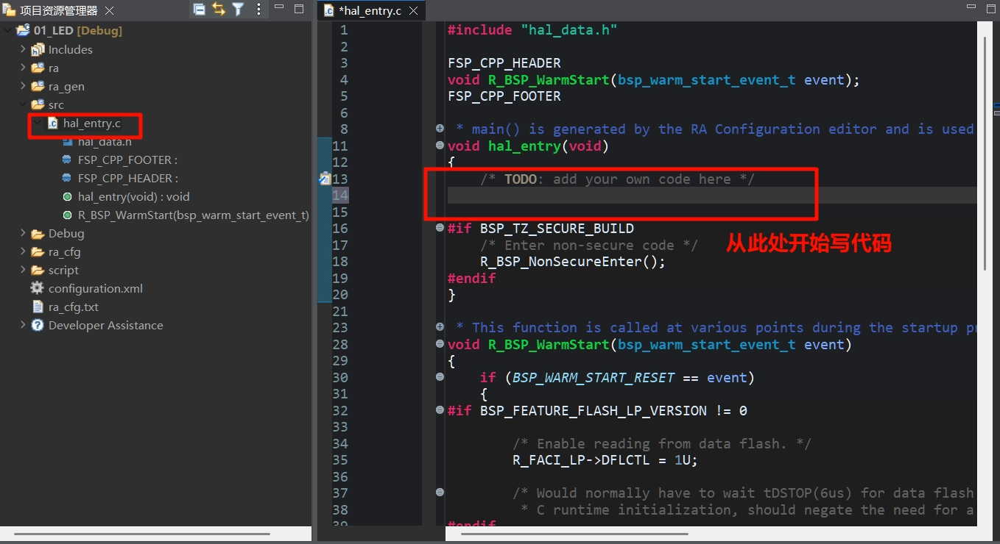
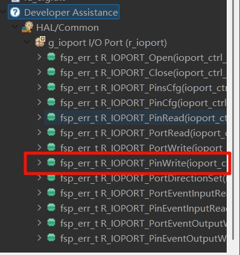
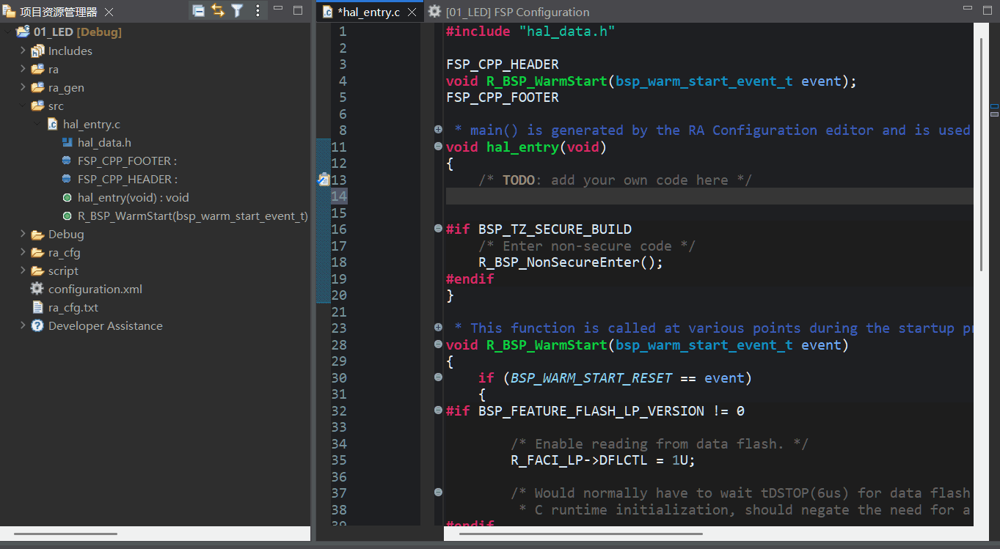

# 软件部分
## 1 新建工程
将先前创建的工程模板文件夹复制一份，并将文件夹重命名为`01_LED`

在e2s里面，按下面几张图所示的步骤进行项目的导入。






## 2 配置工程
双击e2s界面左侧的`项目资源管理器`当中的`configuration.xml`文件，在中间选择Pins，找到P113引脚，将`Mode`设置为`Output Mode(Initial High) `。同理，将P207引脚也按上述方式设置。



配置完成后，在Stacks里面就能看到IDE自动为我们添加的io port模块



保存配置文件，并点击Generate Project Content让其自动为我们生成代码。

## 3 编写代码
双击打开项目资源管理器中的src/hal_entry.c文件，在hal_entry函数中开始编写驱动LED亮灭的代码。



到了编写代码这步，可能你会想，我怎么知道要调用哪些函数呢？是不是还要去翻阅API文档？
其实不用多虑，在e2s的左侧有**Developer Assistant**，它能帮助我们快速找到io port库下面的各个函数，如下图所示：



比如我在这里要用到R_IOPORT_PinWrite函数，就可以依次展开栏，将`call R_IOPORT_PinWrite()`拖放到源文件任意位置，见下方动图



接下来使用`R_IOPORT_Open`函数打开端口，然后写一个while(1)死循环，循环内先调用两次`R_IOPORT_PinWrite`函数，将P113和P207引脚置为高电平，调用`R_BSP_SoftwareDelay`延时500ms，再置为低电平、延时500ms。最终在hal_entry内的自定义代码如下:

```c
    R_IOPORT_Open(&g_ioport_ctrl, g_ioport.p_cfg); //打开端口。此处可省略，因为在R_BSP_WarmStart已自动打开
    while(1){
       //将P113和P207都置为输出高电平(亮)
       R_IOPORT_PinWrite(&g_ioport_ctrl, BSP_IO_PORT_01_PIN_13, BSP_IO_LEVEL_HIGH);
       R_IOPORT_PinWrite(&g_ioport_ctrl, BSP_IO_PORT_02_PIN_07, BSP_IO_LEVEL_HIGH);
       R_BSP_SoftwareDelay(500 ,BSP_DELAY_UNITS_MILLISECONDS); //delay 500ms
       //将P113和P207都置为输出低电平(灭)
       R_IOPORT_PinWrite(&g_ioport_ctrl, BSP_IO_PORT_01_PIN_13, BSP_IO_LEVEL_LOW);
       R_IOPORT_PinWrite(&g_ioport_ctrl, BSP_IO_PORT_02_PIN_07, BSP_IO_LEVEL_LOW);
       R_BSP_SoftwareDelay(500 ,BSP_DELAY_UNITS_MILLISECONDS);
    }
```