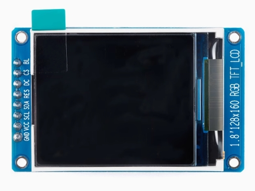

# 硬件部分
1.8寸TFT屏幕的引脚定义如下：

| 引脚名 |            说明            |
| :----: | :------------------------: |
|  GND   |       接开发板的GND        |
|  VCC   |           接3.3V           |
|  SCL   |        时钟 接RSPCK        |
|  SDA   |        数据 接MOSI         |
|  RST   |    复位脚 使用GPIO控制     |
|   DC   | 数据或命令脚  使用GPIO控制 |
|   CS   |    片选脚 使用GPIO控制     |
|   BL   | 背光控制 直接IO输出高电平  |

观察原理图，在PMOD这块，正好有我们驱动屏幕所需的SPI功能所使用的引脚。接下来在e2s配置里就着重关注相关引脚配置。