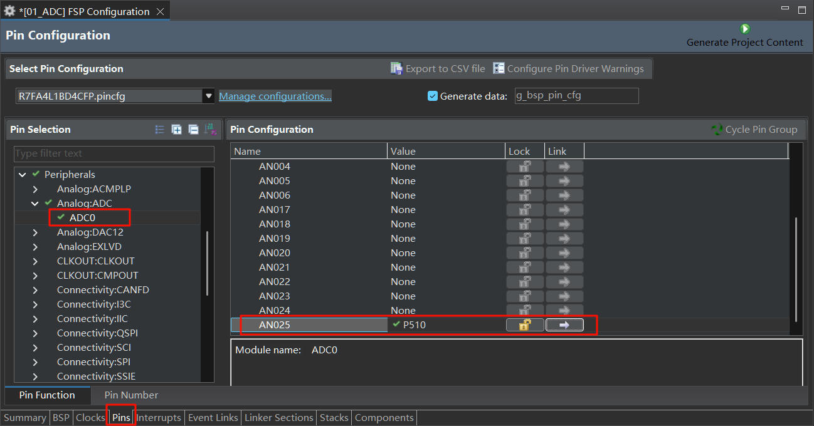
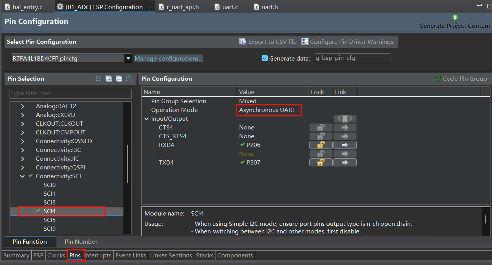
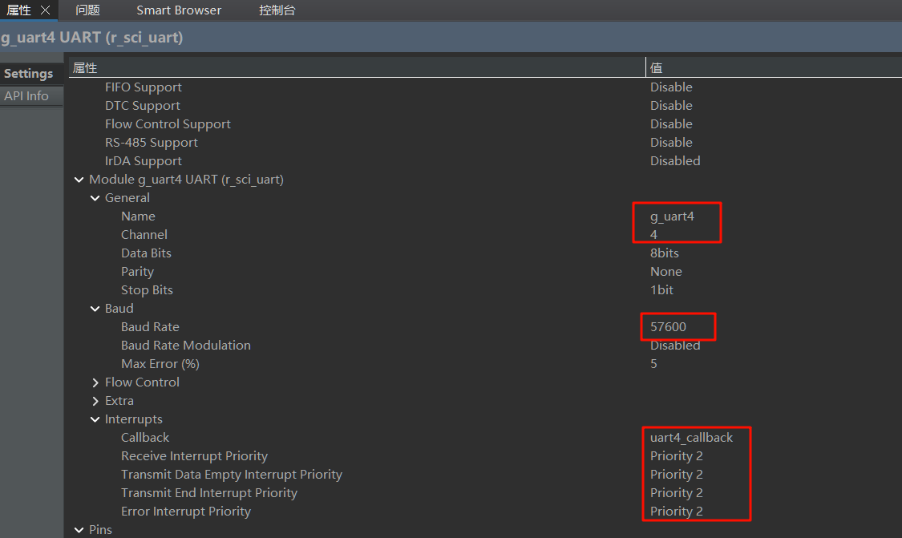
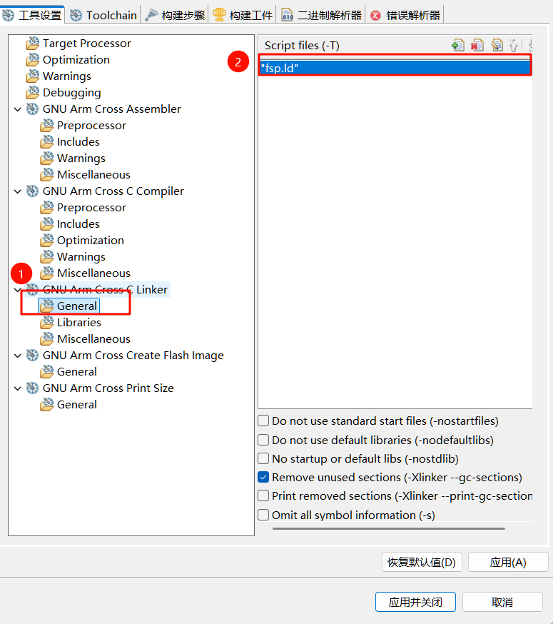

# 01 ADC单次扫描采集外部电压输入

## 1. 前言
前两天收到了瑞萨RA生态工作室寄来的RA4L1-SENSOR开发板，这款开发板是基于瑞萨 RA4L1系列微控制器。

RA4L1微控制器具备多种低功耗功能，包括段码LCD显示驱动器、高级安全引擎、RTC、ADC、定时器和低功耗UART等通信接口，用户可以根据具体应用需求灵活优化功耗与性能的平衡。这使其成为工业自动化、家电、智能家居、消费电子、楼宇自动化以及医疗保健等领域的理想选择。

本篇报告将实现ADC采集外部电压输入，并通过串口打印当前电压值，为下一个在RA4L1-SENSOR开发板自带的LCD上显示电压值的实验做铺垫。

## 2. 硬件部分
本次实验用到了ADC功能。ADC 即模拟-数字转换器（Analog-to-digital converter）， 是一种用于将连续的模拟信号转换为离散的数字信号的器件。 就比如我们可以将我们生活中的温度、压力、声音这样的模拟信号通过 ADC 转化为可以通过单片机处理的数字信号。 RA4L1开发板搭载的芯片拥有12位的ADC。


## 3. 软件部分
### 3.1 创建项目
下载安装瑞萨E2Studio，具体的下载安装教程可以参考我之前在[电子发烧友论坛的这篇文章](https://bbs.elecfans.com/jishu_2468424_1_1.html) 或是我的[个人开发文档](https://wiki.vrxiaojie.top/RA4E2-Develop-Board/%E7%91%9E%E8%90%A8RA4E2%E5%BC%80%E5%8F%91%E6%9D%BF/00%20%E5%BC%80%E5%8F%91%E6%9D%BF%E5%BC%80%E7%AE%B1%E4%B8%8E%E7%8E%AF%E5%A2%83%E6%90%AD%E5%BB%BA/%E6%90%AD%E5%BB%BA%E5%BC%80%E5%8F%91%E7%8E%AF%E5%A2%83.html)。注意下载的FSP版本要**大于5.9.0**，用最新版本的，否则在后面找不到RA4L1芯片。

新建一个RA C/C++项目。


项目名称`01_ADC`


芯片选择`R7FA4L1BD4CFP`


一定要选**GNU ARM Embedded**


剩下的全部默认，暂时不用RTOS，一直点击下一步、完成即可。

### 3.2 配置晶振
开发板上的HSE晶振是8M的，因此需要在`configuration.xml`的`Clocks`页面将 XTAL改为8MHz。同时还要改一下PLL倍率为`x10`，这样让工作频率在80MHz。


### 3.3 配置ADC
在E2S中的`Pins--ADC0--配置AN025通道为引脚P510`



在`Stacks`页新建`ADC(r_adc)`


双击刚刚创建的`g_adc0 ADC`,配置如下


设置中断回调函数为`adc_callback`，优先级2


### 3.4 配置串口
在`Pins--SCI--SCI9下配置模式为异步UART`，程序自动配好了RXD和TXD引脚。


在`Stacks`页新建`UART(r_sci_uart)`


打开属性页面，修改名称和通道，以及回调函数名称、中断优先级为2。


### 3.5 printf重定向至串口
printf函数通常需要设置堆栈大小。因为printf函数在运行时需要使用栈空间来存储临时变量和函数调用信息。如果堆栈大小不足，可能会导致程序崩溃或不可预期的行为。

为了防止printf崩溃，在`BSP`页面下修改堆大小为`0x2000`


然后点击**Generate Project Content**生成程序代码

在下图所示位置勾选上这两个选项。**如果这里没有这两个选项，检查是不是之前创建项目时没有选GNU ARM Embedded**


### 3.6 程序代码
#### 3.6.1 新建uart驱动代码
在`src`目录下，新建`uart`文件夹，在其中新建`uart.h`和`uart.c`文件。

`uart.c`文件内容
```c
#include "uart.h"
#include "hal_data.h"
/* 发送完成标志 */
volatile int uart_send_complete_flag = 0;

/* 调试串口 UART9 初始化 */
void UART_Init(void)
{
   fsp_err_t err = FSP_SUCCESS;

   err = R_SCI_UART_Open (&g_uart9_ctrl, &g_uart9_cfg);
   assert(FSP_SUCCESS == err);
}

/* 重定向 printf 输出 */
#if defined __GNUC__ && !defined __clang__
int _write(int fd, char *pBuffer, int size); //防止编译警告
int _write(int fd, char *pBuffer, int size)
{
   (void)fd;
   R_SCI_UART_Write(&g_uart9_ctrl, (uint8_t *)pBuffer, (uint32_t)size);
   while(uart_send_complete_flag == 0);
   uart_send_complete_flag = 0;

   return size;
}
#else
int fputc(int ch, FILE *f)
{
   (void)f;
   R_SCI_UART_Write(&g_uart9_ctrl, (uint8_t *)&ch, 1);
   while(uart_send_complete_flag == 0);
   uart_send_complete_flag = 0;

   return ch;
}
#endif

/* 串口中断回调 */
void uart9_callback (uart_callback_args_t * p_args)
{
   switch (p_args->event)
   {
      case UART_EVENT_RX_CHAR:
      {
            /* 暂时用不上发送功能 */
            break;
      }
      case UART_EVENT_TX_COMPLETE:
      {
            uart_send_complete_flag = 1;
            break;
      }
      default:
            break;
   }
}

```

`uart.h`文件内容

```c
#include "stdio.h"

void UART_Init(void);
```

#### 3.6.2 新建adc驱动代码
在`src`目录下，新建`adc`文件夹，在其中新建`adc.h`和`adc.c`文件。

`adc.c`文件内容
```c
#include "adc.h"
#include "hal_data.h"

//ADC转换完成标志位
volatile bool scan_complete_flag = false;

void ADC_Init(void){
    R_ADC_Open(&g_adc0_ctrl, &g_adc0_cfg);
    R_ADC_ScanCfg(&g_adc0_ctrl, &g_adc0_channel_cfg);
}

double Read_ADC_Voltage_Value(void)
{
    uint16_t adc_data;
    double a0;
    (void)R_ADC_ScanStart(&g_adc0_ctrl);
    while (!scan_complete_flag) //等待转换完成标志
    {
     ;
    }
    scan_complete_flag = false; //重新清除标志位

    /* 读取通道0数据 */
    R_ADC_Read(&g_adc0_ctrl, ADC_CHANNEL_25, &adc_data);
    /* ADC原始数据转换为电压值（ADC参考电压为3.3V） */
    a0 = (double)(adc_data*3.3/4095);

    return a0;
}

void adc_callback(adc_callback_args_t * p_args)
{
   FSP_PARAMETER_NOT_USED(p_args);
   scan_complete_flag = true;
}
```

`adc.h`文件内容
```c
#ifndef ADC_ADC_H_
#define ADC_ADC_H_

double Read_ADC_Voltage_Value(void);
void ADC_Init(void);

#endif /* ADC_ADC_H_ */
```


#### 3.6.3 修改hal_entry.c
引用头文件部分
```c
#include "hal_data.h"
#include "uart/uart.h"
#include "adc/adc.h"
```

修改`hal_entry`函数
```c
void hal_entry(void)
{
    /* TODO: add your own code here */
    UART_Init();
    ADC_Init();
    printf("ADC电压采集程序\r\n");
    while(1){
        double volt = Read_ADC_Voltage_Value();
        printf("ADC采集电压: %.3f V\r\n", volt);
        R_BSP_SoftwareDelay(500, BSP_DELAY_UNITS_MILLISECONDS);
    }

#if BSP_TZ_SECURE_BUILD
    /* Enter non-secure code */
    R_BSP_NonSecureEnter();
#endif
}
```


## 4. 编译下载测试
P510在开发板的位置如下所示，将该引脚分别接到VCC和GND，用串口查看打印的结果。


## 问题及解决方法
### 1. cannot open linker script file fsp.ld: No such file or directory

在编译时，出现报错
```
C:/Program Files (x86)/Arm GNU Toolchain arm-none-eabi/13.2 Rel1/bin/../lib/gcc/arm-none-eabi/13.2.1/../../../../arm-none-eabi/bin/ld.exe: cannot open linker script file fsp.ld: No such file or directory
collect2.exe: error: ld returned 1 exit status
```


**解决方法**
项目--C/C++Project Settings


双击`fsp.ld`


选择工作空间，找到script文件夹下的fsp.ld，确定


再次编译，即可解决问题
