# 02 LCD显示电压值
## 1. 前言
本节实验是在上节实验1(ADC采集并转换电压值+串口打印输出)的基础上，将采集到的电压直接显示在LCD上。

## 2. 硬件部分
### 2.1 LCD简介
液晶显示（LCD）是嵌入式系统中常见的人机交互方式，广泛应用于工业控制、智能家电、医疗设备和消费电子产品。Renesas RA4L1 微控制器（MCU）内置 Segment LCD Controller (SLCDC)，可直接驱动 静态、1/2、1/3、1/4 Bias 的段式 LCD 显示屏，无需额外的 LCD 驱动芯片。这种集成方案不仅降低了硬件成本，还简化了设计。

### 2.2 RA4L1开发板上的LCD模块
本次实验用到了瑞萨开发板的SLCDC模块。RA4L1 的 SLCDC 模块提供了一种高效、低功耗、低成本的 LCD 显示方案。通过 FSP 提供的 r_slcdc 驱动，开发者可以快速初始化 LCD，轻松控制显示内容。在实际项目中，合理配置 COM/SEG 引脚、优化时钟和对比度设置，可以进一步提升 LCD 显示效果。

开发板板载的LCD缩略图如下所示

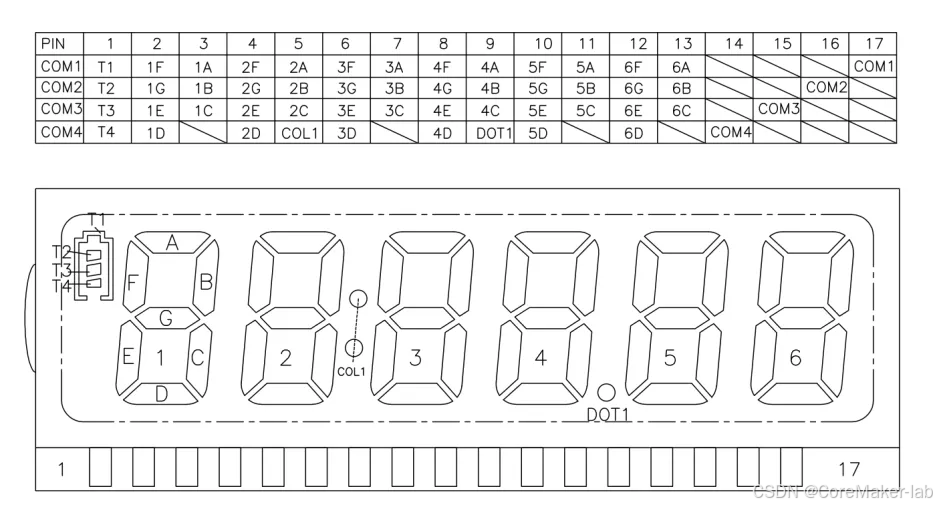  

● SEG（Segment）：控制 LCD 具体显示的段，如数码管的 A-G 段。

● COM（Common）：LCD 的 公共信号，决定哪个段被驱动，多 COM 允许减少 I/O 引脚数量。

原理图如下，这张图要在后面软件配置引脚时用到

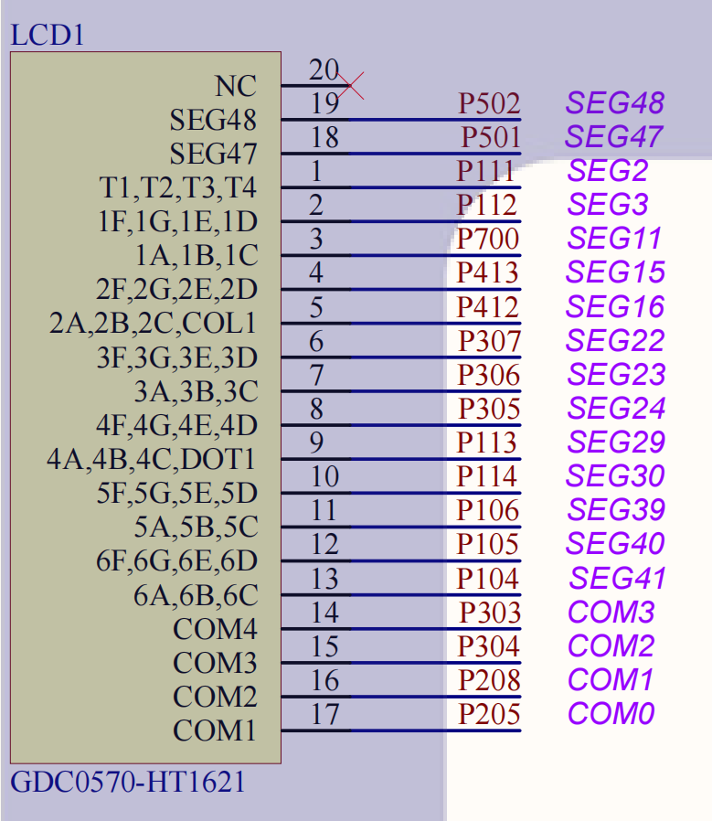  


## 3. 软件部分
**复制上次实验的项目**，修改名称为`02_Voltage_DisplayOnLCD`。
### 3.1 LCD配置
首先配置引脚。在`pins`--`SLCDC`，选择工作模式`4 slice`，也同时配置段所对应的引脚、VL引脚。**记得把CAPH和CAPL也配置上**，这里配置的P206和P207会和上一次实验的UART冲突，所以我把SCI4换到SCI3了，对应修改UART_SCI3部分属性。
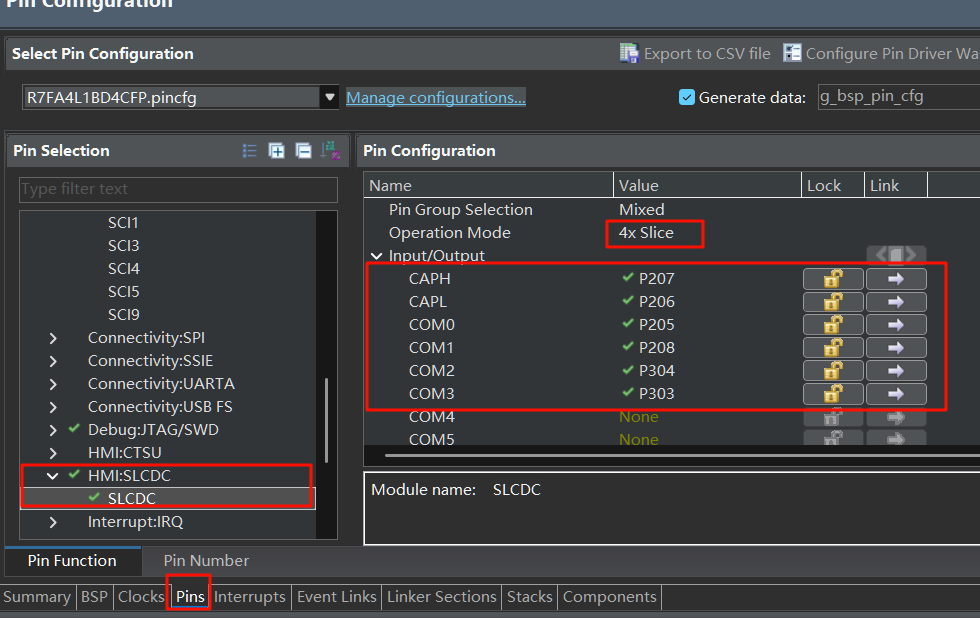  

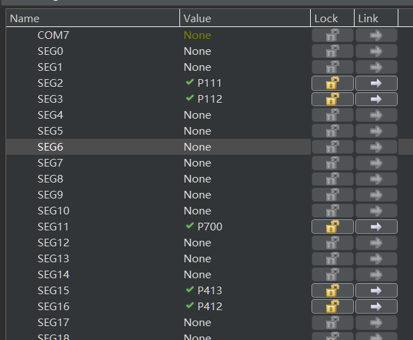  

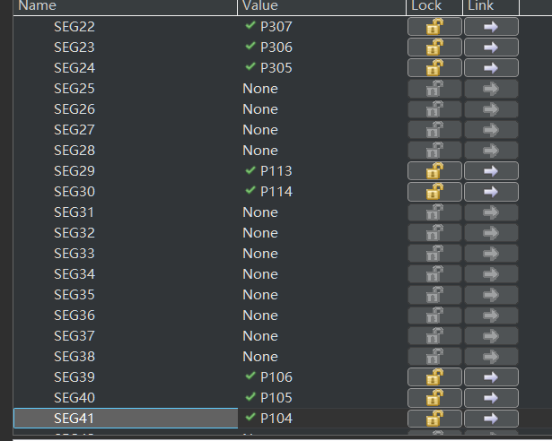  

VL（Voltage Level）引脚用于提供 LCD 偏置电压，控制 LCD 的对比度和驱动电压。
在 内部电压提升模式（Internal Voltage Boosting） 下，RA MCU 会自动产生 VL1、VL2、VL3、VL4 并提供给 LCD 作为驱动电压。在 外部电压模式 下，这些电压需要由外部电路提供。
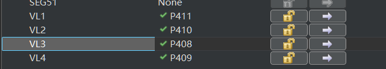  


然后配置stacks。`New Stack` -- `Graphics` -- `Segment LCD`

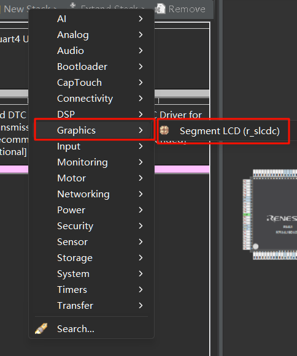  

双击`g_slcdc0 Segment`，点击屏幕下方的属性，按下图配置：

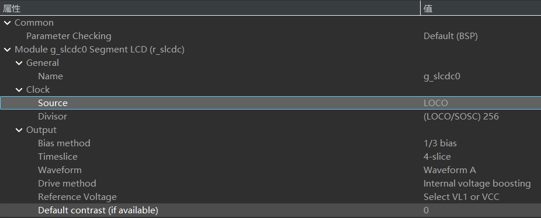  


属性解释：
● Name（名称）：g_slcdc0 这是 SLCDC 模块的实例名称。
● Source（时钟源）：LOCO（Low-Speed On-Chip Oscillator，低速片上振荡器），该选项决定 SLCDC 使用 LOCO 作为时钟来源。
● Divisor（分频器）：(LOCO/SOSC) 256 代表 LOCO 或 SOSC（Sub-Oscillator，子振荡器）时钟 除以 256 作为 SLCDC 驱动频率。较大的除数意味着更低的 LCD 刷新速率。
● Bias method（偏置方式）：1/3 bias 采用 1/3 偏压驱动，适用于多 COM LCD，可减少功耗并提升对比度。
● Timeslice（时间片）：4-slice 说明使用 4 个 COM（公共端），即 四路复用驱动，减少 MCU 需要的 I/O 端口。
● Waveform（波形模式）：Waveform A 选择 波形 A，影响 LCD 显示的刷新方式。
● Drive method（驱动方式）：Internal voltage boosting 采用 内部电压升压，可以提高 LCD 对比度，无需外部电压源。
● Reference Voltage（参考电压）：Select VL1 or VCC 允许选择 VL1 或 VCC 作为 LCD 驱动电压。
● Default contrast（默认对比度）：0 如果支持，则默认对比度设置为 0，可能需要在代码中动态调整。

### 3.2 LCD驱动编写
#### 3.2.1 LCD相关API解释
（1）LCD打开端口函数`R_SLCDC_Open`
为 LCD 驱动分配控制块 (slcdc_ctrl_t) 以及内部的资源，以确保 SLCDC 可以开始正常运行。 完成初始化后，使 LCD 驱动模块处于待启动状态，等待后续调用 R_SLCDC_Start() 函数真正启动 LCD 输出驱动波形。

（2）LCD启动的函数是`R_SLCDC_Start`
在调用 R_SLCDC_Open() 完成 SLCDC 初始化后，R_SLCDC_Start() 用于正式启动 LCD 驱动信号输出。调用此函数后，MCU 开始向 LCD 面板输出预配置的驱动波形和电压信号，LCD 显示正式开始工作。

（3）批量写入函数`R_SLCDC_Write`
数据被写入SLCDC内部的段数据寄存器中，从而控制LCD各段的亮灭状态。

SEG和COM的对应关系如下图所示，之后的驱动编写都参考这张图。

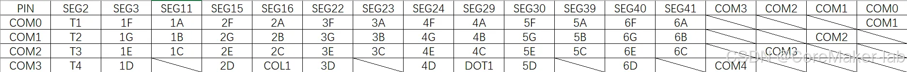 

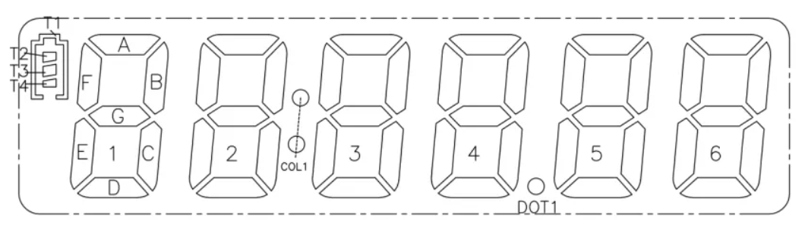  

假设我要让第1个数码管显示数字0，0的段码对应的是除了`1G=0`外，1A、1B...一直到1F都是1。

|段|COM3|COM2|COM1|COM0|
|--|--|--|--|--|
|SEG3|1|1|0|1|
|SEG11|0|1|1|1|

也就是SEG3写入0xD、SEG11写入0x7。

代码如下
```c
uint8_t segment_data_num1[] = {0x0D,0x00,0x00,0x00,0x00,0x00,0x00,0x00,0x07};
R_SLCDC_Write(&g_slcdc0_ctrl, 3, segment_data_num1, sizeof(segment_data_num1));
```
上面表示从SEG3开始，连续写9次数据，写完SEG11结束。但是SEG4~SEG10我们没用上，所以这样写是有多余操作的，不优雅。

（4）单独修改某个段的函数`R_SLCDC_Modify`
R_SLCDC_Modify() 是用于修改单个段寄存器中的部分位的函数，属于 SLCDC 驱动的精细控制接口。

例如我们要让LCD左上角的小电池亮起来，显示两格电量，需要让SEG2的T1、T3、T4都为1，T2=0，也就是对SEG2写入0xD，掩码为0xF

```c
R_SLCDC_Modify (&g_slcdc0_ctrl, 2, 0xD, 0xF);
```

实际效果如下
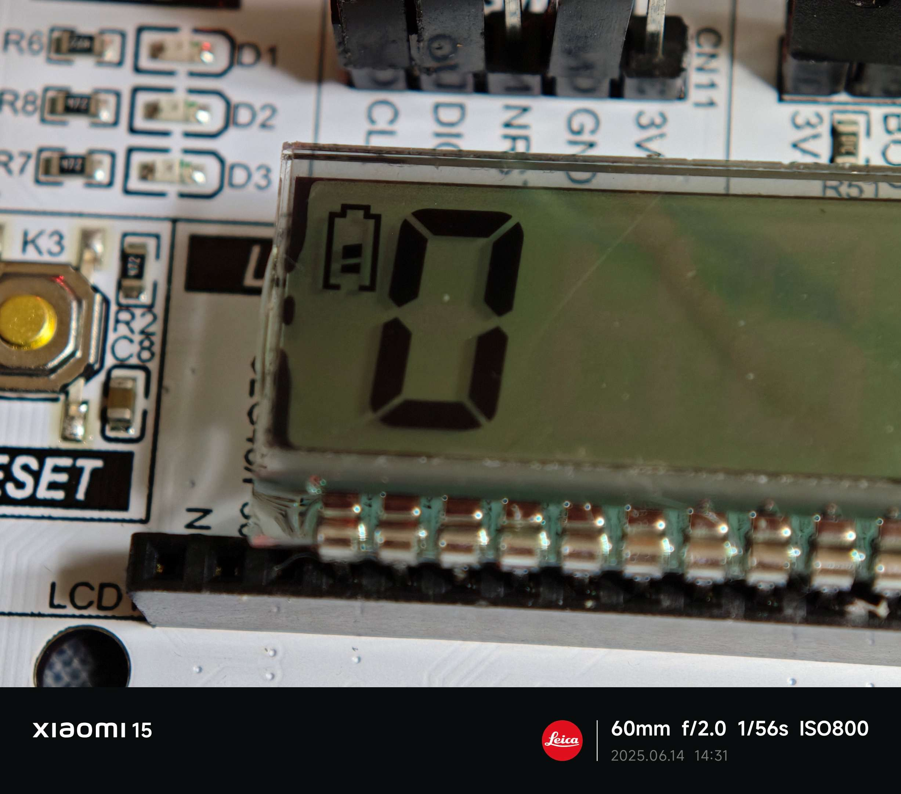  

#### 3.2.2 新建lcd.c文件
在src目录下创建`lcd`文件夹后，创建lcd.c文件。实现了数字0~9的显示、设置小数点和冒号的显示、电池小图标的显示。

lcd.c文件中的代码如下:
```c
#include "lcd.h"

const uint8_t digit_segments[10] =
{
SEG_A | SEG_B | SEG_C | SEG_D | SEG_E | SEG_F,        // 0
  SEG_B | SEG_C,                                        // 1
  SEG_A | SEG_B | SEG_G | SEG_E | SEG_D,                // 2
  SEG_A | SEG_B | SEG_G | SEG_C | SEG_D,                // 3
  SEG_F | SEG_G | SEG_B | SEG_C,                        // 4
  SEG_A | SEG_F | SEG_G | SEG_C | SEG_D,                // 5
  SEG_A | SEG_F | SEG_E | SEG_D | SEG_C | SEG_G,        // 6
  SEG_A | SEG_B | SEG_C,                                // 7
  SEG_A | SEG_B | SEG_C | SEG_D | SEG_E | SEG_F | SEG_G, // 8
  SEG_A | SEG_B | SEG_C | SEG_D | SEG_F | SEG_G         // 9
};

const uint8_t segment_com[7] =
{ 0, // A
  1, // B
  2, // C
  3, // D
  2, // E
  0, // F
  1  // G
        };

// 每位数码管的SEG编号，顺序为 A-G，共6个数码管
const uint8_t digit_seg_map[6][7] =
{
{ 11, 11, 11, 3, 3, 3, 3 },  // 第1位（最左）
  { 16, 16, 16, 15, 15, 15, 15 }, // 第2位
  { 23, 23, 23, 22, 22, 22, 22 }, // 第3位
  { 29, 29, 29, 24, 24, 24, 24 }, // 第4位
  { 39, 39, 39, 30, 30, 30, 30 }, // 第5位
  { 41, 41, 41, 40, 40, 40, 40 }, // 第6位
        };

void LCD_Init(void)
{
    fsp_err_t err;
    err = R_SLCDC_Open (&g_slcdc0_ctrl, &g_slcdc0_cfg);
    assert(FSP_SUCCESS == err);
    R_BSP_SoftwareDelay (1, BSP_DELAY_UNITS_MILLISECONDS);

    err = R_SLCDC_Start (&g_slcdc0_ctrl);
    assert(FSP_SUCCESS == err);
    R_BSP_SoftwareDelay (1, BSP_DELAY_UNITS_MILLISECONDS);
}

void LCD_ShowDigit(uint8_t position, uint8_t digit)
{
    if (position > 5 || digit > 9)
        return;

    uint8_t segs = digit_segments[digit];

    for (int i = 0; i < 7; i++)
    {
        uint8_t seg_index = digit_seg_map[position][i];
        uint8_t com = segment_com[i];
        uint8_t bit = 1 << com;

        bool on = (segs & (1 << i)) != 0;
        uint8_t set = on ? bit : 0;

        R_SLCDC_Modify (&g_slcdc0_ctrl, seg_index, set, bit);
    }
}

/**
 * @brief 在LCD上显示数字，右对齐
 * @param number 要显示的数字
 * @param d 要显示位数
 */
void LCD_ShowNumber(uint32_t number, uint8_t d)
{
    for (int i = 0; i < d; i++)
    {
        uint8_t t = number % 10;
        LCD_ShowDigit (5 - i, t);  // 右对齐
        number /= 10;
    }
}

void LCD_setColon(bool on)
{
    R_SLCDC_Modify (&g_slcdc0_ctrl, 16, on ? 0x8 : 0x0, 0x8);  // COL1
}

void LCD_setDot(bool on)
{
    R_SLCDC_Modify (&g_slcdc0_ctrl, 29, on ? 0x8 : 0x0, 0x8);  // DOT1
}

/** @brief: 开启LCD屏幕左上角的电池显示
 @param: on: true:开启显示, false: 关闭显示
 @param: num: 显示电池电量 范围0~3
 */
void LCD_setBattery(bool on, uint8_t num)
{
    if (on)
    {
        switch (num)
        {
            case 0:
                R_SLCDC_Modify (&g_slcdc0_ctrl, 2, 0x1, 0xF);
            break;
            case 1:
                R_SLCDC_Modify (&g_slcdc0_ctrl, 2, 0x9, 0xF);
            break;
            case 2:
                R_SLCDC_Modify (&g_slcdc0_ctrl, 2, 0xD, 0xF);
            break;
            case 3:
                R_SLCDC_Modify (&g_slcdc0_ctrl, 2, 0xF, 0xF);
            break;
        }
    }
    else
    {
        R_SLCDC_Modify (&g_slcdc0_ctrl, 2, 0x0, 0xF);
    }
}

```

#### 3.2.3 新建lcd.h文件
头文件主要是声明lcd.c中的函数

```c
#ifndef LCD_LCD_H_
#define LCD_LCD_H_
#include "hal_data.h"
#define SEG_A (1 << 0)
#define SEG_B (1 << 1)
#define SEG_C (1 << 2)
#define SEG_D (1 << 3)
#define SEG_E (1 << 4)
#define SEG_F (1 << 5)
#define SEG_G (1 << 6)

void LCD_Init(void);
void LCD_ShowDigit(uint8_t position, uint8_t digit);
void LCD_ShowNumber(uint32_t number, uint8_t d);
void LCD_setColon(bool on);
void LCD_setDot(bool on);
void LCD_setBattery(bool on, uint8_t num);

#endif /* LCD_LCD_H_ */
```
### 3.3 修改hal_entry.c
先在头文件引入lcd.h
```c
#include "lcd/lcd.h"
```

将在hal_entry函数内改为如下:

```c
void hal_entry(void)
{
    /* TODO: add your own code here */
    double volt;
    UART_Init ();
    ADC_Init ();
    LCD_Init ();

    LCD_setDot (true);
    while (1)
    {
        volt = Read_ADC_Voltage_Value ();
        uint32_t volt_int = volt * 100;
        if (volt_int == 0) //0V显示空电池
        {
            LCD_setBattery (true, 0);
        }
        else if (volt_int >= 1 && volt_int <= 110) //0.01V~1.1V显示1格电量
        {
            LCD_setBattery (true, 1);
        }
        else if (volt_int >= 111 && volt_int <= 220) //1.11V~2.2V显示2格电量
        {
            LCD_setBattery (true, 2);
        }
        else // 2.2V以上显示3格电量
        {
            LCD_setBattery (true, 3);
        }
        LCD_ShowNumber (volt_int, 3);
        R_BSP_SoftwareDelay (100, BSP_DELAY_UNITS_MILLISECONDS);
    }
}
```

## 4. 编译下载测试
使用杜邦线连接一个200Ω电阻串联100K的可调电阻，将可调电阻的滑动端接到P500引脚。

下载程序，效果如底部视频所示。

