# 03 触摸按键调试及实现长短按

## 1. 前言
为了方便后面用户操作，这里使用按键进行人机交互。开发板已经搭载2个实体按键和2个触摸按键，本次实验以触摸按键修改在LCD上显示的数值为例，进行按键长短按操作调试，给后续实验打下基础。

**本次实验需要用到J-Link调试器。**

## 2. 硬件部分
### 2.1 电容按键介绍
电容式感应触摸按键可以穿透绝缘材料外壳 8mm （玻璃、塑料等等）以上，准确无误地侦测到手指的有效触摸。 并保证了产品的灵敏度、稳定性、可靠性等不会因环境条件的改变或长期使用而发生变化，并具有防水和强抗干扰能力。

瑞萨的芯片内部集成高分辨率触摸检测模块CTSU和专用信号处理电路，以保证芯片对环境变化具有灵敏的自动识别和跟踪功能。 芯片还必须满足用户在复杂应用中对稳定性、灵敏度、功耗、响应速度、防水等方面的高体验要求。 电容式触摸按键控制芯片通常广泛适用于遥控器、灯具调光、各类开关以及车载、小家电和家用电器控制界面等应用中。 在芯片应用的开发过程非常简单，可以最大限度的降低方案成本。

### 2.2 电容按键原理
#### 2.2.1 无手指触摸的情况
在电路板未上电时，可以认为电容Cx是没有电荷的，在上电时，在电阻作用下，电容Cx就会有一个充电过程，直到电容充满，即Vc电压值为3.3V，这个充电过程的时间长短受到电阻R阻值和电容Cx容值的直接影响。但是在我们选择合适电阻R并焊接固定到电路板上后，这个充电时间就基本上不会变了，因为此时电阻R已经是固定的，电容Cx在无外界明显干扰情况下基本上也是保持不变的。

#### 2.2.2 有手指触摸的情况
此时整个电容按键可以容纳的电荷数量就比没有手指触摸时要多了，可以看成是Cx和Cs叠加的效果。在相同的电阻R情况下，因为电容容值增大了，导致需要更长的充电时间。也就是这个充电时间变长使得我们区分有无手指触摸，也就是电容按键是否被按下。

现在最主要的任务就是测量充电时间。充电过程可以看作是一个信号从低电平变成高电平的过程，现在就是要求出这个变化过程的时间。我们可以利用定时器输入捕获功能计算充电时间，即设置TIMx_CH为定时器输入捕获模式通道。这样先测量得到无触摸时的充电时间作为比较基准，然后再定时循环测量充电时间与无触摸时的充电时间作比较，如果超过一定的阈值就认为是有手指触摸。

## 3. 软件部分
复制上一节实验的工程，重命名为`03_Touch_Button`

### 3.1 配置CTSU
开发板的两个触摸按键接在了P103和P102引脚上，对应着TS0和TS1。在HMI:CTSU--CTSU--选择TS0和TS1分别为P103和P102。

**注意:**这里的引脚和UART又冲突了，上次是换到了SCI3，这次换到SCI5，用P507和P506引脚做UART通信，对应的属性配置也要修改。

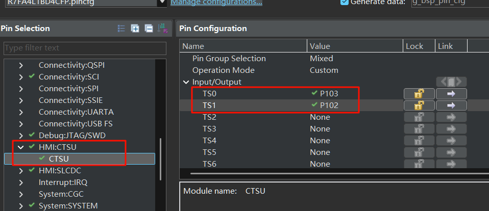  

新增配置Touch(rm_touch) stack，一定别选错了！
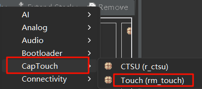  


接着双击CTSU(r_ctsu)，将`Support for Using DTC`值改为`Enabled`。

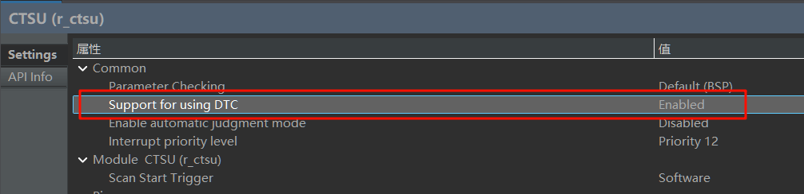  

然后add DTC driver，注意Transmission和Reception都要操作。
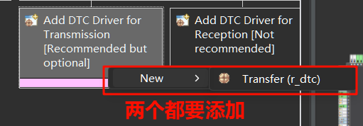  

一切就绪，生成代码。

### 3.2 修改调试配置
点击菜单栏的运行--调试配置
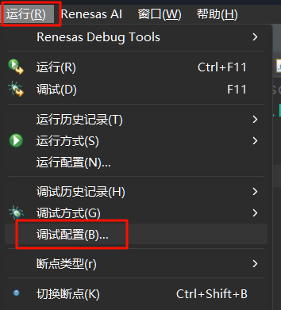  

在GDB Hardware Debugging下新建配置
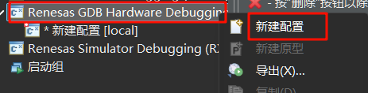  


浏览选择项目以及程序elf文件
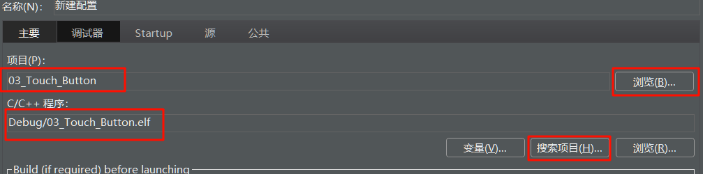  

在`调试器`选项卡选择J-Link ARM，目标选择R7FA4L1BD
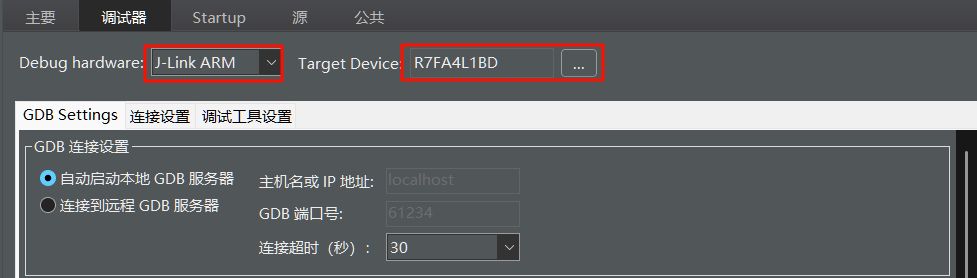  

在`公共`选项卡**取消勾选后台启动**
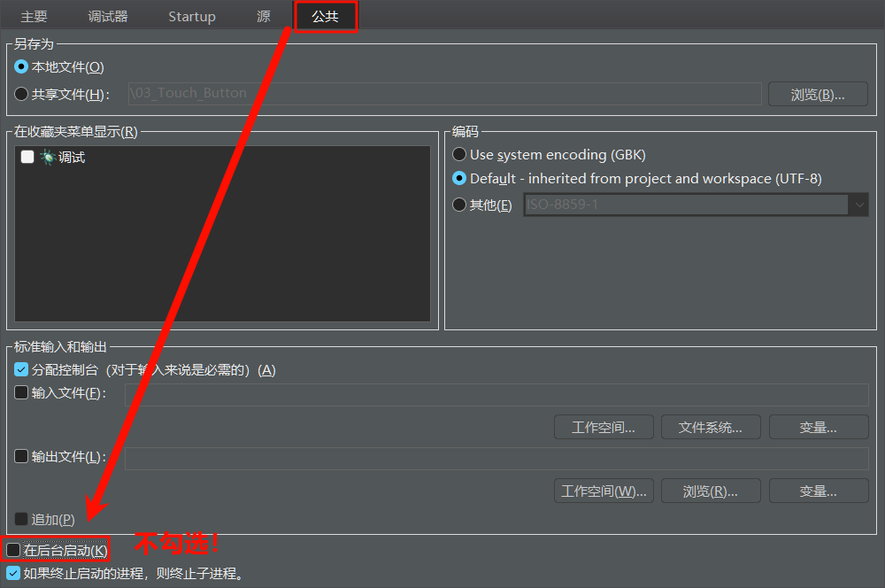  

应用、退出即可。

### 3.3 调试电容按键
如图所示新增一个CapTouch workflow

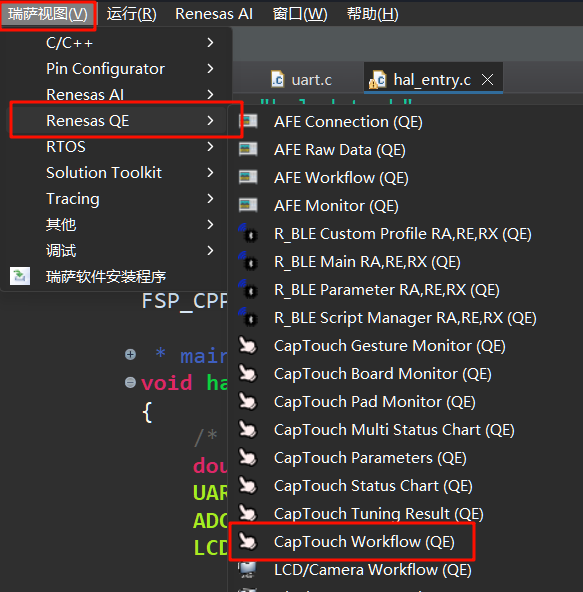  

选择一个项目，这里选当前项目。
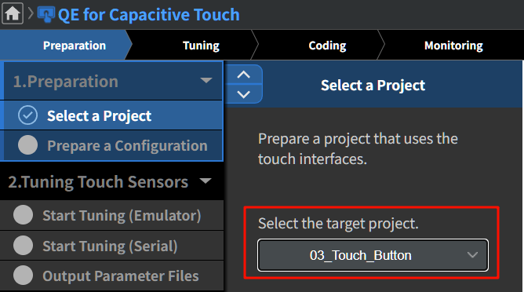  

下一步生成一个新的配置文件
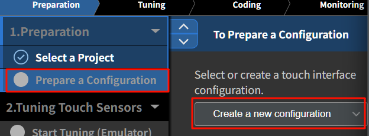  

在弹出的页面上，点击Button，放置两个按钮，并双击按钮打开配置，分别选择TS0和TS1，电阻配置**560ohm**，最后点击create。  

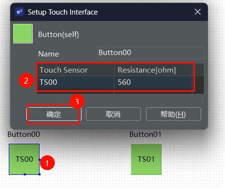  


下一步，连接J-Link与开发板，接线如下：

| J-Link | RA4L1开发板 |
| ------ | ----------- |
| Vref   | 3V3         |
| SWDIO  | SWDIO       |
| SWCLK  | SWCLK       |
|GND|GND|

点击Start Tuning，会自动编译、下载，**这期间不要动板子**，直到出现下图带黄条的界面

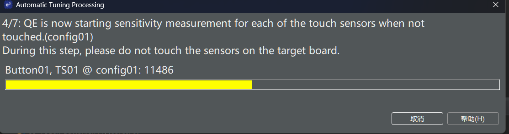 

:::warning 启动调谐后卡在第一步 1/7: QE is beginning the tuning process 的解决方法

经过测试，发现是Stack中的ADC模块的问题，先暂时把该模块移除，再按照之前的配置把ADC模块添加回来即可。具体原因暂时不明确。

:::

此时用合适的力度按住TS0(注意不要用力过重，否则阈值过高按键不灵敏)，当看到**黄条到顶后**，在键盘上按下任意键。TS1也是如此。

结束后，点击Continue the Tuning Process


回到workflow界面，点击Output Parameter Files，程序会自动生成配置文件。

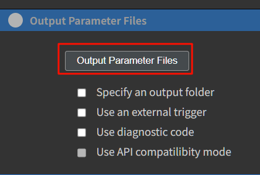  

点击 Implement Program，点击Show Sample，选择Output to a File，在qe_gen文件夹内就多出一个`qe_touch_sample.c`
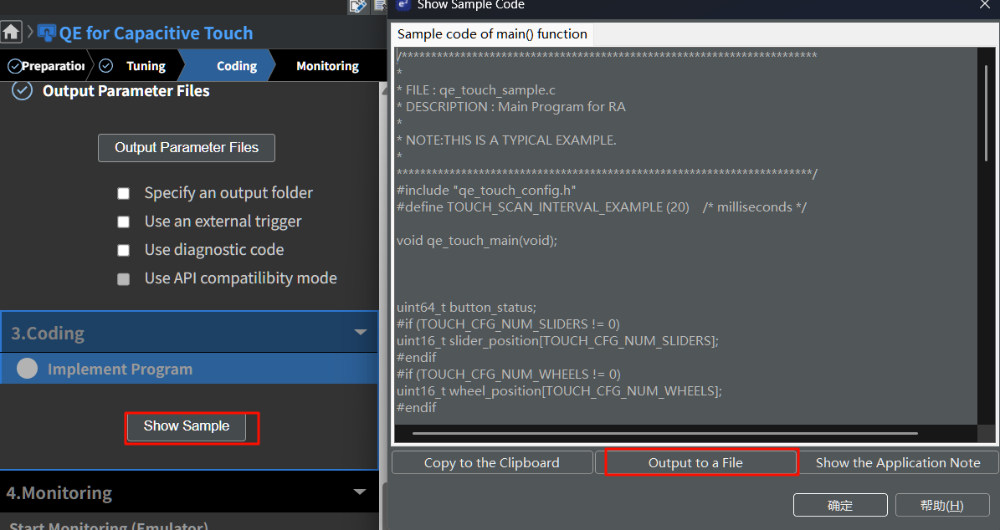  

### 3.4 编写代码
可以参考上一小节的`qe_touch_sample.c`内容，在我们hal_entry.c中编写代码。这里要实现在LCD屏幕显示计数值，按下TS0数字减一、TS1数字加一、单独长按TS0和TS1数字快速加10或减10、同时长按TS0和TS1数字清零的效果。

#### 3.4.1 新建sys_time.c和systime.h
在src目录下新建sys_time目录，并创建sys_time.c和systime.h。

`get_system_time_ms`是获取系统tick的函数，在`system_time_init`设置每一个tick是1ms
`systime.c`文件内容
```c
#include "sys_time.h"
static volatile uint32_t system_ms = 0;

void SysTick_Handler(void)
{
    system_ms++;
}

uint32_t get_system_time_ms(void)
{
    return system_ms;
}

void system_time_init(void)
{
    SystemCoreClockUpdate();
    SysTick_Config(SystemCoreClock / 1000);  // 每1ms中断一次
}
```

`systime.h`文件内容
```c
#ifndef SYS_TIME_SYS_TIME_H_
#define SYS_TIME_SYS_TIME_H_

#include "hal_data.h"
uint32_t get_system_time_ms(void);
void system_time_init(void);
#endif /* SYS_TIME_SYS_TIME_H_ */
```

#### 3.4.2 新建touch_btn.c和touch_btn.h
在src目录下新建touch_btn目录，并创建touch_btn.c和touch_btn.h。

`touch_btn.c`文件内容
```c
#include "touch_btn.h"
#include "../sys_time/sys_time.h"

typedef struct
{
    uint8_t id;
    bool last_pressed;
    bool current_pressed;
    uint32_t press_start_time;
    touchBtn_event_t event;
} TouchBtn_t;

static TouchBtn_t btns[NUM_BTNS] =
{
{ 0, false, false, 0, TOUCH_NONE },
  { 1, false, false, 0, TOUCH_NONE } };

static uint64_t button_status = 0;

// 外部变量，由 qe_touch_callback 设置
extern volatile uint8_t g_qe_touch_flag;

void TouchBtn_Init(void)
{
    RM_TOUCH_Open (g_qe_touch_instance_config01.p_ctrl, g_qe_touch_instance_config01.p_cfg);
    RM_TOUCH_ScanStart (g_qe_touch_instance_config01.p_ctrl);
}

void TouchBtn_Process(void)
{
    RM_TOUCH_ScanStart (g_qe_touch_instance_config01.p_ctrl);
    if (!g_qe_touch_flag)
        return;

    g_qe_touch_flag = 0;

    if (RM_TOUCH_DataGet (g_qe_touch_instance_config01.p_ctrl, &button_status, NULL, NULL) != FSP_SUCCESS)
        return;

    uint32_t now = get_system_time_ms ();

    for (int i = 0; i < NUM_BTNS; i++)
    {
        TouchBtn_t *btn = &btns[i];
        btn->last_pressed = btn->current_pressed;
        btn->current_pressed = (button_status & (1ULL << btn->id)) != 0;

        if (!btn->last_pressed && btn->current_pressed)
        {
            // 新按下，记录开始时间
            btn->press_start_time = now;
            btn->event = TOUCH_NONE;
        }
        else if (btn->current_pressed)
        {
            // 持续按住中
            uint32_t duration = now - btn->press_start_time;
            if (duration >= LONG_PRESS_THRESHOLD_MS && btn->event != TOUCH_LONG_PRESS)
            {
                btn->event = TOUCH_LONG_PRESS;
            }
        }
        else if (btn->last_pressed && !btn->current_pressed)
        {
            // 松手时判断是否为短按（未达到长按阈值时）
            uint32_t duration = now - btn->press_start_time;
            if (duration < LONG_PRESS_THRESHOLD_MS)
            {
                btn->event = TOUCH_SHORT_PRESS;
            }
        }
    }
}

touchBtn_event_t TouchBtn_GetEvent(uint8_t btn_id)
{
    if (btn_id >= NUM_BTNS)
        return TOUCH_NONE;

    touchBtn_event_t e = btns[btn_id].event;
    btns[btn_id].event = TOUCH_NONE;
    return e;
}
```

`touch_btn.h`文件内容

```c
#ifndef TOUCH_BTN_H_
#define TOUCH_BTN_H_
#include "hal_data.h"
#include "qe_touch_config.h"

#define NUM_BTNS 2
#define LONG_PRESS_THRESHOLD_MS 1000  // 长按时间，默认1s

typedef enum {
    TOUCH_NONE = 0,
    TOUCH_SHORT_PRESS,
    TOUCH_LONG_PRESS
} touchBtn_event_t;

void TouchBtn_Init(void);
void TouchBtn_Process(void);  // 轮询调用，可放主循环
touchBtn_event_t TouchBtn_GetEvent(uint8_t btn_id);  // 获取按键事件后，自动清除

#endif
```

#### 3.4.3 修改hal_entry.c
在包含头文件部分新增
```c
#include "touch_btn/touch_btn.h"
#include "sys_time/sys_time.h"
```

修改hal_entry函数
```c
void hal_entry(void)
{
    /* TODO: add your own code here */
    uint32_t num = 0;
    uint32_t last_inc_time = 0, last_dec_time = 0;
    const uint32_t repeat_interval_ms = 100;  // 自动重复自增间隔

    system_time_init ();
    UART_Init ();
    ADC_Init ();
    LCD_Init ();
    TouchBtn_Init ();

    while (1)
    {
        LCD_ShowNumber (num, 6);
        TouchBtn_Process ();

        touchBtn_event_t e0 = TouchBtn_GetEvent (0);
        touchBtn_event_t e1 = TouchBtn_GetEvent (1);

        // 短按处理
        if (e0 == TOUCH_SHORT_PRESS)
        {
            if(num>0)
                num--;
        }
        if (e1 == TOUCH_SHORT_PRESS)
        {
            num++;
        }
        // 同时长按TS0和TS1清零
        if (e0 == TOUCH_LONG_PRESS && e1 == TOUCH_LONG_PRESS)
        {
            num = 0;
        }

        // 长按 TS0 快速减10
        if (e0 == TOUCH_LONG_PRESS && get_system_time_ms () - last_dec_time >= repeat_interval_ms)  // 超过长按阈值
        {
            if (num >= 10)
                num -= 10;
            else
            {
                num = 0;
            }
            last_dec_time = get_system_time_ms ();
        }
        // 长按 TS1 快速加10
        if (e1 == TOUCH_LONG_PRESS && get_system_time_ms () - last_inc_time >= repeat_interval_ms)  // 超过长按阈值
        {
            num += 10;
            last_inc_time = get_system_time_ms ();

        }
        R_BSP_SoftwareDelay (2, BSP_DELAY_UNITS_MILLISECONDS);
    }
}
```

## 4 最终效果

按下图所示方法开启监测。先点击show views，再开始调试，选择要监测的按键，最后点击enable monitoring，触摸按键查看效果。
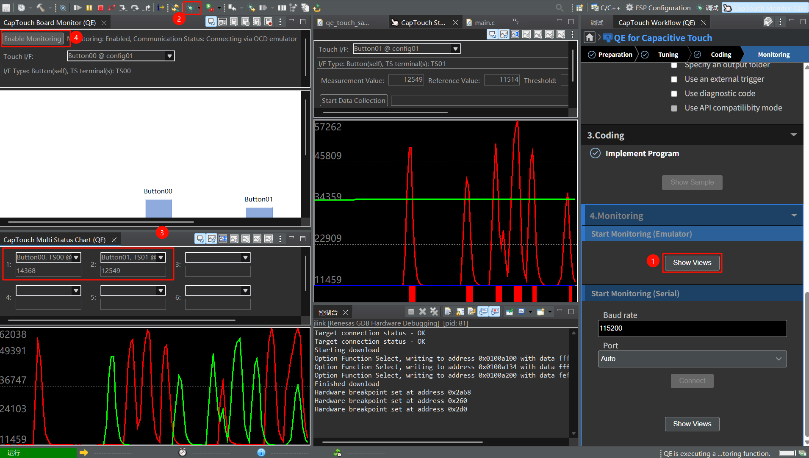  

在开发板上能看到，短按下TS1时，数字自增1，长按快速自增10。TS0是自减，效果类似。长按TS0和TS1是清零。演示视频在文章顶部。


