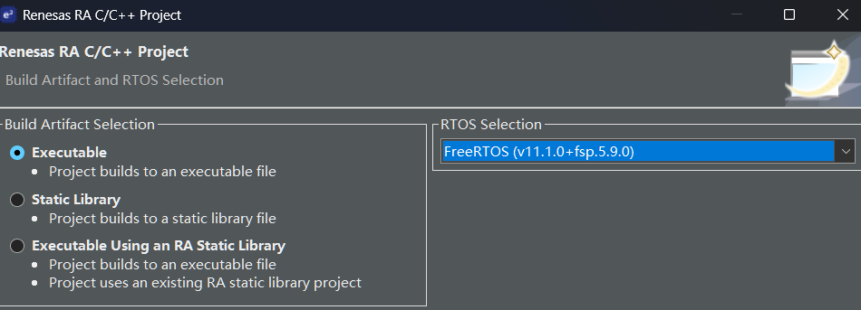
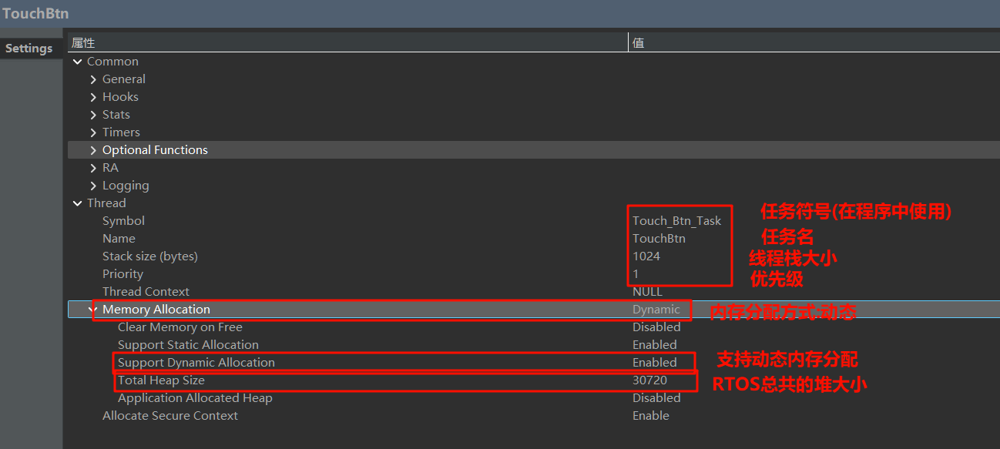
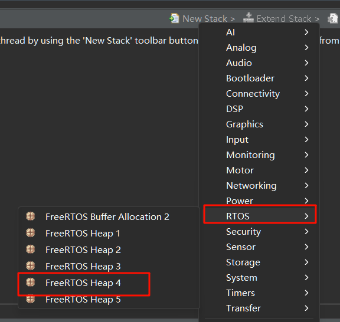
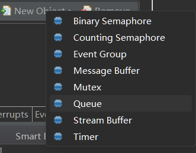
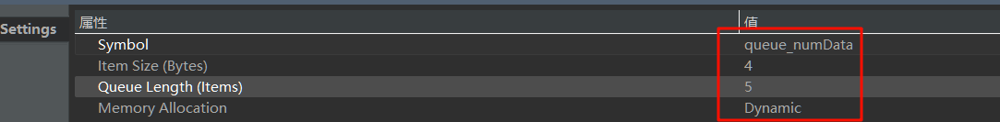

# 04 FreeRTOS重构工程

## 1. 前言
之前几个实验都是在裸机开发，随着项目的推进，裸机开发很难去保证各个功能的实时性，因此，本次实验借助FreeRTOS来整合之前的项目，给每个功能都设置任务。另外，还要加入一个按下开发板上的按键即切换任务的功能，实现既有触摸按键计数任务，又有ADC采集功能

之后的实验就在本次FreeRTOS实验的基础上继续改进。

## 2. FreeRTOS介绍
FreeRTOS 由美国的 Richard Barry 于 2003 年发布，Richard Barry 是 FreeRTOS 的拥有者和维护者，在过去的十多年中 FreeRTOS 历经了 9 个版本，与众多半导体厂商合作密切，累计开发者数百万，是目前市场占有率最高的 RTOS。

## 3. 软件部分
### 3.1 创建工程
创建工程的详细过程就参考我之前写的RA4L1的实验1，主要是这里RTOS选择FreeRTOS v11.1.0+fsp5.9.0。

  

去到配置xml里面，**按照上一次实验项目的配置，把pins和Stacks页面完善一下**，包括`LCD、触摸、SCI-UART、ADC`,这里就不再截图啰嗦了。

---

**请注意！一定要在配置完xml后先进行触摸按键调试(参考实验3)，再继续创建线程，否则在创建完进程后无法进行触摸按键调试！(这bug太离谱了，实验了好久得出来的正确操作顺序)**

---

### 3.2 新增线程(Threads)
注: 线程和任务在后文都是指的同一个东西，我就混着使用了。任务(Task)是FreeRTOS官方的叫法，而线程(Thread)是在E2Studio中的写法。

在我们之前的裸机程序中，有两个功能需要放在while死循环中:电容按键扫描以及LCD显示

在FreeRTOS中，我们就把这两个功能作为两个任务创建。

点击Stacks选项卡--在左侧的New Thread -- 点击新创建的Thread 属性 -- 修改Name、Symbol以及Priority，下图是以电容按键扫描任务为例Symbol是`Touch_Button_Task`，name是`TouchBtn`，优先级是`1`，内存分配为`Dynamic` 。**修改Total Heap Size堆大小为30720**



LCD显示的任务与电容按键任务操作方法相同，只不过修改一下Name和symbol即可，这里我写的symbol是`LCD_Display_Task`，Name是`LcdDisplay`，优先级`1`，内存分配为`Dynamic`

### 3.3 选择堆算法
接着为堆选择算法，这里一共有1~5共5个算法可选，每种算法介绍如下：

Heap_1：这是最简单的内存分配实现，它不允许释放已分配的内存。这意味着一旦内存被分配出去，就不能被回收，这可能导致内存的快速耗尽。

Heap_2：与Heap_1相比，Heap_2允许内存的释放。但是，它不会合并相邻的空闲内存块，因此可能会导致内存碎片化。

Heap_3：Heap_3使用标准的malloc()和free()函数来管理内存，因此堆的大小由链接器配置决定，而不是由FreeRTOS的配置文件设置。

Heap_4：Heap_4在Heap_2的基础上进行了改进，它会合并相邻的空闲内存块，从而减少内存碎片化的可能性。Heap_4使用“第一次适应算法”来分配内存，通常建议作为内存管理的首选方案。

Heap_5：Heap_5与Heap_4类似，但它支持从多个非连续的内存块中分配内存，这对于系统内存不是连续块的情况非常有用。`

这里我选择`Heap 4`算法。
点击HAL/Common -- New Stack -- RTOS -- FreeRTOS Heap4，注意堆算法不是“属于”某个线程，而是属于整个FreeRTOS的。你不能在另一线程里选择另一种堆算法。

  

### 3.4 创建队列
在之前的裸机开发中，都是使用extern一个全局变量来传递数据的，例如，一个模块采集数据后，将结果存入某个全局变量，其他模块通过 extern 声明访问这个变量。这种方式虽然简单直接，但存在一些问题：

- 全局变量数量多，容易混乱，维护困难;

- 没有访问控制，可能被任意地方修改;

- 多个模块同时访问时容易出现竞态条件;

- 不适用于多任务并发的系统。

在FreeRTOS中，队列是一个线程安全的、先进先出（FIFO）缓冲结构，用于任务之间或者任务与中断之间安全传递数据。你可以把它理解为一个**任务之间传纸条的小信箱**，一方放入数据，另一方接收数据，而且不会因为同时访问而出错。

在xml配置文件中，Threads下方有一个Object区域，点击`New Object-- Queue`

  

修改`symbol`为`queue_numData`，由于我们的num是uint32_t类型的，大小是4字节，`Item Size`填`4`，队列长度写`5`，内存分配选`Dynamic`

  

完成后点击生成代码即可
### 3.5 代码移植
#### 3.5.1 复制之前项目src下的文件夹
在src目录下就有自动生成的`LCD_Display_Task_entry.c`和`Touch_Button_Task_entry.c`文件。我们在这两个文件中移植任务函数。

另外，把之前项目的src下的文件夹`adc`，`lcd`和`uart`都复制到当前项目下，sys_time文件夹不用复制了，因为现在用RTOS内置函数来获取Tick。

#### 3.5.2 修改LCD_Display_Task_entry.c
该文件内容如下，里面使用队列接收，当接收到queue_numData的数据时，将值赋值给局部变量num，并显示在屏幕上。

```c
#include "LCD_Display_Task.h"
#include "lcd/lcd.h"
/* LcdDisplay entry function */
/* pvParameters contains TaskHandle_t */
void LCD_Display_Task_entry(void *pvParameters)
{
    FSP_PARAMETER_NOT_USED(pvParameters);

    /* TODO: add your own code here */
    uint32_t num = 0;
    LCD_Init ();
    while (1)
    {
        if (xQueueReceive (queue_numData, &num, 0) == pdTRUE)
        {
            LCD_ShowNumber (num, 6);
        }
        vTaskDelay (1);
    }
}
```

#### 3.5.3 修改Touch_Button_Task_entry.c
文件内容如下
```c
#include "Touch_Button_Task.h"
#include "touch_btn/touch_btn.h"
/* TouchBtn entry function */
/* pvParameters contains TaskHandle_t */
void Touch_Button_Task_entry(void *pvParameters)
{
    FSP_PARAMETER_NOT_USED (pvParameters);

    /* TODO: add your own code here */
    uint32_t num = 0;
        uint32_t last_inc_time = 0, last_dec_time = 0;
        const uint32_t repeat_interval_ms = 100;  // 自动重复自增间隔
        TouchBtn_Init ();
        while (1)
        {
            TouchBtn_Process ();

        touchBtn_event_t e0 = TouchBtn_GetEvent (0);
        touchBtn_event_t e1 = TouchBtn_GetEvent (1);

        // 短按处理
        if (e0 == TOUCH_SHORT_PRESS)
        {
            if (num > 0)
                num--;
        }
        if (e1 == TOUCH_SHORT_PRESS)
        {
            num++;
        }
        // 同时长按TS0和TS1清零
        if (e0 == TOUCH_LONG_PRESS && e1 == TOUCH_LONG_PRESS)
        {
            num = 0;
        }

        // 长按 TS0 快速减10
        if (e0 == TOUCH_LONG_PRESS && xTaskGetTickCount () - last_dec_time >= repeat_interval_ms)  // 超过长按阈值
        {
            if (num >= 10)
                num -= 10;
            else
            {
                num = 0;
            }
            last_dec_time = xTaskGetTickCount ();
        }
        // 长按 TS1 快速加10
        if (e1 == TOUCH_LONG_PRESS && xTaskGetTickCount () - last_inc_time >= repeat_interval_ms)  // 超过长按阈值
        {
            num += 10;
            last_inc_time = xTaskGetTickCount ();

        }
        xQueueSend(queue_numData, &num, 0);
            vTaskDelay (1);
        }
}
```
说明:
1. 之前是使用`get_system_time_ms`来获取系统时间的，现在是用FreeRTOS提供的`来获取。

2. xQueueSend(queue_numData, &num, 0);是向队列`queue_numData`发送数据的。

#### 3.5.4 修改触摸驱动touch_btn/touch_btn.c
打开该文件，将`TouchBtn_Process`函数中的
```c
uint32_t now = get_system_time_ms ();
```
改为
```c
uint32_t now = xTaskGetTickCount();
```
整个文件内容太多了就不写在这了，可查看结尾/评论区的工程附件。

至此，可以编译下载看看能不能实现触摸按键增减LCD上的数字了。

## 4. 下载测试
将代码下载到开发板中，预期效果应与实验03效果一致。

