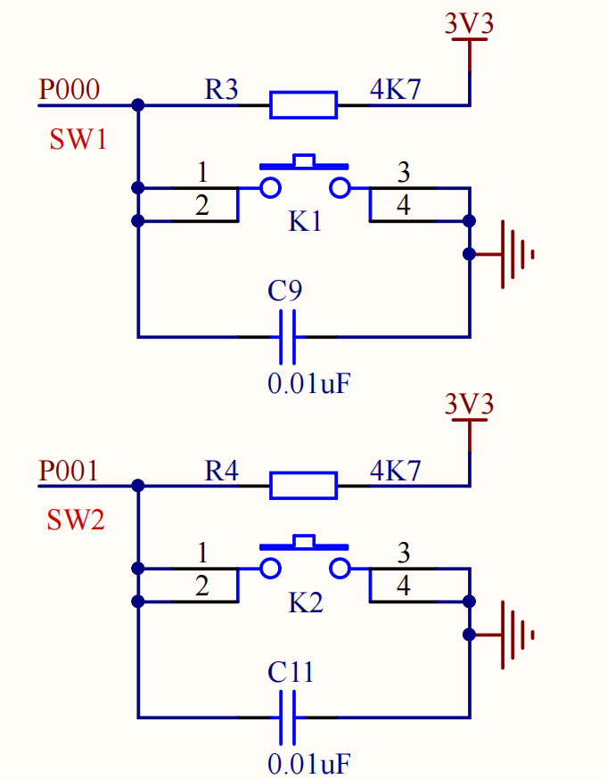
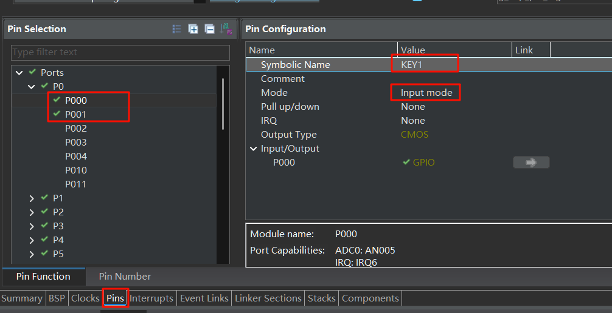
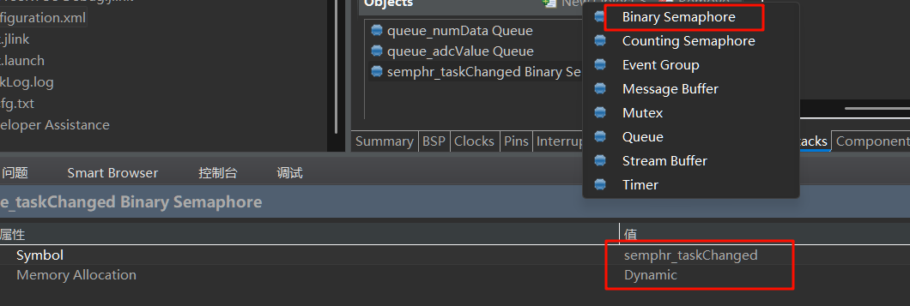

# 05 按键实现RTOS任务切换
## 1. 前言
上次实验，我们已经成功将裸机项目移植为FreeRTOS项目，系统的实时性大大提高。
本次实验将继续围绕RTOS，把ADC采集电压的功能加回来，使用开发板上的实体按键实现ADC电压采集与计数功能的切换，为之后的多任务切换做个铺垫。


## 2. 软件部分
将上次的实验工程复制一份，重命名为`05_Button_Switch_Task`

### 2.1 绑定按键IO && 配置任务、队列和信号量
开发板实体按键接在了P000和P001上

  

在Pins--P0--P000，设置Symbolic Name为`KEY1`，模式是输入模式。P001(KEY2)同理。

  


现在在Stack--Threads中把ADC和按键任务也添加上。

ADC任务的symbol是`ADC_Task`，Name是`ADC_Voltage`，优先级`2`，Stack Size为`256`，内存分配为`Dynamic`.

按键切换任务的symbol是`Key_Switch_Task`，Name是`KeySwitch`，Stack Size为`256`，优先级`2`，内存分配为`Dynamic`.

创建一个队列，修改`symbol`为`queue_adcValue`，由于double类型大小是8字节，`Item Size`填`8`，队列长度写`3`，内存分配选`Dynamic`。

创建一个二值信号量，symbol为`semphr_taskChanged`，内存分配选`Dynamic`

  

完成后保存并生成代码。

### 2.2 LCD驱动添加清屏clear函数
在`lcd.c`文件末尾添加函数
```c
void LCD_Clear(void){
    // 清除SEG0~SEG41
    for(uint8_t idx=0;idx<=41;idx++){
        R_SLCDC_Modify (&g_slcdc0_ctrl, idx, 0x00, 0xFF);
    }
}
```
记得在`lcd.h`中声明该函数。

### 2.3 修改ADC_Task_entry.c

```c
#include "ADC_Task.h"
#include "adc/adc.h"
/* ADC_Voltage entry function */
/* pvParameters contains TaskHandle_t */
void ADC_Task_entry(void *pvParameters)
{
    FSP_PARAMETER_NOT_USED (pvParameters);

    /* TODO: add your own code here */
    double adcValue = 0.0;
    ADC_Init();
    while (1)
    {
        adcValue = Read_ADC_Voltage_Value();
        xQueueSend(queue_adcValue, &adcValue, 0);
        vTaskDelay (200);
    }
}
```

### 2.4 修改Key_Switch_Task_entry.c
这个任务代码目前是只做了两个任务来回切换，之后再完善多任务切换的。
```c
#include "Key_Switch_Task.h"
/* KeySwitch entry function */
extern TaskHandle_t ADC_Task, Touch_Button_Task;
static bool adc_task_active = true; // 初始为ADC_Task运行

/* pvParameters contains TaskHandle_t */
void Key_Switch_Task_entry(void *pvParameters)
{
    FSP_PARAMETER_NOT_USED(pvParameters);

    /* TODO: add your own code here */
    uint8_t key_state;
    vTaskSuspend (Touch_Button_Task);
    xSemaphoreGive(semphr_taskChanged);
    while (1)
    {
        R_IOPORT_PinRead (&g_ioport_ctrl, KEY1, &key_state);
        if (BSP_IO_LEVEL_LOW == key_state)
        {
            // 消抖处理
            vTaskDelay (5);
            do // 等待按键释放，避免重复触发
            {
                R_IOPORT_PinRead (&g_ioport_ctrl, KEY1, &key_state);
                vTaskDelay (10);
            }
            while (BSP_IO_LEVEL_LOW == key_state);
            //实现任务切换
            if (adc_task_active)
            {
                vTaskSuspend (ADC_Task);
                vTaskResume (Touch_Button_Task);
                adc_task_active = false;
            }
            else
            {
                vTaskSuspend (Touch_Button_Task);
                vTaskResume (ADC_Task);
                adc_task_active = true;
            }
            xSemaphoreGive(semphr_taskChanged);  // 当任务切换时发送信号量给LCD任务清屏

        }
        vTaskDelay (20);
    }
}
```

### 2.5 修改LCD_Display_Task_entry.c
这里显示函数是用了一个信号量来进行显示的切换，在切换时要调用`LCD_Clear`进行清屏
```c
#include "LCD_Display_Task.h"
#include "lcd/lcd.h"
/* LcdDisplay entry function */
/* pvParameters contains TaskHandle_t */
void LCD_Display_Task_entry(void *pvParameters)
{
    FSP_PARAMETER_NOT_USED(pvParameters);

    /* TODO: add your own code here */
    uint32_t num = 0;
    double adcValue = 0.0;
    static bool adc_task_active = true;
    LCD_Init ();
    //刚上电时先等待按键切换任务那边暂停任务，再进行显示
    if (xSemaphoreTake(semphr_taskChanged, 10000) == pdTRUE)
    {
        LCD_Clear ();
    }
    while (1)
    {
        if (xSemaphoreTake(semphr_taskChanged, 0) == pdTRUE)
        {
            adc_task_active = !adc_task_active;
            LCD_Clear ();
        }
        if (xQueueReceive (queue_numData, &num, 0) == pdTRUE && adc_task_active == false)
        {
            LCD_setDot (0);
            LCD_ShowNumber (num, 6);
        }
        if (xQueueReceive (queue_adcValue, &adcValue, 0) == pdTRUE && adc_task_active == true)
        {
            LCD_setDot (1);
            LCD_ShowNumber ((uint32_t) (adcValue * 100), 3);
        }
        vTaskDelay (10);
    }
}
```

## 3. 编译下载
初始屏幕显示的是ADC采集电压的读数，点击KEY1切换到按键计数功能，触摸按键即可计数。可尝试来回切换查看效果，如结尾视频所示。

