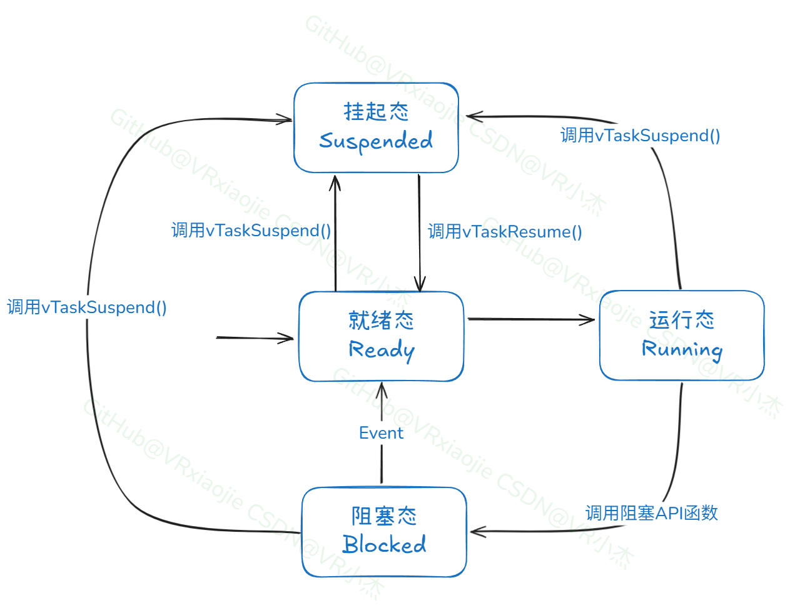
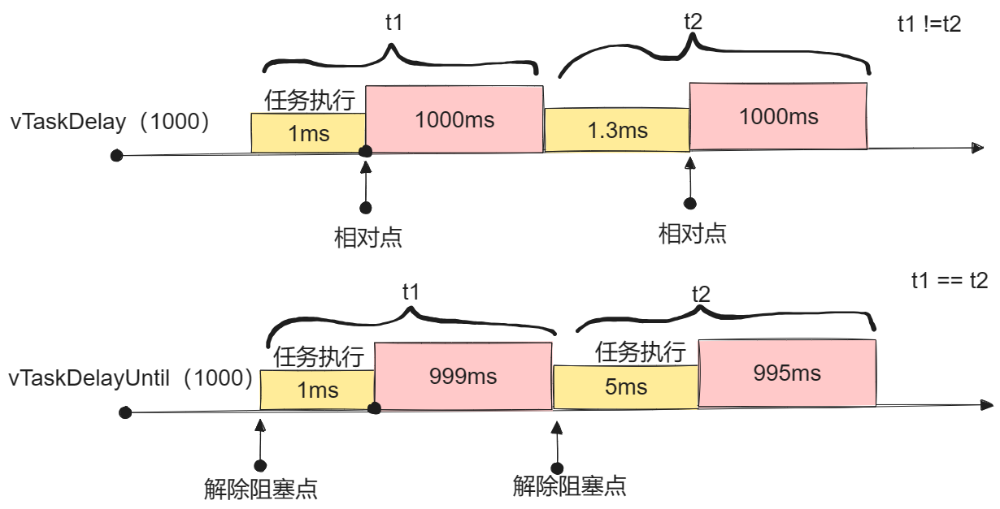
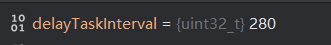

## 3 FreeRTOS任务控制
### 3.1 任务状态
在FreeRTOS中，任务有4种状态：运行态(Running)、就绪态(Ready)、阻塞态(Blocked)、挂起态(Suspended)。它们的关系如下图所示。

运行态：当任务实际执行时，它被称为处于运行状态。任务当前正在使用处理器。 如果运行 RTOS 的处理器只有一个内核， 那么在任何给定时间内都只能有一个任务处于运行状态。

就绪态：准备就绪任务指那些能够执行（不处于阻塞或挂起状态），但目前没有执行的任务，因为同等或更高优先级的不同任务已经处于运行状态。

阻塞态：如果任务当前正在等待时间或外部事件，则该任务被认为处于阻塞状态。 例如，如果一个任务调用`vTaskDelay()`，它就进入了阻塞态， 直到延迟结束(产生时间事件)。任务也可以通过阻塞来等待队列、信号量、事件组、通知或信号量事件。处于阻塞状态的任务通常有一个"超时"期，超时后任务会被解除阻塞，即使该任务所等待的事件没有发生。“阻塞”状态下的任务不使用任何处理时间，不能主动进入运行态。

挂起态：与“阻塞”状态下的任务一样，“挂起”状态下的任务不能进入运行态，但处于挂起状态的任务没有超时。任务只有在分别通过 vTaskSuspend() 和 xTaskResume() API 调用时才会进入或退出挂起状态。



### 3.2 挂起任务
```C
void vTaskSuspend( TaskHandle_t xTaskToSuspend );
```

功能：挂起任务。参数`xTaskToSuspend`是要挂起任务的句柄，传递NULL是挂起当前任务。若在同一任务上调用vTaskSuspend()多次，相当于只调用一次该函数。

### 3.3 恢复任务
```C
void vTaskResume( TaskHandle_t xTaskToResume );
```

功能：恢复被挂起的任务。参数`xTaskToResume`是要恢复任务的句柄。


### 3.4 阻塞任务
#### 3.4.1 vTaskDelay相对时间阻塞
```C
void vTaskDelay( const TickType_t xTicksToDelay );
```

功能：阻塞任务。以滴答数为单位。由于之前配置FreeRTOS的一次滴答为1ms，因此这里的每个滴答就是1ms。

延时时间是从调用vTaskDelay()后开始计算的相对时间

适用于不要求周期性的延时。如果用vTaskDelay创建周期性任务，假设100ms执行一次，那么从调用vTaskDelay(100)后，任务进入阻塞状态，经过100个滴答数后任务解除阻塞。

实际上的执行周期是任务执行时间+100ms，任务执行中有可能被高优先级的任务抢占、进入中断等，导致实际执行时间变长。例如第1次：执行耗时 10ms，延时 100ms ==> 间隔 110 ms；第2次：执行耗时 30ms，延时 100ms ==> 间隔 130ms …长此以往，误差会累积得越来越大，周期不稳定。


#### 3.4.2 vTaskDelayUntil绝对时间阻塞
```C
void vTaskDelayUntil( TickType_t *pxPreviousWakeTime,
                      const TickType_t xTimeIncrement );
```

功能：阻塞任务。pxPreviousWakeTime：指向一个变量的指针，该变量用于保存任务最后一次解除阻塞的时间。该变量在第一次使用前 必须用当前时间进行初始化。在这之后，该变量会在 vTaskDelayUntil() 中自动更新。

xTimeIncrement：阻塞的时间段。

`vTaskDelayUntil`实现精确的周期性任务调度。每次延迟都以“上次唤醒时间”为基准，适合要求任务定时运行的场景。

vTaskDelay与vTaskDelayUntil对比如下图所示。




### 3.5 任务控制相关实验
#### 3.5.1 任务挂起和恢复实验
在CubeMX中配置PA2引脚为输入引脚，模式为上拉输入，标签为`KEY`。这个引脚通过杜邦线接到面包板，串联一个按键，按键另一头接地，当按下按键时PA2引脚读取到低电平。当按下外部按键时，将`LED_app`在挂起和恢复状态之间切换。

与该按键相关的任务命名为`Key_app`，实现一个简单的按键高低电平检测的功能。当按下外部按键后，在挂起和恢复LED任务之间切换。

```C
void Key_app(void *args)
{
    static uint8_t last_state = 1, cur_state=1;
    static uint8_t isSuspended = 0;
    for (;;) {
        cur_state = HAL_GPIO_ReadPin(EX_KEY_GPIO_Port, EX_KEY_Pin);
        if (cur_state != last_state) {
            if (last_state == 1 && isSuspended == 0) //按下+挂起任务
            {
                isSuspended = 1;
                vTaskSuspend(LED_TaskHandle);
            }
            else if (last_state == 1 && isSuspended == 1) { //按下+恢复任务
                isSuspended = 0;
                vTaskResume(LED_TaskHandle);
            }
            last_state = cur_state;
        }
        vTaskDelay(30);
    }
}
```

LED_app内的代码如下所示，该任务是让板载LED不停闪烁。

```C
void LED_app(void *args)
{
    for (;;) {
        HAL_GPIO_TogglePin(LED_GPIO_Port, LED_Pin);
        vTaskDelay(100);
    }
}
```

实验现象：按下外部按键，LED任务阻塞，再次按下按键，LED任务恢复。


#### 3.5.2 两种阻塞函数的对比实验
将`LED_app`改为下面的内容。为了方便在调试时查看间隔的时间，定义了全局变量`delayTaskInterval`。在任务内使用`xTaskGetTickCount()`获取滴答计数值，并和上一次获取到的值相减，赋值给`delayTaskInterval`。

为了模拟任务执行时间，加入了HAL_Delay(80);阻塞80ms。

```C
uint32_t delayTaskInterval = 0;
void LED_app(void *args)
{
    TickType_t xLastWakeTime = xTaskGetTickCount();
    for (;;) {
        TickType_t xNow = xTaskGetTickCount();
        delayTaskInterval = xNow - xLastWakeTime;
        xLastWakeTime = xNow; 
        HAL_GPIO_WritePin(LED_GPIO_Port, LED_Pin,GPIO_PIN_SET);
        vTaskDelay(100);
        HAL_Delay(80);
        HAL_GPIO_WritePin(LED_GPIO_Port, LED_Pin,GPIO_PIN_RESET);
        vTaskDelay(100);
    }
}
```

下载调试，查看变量`delayTaskInterval`，可以看到两次任务运行间隔280ms，而且明显能感觉到LED亮的时间比熄灭的时间长一点。这恰恰说明了vTaskDelay是用的相对时间，也就是LED亮100ms(阻塞时间)+80ms(模拟的任务执行时间)，灭100ms(阻塞时间).



然而，我们本意是要让该任务以200ms为周期执行一次的，现在却是280ms执行一次。

接下来使用`vTaskDelayUntil`试试。将LED_app代码修改如下：


```C
uint32_t delayTaskInterval = 0;
void LED_app(void *args)
{
    static TickType_t prvWakeTime;
    TickType_t xLastWakeTime = xTaskGetTickCount();
    for (;;) {
        TickType_t xNow = xTaskGetTickCount();
        delayTaskInterval = xNow - xLastWakeTime;
        xLastWakeTime = xNow;
        HAL_GPIO_WritePin(LED_GPIO_Port, LED_Pin,GPIO_PIN_SET);
        // vTaskDelay(100);
        HAL_Delay(80);
        vTaskDelayUntil(&prvWakeTime,100);
        HAL_GPIO_WritePin(LED_GPIO_Port, LED_Pin,GPIO_PIN_RESET);
        // vTaskDelay(100);
        vTaskDelayUntil(&prvWakeTime,100);
    }
}

```

再次调试查看变量`delayTaskInterval`的值，200ms。而且现在LED灯亮和灭的时间都一样了。


