## 1 初识FreeRTOS
### 1.1简介
FreeRTOS 由美国的 Richard Barry 于 2003 年发布，Richard Barry 是 FreeRTOS 的拥有者和维护者，在过去的十多年中 FreeRTOS 历经了 9 个版本，与众多半导体厂商合作密切，累计开发者数百万，是目前市场占有率最高的 RTOS。

FreeRTOS 于 2018 年被亚马逊收购，改名为 AWS FreeRTOS，版本号升级为 V10，且开源协议也由原来的 GPLv2+修改为 MIT，与 GPLv2+相比，MIT 更加开放，

有很多的文档和例程均能在FreeRTOS的官网:  找到。我学习RTOS过程基本上是看书——看视频——看文档——写代码，在写代码时遇到不会的再重复看前面的内容，书、视频、文档综合起来看就能搞明白很多知识点。最后再在学习过程中写下这本RTOS学习笔记。

### 1.2 STM32CubeMX创建第一个FreeRTOS工程
这次使用的开发板是立创开发板天空星STM32F407，其主控是STM32F407VGT6，官方wiki资料页面 。使用开发软件是STM32CubeMX 、Keil5、安装了EIDE及C/C++插件的VSCode，其中，CubeMX是用图形化界面快速配置引脚及生成工程模板的，这样能将主要精力花在学习FreeRTOS上而非敲各种功能和引脚的初始化代码；安装了插件的VSCode拿来编写主要代码，其代码提示和可操作性比Keil5强；而Keil5主要用来调试代码。

调试下载器使用的是自己做的J-Link Base，使用SW方式下载调试。

接下来使用CubeMX创建一个新项目选择主控STM32F407VGT6，做如下配置：

（1）配置RCC 中的HSE高速时钟为晶振

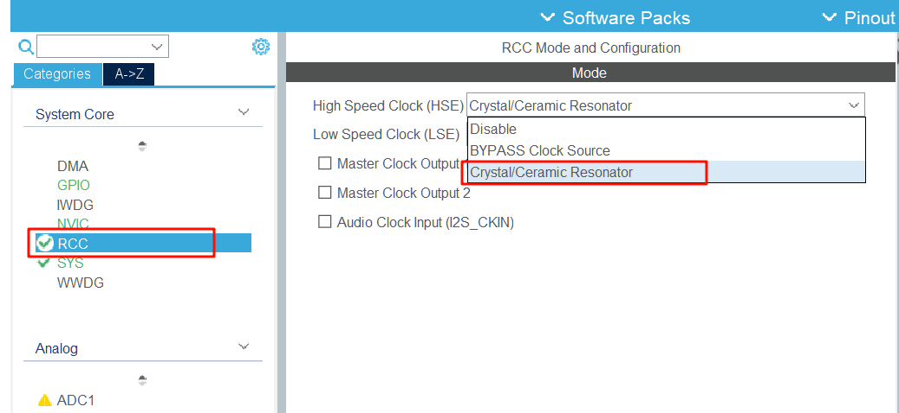
（2）在Middleware and Software packs中，将接口改为CMSIS_V2，其他的不用动

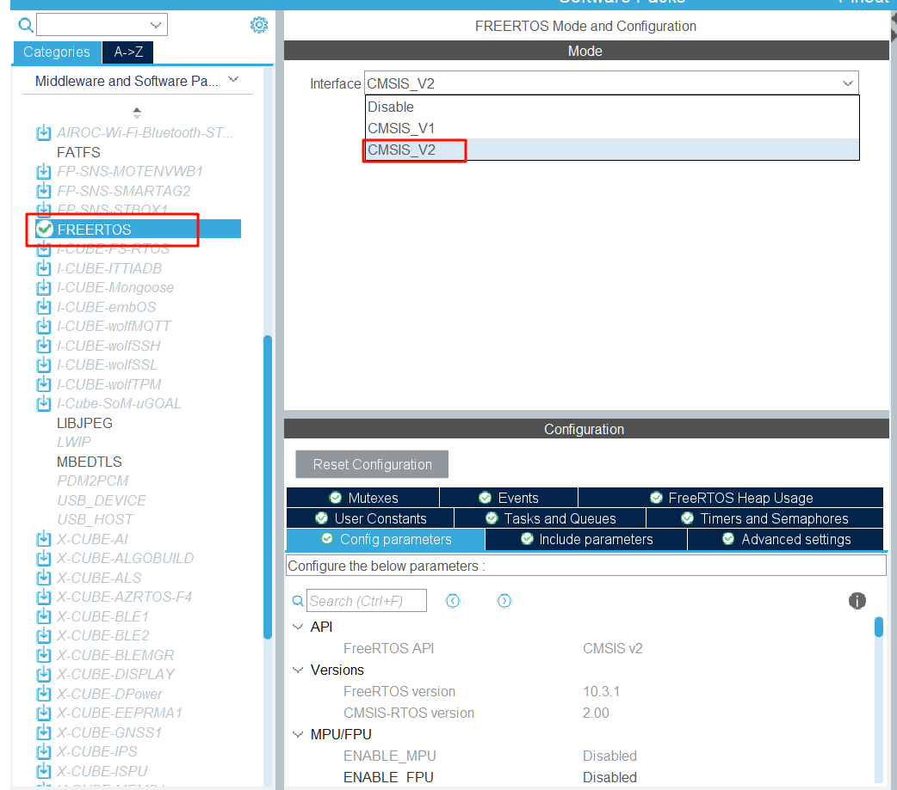

（3）将Sys中的Timebase Source 改为定时器TIM1~TIM14中的任意一个，这里改为**TIM14**。顺带把Debug改一下，改为**Serial Wire**。

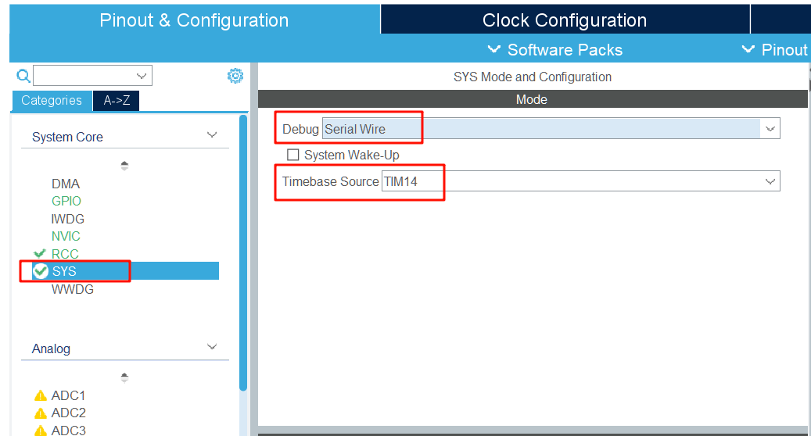

如果不改，在生成代码时会出现下面的提示。

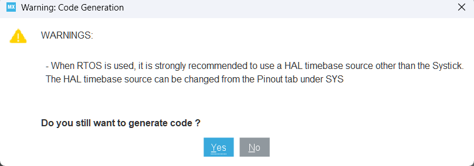

原因是在HAL库驱动中，由于某些外设的驱动需要使用超时判断（比如 I2C、 SPI、 SDIO 等），需要精确延时（精度为 1ms），使用的是 SysTick，但是在操作系统里面，我们需要使用 SysTick 来提供系统时基, 那么就冲突了。

HAL库的时钟源主要用于HAL_Delay()这个函数，这个函数用于实现延时以及上面说的外设驱动的超时判断。这个函数主要是靠不断读取SysTick计数器的值来实现延迟。

但是加入了RTOS之后，RTOS强制将SysTick的中断设置为最低，假设在一个中断优先级比SysTick高的中断int_a中调用HAL_Delay()来进行延时，那么由于int_a中断优先级高于SysTick，从而导致SysTick无法抢占，也就无法增加计数器的值，就会导致int_a中断服务函数死等HAL_Delay()延时，无法退出，从而造成比int_a优先级低的中断服务都无法使用，系统也无法调度。


（4）配置PB2引脚为推挽输出，将User Label命名为LED

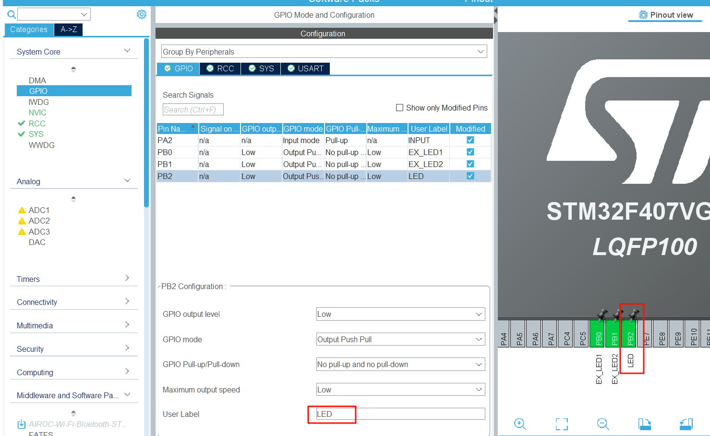


（5）在Clock Configuration页面中，把HSE的频率改为8MHz，PLL Source Mux改为HSE，HLCK改为168，然后按回车键，程序会自动调整其他时钟频率。

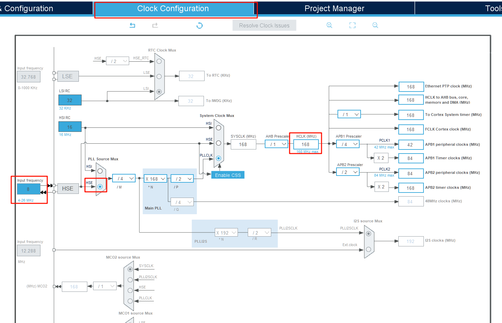
（6）在Project Manager页面中，修改项目名称、IDE改为MDK_ARM，修改堆大小0x1000，栈大小0x2000

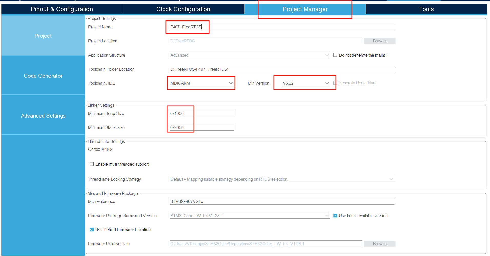


此外，选择左侧的Code Generator，修改下图两个选项。其含义分别是只复制必要的库文件、为每个外设生成对应的.c和.h文件。

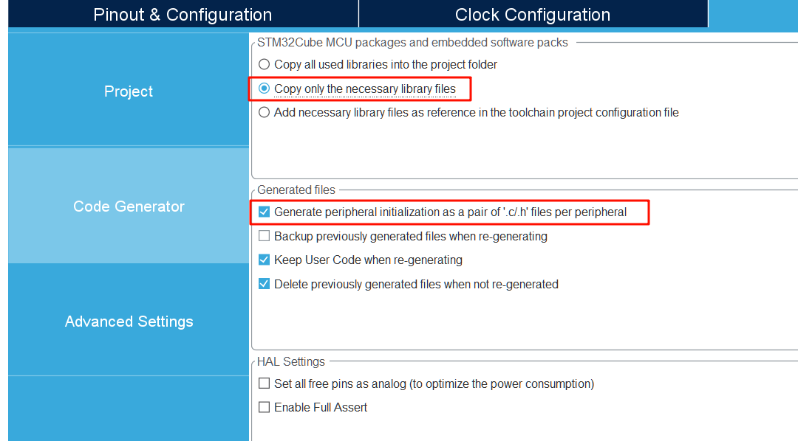

（7）一切就绪，生成代码。完成后打开项目

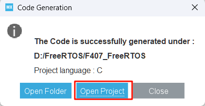


### 1.3 在VSCode-EIDE插件中导入并工程
（1）安装EIDE插件，导入项目，找到MDK_ARM文件夹下的 F407_FreeRTOS.uvprojx文件。将eide配置文件存放在指定位置

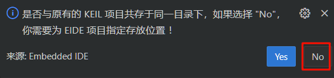

放在MDK_ARM的上一级目录。

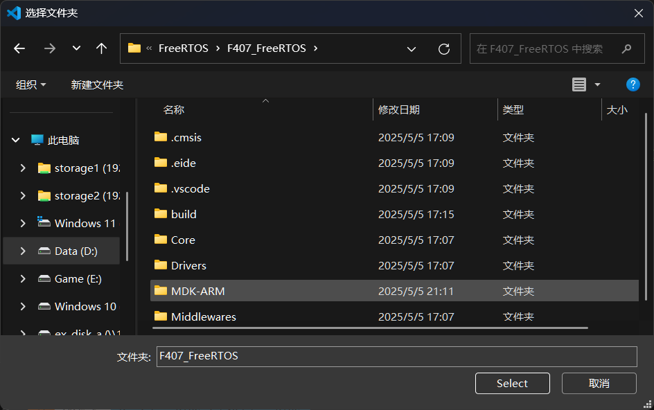

完成后打开新的工作区。

（2）烧录配置这里，我的是JLink，只需要配置一下芯片名称即可，接口类型的SWD。

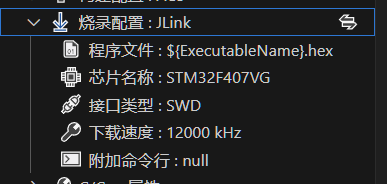


### 1.4 点个灯测试一下
既然都配置到这里了，就把之前配置的板载小灯点亮，来做下载测试。

打开freertos.c文件，这里面是CubeMX自动为我们生成的模板，只要在USER CODE BEGIN xxx与 USER CODE END xxx中间编写的代码，都不会被CubeMX自动覆盖掉。

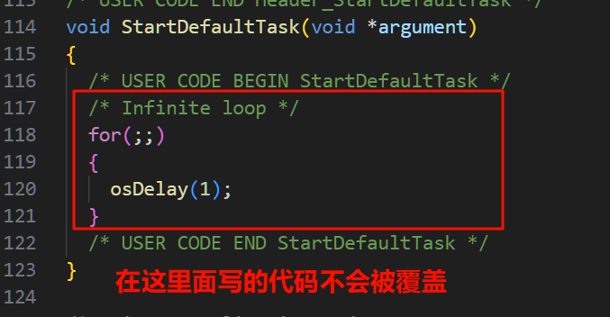

在StartDefaultTask函数内，写入如下代码（注意不要把for死循环删了）：


```c
void StartDefaultTask(void *argument)
{
  /* USER CODE BEGIN StartDefaultTask */
  /* Infinite loop */
  for(;;)
  {
    HAL_GPIO_TogglePin(LED_GPIO_Port, LED_Pin);
    vTaskDelay(500);
  }
  /* USER CODE END StartDefaultTask */
}
```

这段代码很简单，HAL_GPIO_TogglePin是让刚刚配置的LED所接的引脚翻转，即让LED闪烁。其中的每隔vTaskDelay(500)是延时500ms，但这里不是HAL_Delay();这种让整个系统卡住的死等，这函数在后面会说到，目前理解为不会让系统卡死的延时即可。

编译下载，看看效果，LED正常闪烁。