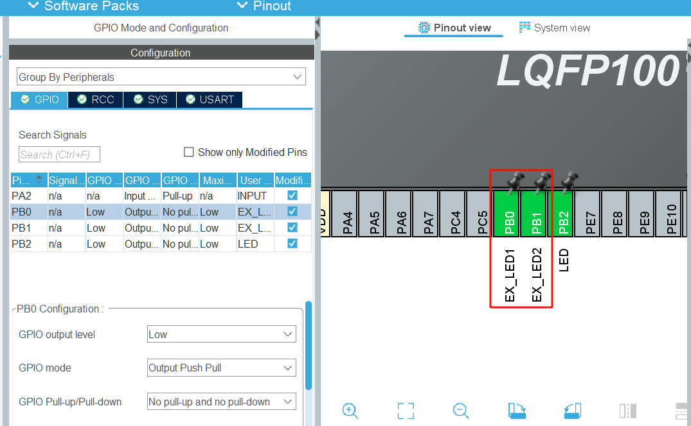

## 2 FreeRTOS任务创建与删除
任务的创建分为动态创建和静态创建两种方式。任务必须是一个死循环，否则任务将通过 LR 返回，如果 LR 指向了非法的内存就会产生 HardFault_Handler，而 FreeRTOS 指向一个死循环，那么任务返回之后就在死循环中执行，这样子的任务是不安全的，所以避免这种情况，任务一般都是死循环并且无返回值的。

当要结束一个任务时，不能使用return，而是要使用vTaskDelete，只执行一次的任务在执行完毕要记得及时删除。

### 2.1 动态创建新任务
#### 2.1.1 xTaskCreate函数解释
```c
BaseType_t xTaskCreate( TaskFunction_t pvTaskCode,
                         const char * const pcName,
                         const configSTACK_DEPTH_TYPE uxStackDepth,
                         void *pvParameters,
                         UBaseType_t uxPriority,
                         TaskHandle_t *pxCreatedTask
                       );

```

::: details
pvTaskCode
指向任务入口函数的指针（即实现任务的函数名称）。 任务通常以无限循环的形式实现；实现任务的函数 绝不能尝试返回或退出。但是，任务可以自行删除。

pcName
任务的描述性名称。此参数主要用于方便调试，但也可用于 获取任务句柄。任务名称的最大长度 由 FreeRTOSConfig.h 中的 configMAX_TASK_NAME_LEN 定义。

uxStackDepth
要分配用作任务堆栈的字数（不是字节数！）。例如，如果堆栈宽度为 16 位，uxStackDepth 为 100，则将分配 200 字节用作任务 堆栈。再举一例，如果堆栈宽度为 32 位，uxStackDepth 为 400， 则将分配 1600 字节用作任务堆栈。堆栈深度与堆栈宽度的乘积不得超过 size_t 类型变量所能包含的最大值。

pvParameters
作为参数传递给所创建任务的值。如果 pvParameters 设置为某变量的地址， 则在创建的任务执行时，该变量必须仍然存在， 因此，不能传递堆栈变量的地址。

uxPriority
创建的任务将以该指定优先级执行。支持 MPU 的系统 可以通过在 uxPriority 中设置 portPRIVILEGE_BIT 位来选择以特权（系统）模式创建任务。 例如，要创建优先级为 2 的特权任务，请将 uxPriority 设置为 ( 2 | portPRIVILEGE_BIT )。应断言优先级 低于 configMAX_PRIORITIES。如果 configASSERT 未定义，则优先级默认上限为 (configMAX_PRIORITIES - 1)。

pxCreatedTask
用于将句柄传递至由 xTaskCreate() 函数创建的任务。pxCreatedTask 是可选参数， 可设置为 NULL。

返回：
如果任务创建成功，则返回 pdPASS，
否则返回 errCOULD_NOT_ALLOCATE_REQUIRED_MEMORY。

:::
#### 2.1.2 动态创建任务实验
在freertos.c文件，/* USER CODE BEGIN Variables */之后定义任务句柄 LED_TaskHandle。

```c
/* Private variables ---------------------------------------------------------*/
/* USER CODE BEGIN Variables */
xTaskHandle LED_TaskHandle;
/* USER CODE END Variables */

```

在freertos.c文件末尾的 /* USER CODE BEGIN Application */之后编写任务函数LED_app。

```c
/* Private application code --------------------------------------------------*/
/* USER CODE BEGIN Application */
void LED_app(void *args)
{
    for (;;) {
        HAL_GPIO_TogglePin(LED_GPIO_Port, LED_Pin);
        vTaskDelay(300);
    }
}
/* USER CODE END Application */
```

在freertos.c文件 /* USER CODE BEGIN FunctionPrototypes */后声明LED_app函数。

```c
/* Private function prototypes -----------------------------------------------*/
/* USER CODE BEGIN FunctionPrototypes */
void LED_app(void *args);
/* USER CODE END FunctionPrototypes */
```

在freertos.c文件中MX_FREERTOS_Init函数内的/* USER CODE BEGIN RTOS_THREADS */之后编写创建任务代码。

```c
    /* USER CODE BEGIN RTOS_THREADS */
    /* add threads, ... */
    xTaskCreate(LED_app, "LED app", 64, NULL, osPriorityNormal1, &LED_TaskHandle);
    /* USER CODE END RTOS_THREADS */
```
这里的osPriorityNormal1是CubeMX生成的宏定义，可以在cmsis_os2.h中看到，其优先级是24+1，**FreeRTOS中的优先级数值越大，代表优先级越高**。Idle（空闲）任务优先级为1。

```c
  osPriorityNone          =  0,        ///< No priority (not initialized).
  osPriorityIdle          =  1,         ///< Reserved for Idle thread.
  osPriorityLow           =  8,         ///< Priority: low
…
  osPriorityBelowNormal7  = 16+7,       ///< Priority: below normal + 7
  osPriorityNormal        = 24,         ///< Priority: normal
  osPriorityNormal1       = 24+1,       ///< Priority: normal + 1
…
```

行了，编译下载看看效果，这里把vTaskDelay的时间调短了，板载LED闪烁速度明显变快。

### 2.2 静态创建新任务
#### 2.2.1 xTaskCreateStatic函数解释
```c
TaskHandle_t xTaskCreateStatic( TaskFunction_t pxTaskCode,
                                 const char * const pcName,
                                 const uint32_t ulStackDepth,
                                 void * const pvParameters,
                                 UBaseType_t uxPriority,
                                 StackType_t * const puxStackBuffer,
                                 StaticTask_t * const pxTaskBuffer );
```

::: details
pxTaskCode
指向任务入口函数的指针（即实现任务的函数名称， 请参阅如下示例）。
任务通常以无限循环的形式实现； 实现任务的函数绝不能尝试返回或退出。但是，任务可以自行删除。

pcName
任务的描述性名称。此参数主要用于方便调试，但也可用于 获取任务句柄。
任务名称的最大长度由 FreeRTOSConfig.h 中的 configMAX_TASK_NAME_LEN 定义。

ulStackDepth
puxStackBuffer 参数用于将 StackType_t 变量的数组传递至 xTaskCreateStatic()。ulStackDepth 必须设置为数组中的索引数。

pvParameters
作为参数传递给所创建任务的值。如果 pvParameters 设置为某变量的地址，则在创建的任务执行时，该变量必须仍然存在， 因此，不能传递堆栈变量的地址。

uxPriority
创建的任务将以该指定优先级执行。

puxStackBuffer
必须指向至少包含 ulStackDepth 个索引的 StackType_t 数组（见上述 ulStackDepth 参数）， 该数组将用作任务堆栈，因此必须持久存在 （不能在函数的堆栈上声明）。

pxTaskBuffer
必须指向 StaticTask_t 类型的变量。该变量将用于保存新任务的数据 结构体 (TCB)，因此必须持久存在（不能在函数的堆栈上声明）。

返回：
如果 puxStackBuffer 和 pxTaskBuffer 均不为 NULL，则创建任务，并返回任务的句柄。
如果 puxStackBuffer 或 pxTaskBuffer 为 NULL，则不会创建任务， 并返回 NULL。
:::


#### 2.2.2 静态创建任务实验
在freertos.c中 /* USER CODE BEGIN PD */，定义栈大小

```c
/* Private define ------------------------------------------------------------*/
/* USER CODE BEGIN PD */
#define STACK_SIZE 128
/* USER CODE END PD */
```

注释掉LED_TaskHandle这个句柄，变量中新定义一个指向保存任务数据的结构体一个数组LED_TaskStack作为栈空间。

```c
/* Private variables ---------------------------------------------------------*/
/* USER CODE BEGIN Variables */
// xTaskHandle LED_TaskHandle;
StaticTask_t  LED_TaskBuffer;
StackType_t LED_TaskStack[ STACK_SIZE ];
/* USER CODE END Variables */
```

可以将上面动态创建任务实验的代码xTaskCreate部分注释掉。新增使用xTaskCreateStatic创建任务的函数。

```c
    /* USER CODE BEGIN RTOS_THREADS */
    /* add threads, ... */
    // xTaskCreate(LED_app, "LED app", 64, NULL, osPriorityNormal1, &LED_TaskHandle);
    xTaskCreateStatic(LED_app, "LED app Static", STACK_SIZE, NULL, osPriorityNormal1, LED_TaskStack, &LED_TaskBuffer);
    /* USER CODE END RTOS_THREADS */
```

### 2.3 删除任务
#### 2.3.1 vTaskDelete 函数解释
```c
void vTaskDelete( TaskHandle_t xTask );

```

::: details
参数：
xTask
要删除的任务的句柄。如果传递 NULL，会删除调用任务。
:::

#### 2.3.2 删除任务实验
（1）由于天空星开发板上只有一个板载LED，手头其他的开发板上有2个LED的，因此需要再在天空星开发板上配两个推挽输出的GPIO去驱动外置LED。

在CubeMX中启用两个GPIO，我这里设置的是PB0和PB1，配置成推挽输出模式，UserLabel分别设置为EX_LED1和EX_LED2。完成之后生成代码。




（2）在USER CODE BEGIN Variables代码块下新增两个变量，用于存放任务句柄。

```c
TaskHandle_t ex_LED1_TaskHandle = NULL;
TaskHandle_t ex_LED2_TaskHandle = NULL;

```

（3）在USER CODE BEGIN Application代码块下新增两个函数，用于驱动外部LED的闪烁任务。

```c
void Externel_LED1_app(void *args)
{
    for (;;) {
        HAL_GPIO_TogglePin(EX_LED1_GPIO_Port, EX_LED1_Pin);
        osDelay(200);
    }
}

void Externel_LED2_app(void *args)
{
    static uint8_t cnt;
    for (;;) {
        if (cnt < 5) {
            cnt++;
        }
        if (cnt == 5 && ex_LED1_TaskHandle != NULL) {
            vTaskDelete(ex_LED1_TaskHandle);
            ex_LED1_TaskHandle = NULL;
        }
        HAL_GPIO_TogglePin(EX_LED2_GPIO_Port, EX_LED2_Pin);
        osDelay(400);
    }
}
```

在Externel_LED2_app函数中，我设定了一个计数变量cnt，当cnt等于5且外部LED1闪烁任务句柄不为NULL时，去删除外部LED1闪烁的任务，并置句柄为NULL，防止再次删除一个不存在的任务而导致系统宕机。

（4）在USER CODE BEGIN RTOS_THREADS 中，调用创建动态任务的函数xTaskCreate，并传入相应参数。

```c
xTaskCreate(LED_app, "LED app", 64, NULL, osPriorityNormal1, &LED_TaskHandle);
xTaskCreate(Externel_LED1_app, "externel LED1 app", 64, NULL, osPriorityNormal1, &ex_LED1_TaskHandle);
xTaskCreate(Externel_LED2_app, "externel LED2 app", 64, NULL, osPriorityNormal1, &ex_LED2_TaskHandle);
```

（5）在USER CODE BEGIN FunctionPrototypes 中声明函数。

```c
void LED_app(void *args);
void Externel_LED1_app(void *args);
void Externel_LED2_app(void *args);
```

（6）编译下载，外部LED1在经过了两秒后熄灭，而外部LED2和板载LED正常闪烁。


#### 2.3.3 删除当前任务实验
从2.3.1节的函数解释得知，vTaskDelete的参数如果为NULL，则会删除当前任务。

把2.3.2节写在USER CODE BEGIN RTOS_THREADS 代码块里的内容删掉，转而放在自动生成的默认任务 StartDefaultTask里面。在循环体的最后调用vTaskDelete(NULL); 如下所示。

```c
void StartDefaultTask(void *argument)
{
    /* USER CODE BEGIN StartDefaultTask */
    /* Infinite loop */
    for (;;) {
        xTaskCreate(LED_app, "LED app", 64, NULL, osPriorityNormal1, &LED_TaskHandle);
        xTaskCreate(Externel_LED1_app, "externel LED1 app", 64, NULL, osPriorityNormal1, &ex_LED1_TaskHandle);
        xTaskCreate(Externel_LED2_app, "externel LED2 app", 64, NULL, osPriorityNormal1, &ex_LED2_TaskHandle);
        vTaskDelete(NULL);
    }
    /* USER CODE END StartDefaultTask */
}
```

这样就实现了调用默认任务去创建所有的任务，然后删除默认任务的操作。
