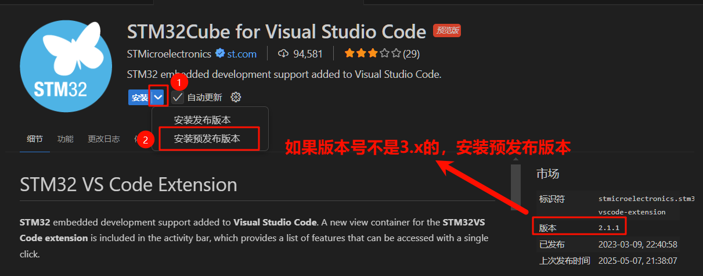
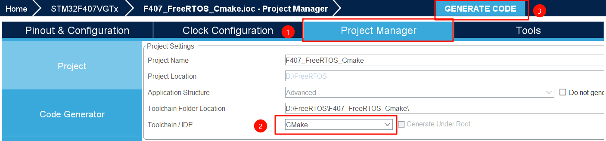
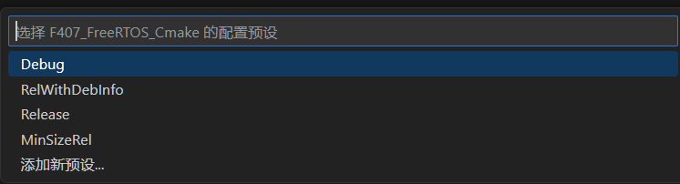
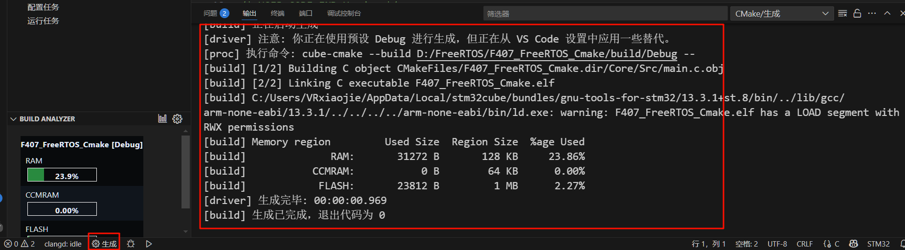
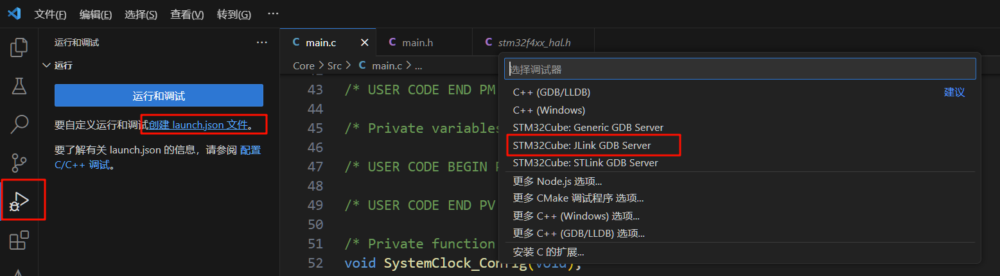
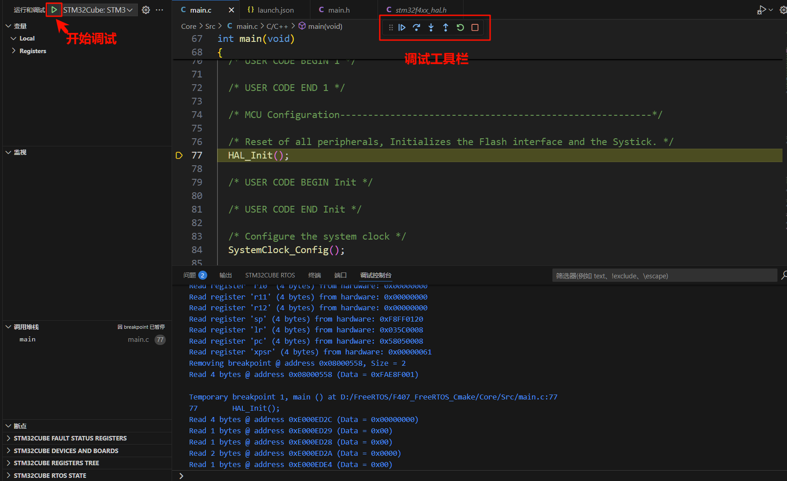
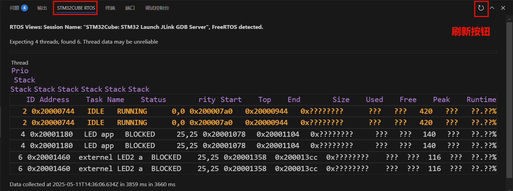
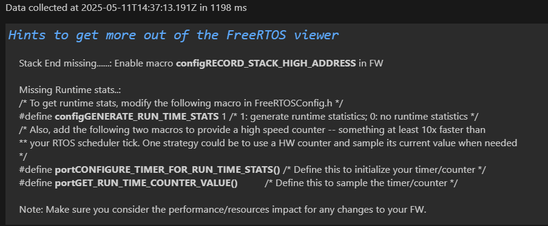
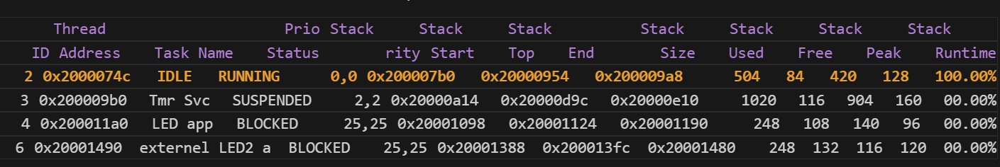

## 附1 使用STM32Cube for VSCode插件开发（3.x版本）
### 1.1 安装插件
正文中是用VSCode-EIDE插件+Keil5开发的，使用VSCode-EIDE插件编译下载、Keil5调试。但这样来回切换非常麻烦，而且EIDE存在不能及时更新项目内容的bug。

恰好在写这篇文档时，ST公司发布了STM32Cube for VSCode插件V3.x新版本，3.x相比于2.x提升巨大，不再需要STM32 Cube CLT，也无需其他插件，将VSCode当作了STM32专用的IDE来看待。

在VSCode插件市场搜索STM32Cube for Visual Studio Code，看右侧版本号如果不是3.x版本的，则需要安装预发布版本。



它会自动安装其他的依赖项，需要下载1GB+的文件，需预留充足的C盘空间。


### 1.2 导入并编译项目
启动STM32CubeMX，选择Project Manager，将Toolchain/IDE改为CMake，然后生成代码。



回到VSCode，在文件—打开文件夹，打开项目文件夹并选择文件夹。STM32Cube插件会自动导入CMake项目，并询问要用哪个预设，这里我选择了Debug。



添加完后，在左下角点击生成，进行编译，如果没有问题，则会生成.elf文件，并显示RAM、ROM占用情况。




### 1.3 调试项目
点击VSCode的左侧栏“任务与调试”，新建launch.json文件，我使用的是J-Link，所以点击悬浮框的**STM32Cube: JLink GDB Server**。



创建完Launch.json后，直接保存即可，不用过多配置。

点击三角形开始调试，等待片刻程序会自动编译、下载，进入调试后的界面如下所示。



这里的调试功能很多与Keil5的类似。下面着重讲一下使用STM32 Cube RTOS插件，观察RTOS中的任务相关信息。


### 1.4 RTOS视图
首先需要开始调试，并将程序继续运行下去，直到初始化RTOS结束后，可以暂停程序。之后在底部面板区域，切换到STM32CUBE RTOS选项卡，点击刷新按钮，显示如下。



能发现这里的栈显示是有问题的，内存使用量以及CPU时间都是问号。查看底下的提示文本，得知需要在**FreeRTOSConfig.h**定义一些宏。



打开./Core/Inc/FreeRTOSConfig.h，在靠近末尾的位置有让我们自己进行宏定义的地方，输入以下代码：

```c
#define configRECORD_STACK_HIGH_ADDRESS 1
#define configGENERATE_RUN_TIME_STATS   1
#define portCONFIGURE_TIMER_FOR_RUN_TIME_STATS()
#define portGET_RUN_TIME_COUNTER_VALUE() xTaskGetTickCount() /* 获取系统tick */
```

保存并再次编译项目，进行调试，查看RTOS面板，能看到数据都正常显示了。这样就能更好地查看任务栈大小够不够、任务运行状态、CPU运行时间等数据。


