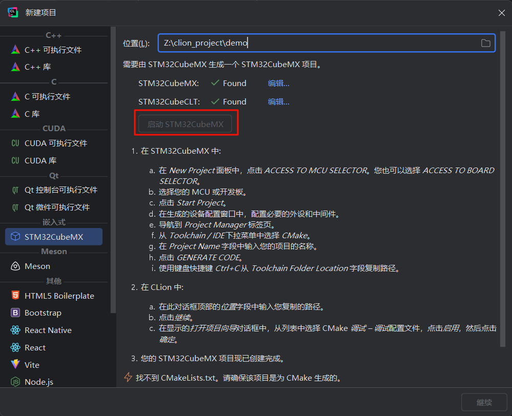
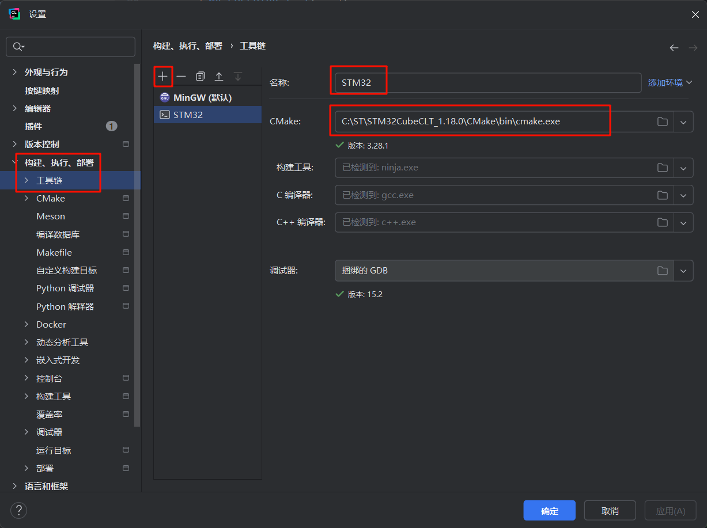
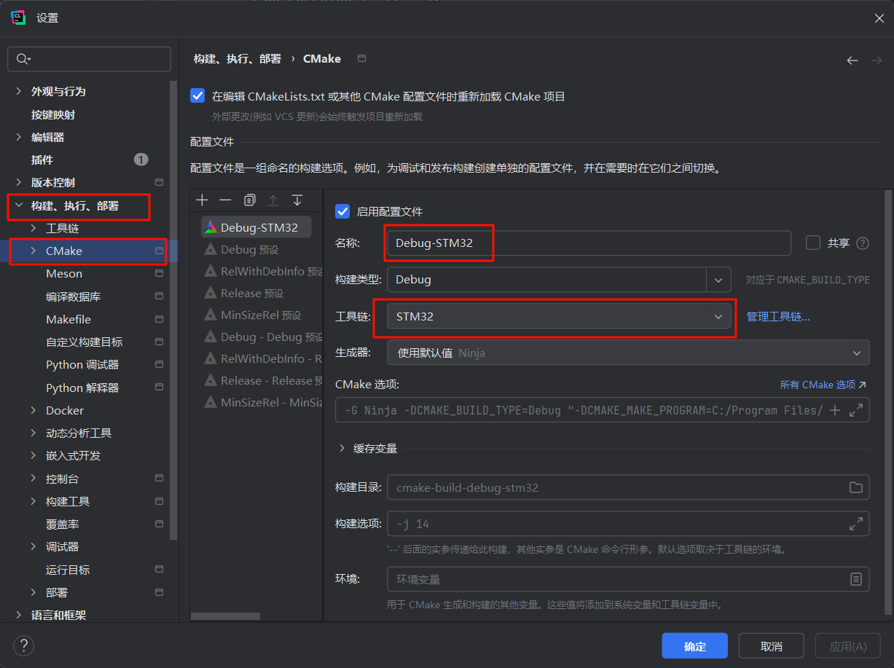
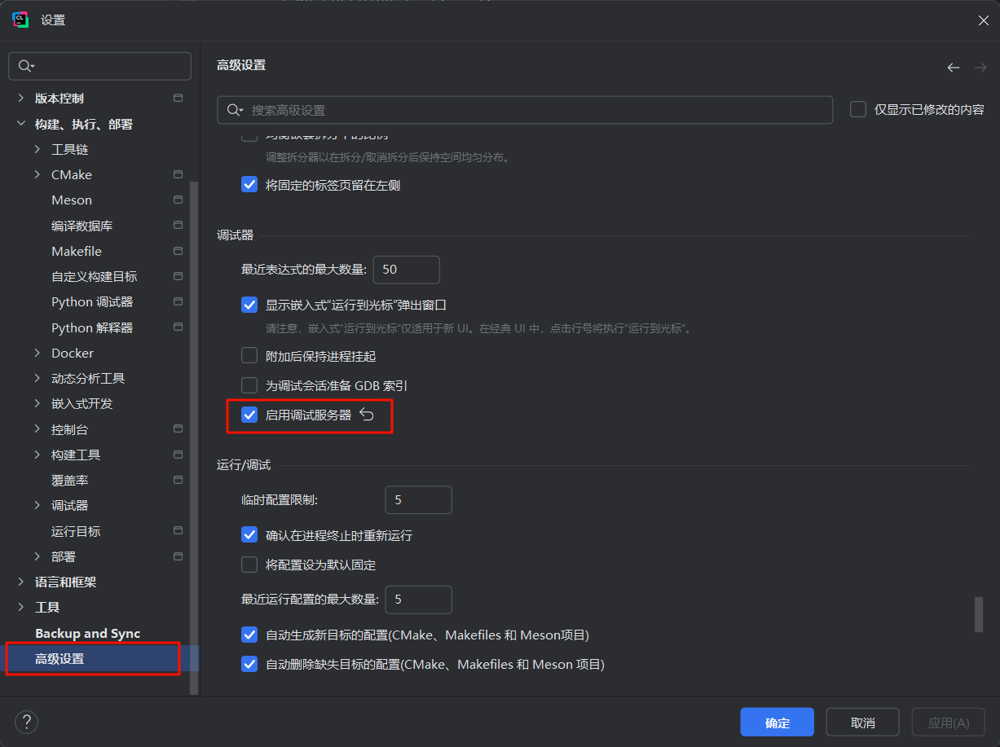
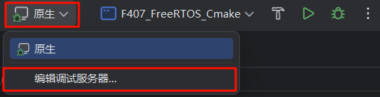
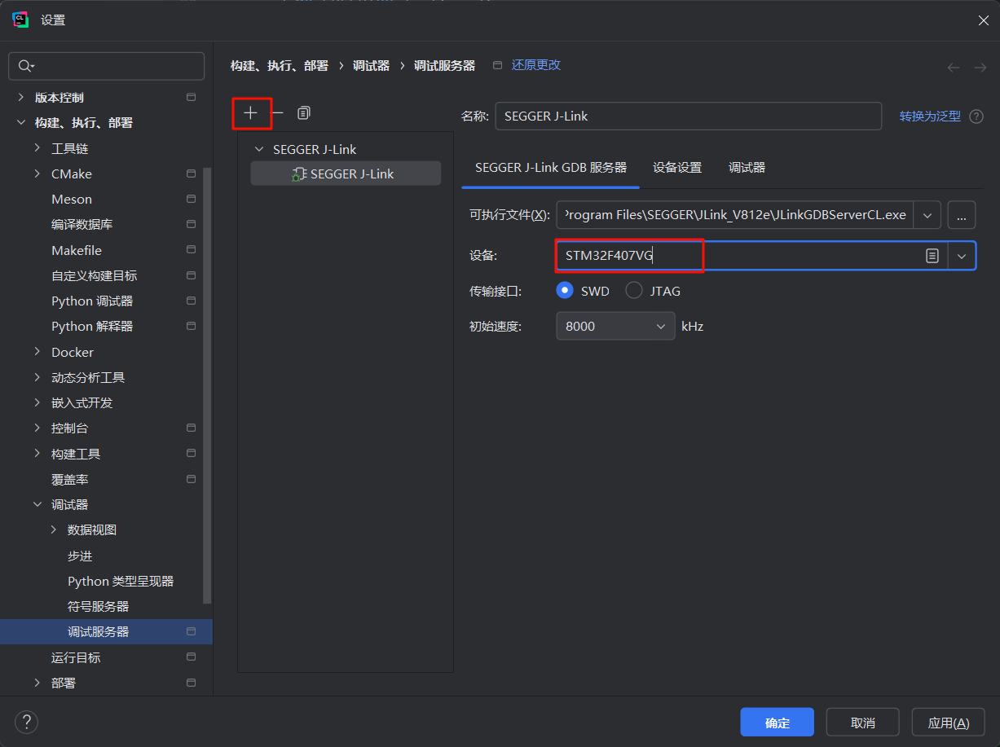
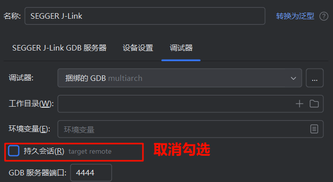
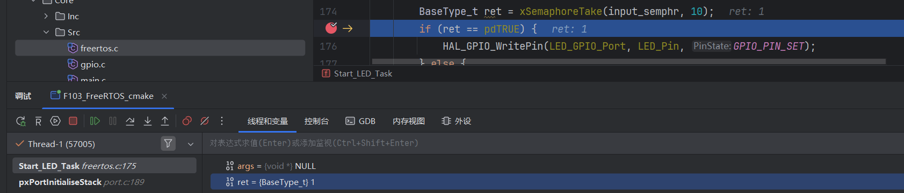
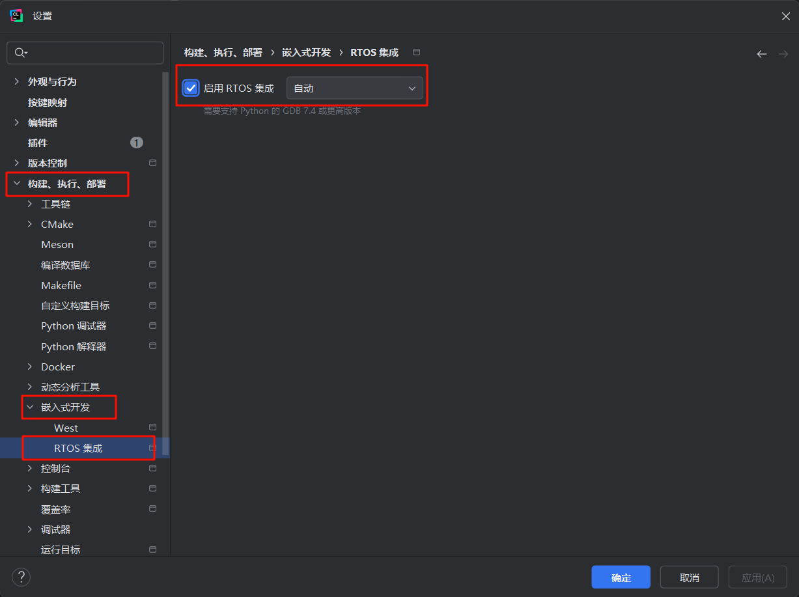
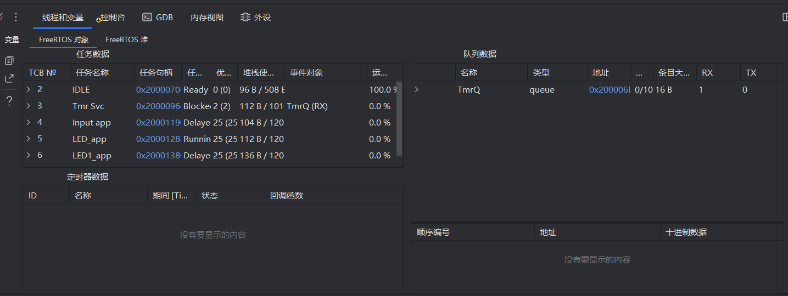

## 附2 使用CLion开发STM32程序
2025年5月8日，CLion官宣将对非商业用途免费，这意味着个人开发者可以免费使用CLion了。先前出过使用VSCode+插件开发的教程，其实对于我们正常的嵌入式开发来讲，CLion和VSCode二选一即可，喜欢哪个就用哪个。

### 1.1 安装STM32CubeCLT
STM32CubeCLT是STM推出的官方编译工具集，它集成了CMake、ARM-GCC、Ninja、OpenOCD，方便我们使用。在 网页进行下载安装即可。注意，下载时会要求登录ST账号，如果没有则需要先注册一个。

### 1.2 安装CLion
前去jetbrains官网下载Windows版的CLion，  ，下载完成后双击安装即可，建议安装在默认目录。

等待安装完成后，无需重新启动。

### 1.3 配置CLion
打开上一步安装好的CLion，请注意第一次启动需要配置一些语言等相关操作，并且非商业使用的话需要登录Jetbrains账户。

如果你之前没有用STM32CubeMX创建过项目，请在进到主界面后新建一个项目，存储位置自己选择，然后点击启动STM32CubeMX。在CubeMX中选择芯片型号，配置相关引脚，并在Project Manager选项卡中将IDE/Tollchain改为CMake，生成代码即可。

由于我这里正好有附1章节的CMake工程，所以我直接用CLion打开存放该项目的文件夹。打开项目时会有打开项目向导，提示我们选择工具链和CMake配置。如果不小心关掉了，可以在文件—设置—构建、执行、部署 中找到。

（1）新建工具链，命名为STM32，CMake路径选择安装CubeCLT文件夹下的Cmake/bin/cmake.exe，然后CLion会自动寻找构建工具和编译器。

（2）新建Cmake配置文件，命名为Debug-STM32，工具链选择刚刚创建的STM32。

（3）启用调试服务器。要为嵌入式项目做开发调试，需要启用调试服务器，以便使用J-Link或者STLink调试下载。在设置—高级设置--勾选“启用调试服务器”--确定。

回到编辑页面，在上方菜单栏多出一个“原生”，点击它，并编辑调试服务器。

新增一个J-Link GDB 服务器，设备选择STM32F407VG。

在调试器分页下，取消勾选持久会话，避免下载后不自动复位。

### 1.4 编译并调试项目
将开发板接入J-Link，J-Link连接电脑，点击调试按钮。在某行代码上打一个断点，测试一下变量查看、单步执行等操作，如果没啥问题，说明配置完成，可以进行正常开发。

### 1.5 RTOS视图
与在VSCode里面观察类似，CLion自带RTOS集成，需要在设置—构建、执行、部署—RTOS集成中勾选“启用RTOS集成”。

再次启动调试，在线程和变量选项卡下就多出来了FreeRTOS对象和堆的选项卡，在这里能方便地查看哪些任务在运行，占用了多少的RAM，其运行状态是什么等信息。

