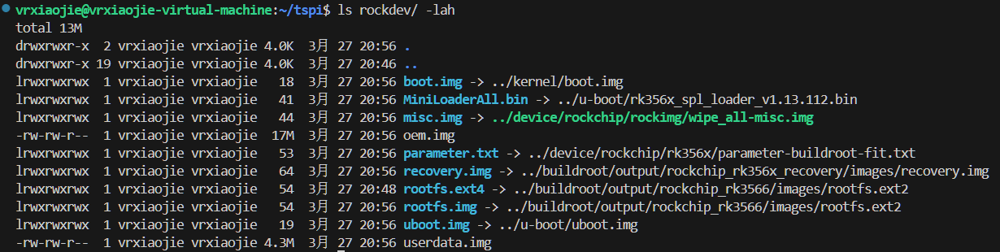

# 编译Ubuntu22.04笔记

## 0 系统环境
运行在VMWare 虚拟机内的Ubuntu 22.04 LTS 

R7 5800H 3.2GHz 

8核16GB内存

150GB磁盘空间

## 1 编译前准备 
本教程是在立创开发板官方百度网盘下载泰山派SDK并同步过repo的基础上进行的，若还未下载泰山派SDK，请移步教程https://wiki.lckfb.com/zh-hans/tspi-rk3566/project-case/fat-little-cell-phone/sdk-compile.html#linux-sdk 

泰山派SDK存放位置为 ~/tspi/ 

### 1.1	下载并解压Rockchip Ubuntu SDK
前去https://github.com/Joshua-Riek/linux-rockchip/tree/jammy ，下载linux-rockchubuntu 5.10.0 -1012.12 

下载完成后，解压
```shell
unzip jammy.zip 
```

将tspi目录下原来的kernel重命名为kernel_old。  
```shell
mv ./tspi/kernel ./tspi/kernel_old
```


将解压出的文件夹移动到泰山派SDK目录下，并重命名为kernel
```shell
mv linux-rockchip-jammy/ tspi/kernel 
```

### 1.2 复制泰山派设备树文件
将之前的kernel_old 下的tspi开头的设备树文件复制到新的kernel下

```shell
cp ~/tspi/kernel_old/arch/arm64/boot/dts/rockchip/tspi* ~/tspi/kernel/arch/arm64/boot/dts/rockchip
```

```shell
cd ~/tspi/kernel/arch/arm64/boot/dts/rockchip
```


编辑Makefile，
```shell
vim ~/tspi/kernel/arch/arm64/boot/dts/rockchip/Makefile
```

新增一行：
```Makefile
dtb-$(CONFIG_ARCH_ROCKCHIP) += tspi-rk3566-user-v10-linux.dtb
```
并保存退出

### 1.3 修改menuconfig
#### 1.3.1 触摸屏
进入kernel目录
```shell
cd kernel
make ARCH=arm64 menuconfig
```

找到
```text
Device Drivers 
  -> Input device support 
    -> Generic input layer (needed for keyboard, mouse, ...) (INPUT [=y]) 
      -> Touchscreens (INPUT_TOUCHSCREEN [=y])  
```

按Y键使能触摸屏

 

#### 1.3.2 WIFI
参考 https://blog.csdn.net/qq_65198598/article/details/145430241

搜索 **AP6**，按下1进入对应配置页面

 
修改固件以及NVRAM路径，这里是指Ubuntu系统内的路径，后文会说如何将固件复制进去。
Firmware path和NVRAM path分别修改为
```text
/lib/firmware/fw_bcm43438a1.bin
/lib/firmware/nvram_ap6212a.txt
 ```


#### 1.3.3 GPU
（1）将`Device Drivers > Graphics support > Direct Rendering Manager (XFree86 4.1.0 and higher DRI support)下的Ignore drm ioctl permission `标记为 **N**


（2）将`Device Drivers > Graphics support > Search (Panfros) > Graphics support下的Panfrost (DRM support for ARM Mali Midgard/Bifrost GPUs)` 标记为 **Y**


 

（3）打开`~/tspi/kernel/arch/arm64/boot/dts/rockchip/tspi-rk3566-core-v10.dtsi `
将cursor-win-id = <ROCKCHIP_VOP2_CLUSTER0>;  这一行**注释掉**。
 

（4）在GPU图像处理下新增两行：
```text
clock-names = "gpu", "bus";
interrupt-names = "gpu", "mmu", "job";
```


#### 1.3.4 保存退出
完成后保存
 


退出后输入
```shell
make ARCH=arm64 savedefconfig
mv defconfig arch/arm64/configs/rockchip_linux_defconfig
```


### 1.4 复制触摸驱动
将屏幕卖家给的屏幕驱动`GT911_Config_08121A1_V90.cfg` 复制到`~/tspi/kernel/drivers/input/touchscreen/gt9xx/` 目录下

并在`gt9xx_cfg.h`中修改`gtp_dat_9_7`数组内容为
```c
#include "GT911_Config_08121A1_V90.cfg"
```


### 1.5 安装GCC交叉编译工具
前往https://developer.arm.com/downloads/-/gnu-a/10-2-2020-11
下载`gcc-arm-10.2-2020.11-x86_64-aarch64-none-linux-gnu.tar.xz`

 
并将其解压至 ~/ 目录下
```shell
tar -xvf gcc-arm-10.2-2020.11-x86_64-aarch64-none-linux-gnu.tar.xz
```

 

### 1.6 配置环境变量
编辑 ~/.bashrc

```shell
vim ~/.bashrc
```

在文件最后新增三行
```shell
export ARCH=arm64
export CROSS_COMPILE=aarch64-none-linux-gnu-
export PATH=$PATH:/home/vrxiaojie/gcc-arm-10.2-2020.11-x86_64-aarch64-none-linux-gnu/bin
```

然后保存退出文件，使环境变量生效。
```shell
source ~/.bashrc
```

可以使用
```shell
aarch64-none-linux-gnu-gcc -v 
```
查看是否能正确找到gcc编译器，若出现下图所示则为成功

 
## 2 编译系统
### 2.1 编译SDK并打包固件
在~/tspi目录下执行全量编译

```shell
./build.sh all
```

若为首次编译，按我的笔记本电脑配置需要约3小时。后续全量编译只需要十几分钟，若只是单独编译kernel等内容，则只需几分钟。
 

在rockdev目录下生成.img镜像文件
```shell
./mkfirmware.sh 
```
 

其中的rootfs相关文件需要被替换成RK版Ubuntu镜像文件，在后文会讲到。
 

### 2.2 下载Ubuntu Base
前往源站 https://cdimage.ubuntu.com/ubuntu-base/releases/jammy/release/ 或前往镜像站https://mirrors.aliyun.com/ubuntu-cdimage/ubuntu-base/releases/22.04/release/ （速度较快）下载ubuntu-base-22.04.5-base-arm64.tar.gz
 

在 ~/ 下新建一个ubuntu文件夹，并将压缩包解压至此
```shell
mkdir ~/ubuntu_rootfs
tar -xzvf ubuntu-base-22.04.5-base-arm64.tar.gz -C ~/ubuntu_rootfs/
```

### 2.3 将WIFI固件复制进Ubuntu
为了使上面配置menuconfig的WIFI模块生效
```shell
sudo cp ~/tspi/external/rkwifibt/firmware/broadcom/AP6212A1/wifi/nvram_ap6212a.txt ~/ubuntu_rootfs/lib/firmware
sudo cp ~/tspi/external/rkwifibt/firmware/broadcom/AP6212A1/wifi/fw_bcm43438a1.bin ~/ubuntu_rootfs/lib/firmware
```
### 2.4 安装模块至rootfs中
在 `~/tspi/kernel`目录下编译模块
```shell
make modules
```
 

接着安装模块至ubuntu rootfs
```shell
make ARCH=arm64 modules_install INSTALL_MOD_PATH=../../ubuntu_rootfs
```

 
用`ls`命令能看到`ubuntu_rootfs/lib/modules`目录下多出了一个带数字的文件夹`5.10.209`，文件夹内包含了刚安装的模块

 

### 2.5 配置并挂载Ubuntu
以下内容参考 https://www.jlc-bbs.com/platform/a/310346

（1）在当前编译环境中安装仿真开发环境，
```shell
sudo apt install qemu-user-static
```

（2）将当前编译环境中的仿真开发环境复制到目标系统文件夹
```shell
sudo cp /usr/bin/qemu-aarch64-static ubuntu_rootfs/usr/bin/
```

（3）将当前编译环境中的网络配置文件复制到目标系统文件夹
```shell
sudo cp /etc/resolv.conf  ubuntu_rootfs/etc/
```


（4）修改目标系统中的软件源配置文件
```shell
sudo vim ubuntu_rootfs/etc/apt/sources.list
```
将该文件原先的内容删掉，替换为以下内容：
```shell
deb http://mirrors.aliyun.com/ubuntu-ports/ jammy main restricted universe multiverse
deb-src http://mirrors.aliyun.com/ubuntu-ports/ jammy main restricted universe multiverse

deb http://mirrors.aliyun.com/ubuntu-ports/ jammy-security main restricted universe multiverse
deb-src http://mirrors.aliyun.com/ubuntu-ports/ jammy-security main restricted universe multiverse

deb http://mirrors.aliyun.com/ubuntu-ports/ jammy-updates main restricted universe multiverse
deb-src http://mirrors.aliyun.com/ubuntu-ports/ jammy-updates main restricted universe multiverse

# deb http://mirrors.aliyun.com/ubuntu-ports/ jammy-proposed main restricted universe multiverse
# deb-src http://mirrors.aliyun.com/ubuntu-ports/ jammy-proposed main restricted universe multiverse

deb http://mirrors.aliyun.com/ubuntu-ports/ jammy-backports main restricted universe multiverse
deb-src http://mirrors.aliyun.com/ubuntu-ports/ jammy-backports main restricted universe multiverse
```

（5）编写挂载脚本
```shell
sudo vim mount.sh
```


加入以下内容：
```sh
#!/bin/bash
function mnt() {
    echo "MOUNTING"
    sudo mount -t proc /proc ${2}proc
    sudo mount -t sysfs /sys ${2}sys
    sudo mount -o bind /dev ${2}dev
    #sudo mount -t devpts -o gid=5,mode=620 devpts ${2}dev/pts
    sudo mount -o bind /dev/pts ${2}dev/pts
    sudo chroot ${2}
}
function umnt() {
    echo "UNMOUNTING"
    sudo umount ${2}proc
    sudo umount ${2}sys
    sudo umount ${2}dev/pts
    sudo umount ${2}dev
}
if [ "$1" == "-m" ] && [ -n "$2" ];
then
        mnt $1 $2
elif [ "$1" == "-u" ] && [ -n "$2" ];
then
        umnt $1 $2
else
        echo ""
        echo "Either 1'st, 2'nd or both parameters were missing"
        echo ""
        echo "1'st parameter can be one of these: -m(mount) OR -u(umount)"
        echo "2'nd parameter is the full path of rootfs directory(with tralling '/')"
        echo ""
        echo "For example: ch-mount -m /media/sdcard"
        echo ""
        echo 1st parameter : ${1}
        echo 2nd parameter : $[2]
fi
```
（6）添加脚本执行权限
```shell
sudo chmod +x mount.sh
```

（7）挂载根文件系统
```shell
./mount.sh -m ubuntu_rootfs/
```
注意: 当完成根文件系统挂载后，后续命令将在根文件系统中执行，直至根文件系统被卸载（后文会提及如何卸载）

### 2.6 在根文件系统中安装必要的软件
（1）更新安装软件包列表
```shell
apt update
```

若在使用该命令时遇到问题：

 

其原因是/tmp文件夹的权限错误，只需使用chmod为/tmp赋777权限
```shell
chmod 777 /tmp
apt clean
apt update
```

（2）更新和升级软件包
```shell
apt upgrade
```

（3）在目标系统中安装必要的软件
```shell
apt install -y sudo vim udev net-tools ethtool udhcpc netplan.io language-pack-en-base iputils-ping openssh-sftp-server  ntp usbutils alsa-utils libmtp9 language-pack-zh-han* bluetooth* bluez* blueman* wireless-tools network-manager dialog chromium-browser
```
安装过程中会提示配置地区和时区，输入`6` 选择Asia

 
接着输入`70`选择Shanghai
 


（4）为了实现屏幕显示，安装桌面环境 ubuntu-desktop
注意，此过程相当耗时，如有提示缺少依赖，可用apt单独安装依赖后，继续安装桌面环境。
```shell
apt install ubuntu-desktop -y
```
中途会让选择键盘布局，这里输入`19`，选择Chinese

 
继续选择中文键盘布局 `1`
 

（5）卸载办公套件并清除相关配置文件
```shell
apt-get remove --purge libreoffice* -y
```

（6）清理无用的软件
```shell
sudo apt autoremove
```

（7）清理apt
```shell
sudo apt clean
```

### 2.7 添加用户及启动配置
（1）在目标系统中添加用户
```shell
adduser vrxiaojie
```

（2）为用户添加管理员权限
```shell
adduser vrxiaojie sudo
```

（3）修改root用户密码
```shell
passwd root
```

### 2.8 修改开机等待网络延迟时间
默认情况下，系统启动过程中会出现“A start job is running for wait for network to be Configured”的提示信息，然后开始倒计时5分钟，需要等待倒计时结束后才能继续启动系统，通过修改配置文件，将倒计时时间缩短到5秒或关闭倒计时。
```shell
vim  /etc/systemd/system/network-online.target.wants/systemd-networkd-wait-online.service
```

修改的配置文件内容：
```text
ExecStart=/usr/bin/nm-online -s -q --timeout=0
```

### 2.9 添加分区释放的系统服务（重要）
默认情况下，rootfs分区烧录后，只有固件本身大小。通过添加系统服务，实现分区释放。
（1）修改配置文件
```shell
vim /etc/init.d/resize2fs.sh
```

修改的配置文件内容：
```sh
#!/bin/bash -e 
# resize filesystem mmcblk0p6
if [ ! -e "/usr/local/boot_flag" ] ;
then
  echo "Resizing /dev/mmcblk0p6..."
  resize2fs /dev/mmcblk0p6
  touch /usr/local/boot_flag
fi
```

（2）添加配置文件执行权限
```shell
chmod +x /etc/init.d/resize2fs.sh
```

（3）创建执行上述脚本的系统服务
```shell
vim lib/systemd/system/resize2fs.service
```
添加内容：
```text
#start
[Unit]
Description=Setup rockchip platform environment
Before=lightdm.service
After=resize-helper.service
[Service]
Type=simple
ExecStart=/etc/init.d/resize2fs.sh
[Install]
WantedBy=multi-user.target
#end
```
### 2.10 退出并卸载根文件系统
（1）退出根文件系统
```shell
exit
```

（2）卸载根文件系统
```shell
sudo ./mount.sh -u ubuntu_rootfs/
```

## 3 制作rootfs.img并烧录
### 3.1 制作文件系统rootfs分区
（1）创建空镜像文件
```shell
sudo dd if=/dev/zero of=ubuntu_rootfs.img bs=1M count=8192
```

::: warning 备注
镜像文件的大小需要大于上述根文件系统所在文件夹ubuntu_rootfs的整体大小，可以通过du命令查看ubuntu_rootfs文件夹的大小，然后通过设置count项的值，配置合适的镜像文件大小。
:::

（2）将创建的镜像文件格式化为.ext4文件系统
```shell
sudo mkfs.ext4 ubuntu_rootfs.img
```

（3）新建一个文件夹，用于挂载
```shell
sudo mkdir ubuntu_base_rootfs
```

（4）为上述文件夹添加权限
```shell
sudo chmod 777 ubuntu_base_rootfs
```

（5）将创建的空白镜像文件挂载到上述文件夹
```shell
sudo mount ubuntu_rootfs.img ubuntu_base_rootfs
```

（6）将之前根文件系统所在文件夹内容全部复制到新建的空文件夹
```shell
sudo cp -rfp ubuntu_rootfs/* ubuntu_base_rootfs/
```

（7）卸载镜像文件
```shell
sudo umount ubuntu_base_rootfs/
```

（8）修复及检测镜像文件系统
```shell
sudo e2fsck -p -f ubuntu_rootfs.img
```

（9）压缩镜像文件的大小
```shell
sudo resize2fs -M ubuntu_rootfs.img
```

（10）查看镜像文件的大小
```shell
sudo du -sh ubuntu_rootfs.img
```

（11）删除原rockdev下的rootfs.ext4和rootfs.img
```shell
rm ~/tspi/rockdev/rootfs.*
```

（12）将刚刚创建的ubuntu_rootfs.img 移动到rockdev下并重命名为rootfs.img
```shell
mv ubuntu_rootfs.img ~/tspi/rockdev/rootfs.img
```

### 3.2 烧录所有的img镜像至泰山派
在电脑端打开瑞芯微开发工具。若不知道如何通过工具烧录，参考https://wiki.lckfb.com/zh-hans/tspi-rk3566/sdk-compilation/linux-compilation.html#%E4%B8%8B%E8%BD%BD%E5%88%86%E6%95%A3%E9%95%9C%E5%83%8F 

将泰山派用USB线连接到电脑，按住REC按键不放的同时，按下RST键，等待30秒左右，即可在开发工具中看到“发现一个LOADER设备”

除了backup以外的镜像均勾选上，并选择对应路径，点击烧录。


 
## 4 扩容分区（可选）
参考：https://www.bilibili.com/opus/965804309452161045

默认的/dev/root大小才5GB，剩余空间仅900MB，完全不够用，因此，需要做扩容分区。

（1）打开rockdev下的parameter.txt，该文件是软链接到device/rockchip/rk356x/parameter-buildroot-fit.txt的。

:::tip 说明

关注CMDLINE这行，格式为size@addr(name)，其中size表示该分区大小，addr表示该分区起始地址，name表示分区名。注意的是，这里以512B为单位的而非1024B，所以rootfs的0x00c00000是12582912B/1024/1024/512B*1024B = 6GB，想要修改成12GB就是0x01800000 。
:::

重点修改CMDLINE这行，注意修改rootfs的大小、oem和userdata的地址：
```text
0x01800000@0x00058000(rootfs),0x00040000@0x01858000(oem),-@0x01898000(userdata:grow) 
```
 

（2）打开官方下载工具，重新加载parameter文件，然后重新下载rootfs、oem、userdata分区

或者是执行命令打包镜像直接升级
```shell
./build.sh updateimg 
```
（3）烧录进去使用df -h命令查看，发现/dev/root分区并没有扩容，需要使用调整文件系统大小命令resize2fs调整到最大大小。
```shell
sudo resize2fs /dev/mmcblk0p6
```

 
## 5 最终效果
连接WIFI界面

 

系统信息界面，正确识别了Mali G52 GPU


 
