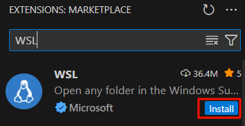
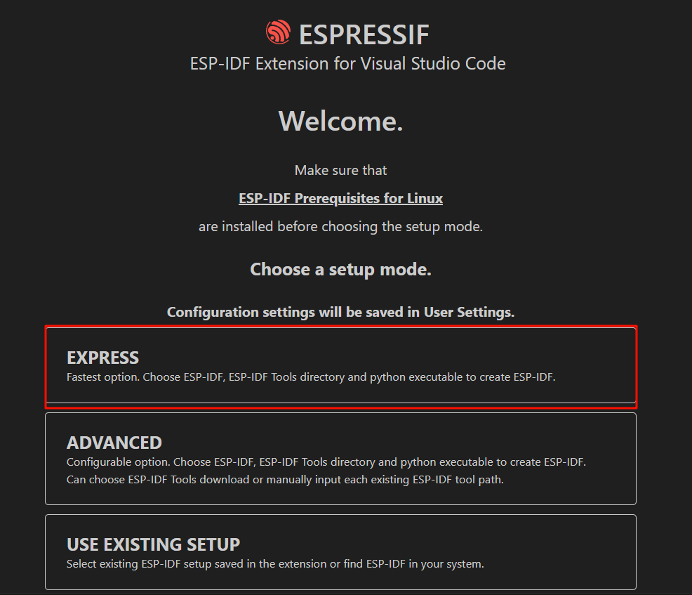

# 安装ESP-IDF（基于VSCode插件）
本部分参考了[官方文档](https://docs.espressif.com/projects/vscode-esp-idf-extension/zh_CN/latest/installation.html)
## 安装VSCode
请前去[VSCode官网下载](https://code.visualstudio.com/)并安装它，安装过程非常简单，无需额外配置。

## 安装VSCode插件
打开VSCode，前往菜单栏 view > extensions，或者使用快捷键 Ctrl+Shift+X打开扩展栏。

安装下图中 `WSL`、`Remote Development` 和 `ESP-IDF` 扩展。

  

  

  

## 连接wsl
点击左下角的连接按钮，在弹出的窗口中选择连接到wsl
  

VSCode会自动创建一个新的页面，连接成功后左下角会显示 `WSL:Ubuntu-22.04`

## 安装并配置ESP-IDF插件
打开扩展窗口，将esp-idf插件安装在wsl中

  

点击左侧栏的`ESP-IDF图标`，选择`Advanced`下的 `Configure ESP-IDF Extension`

  

在接下来的页面点击`EXPRESS`快速安装

  

勾选`Show all ESP-IDF tags`，这样能看到所有的tag，我们选择`v5.5`，然后点击install

  

然后插件就会自动下载安装v5.5版本的ESP-IDF，如下图

  
