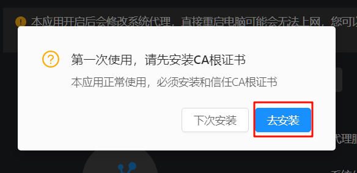
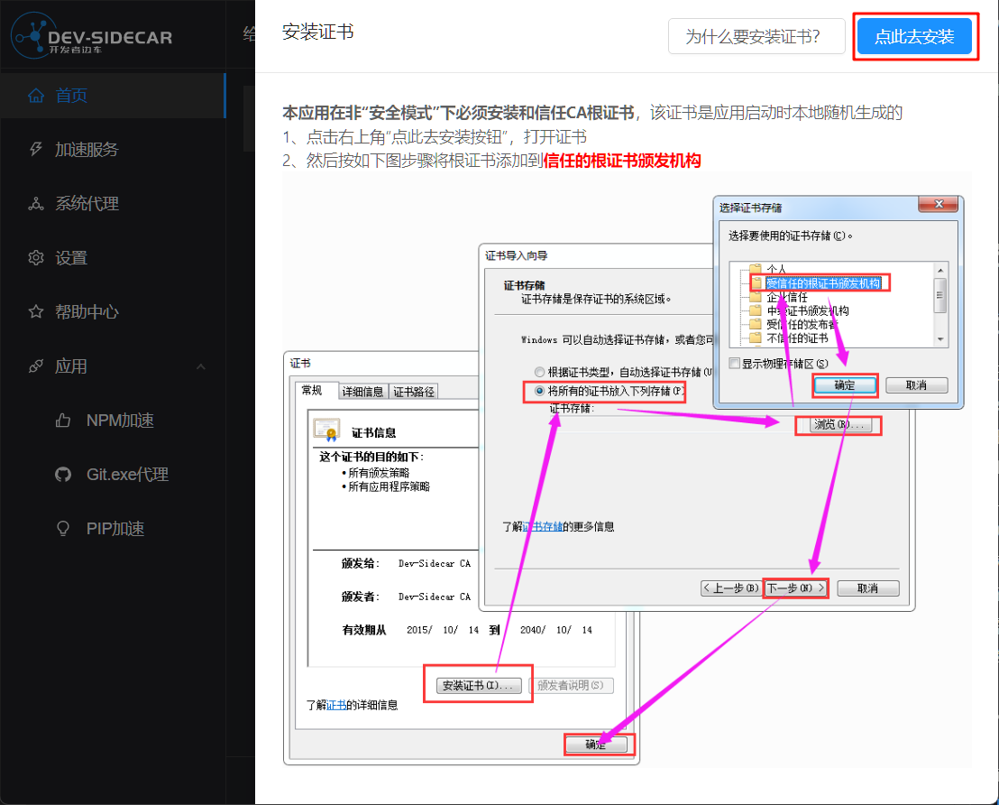
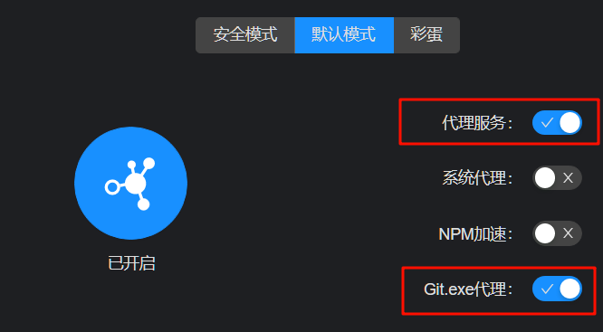
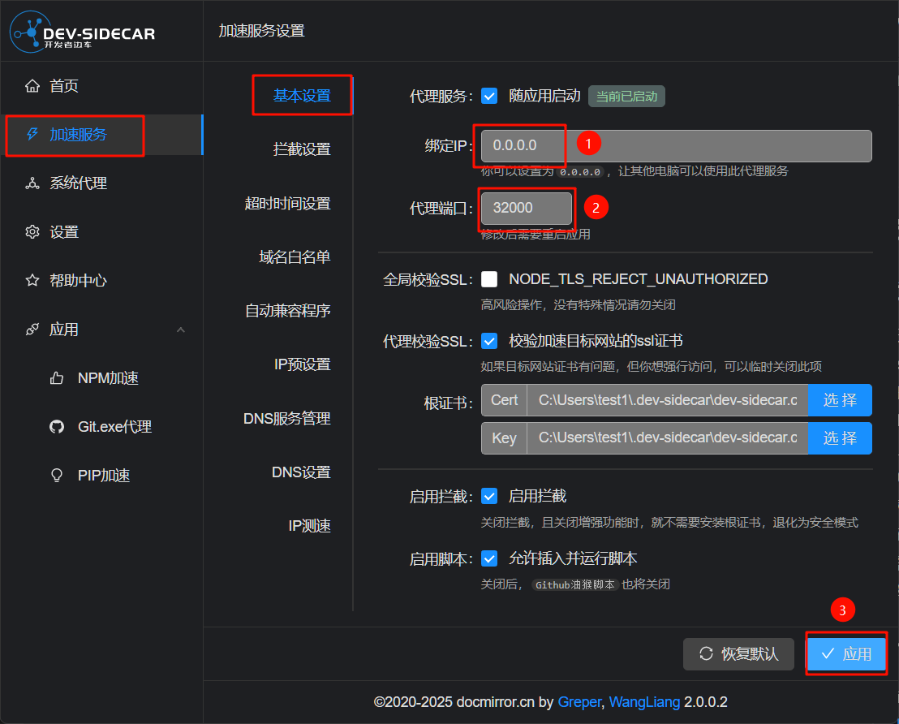

# 安装dev-sidecar的指南
## 为什么要安装这个软件？
开发者边车dev-sidecar，是通过本地代理的方式将https请求代理到一些国内的加速通道上。它可以用于加速git.exe、加速访问GitHub等。如果你要编译本项目，就需要安装ESP-IDF、下载项目源代码，这些操作都需要访问GitHub，这就需要用到dev-sidecar这个工具，避免网络问题带来的麻烦。

## 下载dev-sidecar
前往github下载windows版本
 https://github.com/docmirror/dev-sidecar/releases/download/v2.0.0.2/DevSidecar-2.0.0.2-windows-x64.exe 
 
如果打不开或者下载速度很慢，建议在网络搜索`github release加速`，使用别人搭建好的加速站来下载。

## 安装dev-sidecar
双击安装程序，它会自动安装，这一部分跳过

## 配置dev-sidecar
**使用管理员身份**打开dev-sidecar，第一次打开会让你安装一个CA证书，点击“去安装”

跟着底下的教程安装即可

回到dev-sidecar的主页，将“代理服务”和“git.exe代理”打开

在“加速服务”的基本设置中，将“绑定ip”改为`0.0.0.0`，方便后续在后面wsl里面配置代理。另外，我这里将“代理端口”改为了`32000`。设置完成后记得点击应用，然后重启dev-sidecar

