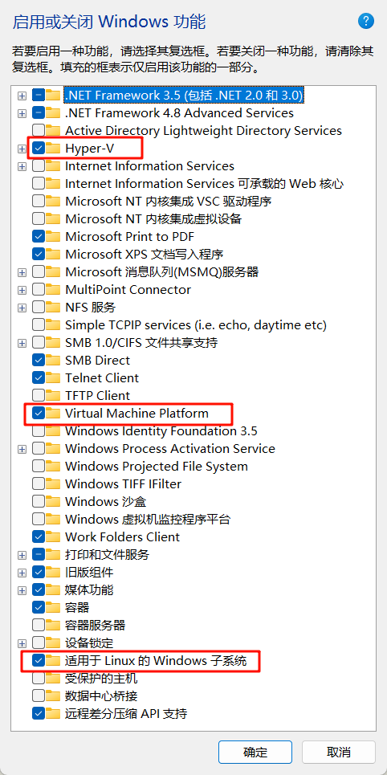
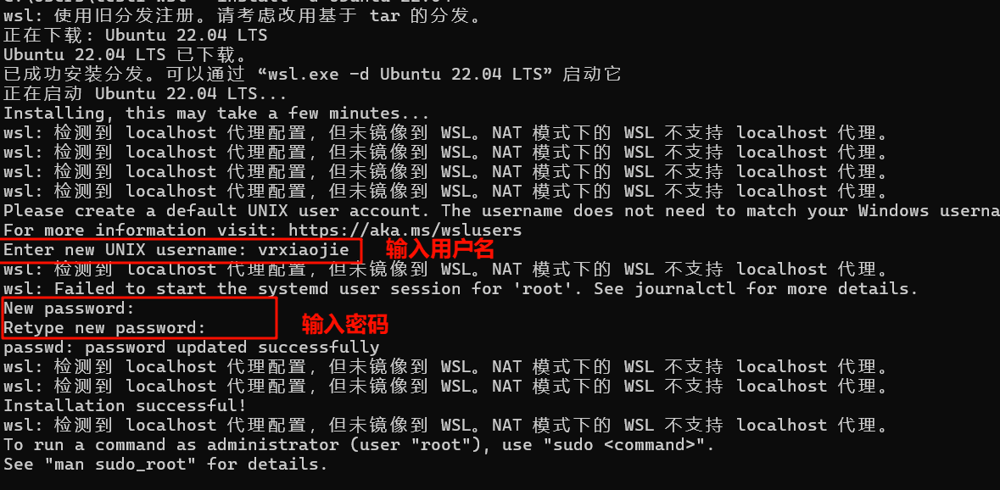
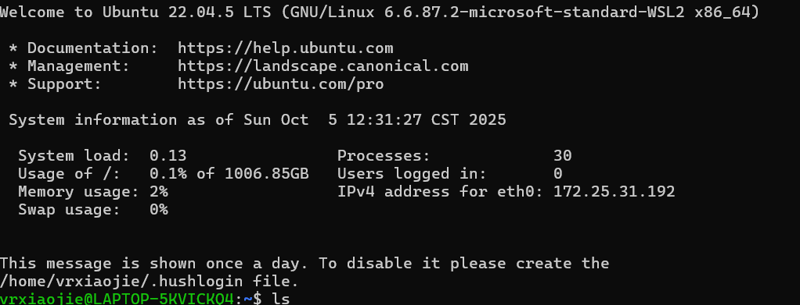

# 安装wsl2指南
## wsl2简介
WSL（Windows Subsystem for Linux）是微软开发的一项技术，允许用户在Windows系统中直接运行完整的Linux环境，无需虚拟机。

## 安装wsl2的前置工作
1. 在主板BIOS中，开启虚拟化功能。请根据你电脑的主板/笔记本电脑型号去网络搜索 “XX品牌 开启虚拟化”。

2. 启用windows功能：`hyper-V`、`Virtual Machine Platform`、 `适用于Linux的Windows子系统`



## 安装wsl2
使用win+r输入cmd打开命令行窗口，输入以下命令先更新wsl内核
```shell
wsl --update
```

安装ubuntu2204版本

```shell
wsl --install -d Ubuntu-22.04
```

它会自动下载安装，中间需要你设置用户名和密码



完成后就自动进入了终端环境



以后我们如果要再次进入wsl终端，可以打开命令行窗口后，使用命令`wsl`，直接进入wsl终端。