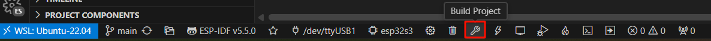
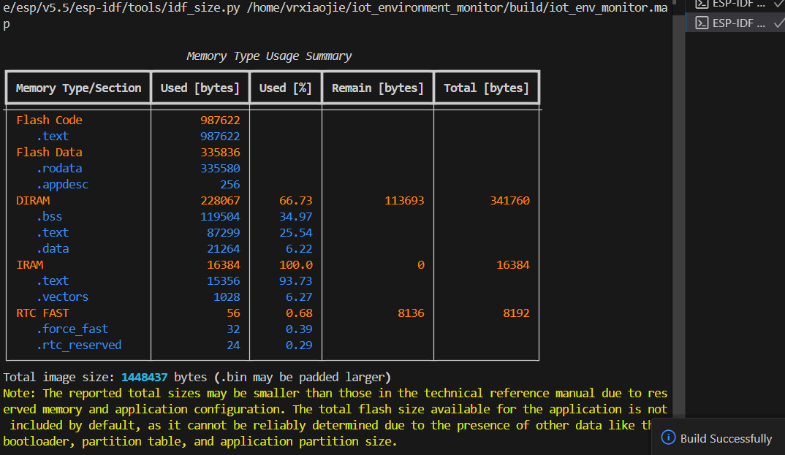

# 拉取工程仓库并编译
## clone工程
打开VSCode，连接至wsl，在VSCode终端中输入命令
```shell
cd ~
git clone https://github.com/vrxiaojie/iot_environment_monitor.git
```

## 在VSCode中打开工程
在VSCode中打开刚刚clone下来的工程文件夹，如下图所示
  

## 编译工程
点击底栏的扳手按钮，开始编译
::: warning 注意
请保持网络通畅，ESP-IDF会在此期间自动从组件仓库下载所需依赖
:::

  

编译成功后会出现下图的内存占用统计界面，并且也有消息提示build successfully

  

## 烧录程序
有关烧录程序部分，请参考[基于VSCode插件的自动烧录](../2-程序烧录/基于VSCode插件的自动烧录)