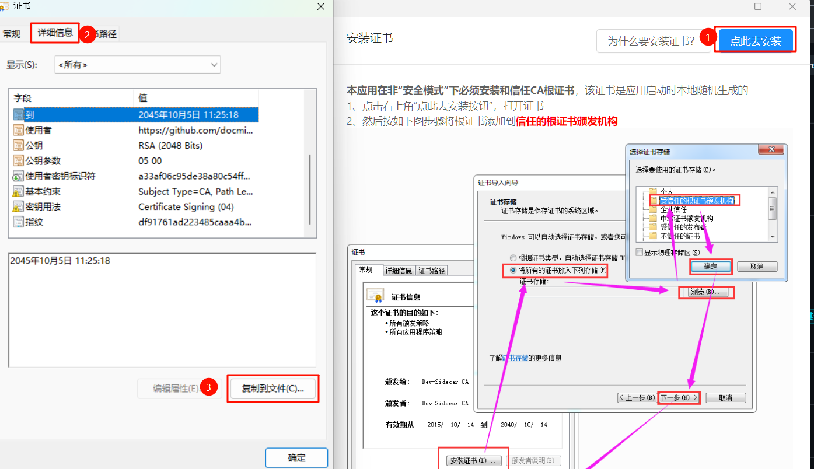
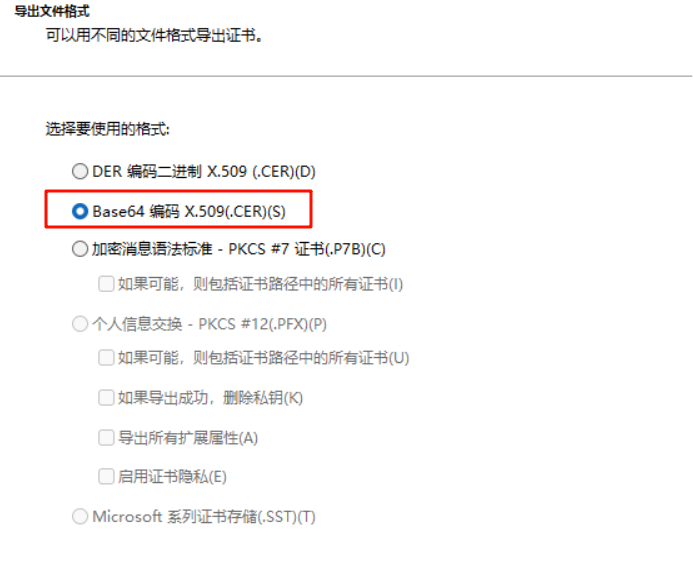
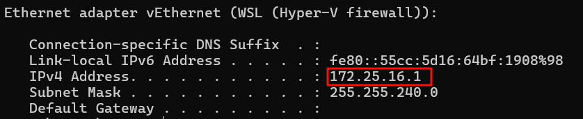
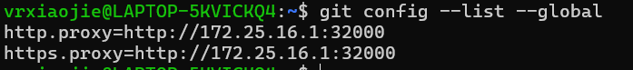

# 配置ESP-IDF安装环境
本部分参考了ESP-IDF的[官方文档](https://docs.espressif.com/projects/vscode-esp-idf-extension/zh_CN/latest/additionalfeatures/wsl.html)

## 安装编译环境所需软件包
### 修改apt镜像源
备份sources.list
```shell
sudo cp /etc/apt/sources.list  /etc/apt/sources.list.bk
```

使用vim编辑sources.list
```shell
sudo vim /etc/apt/sources.list
```

将以下内容替换到原文件中去
```text
deb http://mirrors.aliyun.com/ubuntu/ jammy main restricted universe multiverse
deb-src http://mirrors.aliyun.com/ubuntu/ jammy main restricted universe multiverse
deb http://mirrors.aliyun.com/ubuntu/ jammy-security main restricted universe multiverse
deb-src http://mirrors.aliyun.com/ubuntu/ jammy-security main restricted universe multiverse
deb http://mirrors.aliyun.com/ubuntu/ jammy-updates main restricted universe multiverse
deb-src http://mirrors.aliyun.com/ubuntu/ jammy-updates main restricted universe multiverse
deb http://mirrors.aliyun.com/ubuntu/ jammy-proposed main restricted universe multiverse
deb-src http://mirrors.aliyun.com/ubuntu/ jammy-proposed main restricted universe multiverse
deb http://mirrors.aliyun.com/ubuntu/ jammy-backports main restricted universe multiverse
deb-src http://mirrors.aliyun.com/ubuntu/ jammy-backports main restricted universe multiverse
```

更新软件包列表
```shell
sudo apt update
sudo apt upgrade
```

### 安装所需的软件包
```shell
sudo apt-get install git wget flex bison gperf cmake ninja-build ccache libffi-dev libssl-dev dfu-util python3-pip python3 python3-venv
```

## 配置git代理
### 导出dev-sidecar的证书
由于证书缺失，开启 SideCar 后 WSL2 中的 HTTPS 连接都会变为不受信状态，导致例如 git 无法连接到 remote 做任何操作。本部分的操作[参考GitHub Issue](https://github.com/docmirror/dev-sidecar/issues/73)

打开dev-sidecar，在主界面点击安装根证书，在弹出的证书属性窗口中导出证书（详细信息选项卡 -> 复制到文件）



导出文件格式选择base64编码这项


我保存的文件名为`devsidecar.cer`，放在了`Z盘`下

将导出的证书复制到/usr/local/share/ca-certificates中，同时更改后缀名为.crt。**注意，wsl是默认挂载本地磁盘到/mnt目录下的，请根据你实际存储证书的位置调整下方cp命令的原文件位置这部分。**
```shell
sudo cp /mnt/z/devsidecar.cer /usr/local/share/ca-certificates/devsidecar.crt
```

运行更新ca证书的命令
```shell
sudo update-ca-certificates
```

### 设置git config代理
前面已经安装了dev-sidecar，并且绑定ip为0.0.0.0，我们接下来要为运行在wsl中的git程序配置代理。

首先在windows命令行窗口中，使用ipconfig查看WSL主机的IP地址，如下图所示，我这里的为 `172.25.16.1`，**不同的电脑这里的IP地址不一定相同**



回到WSL中，为git添加http和https代理。例如我的WSL主机IP地址是 `172.25.16.1`，dev-sidecar加速服务代理端口是`32000`，那么我的命令如下
```shell
git config --global http.proxy http://172.25.16.1:32000
git config --global https.proxy http://172.25.16.1:32000
```

完成后可以使用命令
```shell
git config --list --global
```
出现下方提示说明已配置成功



此时可以使用git clone命令去clone一个仓库，检查是否能够正常拉取