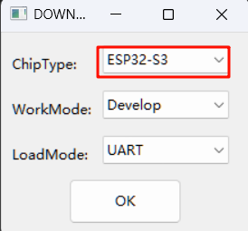
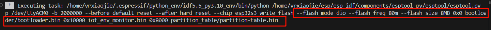
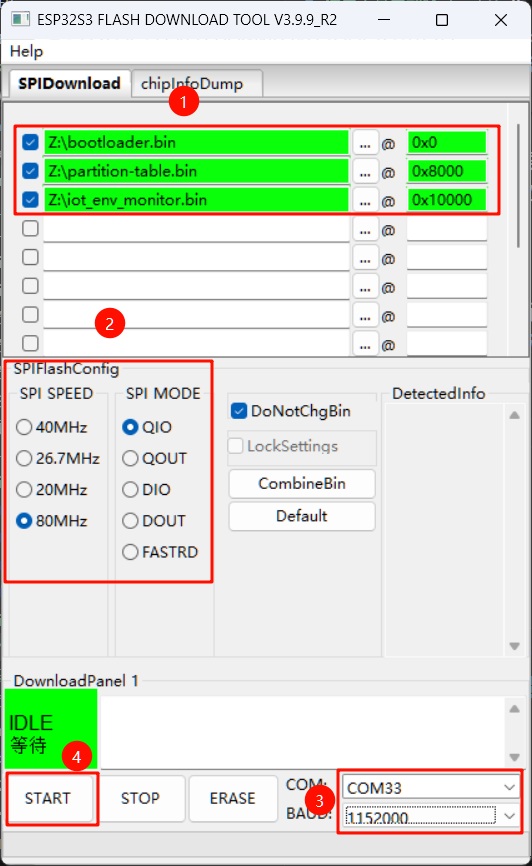
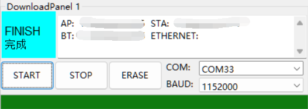

# 使用工具手动烧录

## 下载flash download tool工具
点击下载 [Flash 下载工具](https://dl.espressif.com/public/flash_download_tool.zip)

详细使用方法请参阅 [官方使用文档](https://docs.espressif.com/projects/esp-test-tools/zh_CN/latest/esp32s3/production_stage/tools/flash_download_tool.html)

## 配置参数
将环境监测仪开机，并通过USB type-c连接至电脑，启动`flash_download_tool.exe`

选择芯片 `ESP32S3`，点击OK
  

烧录配置的参数是从VSCode插件一键烧录命令这里得到的，如下图

  

| 文件名              | 地址    |
| ------------------- | ------- |
| bootloader.bin      | 0x0     |
| partition-table.bin | 0x8000  |
| iot_env_monitor.bin | 0x10000 |

SPI Flash配置为`80MHz、QIO`

## 烧录程序
配置完成界面如下图所示，接下来就是点击START烧录程序了
  

::: warning 注意
这里的路径需要使用路径旁边省略号按钮`...`，去手动选择，不要照抄我配置的位置，我是放在Z盘根目录下的。
:::

稍作等待，显示FINISH时，即为烧录成功，此时屏幕是黑屏的，可**先关掉电源再打开电源**，就能看到主界面了

  
