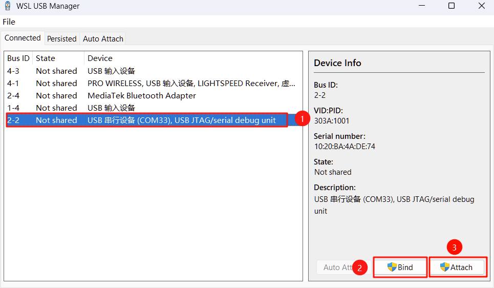
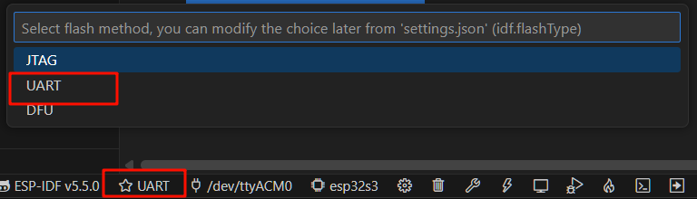
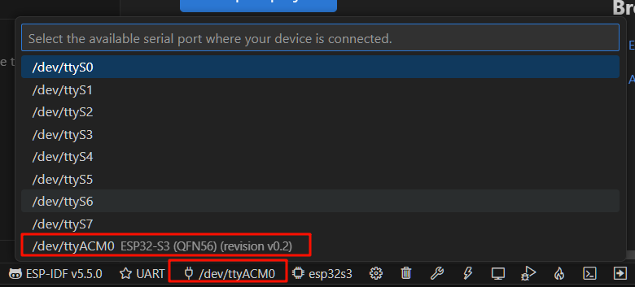
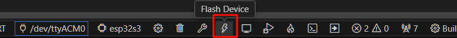

# 基于VSCode插件的自动烧录
阅读本节前，请确保你已经在VSCode上正确安装了ESP-IDF插件，并且成功编译。具体请参见文档 [安装ESP-IDF（基于VSCode插件）](../1-项目编译/安装ESP-IDF（基于VSCode插件）) 和 [拉取工程仓库并编译](../1-项目编译/拉取工程仓库并编译) 

## 下载安装USBIPD
USBIPD是将本地连接的USB设备共享到其他计算机的软件，wsl usb manager是依赖于USBIPD的[下载地址](https://github.com/dorssel/usbipd-win/releases)

下载的文件名为`usbipd-win_5.3.0_x64.msi`

## 下载wsl usb manager
这是一个GitHub上的开源项目，通过可视化的界面，将电脑USB设备快速绑定到wsl上，以便于程序的烧录。

[点击此处下载v1.2.1版本](https://github.com/nickbeth/wsl-usb-manager/releases/download/v1.2.1/wsl-usb-manager.exe) ，如果链接打不开或者下载失败，请自行搜索 `GitHub Releases下载加速`，寻找他人搭建的加速站点。

## 绑定USB设备到WSL
开启环境监测仪的电源，使用USB数据线将其连接到电脑上。

打开wsl usb manager，先点击带有`USB/JTAG serial debug unit`字样的设备，再依次点击`Bind`、`Attach`将其绑定到wsl

  

::: tip 提示
你可以点击 `Auto Attach`，以后每当该设备接入，会自动将其绑定到wsl
:::

## VSCode中的配置修改
在VSCode底部，修改烧录方式为 `UART`
  

选择USB端口，这里一般是`/dev/ttyACMx`
  

## 烧录程序
点击底部的小闪电图标，烧录程序
  

