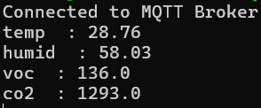
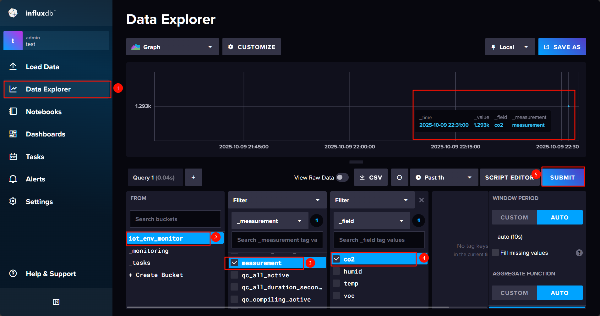
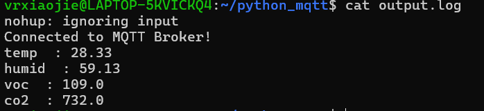
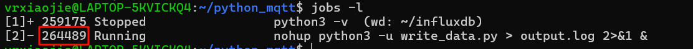

# 基于Python实现MQTT数据存储程序
在我们使用的开源版EMQX中，MQTT数据无法直接写入InfluxDB数据库，数据集成是企业版才有的功能。因此，我们可以使用python语言，编写一个MQTT消息接收、JSON数据解析、向数据库存储的程序

## 安装Python依赖
我这里的WSL使用的是**Python3.10.12**版本，建议先使用此版本，暂不确定所使用的第三方库是否支持更高版本。

使用pip包管理工具来安装influxdb_client和paho_mqtt库

```shell
pip install influxdb_client==1.38.0 paho_mqtt==1.6.1 -i https://mirrors.aliyun.com/pypi/simple/
```

## 在EMQX后台新建一个用户
具体请参考 [新建客户端](./搭建EMQX%20MQTT消息服务器#新增客户端) 这一节。

我在这里新增一个用户`python-1`，密码为`123456`

## 编写代码
进到当前用户家目录，新建一个目录专门用于存放程序和日志文件

```shell
mkdir ~/python_mqtt
cd ~/python_mqtt
```

使用vim 新建一个python源文件
```shell
vim write_data.py
```

在文件内粘贴以下代码。请注意，`token`变量是之前[搭建InfluxDB数据库-配置数据库](./搭建InfluxDB2.0数据库#配置InfluxDB数据库)章节保存的。

```python
import json
import random
from paho.mqtt import client as mqtt_client
import influxdb_client
from influxdb_client import Point
from influxdb_client.client.write_api import SYNCHRONOUS


#配置influxdb
token = ''  # 改为你在influxDB中获取的API token
org = 'test'
url = 'http://localhost:8086'
bucket = 'iot_env_monitor'
write_client = influxdb_client.InfluxDBClient(url=url, token=token, org=org)

#配置MQTT
mqtt_host = 'localhost'
mqtt_port = 1883
topic = '/iot_env_monitor/value'
client_id = f'python-mqtt-{random.randint(0, 100)}'
username = 'python-1'  # 与EMQX后台分配的一致
password = '123456' # 与EMQX后台分配的一致

def write_influxdb(fieldname, value):
    try:
        print(fieldname, " :",value)
        write_api = write_client.write_api(write_options=SYNCHRONOUS)
        point = (
            Point("measurement")
            .field(fieldname, value)
        )
        write_api.write(bucket=bucket, org="test", record=point)
    except Exception as e:
        print("error:",e)


def connect_mqtt() -> mqtt_client:
    def on_connect(client, userdata, flags, rc):
        if rc == 0:
            print("Connected to MQTT Broker!")
        else:
            print("Failed to connect, return code %d\n", rc)

    client = mqtt_client.Client(client_id)
    client.username_pw_set(username, password)
    client.on_connect = on_connect
    client.connect(host=mqtt_host, port=mqtt_port)
    return client


def subscribe(client: mqtt_client):
    def on_message(client, userdata, msg):
        data = msg.payload.decode()
        # print(data)
        jsondata = json.loads(data)
        for name, value in jsondata.items():
            value = round(float(value), 2)
            write_influxdb(name, value)


    client.subscribe(topic)
    client.on_message = on_message


def run():
    client = connect_mqtt() #创建mqtt对象
    subscribe(client)
    client.loop_forever() #表示永久等待发布者发布消息


if __name__ == '__main__':
    run()
```

## 运行程序
使用下面命令运行程序
```shell
python3 write_data.py
```
如果出现`Connected to MQTT Broker!`，说明连接成功

我们可以使用环境监测仪，连接WIFI、MQTT，等待片刻，就能在终端看到当前监测值了

  

同时，这些值也被存进了数据库中，我们可以在influxDB管理页面，通过Data Explorer查询到

  

::: tip 后台运行程序
当前python程序是在前台运行的，当关闭终端后就会被销毁，如果我们不想让它占用终端窗口，可以使用nohup命令。

```shell
nohup python3 -u write_data.py > output.log 2>&1 &
```
**命令解释**

nohup：忽略挂断信号，确保脚本持续运行。

-u：禁用 Python 输出缓冲，实时写入日志。

\>：将标准输出重定向到 output.log。

2>&1：将错误输出重定向到标准输出。

&：将命令放入后台运行。

查看实时日志
```shell
cat output.log
```

  

要想关闭该后台进程，可以先查看后台进程的PID
```shell
jobs -l
```

如下图，我这里查到的PID是 264489
  

使用命令kill掉该进程
```shell
kill -9 264489
```

:::

