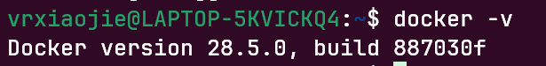

# 安装Docker
## 在开始之前...
请确保你有一台运行着Linux的服务器/个人PC， **【数据上云】** 章节所有操作均是运行在Windows 11 PC的 WSL2（Linux发行版 Ubuntu-22.04）上完成的。如果你尚未安装WSL2，请先参考该文档：[安装wsl2](../1-项目编译/安装wsl2)。

::: tip
如果你有一台Linux服务器，也可以参照本章节的进行安装配置。如果你的Linux发行版不是Debian系的，请不要使用apt包管理器的相关指令，请在网络搜索你所安装的Linux发行版包管理器指令。
:::

## 安装Docker
按下组合键win+r，输入cmd，回车。在打开的窗口中输入命令，启动你的WSL终端
```shell
wsl
```

本部分参考[阿里云安装教程Docker](https://developer.aliyun.com/mirror/docker-ce)

安装必要的一些系统工具
```shell
sudo apt update
sudo apt install ca-certificates curl
```

信任 Docker 的 GPG 公钥
```shell
curl -fsSL https://mirrors.aliyun.com/docker-ce/linux/ubuntu/gpg | sudo gpg --dearmor -o /etc/apt/keyrings/docker.gpg
sudo chmod a+r /etc/apt/keyrings/docker.gpg
```
写入软件源信息

```shell
echo "deb [arch=$(dpkg --print-architecture) signed-by=/etc/apt/keyrings/docker.gpg] https://mirrors.aliyun.com/docker-ce/linux/ubuntu "$(. /etc/os-release && echo "$VERSION_CODENAME")" stable" | sudo tee /etc/apt/sources.list.d/docker.list > /dev/null
```

安装
```shell
sudo apt update
sudo apt install docker-ce docker-ce-cli containerd.io docker-buildx-plugin docker-compose-plugin
```

## 检验安装是否成功
查看docker版本号
```shell
docker -v
```
输出版本号即为安装成功
  

