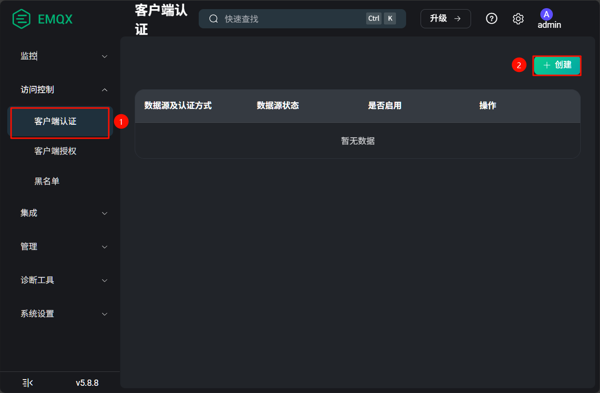

# 搭建EMQX MQTT消息服务器
## EMQX简介
EMQX 是一款「无限连接，任意集成，随处运行」的大规模分布式物联网接入平台，同时作为一个高性能、可扩展的 MQTT 消息服务器。

在本项目中用的是EMQX的5.8.8版本，这是EMQX最后一个开源版，对于当前应用来说是够用的。

## 修改WSL的网络模式
默认情况下，WSL是运行在NAT网络模式，我们还需要通过Windows防火墙配置才能让局域网其他设备访问到WSL内的服务，这样非常麻烦。因此，我们可以修改WSL的网络模式为Mirrored，它直接共享了宿主机的IP地址，且局域网的其他设备可直接输入宿主机`ip:服务端口`来访问服务。

使用任意文本编辑器，打开位于`C:/Users/你的用户名`目录下的`.wslconfig`文件

修改如下两行，关闭防火墙，以及切换网络模式：
```conf
firewall=false
networkingMode=Mirrored
```

保存后，如果你的WSL仍在运行，请打开cmd命令行，输入`wsl --shutdown`，并等待它完全关闭后再启动WSL

进入WSL后，使用`ifconfig`，同时在cmd命令行使用`ipconfig`命令查看IP地址，如果它们显示的相同，说明成功修改网络模式为Mirrored。

  


## 使用Docker-compose安装EMQX
### 创建本地数据存储目录
要想持久化EMQX日志和配置等数据，就要将docker容器中的目录映射到宿主机上。

在当前用户家目录下创建emqx专用的文件夹，名为`emqx`，里面再创建两个文件夹，`log`用于存放日志，`data`用于存放配置文件及用户数据。

```shell
cd ~
mkdir -p emqx/log emqx/data
cd emqx
```

为了避免权限问题，我们将文件夹的权限改为777
```shell
sudo chmod 777 data -R && sudo chmod 777 log -R
```

### 创建docker-compose.yml
为了方便修改容器设置，我们使用Docker Compose 工具，它通过一个 YAML 文件来配置应用程序的服务，使得管理和部署变得更加简单和高效。

在当emqx文件夹内使用vim创建并编辑配置文件
```shell
vim docker-compose.yml
```

将以下内容复制进去
```yml
services:
  emqx:
    image: hub.rat.dev/emqx/emqx:5.8.8
    container_name: emqx
    hostname: emqx 
    restart: unless-stopped
    ports:
      - "1883:1883"
      - "18083:18083"
    volumes:
      - ./data:/opt/emqx/data
      - ./log:/opt/emqx/log
    environment:
      - EMQX_HOST=emqx.dev
```

:::details 参数说明
`services`: 服务集合的根节点，下面定义一个或多个容器服务

`emqx`: 服务名，用于 Compose 内部引用和网络 DNS 名称

`image`: 指定要拉取并运行的镜像，这里用的是镜像站点 hub.rat.dev 上的 emqx:5.8.8

`container_name`: 固定容器名称便于管理和查找

`hostname`: 容器内部的主机名，其他容器或应用在网络内访问时可见该名字

`restart`: 容器重启策略；unless-stopped 表示遇到故障自动重启，除非手动停止容器

`ports`:

"1883:1883": 把宿主机的 1883 端口映射到容器的 1883（MQTT 协议默认端口）。

"18083:18083": 把宿主机的 18083 端口映射到容器的 18083（EMQX 管理控制台/仪表盘端口）。

`volumes`:

./data:/opt/emqx/data: 将当前目录下的 data 文件夹映射到容器内的 /opt/emqx/data，用于持久化配置和状态。

./log:/opt/emqx/log: 用于持久化日志

`environment`:环境变量

EMQX_HOST=emqx.dev: 设置容器环境变量，EMQX 会用来作为节点主机名/节点标识
:::

::: warning 关于Docker镜像源
由于GFW的限制，我们无法直接访问Docker原站点，因此在`image`后面有`hub.rat.dev`，说明是从这个镜像站拉取的镜像。你在使用的时候如果发现无法拉取，请在网络搜索Docker镜像站的URL进行替换
:::

### 启动EMQX容器
输入命令，其中 `up` 指的是创建并启动容器， `-d` 参数是`detached`，让容器在后台运行，无需占用终端
```shell
sudo docker compose up -d
```

它会先在本地寻找名为`hub.rat.dev/emqx/emqx:5.8.8`的镜像，若没有，则自动拉取镜像，如下图

  

自动创建网络和容器，如下图所示，EMQX容器创建成功

  

## 管理EMQX
### 访问EMQX Dashboard管理页面

在浏览器键入`http://localhost:18083`访问Dashboard

打开网页如下图所示
  

**默认的用户名为 `admin`，密码为`public`**

### 新增客户端
点击左侧栏的`访问控制--客户端认证`，点击`创建`

  

接下来在打开的窗口中：
1. 认证方式选择`password-based`
2. 数据源选择`内置数据库`
3. 配置参数保持默认
4. 点击创建

点击刚刚创建的数据库的`用户管理`按钮

  

点击`添加--输入用户名密码--保存` 

  

### 使用MQTTX测试
前往[MQTTX官网下载](https://mqttx.app/zh)

打开MQTTX软件后，新建一个连接。**用户名和密码**是在[新增客户端](#新增客户端)这一小节设置的（我又新增了一个用户名为`mqttx`专门用于测试的）；**服务器地址**是在CMD命令行中用`ipconfig`获取到的的IP（或者直接填localhost）；**端口**默认1883

   

添加一个订阅，topic名为`/test`

  

在发送窗口这边，将topic名改为`/test`，随便发送一条消息，检查自己是否能够接收到。如果可以，说明EMQX的配置完全没有问题，可以继续进行其他配置了！

  

## 使用环境监测仪测试连接
请按以下步骤进行测试
1. 开启环境监测仪电源
2. 进入WIFI页面，搜索并连接和电脑在同一局域网下的WIFI
3. 进入MQTT设置页面，修改地址（记得保留前缀`mqtt://`）、端口、用户名、密码参数
4. 点击保存&连接
    

5. 在电脑MQTTX软件上，订阅topic `/iot_env_monitor/value`
   可以切换格式编码为`JSON`，出现环境数据即为测试成功
    
