# 搭建Grafana数据大屏
在阅读本小节前，请确保你已经基于 [搭建InfluxDB2.0数据库](./搭建InfluxDB2.0数据库) 小节正确安装了InfluxDB数据库。
## Grafana简介
Grafana 是一个开源的数据可视化和监控工具，广泛用于数据分析和系统监控。它可以通过连接多个数据源（如 Prometheus、InfluxDB、Elasticsearch 等）实时展示数据，并允许用户创建交互式的仪表板。

## 使用Docker-compose安装Grafana
### 创建docker-compose.yml
在用户家目录下，新建`grafana`文件夹，用于存放yml文件以及grafana数据，同时，修改该文件夹的权限，避免容器启动后由于权限不足无法创建其他目录。
```shell
cd 
mkdir grafana
chmod -R 777 grafana
cd grafana
```

在grafana文件夹下，使用vim 新建一个`docker-compose.yml`文件
```shell
vim docker-compose.yml
```

粘贴以下内容
```yml
services:
  grafana:
    image: hub.rat.dev/grafana/grafana:12.2.0
    container_name: grafana
    restart: always
    ports:
     - '3000:3000'
    network_mode: "bridge"
    volumes:
    - "./:/var/lib/grafana"
```

### 运行容器
使用命令运行容器，它会自动下载镜像并创建容器
```shell
sudo docker compose up -d
```

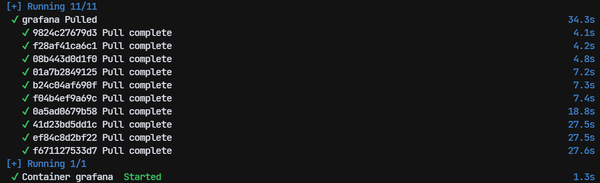  


## 配置Grafana
### 登录管理后台
使用浏览器，打开链接 [http://localhost:3000](http://localhost:3000)

默认用户名`admin`，密码`admin`，你可以在登录后修改密码。

  

### 创建数据源
点击左侧的 `Connections -- Data Sources -- Add data source`

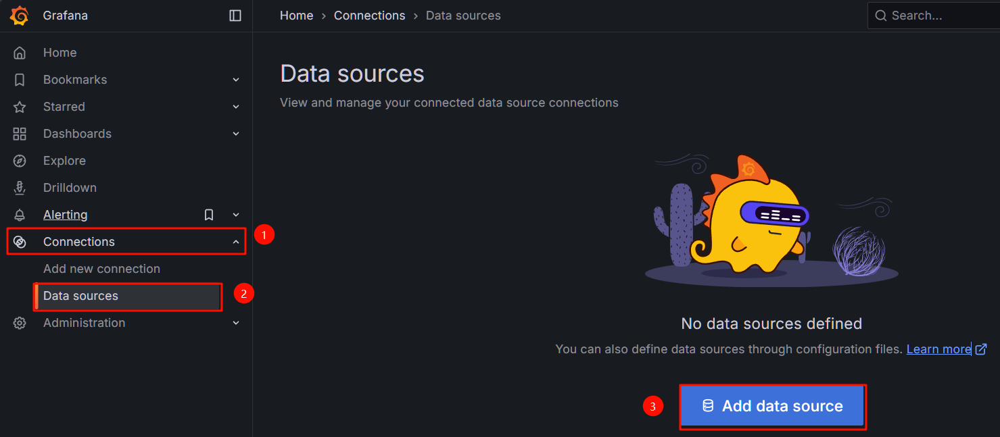  

在接下来的页面，从`Time series databases`（时序数据库）分类中选择`InfluxDB`

::: warning 注意
如果你之前已经参考 [该小节](./搭建InfluxDB2.0数据库) 创建了InfluxDB容器，请使用命令`sudo docker start influxdb`启动它。
:::

回到WSL 终端，使用命令`sudo docker network inspect bridge` 查询一下influxdb在docker bridge网络下的IP，如下图所示，我这里查到的是`172.17.0.3`，你的可能跟我的不一样。

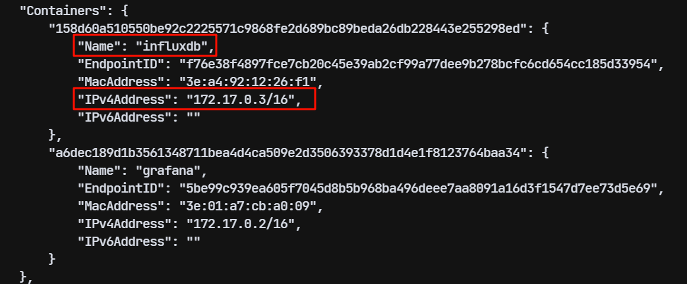  

回到Grafana管理后台，配置查询语言 `Query Language` 为 `Flux`，设置InfluxDB的URL为`http://172.17.0.3:8086`（IP地址以你通过命令查询到的为准）

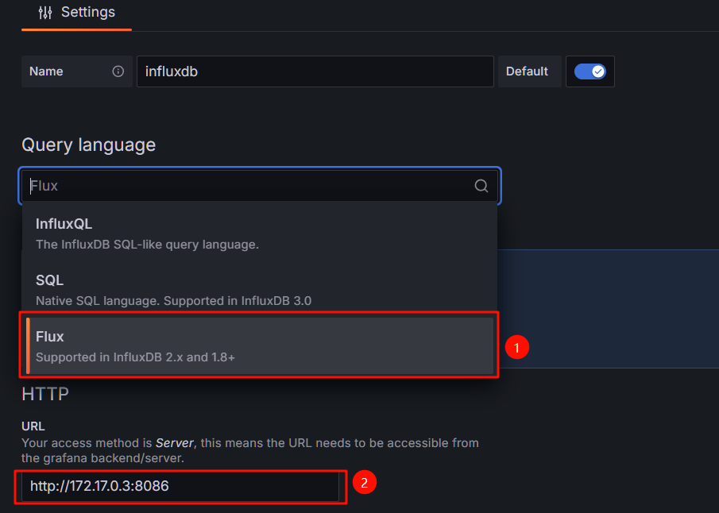  

页面往下拉，在 `InfluxDB Details` 部分，填写下述2个内容：

（1）`Organization`填写为 `test`，该名称可以在InfluxDB后台侧边栏查看到，如下图所示

  

（2）`Token`填写在InfluxDB后台创建的API token，创建方法如下图

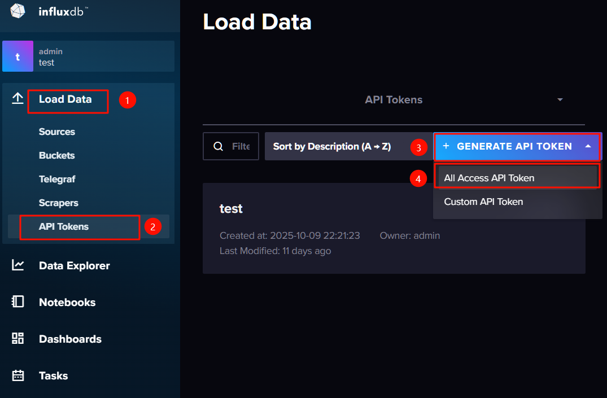  

点击最下方的`Save & test`按钮，如果出现datasource is working. 的提示字样，表示数据源创建完成

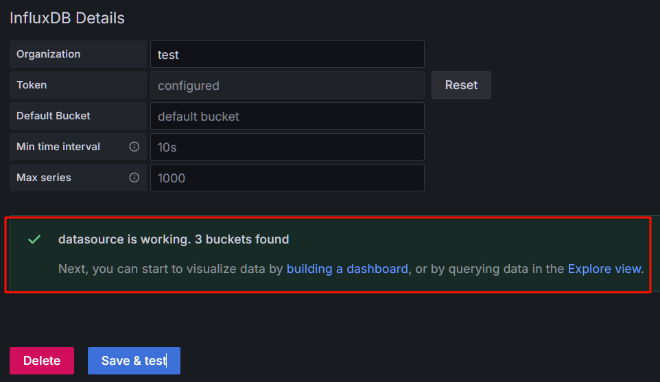  

### 导入已配置好的仪表盘
我这里已经配置了一份仪表盘的模板，你可以导入使用。

点击Grafana管理页面的右上角 '+' 号，选择 `Import Dashboard`

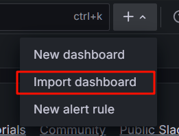  

在新打开的页面，`Import via dashboard JSON model`下的文本框中，粘贴以下代码

::: details 点击查看配置代码
```json
{
  "annotations": {
    "list": [
      {
        "builtIn": 1,
        "datasource": {
          "type": "datasource",
          "uid": "grafana"
        },
        "enable": true,
        "hide": true,
        "iconColor": "rgba(0, 211, 255, 1)",
        "name": "Annotations & Alerts",
        "target": {
          "limit": 100,
          "matchAny": false,
          "tags": [],
          "type": "dashboard"
        },
        "type": "dashboard"
      }
    ]
  },
  "editable": true,
  "fiscalYearStartMonth": 0,
  "graphTooltip": 0,
  "id": 1,
  "links": [],
  "panels": [
    {
      "datasource": {
        "type": "influxdb",
        "uid": "ff07iffjvcr9cd"
      },
      "fieldConfig": {
        "defaults": {
          "color": {
            "mode": "thresholds"
          },
          "decimals": 2,
          "mappings": [],
          "max": 35,
          "min": -15,
          "thresholds": {
            "mode": "absolute",
            "steps": [
              {
                "color": "dark-blue",
                "value": 0
              },
              {
                "color": "semi-dark-blue",
                "value": -15
              },
              {
                "color": "light-blue",
                "value": -5
              },
              {
                "color": "super-light-blue",
                "value": 5
              },
              {
                "color": "super-light-orange",
                "value": 15
              },
              {
                "color": "#EF843C",
                "value": 25
              },
              {
                "color": "dark-orange",
                "value": 35
              }
            ]
          },
          "unit": "celsius"
        },
        "overrides": []
      },
      "gridPos": {
        "h": 8,
        "w": 6,
        "x": 0,
        "y": 0
      },
      "id": 12,
      "options": {
        "minVizHeight": 75,
        "minVizWidth": 75,
        "orientation": "auto",
        "reduceOptions": {
          "calcs": [
            "lastNotNull"
          ],
          "fields": "",
          "values": false
        },
        "showThresholdLabels": false,
        "showThresholdMarkers": true,
        "sizing": "auto"
      },
      "pluginVersion": "12.2.0",
      "targets": [
        {
          "datasource": {
            "type": "influxdb",
            "uid": "AGgeDmvSz"
          },
          "query": "from(bucket: \"iot_env_monitor\")\r\n  |> range(start: v.timeRangeStart, stop: v.timeRangeStop)\r\n  |> filter(fn: (r) => r[\"_measurement\"] == \"measurement\")\r\n  |> filter(fn: (r) => r[\"_field\"] == \"temp\")\r\n  |> aggregateWindow(every: v.windowPeriod, fn: last, createEmpty: false)\r\n  |> yield(name: \"last\")",
          "refId": "A"
        }
      ],
      "title": "当前气温",
      "type": "gauge"
    },
    {
      "datasource": {
        "type": "influxdb",
        "uid": "ff07iffjvcr9cd"
      },
      "fieldConfig": {
        "defaults": {
          "color": {
            "mode": "thresholds"
          },
          "decimals": 2,
          "mappings": [],
          "max": 100,
          "min": 0,
          "thresholds": {
            "mode": "absolute",
            "steps": [
              {
                "color": "dark-orange",
                "value": 0
              },
              {
                "color": "light-orange",
                "value": 20
              },
              {
                "color": "super-light-orange",
                "value": 40
              },
              {
                "color": "light-blue",
                "value": 60
              },
              {
                "color": "semi-dark-blue",
                "value": 80
              },
              {
                "color": "dark-blue",
                "value": 100
              }
            ]
          },
          "unit": "humidity"
        },
        "overrides": []
      },
      "gridPos": {
        "h": 8,
        "w": 6,
        "x": 6,
        "y": 0
      },
      "id": 10,
      "options": {
        "minVizHeight": 75,
        "minVizWidth": 75,
        "orientation": "auto",
        "reduceOptions": {
          "calcs": [
            "lastNotNull"
          ],
          "fields": "",
          "values": false
        },
        "showThresholdLabels": false,
        "showThresholdMarkers": true,
        "sizing": "auto"
      },
      "pluginVersion": "12.2.0",
      "targets": [
        {
          "datasource": {
            "type": "influxdb",
            "uid": "AGgeDmvSz"
          },
          "query": "from(bucket: \"iot_env_monitor\")\r\n  |> range(start: v.timeRangeStart, stop: v.timeRangeStop)\r\n  |> filter(fn: (r) => r[\"_measurement\"] == \"measurement\")\r\n  |> filter(fn: (r) => r[\"_field\"] == \"humid\")\r\n  |> aggregateWindow(every: v.windowPeriod, fn: last, createEmpty: false)\r\n  |> yield(name: \"last\")",
          "refId": "A"
        }
      ],
      "title": "当前湿度",
      "type": "gauge"
    },
    {
      "datasource": {
        "type": "influxdb",
        "uid": "ff07iffjvcr9cd"
      },
      "fieldConfig": {
        "defaults": {
          "color": {
            "mode": "continuous-GrYlRd"
          },
          "decimals": 0,
          "mappings": [],
          "max": 5000,
          "min": 0,
          "thresholds": {
            "mode": "absolute",
            "steps": [
              {
                "color": "green",
                "value": 0
              },
              {
                "color": "green",
                "value": 500
              },
              {
                "color": "yellow",
                "value": 1000
              },
              {
                "color": "orange",
                "value": 2000
              },
              {
                "color": "red",
                "value": 3000
              },
              {
                "color": "purple",
                "value": 5000
              }
            ]
          },
          "unit": "ppm"
        },
        "overrides": []
      },
      "gridPos": {
        "h": 8,
        "w": 6,
        "x": 12,
        "y": 0
      },
      "id": 15,
      "options": {
        "minVizHeight": 75,
        "minVizWidth": 75,
        "orientation": "auto",
        "reduceOptions": {
          "calcs": [
            "lastNotNull"
          ],
          "fields": "",
          "values": false
        },
        "showThresholdLabels": false,
        "showThresholdMarkers": true,
        "sizing": "auto"
      },
      "pluginVersion": "12.2.0",
      "targets": [
        {
          "datasource": {
            "type": "influxdb",
            "uid": "AGgeDmvSz"
          },
          "query": "from(bucket: \"iot_env_monitor\")\r\n  |> range(start: v.timeRangeStart, stop: v.timeRangeStop)\r\n  |> filter(fn: (r) => r[\"_measurement\"] == \"measurement\")\r\n  |> filter(fn: (r) => r[\"_field\"] == \"co2\")\r\n  |> aggregateWindow(every: v.windowPeriod, fn: last, createEmpty: false)\r\n  |> yield(name: \"last\")",
          "refId": "A"
        }
      ],
      "title": "CO2",
      "type": "gauge"
    },
    {
      "datasource": {
        "type": "influxdb",
        "uid": "ff07iffjvcr9cd"
      },
      "fieldConfig": {
        "defaults": {
          "color": {
            "mode": "continuous-GrYlRd"
          },
          "decimals": 0,
          "mappings": [],
          "max": 500,
          "min": 0,
          "thresholds": {
            "mode": "absolute",
            "steps": [
              {
                "color": "green",
                "value": 0
              },
              {
                "color": "red",
                "value": 80
              }
            ]
          }
        },
        "overrides": []
      },
      "gridPos": {
        "h": 8,
        "w": 6,
        "x": 18,
        "y": 0
      },
      "id": 14,
      "options": {
        "minVizHeight": 75,
        "minVizWidth": 75,
        "orientation": "auto",
        "reduceOptions": {
          "calcs": [
            "lastNotNull"
          ],
          "fields": "",
          "values": false
        },
        "showThresholdLabels": false,
        "showThresholdMarkers": true,
        "sizing": "auto"
      },
      "pluginVersion": "12.2.0",
      "targets": [
        {
          "datasource": {
            "type": "influxdb",
            "uid": "AGgeDmvSz"
          },
          "query": "from(bucket: \"iot_env_monitor\")\r\n  |> range(start: v.timeRangeStart, stop: v.timeRangeStop)\r\n  |> filter(fn: (r) => r[\"_measurement\"] == \"measurement\")\r\n  |> filter(fn: (r) => r[\"_field\"] == \"voc\")\r\n  |> aggregateWindow(every: v.windowPeriod, fn: last, createEmpty: false)\r\n  |> yield(name: \"last\")",
          "refId": "A"
        }
      ],
      "title": "VOC",
      "type": "gauge"
    },
    {
      "datasource": {
        "type": "influxdb",
        "uid": "ff07iffjvcr9cd"
      },
      "fieldConfig": {
        "defaults": {
          "color": {
            "mode": "continuous-YlBl"
          },
          "custom": {
            "axisBorderShow": false,
            "axisCenteredZero": false,
            "axisColorMode": "text",
            "axisLabel": "",
            "axisPlacement": "auto",
            "barAlignment": 0,
            "barWidthFactor": 0.6,
            "drawStyle": "line",
            "fillOpacity": 0,
            "gradientMode": "none",
            "hideFrom": {
              "legend": false,
              "tooltip": false,
              "viz": false
            },
            "insertNulls": false,
            "lineInterpolation": "smooth",
            "lineStyle": {
              "fill": "solid"
            },
            "lineWidth": 2,
            "pointSize": 5,
            "scaleDistribution": {
              "type": "linear"
            },
            "showPoints": "auto",
            "showValues": false,
            "spanNulls": false,
            "stacking": {
              "group": "A",
              "mode": "none"
            },
            "thresholdsStyle": {
              "mode": "off"
            }
          },
          "mappings": [],
          "thresholds": {
            "mode": "absolute",
            "steps": [
              {
                "color": "green",
                "value": 0
              },
              {
                "color": "red",
                "value": 80
              }
            ]
          },
          "unit": "celsius"
        },
        "overrides": []
      },
      "gridPos": {
        "h": 11,
        "w": 6,
        "x": 0,
        "y": 8
      },
      "id": 8,
      "options": {
        "legend": {
          "calcs": [
            "lastNotNull",
            "min",
            "max"
          ],
          "displayMode": "table",
          "placement": "bottom",
          "showLegend": true
        },
        "tooltip": {
          "hideZeros": false,
          "maxHeight": 600,
          "mode": "single",
          "sort": "none"
        }
      },
      "pluginVersion": "12.2.0",
      "targets": [
        {
          "datasource": {
            "type": "influxdb",
            "uid": "AGgeDmvSz"
          },
          "query": "from(bucket: \"iot_env_monitor\")\r\n  |> range(start: v.timeRangeStart, stop: v.timeRangeStop)\r\n  |> filter(fn: (r) => r[\"_measurement\"] == \"measurement\")\r\n  |> filter(fn: (r) => r[\"_field\"] == \"temp\")\r\n  |> aggregateWindow(every: v.windowPeriod, fn: mean, createEmpty: false)\r\n  |> yield(name: \"mean\")",
          "refId": "A"
        }
      ],
      "title": "温度趋势图",
      "type": "timeseries"
    },
    {
      "datasource": {
        "type": "influxdb",
        "uid": "ff07iffjvcr9cd"
      },
      "fieldConfig": {
        "defaults": {
          "color": {
            "mode": "continuous-GrYlRd"
          },
          "custom": {
            "axisBorderShow": false,
            "axisCenteredZero": false,
            "axisColorMode": "text",
            "axisLabel": "",
            "axisPlacement": "auto",
            "barAlignment": 0,
            "barWidthFactor": 0.6,
            "drawStyle": "line",
            "fillOpacity": 0,
            "gradientMode": "none",
            "hideFrom": {
              "legend": false,
              "tooltip": false,
              "viz": false
            },
            "insertNulls": false,
            "lineInterpolation": "smooth",
            "lineWidth": 2,
            "pointSize": 5,
            "scaleDistribution": {
              "type": "linear"
            },
            "showPoints": "auto",
            "showValues": false,
            "spanNulls": false,
            "stacking": {
              "group": "A",
              "mode": "none"
            },
            "thresholdsStyle": {
              "mode": "off"
            }
          },
          "mappings": [],
          "thresholds": {
            "mode": "absolute",
            "steps": [
              {
                "color": "green",
                "value": 0
              },
              {
                "color": "red",
                "value": 80
              }
            ]
          },
          "unit": "humidity"
        },
        "overrides": []
      },
      "gridPos": {
        "h": 11,
        "w": 6,
        "x": 6,
        "y": 8
      },
      "id": 2,
      "options": {
        "legend": {
          "calcs": [
            "last",
            "min",
            "max"
          ],
          "displayMode": "table",
          "placement": "bottom",
          "showLegend": true
        },
        "tooltip": {
          "hideZeros": false,
          "maxHeight": 600,
          "mode": "single",
          "sort": "none"
        }
      },
      "pluginVersion": "12.2.0",
      "targets": [
        {
          "datasource": {
            "type": "influxdb",
            "uid": "AGgeDmvSz"
          },
          "query": "from(bucket: \"iot_env_monitor\")\r\n  |> range(start: v.timeRangeStart, stop: v.timeRangeStop)\r\n  |> filter(fn: (r) => r[\"_measurement\"] == \"measurement\")\r\n  |> filter(fn: (r) => r[\"_field\"] == \"humid\")\r\n  |> aggregateWindow(every: v.windowPeriod, fn: mean, createEmpty: false)\r\n  |> yield(name: \"mean\")",
          "refId": "A"
        }
      ],
      "title": "湿度趋势图",
      "type": "timeseries"
    },
    {
      "datasource": {
        "type": "influxdb",
        "uid": "ff07iffjvcr9cd"
      },
      "fieldConfig": {
        "defaults": {
          "color": {
            "mode": "continuous-BlPu"
          },
          "custom": {
            "axisBorderShow": false,
            "axisCenteredZero": false,
            "axisColorMode": "text",
            "axisLabel": "",
            "axisPlacement": "auto",
            "barAlignment": 0,
            "barWidthFactor": 0.6,
            "drawStyle": "line",
            "fillOpacity": 0,
            "gradientMode": "none",
            "hideFrom": {
              "legend": false,
              "tooltip": false,
              "viz": false
            },
            "insertNulls": false,
            "lineInterpolation": "smooth",
            "lineStyle": {
              "fill": "solid"
            },
            "lineWidth": 2,
            "pointSize": 2,
            "scaleDistribution": {
              "type": "linear"
            },
            "showPoints": "auto",
            "showValues": false,
            "spanNulls": false,
            "stacking": {
              "group": "A",
              "mode": "none"
            },
            "thresholdsStyle": {
              "mode": "off"
            }
          },
          "decimals": 0,
          "mappings": [],
          "thresholds": {
            "mode": "absolute",
            "steps": [
              {
                "color": "orange",
                "value": 0
              },
              {
                "color": "red",
                "value": 80
              }
            ]
          },
          "unit": "ppm"
        },
        "overrides": []
      },
      "gridPos": {
        "h": 11,
        "w": 6,
        "x": 12,
        "y": 8
      },
      "id": 6,
      "options": {
        "legend": {
          "calcs": [
            "last",
            "min",
            "max"
          ],
          "displayMode": "table",
          "placement": "bottom",
          "showLegend": true
        },
        "tooltip": {
          "hideZeros": false,
          "maxHeight": 600,
          "mode": "single",
          "sort": "none"
        }
      },
      "pluginVersion": "12.2.0",
      "targets": [
        {
          "datasource": {
            "type": "influxdb",
            "uid": "AGgeDmvSz"
          },
          "query": "from(bucket: \"iot_env_monitor\")\r\n  |> range(start: v.timeRangeStart, stop: v.timeRangeStop)\r\n  |> filter(fn: (r) => r[\"_measurement\"] == \"measurement\")\r\n  |> filter(fn: (r) => r[\"_field\"] == \"co2\")\r\n  |> aggregateWindow(every: v.windowPeriod, fn: mean, createEmpty: false)\r\n  |> yield(name: \"mean\")",
          "refId": "A"
        }
      ],
      "title": "CO2趋势图",
      "type": "timeseries"
    },
    {
      "datasource": {
        "type": "influxdb",
        "uid": "ff07iffjvcr9cd"
      },
      "fieldConfig": {
        "defaults": {
          "color": {
            "mode": "continuous-BlPu"
          },
          "custom": {
            "axisBorderShow": false,
            "axisCenteredZero": false,
            "axisColorMode": "text",
            "axisLabel": "",
            "axisPlacement": "auto",
            "barAlignment": 0,
            "barWidthFactor": 0.6,
            "drawStyle": "line",
            "fillOpacity": 0,
            "gradientMode": "none",
            "hideFrom": {
              "legend": false,
              "tooltip": false,
              "viz": false
            },
            "insertNulls": false,
            "lineInterpolation": "smooth",
            "lineStyle": {
              "fill": "solid"
            },
            "lineWidth": 2,
            "pointSize": 2,
            "scaleDistribution": {
              "type": "linear"
            },
            "showPoints": "auto",
            "showValues": false,
            "spanNulls": false,
            "stacking": {
              "group": "A",
              "mode": "none"
            },
            "thresholdsStyle": {
              "mode": "off"
            }
          },
          "decimals": 0,
          "mappings": [],
          "thresholds": {
            "mode": "absolute",
            "steps": [
              {
                "color": "orange",
                "value": 0
              },
              {
                "color": "red",
                "value": 80
              }
            ]
          }
        },
        "overrides": []
      },
      "gridPos": {
        "h": 11,
        "w": 6,
        "x": 18,
        "y": 8
      },
      "id": 16,
      "options": {
        "legend": {
          "calcs": [
            "last",
            "min",
            "max"
          ],
          "displayMode": "table",
          "placement": "bottom",
          "showLegend": true
        },
        "tooltip": {
          "hideZeros": false,
          "maxHeight": 600,
          "mode": "single",
          "sort": "none"
        }
      },
      "pluginVersion": "12.2.0",
      "targets": [
        {
          "datasource": {
            "type": "influxdb",
            "uid": "AGgeDmvSz"
          },
          "query": "from(bucket: \"iot_env_monitor\")\r\n  |> range(start: v.timeRangeStart, stop: v.timeRangeStop)\r\n  |> filter(fn: (r) => r[\"_measurement\"] == \"measurement\")\r\n  |> filter(fn: (r) => r[\"_field\"] == \"voc\")\r\n  |> aggregateWindow(every: v.windowPeriod, fn: mean, createEmpty: false)\r\n  |> yield(name: \"mean\")",
          "refId": "A"
        }
      ],
      "title": "VOC趋势图",
      "type": "timeseries"
    }
  ],
  "preload": false,
  "refresh": "1m",
  "schemaVersion": 42,
  "tags": [],
  "templating": {
    "list": []
  },
  "time": {
    "from": "now-6h",
    "to": "now"
  },
  "timepicker": {},
  "timezone": "",
  "title": "IoT_Environment_Monitoring",
  "uid": "ehJhdiDIz",
  "version": 14
}
```
:::

将上述代码粘贴到文本框中，点击 `Load` 加载，下一个页面点击 `Import` 导入，

### 修改仪表盘的数据源
由于数据源的uid不同，会出现 `Database xxx not found `的报错，你需要手动修改。

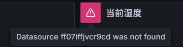  

点击某个面板上的省略号，点击Edit
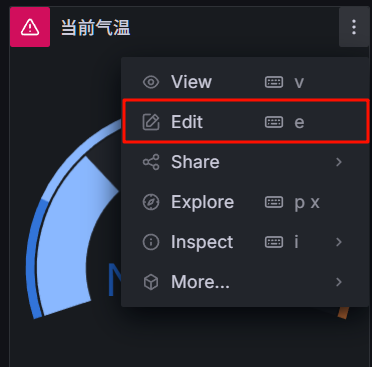  

点击 `Queries` ，在`datasource`处点击，选择`influxdb`，最后点击右上角的`save dashboard`

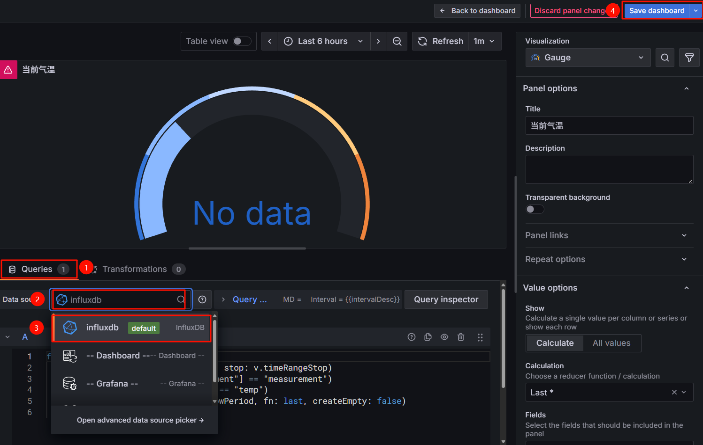  

**这里对其他几个数据面板也进行同样操作，不再重复讲解展示。**

## 最终效果
为了验证数据上云这一章节的成果，请按以下步骤操作：

（1）使用命令`sudo docker start emqx`启动EMQX MQTT服务器

（2）确保InfluxDB和Grafana正常运行（跟随本小节配置的话，肯定是正常运行的）

（3）启动[MQTT数据存储程序](./基于Python实现MQTT数据存储程序)

（4）将桌面环境监测仪开机、连接WIFI、连接MQTT

（5）在Grafana数据大屏查看数据

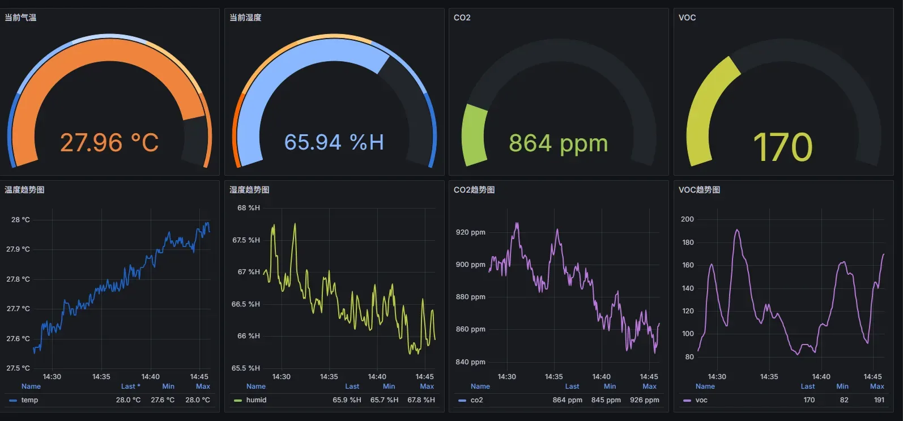  
