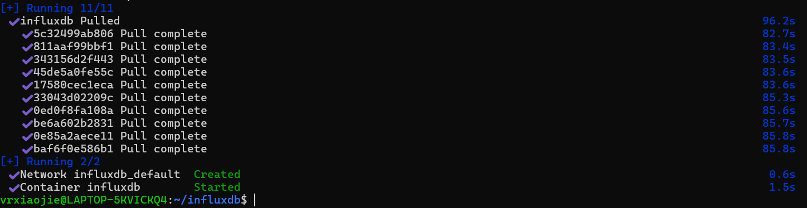
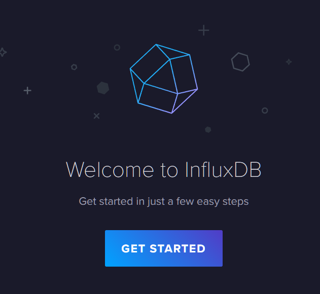
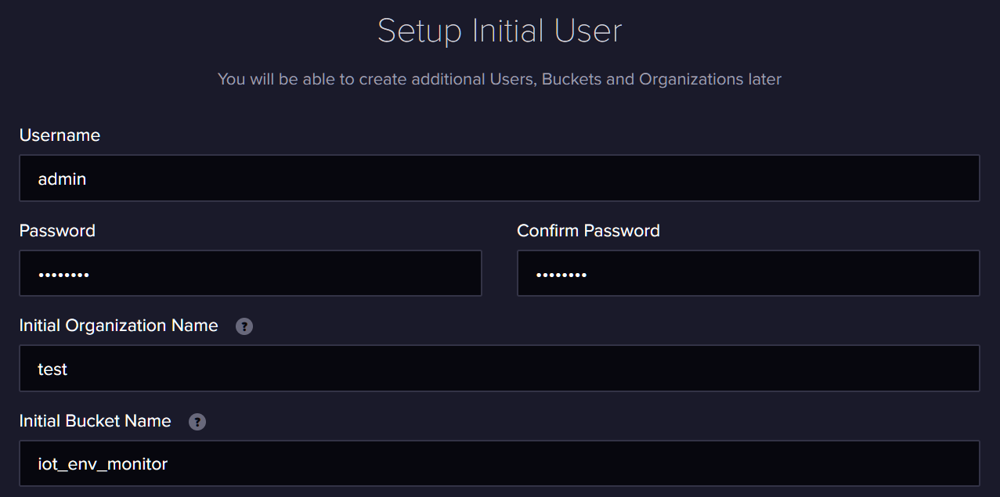
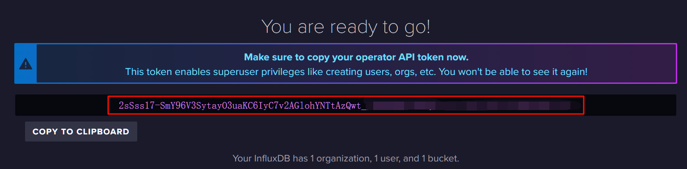
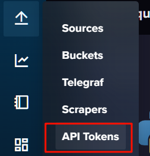

# 搭建InfluxDB2.0数据库
## InfluxDB 简介
InfluxDB 是一个比较热门的时序数据库，广泛应用于物联网（IoT）领域。时序数据是指随时间变化的数据，我们所监测的环境数据（温湿度、CO2、VOC）恰好就是这样的数据。

## 使用Docker-compose安装InfluxDB
### 创建数据存储目录
启动WSL，创建influxDB存储数据的文件夹
```shell
cd
mkdir influxdb
cd influxdb
mkdir data config
```

### 创建docker-compose.yml
使用vim 新建docker-compose.yml

```shell
vim docker-compose.yml
```

粘贴下方内容
```yml
services:
  influxdb:
    image: hub.rat.dev/influxdb:2.7.12
    container_name: influxdb
    restart: unless-stopped
    ports:
      - "8086:8086"
    volumes:
      - ./data:/var/lib/influxdb2
      - ./config:/etc/influxdb2
```

### 运行容器

```shell
sudo docker compose up -d
```

它会自动拉取镜像、配置环境，看到下图所示内容，即为启动成功

  


## 配置InfluxDB数据库
在宿主机上进入网页 [localhost:8086](localhost:8086)

应当会见到 `Welcome to InfluxDB`这样的欢迎页，点击`get started`

  

然后需要配置登录管理页面的用户名、密码、组织名称和数据存储桶名称。

用户名和密码请自行配置，组织名填写 `test`，数据存储桶填写`iot_env_monitor`，点击`continue`

  

**复制显示出来的 API token到记事本上**，之后在配置数据转发程序、配置Grafana数据源时都要用。

  

::: tip 不小心跳过了这页怎么办？
不小心跳过了这页也没关系，进入管理页之后，点击Load Data--API tokens一样能创建API token

  
:::

至此，InfluxDB数据库就搭建完成了