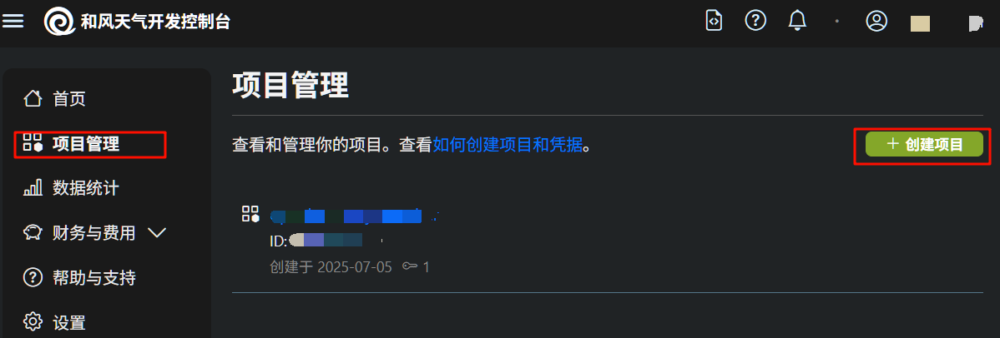
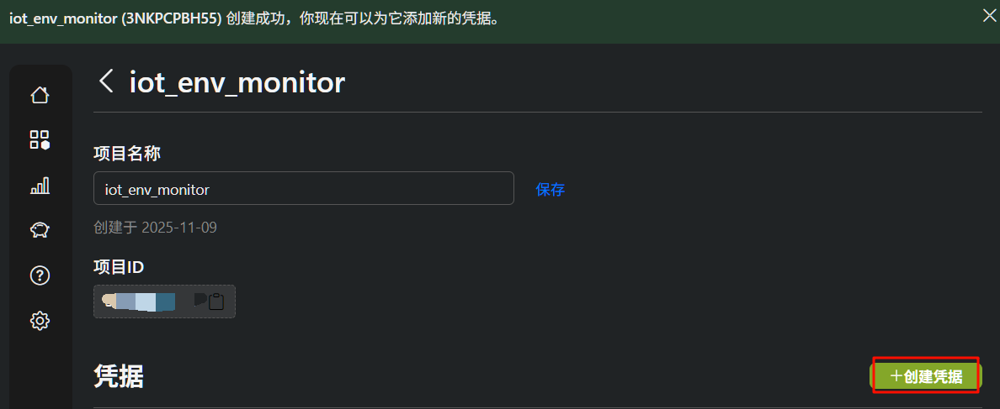
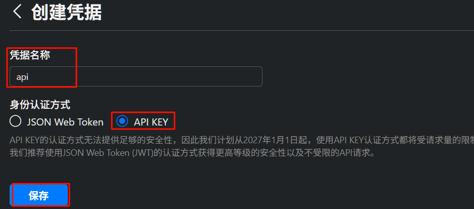
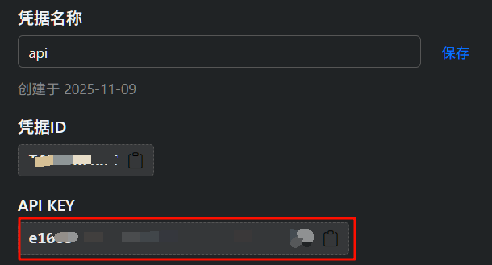
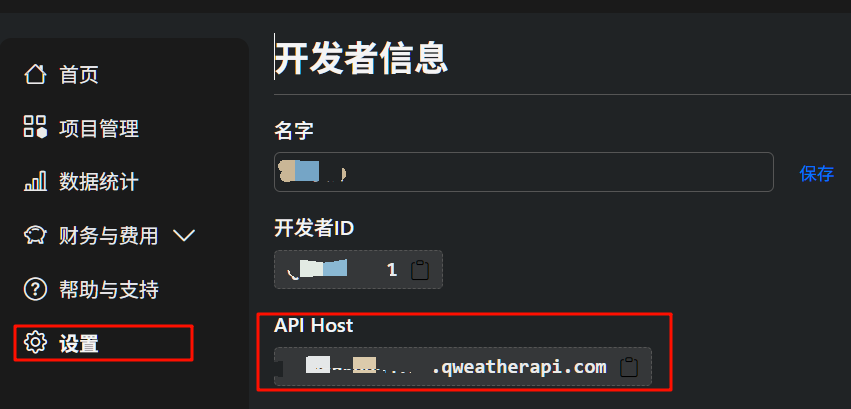
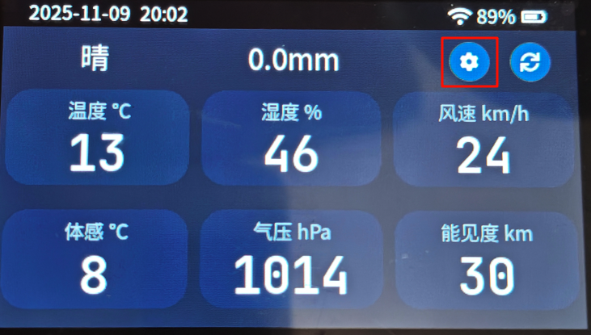
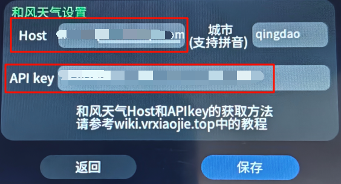

# 配置和风天气
::: warning 适用版本
请将程序版本更新至**v1.2.0**以上
:::
本章节将引导你配置桌面环境监测仪的天气功能，内置天气使用的数据源是和风天气。

## 在和风天气网页操作
### 注册账号
打开网页 [和风天气控制台](https://console.qweather.com/home?lang=zh)，如果没有账号，点击 **免费注册**，输入邮箱和密码即可完成注册

### 获取API KEY
点击左侧列表的 **项目管理** ，点击**创建项目**，项目名我起的是`iot_env_monitor`，你可以任意取

  

点击**创建凭据**
  

凭据名称任意取，身份认证方式选择 **API KEY**,点击保存
  

然后就能看见API KEY了，这里找个记事本记下来，**后续步骤要用**
  

### 获取host
点击左侧列表的设置，就能看到API Host了。这里找个记事本记下来，**后续步骤要用**

  

## 在桌面环境监测仪上的操作

请确保已更新程序版本至**v1.2.0以上**。先打开桌面环境监测仪，连接到WIFI，再回到主界面自右向左划，进入天气页面。最后点击小齿轮按钮，进入天气设置页
  

图中框出的两个即为上面提到的host和API key，使用键盘输入即可。

  

另外记得更改城市名，使用拼音全拼。

完成后**先点击保存，再点击返回**

回到天气页面，点击齿轮旁的刷新按钮，就能显示出来天气数据了。之后只要连接着WIFI，程序就会每30分钟拉取一次天气数据。
