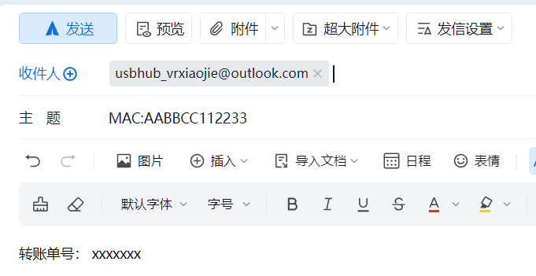

## 指南-获取更多USBHub激活码
**请注意：每人可免费激活一个USBHub**，本指南是面向要做多个Hub的玩家的。每个激活码仅一杯奶茶钱，算是对项目的支持，敬请理解。

（1）使用微信扫一扫，扫描下方二维码
  

（2.1）点击"1个激活码"

（2.2）填写HUB屏幕上显示的12位MAC地址。
受限于该项的可输入长度，如有多个设备需要激活，一次**最多输入4组MAC地址**，请用空格分隔开MAC地址，并且**对应修改购买数量**。否则，会按照付款的激活码数量n，来给予前n个MAC对应的激活码
 
 

（3）付款成功后，请发送邮件至 **usbhub_vrxiaojie@outlook.com**

- 请在邮件**主题**写明 **MAC地址**。例如: MAC:AABBCC112233 

- 请在邮件**正文**附上**转账单号**（在微信--我--服务--钱包--右上角账单--点击你购买的记录）截图或手动输入均可。

将会在**24小时内**通过邮件回复设备激活码，请注意查收！

如超时未收到，请先检查垃圾邮件。若仍没有，开源广场私信作者：https://oshwhub.com/vrxiaojie/works

（4）手动激活
